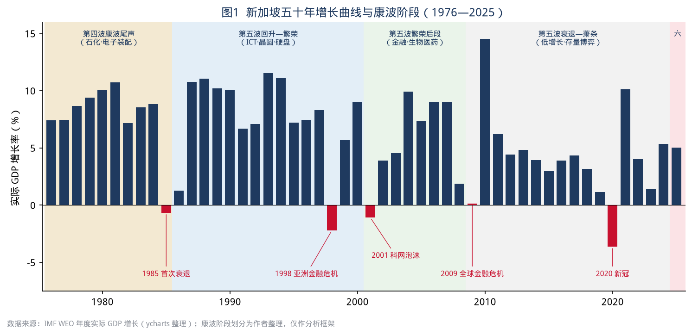
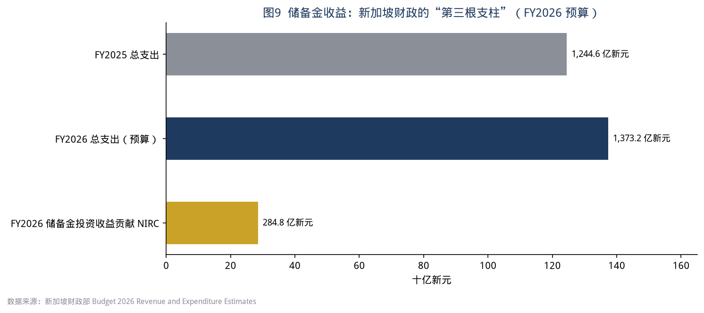
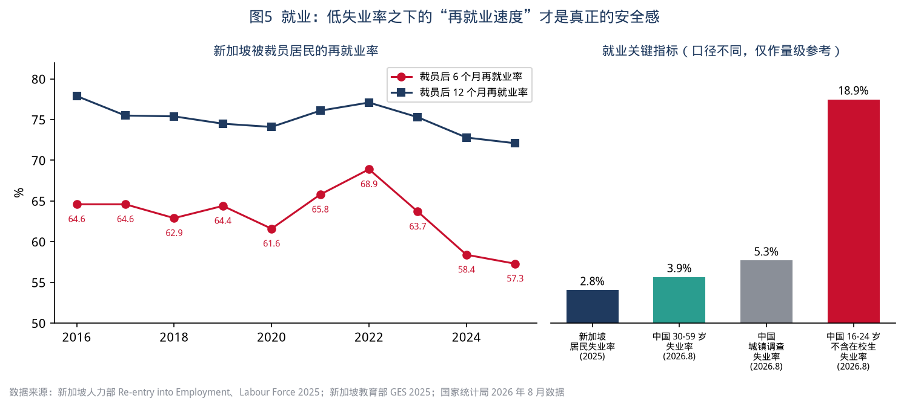
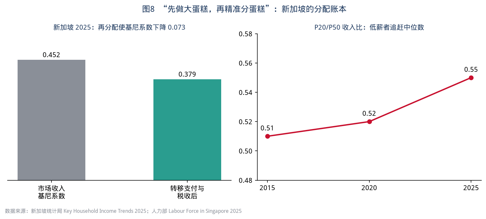
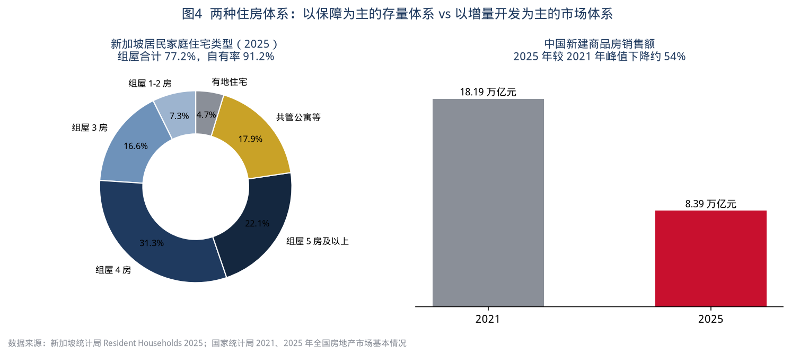
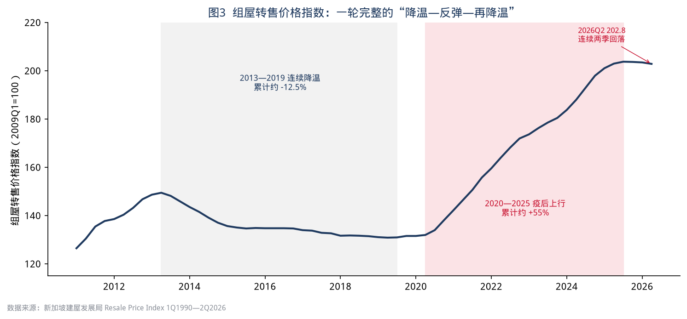
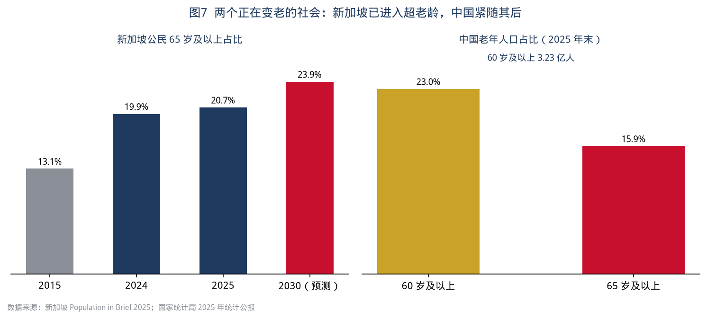
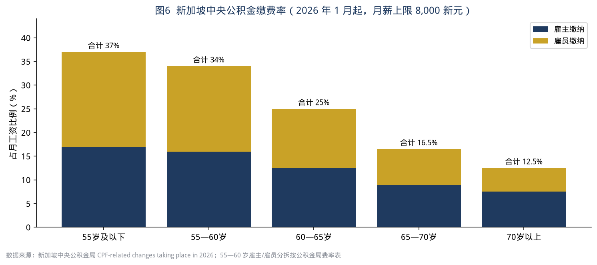
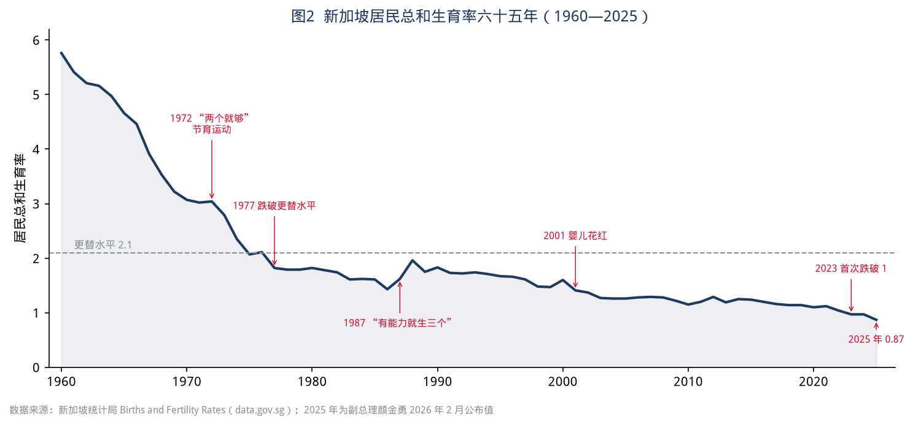
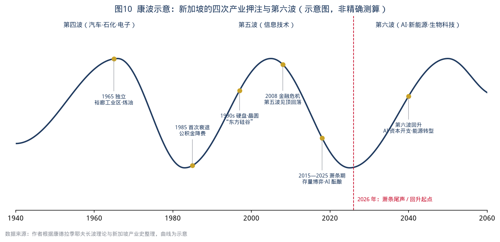

# 以新为鉴——存量时代的城市生存法则

> 副题：一个城市国家穿越五次衰退的民生账本，以及它对中国的二十个启示
>
> 书稿版本：第一版初稿（2026 年 10 月）｜数据截至：2026 年 9 月公开发布数据

## 前言　为什么是新加坡，为什么是现在

2025 年，一本叫《以日为鉴：衰退时代生存指南》的书在中文世界流行。它用日本“失去的三十年”做镜子，讲失业潮里的取舍、学历贬值的一代、考公热的起落、医疗与医药的寒冬与复兴，以及全民出海。这本书之所以引起共鸣，不是因为日本和中国一样，而是因为它给出了一个“如果走错路会怎样”的完整样本。

本书想补上镜子的另一面：**如果一个高度城市化、快速老龄化、增长中枢下移的经济体，在每一次周期下行时都做对了一部分事情，它的普通人会过上怎样的日子？** 这个样本就是新加坡。

选择新加坡，有四个理由。

第一，它是一个“纯城市”样本。新加坡 735 平方公里、611 万人，没有农村、没有腹地，城市治理的每一个决定都直接落到民生上。中国已有 67.89% 的人口住在城镇，未来二十年中国的主要矛盾，大部分会以“城市问题”的形式出现——住房、就业、养老、医疗、育儿、外来人口。新加坡把这些问题压缩在一个城市里，提前给出了答案和代价。

第二，它是一个“穿越周期”的样本。独立六十年，新加坡经历了 1985 年首次衰退、1998 年亚洲金融危机、2001 年科网泡沫、2009 年全球金融危机、2020 年新冠疫情五次负增长或接近零增长。每一次，它都用不同的工具保住了就业和社会信心，其中有成功，也有被反复争论的代价。

第三，它是一个“存量时代”的样本。新加坡早在 2010 年代就进入了土地存量化、人口老龄化、增长常态化的阶段：2015—2019 年 GDP 年均增速约 3%，组屋转售价格从 2013 年到 2019 年连续下跌约 12%。它是怎么在“不再高速增长”的环境里维持民生改善的？这正是中国城市今天面对的问题。

第四，它正在经历第六次康波的起点。2025 年新加坡 GDP 增长 5.0%，2026 年上半年增长 6.1%，财政部门把全年增长预测上调到 4.5%—5.5%，主要动力来自全球 AI 资本开支带动的半导体与服务器需求。与此同时，2025 年应届大学毕业生全职就业率从 79.4% 降到 74.4%，总和生育率降到 0.87。**增长回来了，年轻人的焦虑没有走；技术红利来了，人口红利却在加速消失。** 这几乎就是未来十年中国城市会遇到的局面。

### 本书的写法

本书参照《以日为鉴》的结构：以“篇”为大问题，以“章”为具体群体或制度，在每一章中回答三个问题——新加坡怎么做的、普通人感受如何、对中国意味着什么。与《以日为鉴》相比，本书有三点不同：

1. **更贴近民生。** 每章都有“民生切面”，从一个普通家庭的收入、住房、工作、看病、养老的账本出发，而不是从宏观政策出发。
2. **更多数据。** 每章开头设“数据看板”，全书引用的数据尽量来自新加坡统计局、人力部、建屋发展局、中央公积金局、财政部和中国国家统计局等一手来源，附录 C 逐条列出出处。
3. **更多反思。** 新加坡不是乌托邦。每章都设“反思”一节，讨论它的模式靠什么前提成立、付出了什么代价、在中国为什么不能照搬。最后用“供中国借鉴”给出可操作的建议，分为政策层、城市层和个人/家庭层三个层次。

全书还有一条暗线：**康德拉季耶夫长波（康波）周期。** 我们把新加坡六十年的产业升级、危机应对和民生政策放到第四、第五、第六轮康波的坐标里看。这样看，很多政策就不是“偶然的好决策”，而是一个小型开放经济体对技术长周期的主动适应。对中国读者来说，这条线索有助于回答一个现实问题：在第五波萧条尾声、第六波起点附近，个人和城市应该如何安排自己的就业、资产和技能？

### 阅读提示

- 新加坡数据以新元（S$）计。按 2026 年汇率，1 新元约合 5.3—5.6 元人民币。为避免汇率波动带来误读，书中尽量用比例、倍数和增长率做比较，而不是简单换算绝对值。
- 中新两国的统计口径差异很大，例如失业率、家庭收入、住房自有率的定义各不相同。书中所有跨国比较都只作量级参考，具体口径见附录 C。
- 书中“民生切面”里的家庭画像是根据公开统计数据合成的典型案例，不对应任何真实个人。
- 康波阶段划分在学界并无统一标准。本书采用的划分是一种分析框架，而不是预测工具。

## 目录

- 前言　为什么是新加坡，为什么是现在
- 序章　康波坐标里的新加坡：一个城市国家如何穿越五次衰退
- 第一篇　周期之下：危机来临时的抉择
  - 第一章　保就业，还是保企业？——回顾新加坡五次衰退的应对史
  - 第二章　降成本的艺术——公积金、弹性工资与三方协商
  - 第三章　储备金：逆周期的压舱石——一个城市的“过冬粮”
- 第二篇　就业：没有铁饭碗的城市
  - 第四章　第一份工作——新加坡应届生的“降温”与中国青年就业
  - 第五章　中年转岗——技能创前程与“职业桥梁”
  - 第六章　银发再就业——退休年龄 64 岁、重新雇佣 69 岁之后
  - 第七章　托住底层——渐进式薪金与就业入息补助
- 第三篇　安居：存量时代的住房逻辑
  - 第八章　组屋——把住房从资产拉回居住
  - 第九章　百万组屋与价格周期——调控的边界在哪里
  - 第十章　老房子怎么办——99 年地契、重建与存量更新
- 第四篇　养老与医疗：老龄化社会的账本
  - 第十一章　公积金——个人账户加终身年金
  - 第十二章　看病——3M 体系与“健康 SG”
  - 第十三章　失能之后——长期护理保险与社区养老
- 第五篇　人口：0.87 的警报
  - 第十四章　从“两个就够”到“三个以上”——生育政策六十年反转
  - 第十五章　外来人口——开放与本土的平衡术
- 第六篇　第六波：AI 时代的城市生存法则
  - 第十六章　AI 与饭碗——“增强而非替代”能否兑现
  - 第十七章　产业换挡——每一轮康波，新加坡押注了什么
  - 第十八章　中国城市的选择——存量时代的十条生存法则
- 后记　一个组屋家庭三代人眼中的新加坡
- 结语
- 附录 A　中新民生核心数据对照表
- 附录 B　新加坡周期与政策年表（1955—2026）
- 附录 C　数据引用说明与参考文献

## 序章　康波坐标里的新加坡：一个城市国家如何穿越五次衰退

> **数据看板**
>
> - 总人口 611.1 万（2025 年 6 月），其中公民 366.1 万、永久居民 54.4 万、非居民 190.7 万
> - 人均 GDP 约 9.9 万美元（2025 年，IMF），居亚洲第一
> - 实际 GDP 增长：2024 年 4.4%（后修订）、2025 年 5.0%，2026 年上半年 6.1%
> - 独立以来五次负增长或接近零增长：1985（-0.6%）、1998（-2.2%）、2001（-1.1%）、2009（+0.1%）、2020（-3.6%）（IMF 口径）

### 一、康波是什么，为什么要用它来看新加坡

1926 年，苏联经济学家康德拉季耶夫在研究英、法、美、德等国一百多年的价格、利率和产量数据后提出：资本主义经济存在约 50—60 年的长周期。后来的熊彼特、范杜因等人把长周期和技术革命联系起来：每一轮长波都由一组通用技术驱动——纺织机与蒸汽机、铁路与钢铁、电气与化工、汽车与石化、信息技术。每一轮都分为回升、繁荣、衰退、萧条四个阶段。

在中文世界，已故分析师周金涛把这套理论普及成一句话：“人生就是一场康波。”他的框架里有三类国家：**主导国**（技术策源地，例如第四、第五波的美国）、**追赶国**（第四波的日本、第五波的中国）、**资源国**（澳大利亚、俄罗斯等）。

新加坡不属于其中任何一类。它是第四类：**枢纽国**。它没有资源，不发明通用技术，也没有足够大的国内市场完成追赶。它的生存方式是：在每一轮康波的上升期，抢先成为主导国技术和资本在亚洲的落脚点；在每一轮下行期，用制度工具保护本国居民，等待下一轮上升。

这就是本书把康波作为暗线的原因。中国的城市，尤其是一线和强二线城市，未来越来越像“枢纽”而不是“工厂”：上海、深圳、广州、杭州、成都都在争夺第六波的研发、资本和人才。新加坡六十年的经验，是一个枢纽如何在长波里生存的样本。

### 二、新加坡在四轮康波中的位置

**第四波尾声（1965—1985）：做跨国公司的工厂。** 1965 年被迫独立时，新加坡失业率约 10%，没有腹地、没有资源。政府通过经济发展局（EDB，1961 年成立）招商，在裕廊填海建工业区，引进壳牌、埃索等炼油厂和德州仪器、惠普等电子装配厂。这正是第四波（汽车、石化、电子）的成熟期：美国和日本的跨国公司在寻找低成本、稳定、讲英语的生产基地。新加坡用二十年把自己变成了这样的基地，1970—1984 年间 GDP 年增速普遍在 7%—10%。

**第四波转第五波（1985—1986）：第一次衰退。** 1985 年，新加坡遭遇独立后的首次衰退。直接原因是工资过快上涨、新元升值、全球电子和石油需求放缓；更深层的原因是第四波的红利结束，劳动密集型装配业的竞争力下降。新加坡的应对是大幅降低雇主公积金缴费率、冻结工资，同时启动产业升级。

**第五波回升到繁荣（1987—2007）：做“东方硅谷”和金融中心。** 1980 年代后期到 1990 年代，个人电脑和互联网带动第五波上升。新加坡一度是全球最大的硬盘生产基地，晶圆厂、石化综合体（裕廊岛）、生物医药（启奥城，2003）、金融和财富管理相继兴起。这二十年里，新加坡也经历了 1998 年和 2001 年两次衰退，但都很快恢复。

**第五波衰退到萧条（2008—2025）：低增长和结构性焦虑。** 2008 年金融危机后，主导国的生产率增速放缓，全球进入低利率、低增长、高债务时期。新加坡的增速中枢下移到 3% 左右，社会焦点从“做大蛋糕”转向“分好蛋糕”：住房负担、外来人口、贫富差距、养老保障。2011 年大选执政党得票率降到 60.1%，成为一个转折点，此后一系列民生政策陆续推出：渐进式薪金模式、建国一代配套、终身健保、技能创前程、非自愿失业援助……这一阶段的政策，是本书的重点。

**第六波导入期（2025— ）：AI 与能源。** 2025—2026 年，全球 AI 资本开支带动新加坡制造业强劲增长，2025 年第四季度制造业同比增长 15.0%，主要来自 AI 相关的半导体、服务器和制药。新加坡政府在 2026 年预算中成立由总理担任主席的国家人工智能理事会，2026 年 6 月发布的《经济战略检讨》最终报告提出“优先发展增强而非替代劳动者的 AI”。

### 三、给中国读者的坐标说明

把中国放进同一张图里，可以得到三个判断。

第一，**中国是第五波的追赶国，房地产是第五波追赶红利的资产化形式。** 2021 年全国新建商品房销售额 18.19 万亿元，2025 年降到 8.39 万亿元，降幅约 54%。这不是普通的周期波动，而是追赶阶段“增量时代”的结束。

第二，**中国城市正同时面对三种周期：** 第五波萧条尾声的需求不足、房地产长周期下行的资产负债表压力、人口周期带来的老龄化和少子化。新加坡没有同时遇到这么多压力，但它在每一种压力下都有可参照的工具。

第三，**第六波的窗口对中国城市是真实存在的。** 中国在新能源汽车、光伏、锂电、AI 应用和制造业规模上都处于全球前列。问题不是“有没有机会”，而是“机会能不能转化成普通人的就业和收入”。这一点，正是新加坡在 AI 时代最着力的地方，也是本书最后一篇的主题。

> **本章反思**　康波理论常被用作投资择时工具，甚至被包装成“人生发财靠康波”。本书刻意回避这种用法。长波的阶段划分存在很大争议，用它预测具体年份的资产价格并不可靠。本书使用康波，只是为了提醒读者：**民生政策的有效性高度依赖它所处的技术周期阶段。** 在繁荣期能用的办法（例如扩张性的住房金融），在萧条期可能变成负担；在萧条期必须做的事（例如再培训和托底保障），如果等到危机来了才做，往往太迟。

---

# 第一篇　周期之下：危机来临时的抉择

《以日为鉴》第一篇讨论日本在失业潮中“保就业还是保发展”的选择：日本选择用终身雇佣保护老员工，结果是企业背上冗员负担、新毕业生被挡在门外，形成“就业冰河期”一代。新加坡面对同样的问题时，给出了不一样的答案：**不保具体岗位，保就业能力和雇佣关系；不靠企业硬扛，靠国家账户逆周期补贴。**

## 第一章　保就业，还是保企业？——回顾新加坡五次衰退的应对史

> **数据看板**
>
> - 1985 年衰退：雇主公积金缴费率从 25% 降至 10%，工资冻结两年，1987 年增长反弹至 10.8%
> - 1998 年亚洲金融危机：雇主公积金缴费率从 20% 降至 10%，1999—2000 年逐步恢复至 16%
> - 2003 年（科网泡沫与非典之后）：雇主公积金缴费率从 16% 降至 13%
> - 2009 年全球金融危机：205 亿新元“振兴配套”，其中“雇佣补贴”（Jobs Credit）为每名员工前 2,500 新元月薪的 12%，首次动用过去储备 49 亿新元
> - 2020 年新冠疫情：四份预算合计近 1,000 亿新元（约占 GDP 20%），批准动用过去储备累计约 520 亿新元，雇佣补贴计划（JSS）按月薪前 4,600 新元的 25%—75% 补贴工资

### 一、五次衰退，五种工具

把新加坡五次衰退放在一起看，可以发现一个清晰的演进：**从“压低劳动成本”到“国家替企业付工资”，再到“国家直接给失业者发钱”。**

**1985 年：降成本。** 首次衰退来临时，政府成立由李显龙主持的经济委员会。委员会认为，问题出在劳动成本过高、竞争力下降，因此建议把雇主公积金缴费率从 25% 降至 10%，冻结 1986、1987 年工资，同时下调企业所得税和个人所得税。效果立竿见影：1986 年增长 1.3%，1987 年反弹到 10.8%。但这是一次“让工人共同承担”的调整——工人当期到手工资虽未减少，长期的养老和住房储蓄却被削减。

**1998 年：再降成本，但开始保护低收入者。** 亚洲金融危机中，雇主公积金缴费率从 20% 降至 10%，同时全国工资理事会推动“弹性工资制度”：工资分为基本工资、年度可变部分和月度可变部分，让企业在危机中能通过减少浮动部分而不是裁员来降低成本。

**2001—2003 年：小幅降成本，转向结构调整。** 科网泡沫破灭、“9·11”和非典接连冲击，雇主公积金缴费率从 16% 降至 13%。这一阶段新加坡开始意识到，靠一次次压低成本无法应对结构性冲击，于是成立经济检讨委员会，推动服务业和生物医药发展。

**2009 年：国家替企业付工资。** 全球金融危机时，政府明确拒绝再降公积金缴费率。2009 年预算案说明了理由：这次衰退的根本问题“不是工资竞争力，而是全球需求崩溃”，没有必要全面压低工资。取而代之的是“雇佣补贴”：政府按每名员工前 2,500 新元月薪（当时的工资中位数）的 12% 直接补贴企业，相当于降低 9 个百分点公积金缴费率，但不减少工人的储蓄。补贴按季度发放，以发放时仍在职的员工为准，因此企业有动力留住员工。这一年，政府首次经总统批准动用过去储备 49 亿新元。

**2020 年：全面托底。** 新冠疫情期间，新加坡在四个月里推出四份预算，合计近 1,000 亿新元。核心工具是“雇佣补贴计划”：政府按本地员工月薪前 4,600 新元的 25%—75% 补贴工资，航空、旅游等重灾行业补贴比例最高。2020 年 GDP 收缩 3.6%，但总体失业率高点约 3.6%，居民失业率高点也未超过 5%。

### 二、新加坡的选择逻辑：保“雇佣关系”而不是保“岗位”

《以日为鉴》讲到，日本 1990 年代的“雇佣调整助成金”让企业把冗员留在公司内部，即“企业内失业”。结果是企业丧失调整能力，年轻人进不来，形成一代人的就业冰河期。

新加坡的雇佣补贴看起来与日本相似，都是补贴企业留人，但有三点关键差别：

1. **限时、递减、公开退出。** 2009 年的雇佣补贴只发放了约一年半，后期补贴比例逐步递减，2020 年的补贴按行业和月份逐步下调，退出时间表提前公布。企业知道补贴不会一直存在，必须在补贴期内完成调整。
2. **按工资封顶，偏向中低收入者。** 补贴只覆盖前 2,500 或 4,600 新元工资，对高薪员工的补贴比例自然更低，等于用同样的钱保住更多中低收入岗位。
3. **补贴与培训挂钩。** 2020 年同时推出“就业与技能配套”，为企业提供培训补贴，鼓励企业在停工期间培训员工，而不是简单停薪留职。

更重要的是，新加坡在每一次补贴退出后，都把资源转向“帮助人换工作”，而不是“帮助企业不裁员”。这一点在第二篇会展开。

### 三、民生切面：2009 年和 2020 年，一个普通工人的账本

> 以一名 2009 年月薪 2,500 新元的电子厂技术员为例（合成画像）。
>
> - 雇主每月从政府得到 300 新元雇佣补贴，相当于其工资成本降低约 9%；
> - 他本人的工资和公积金缴费不变，每月公积金账户继续存入约 860 新元（当时雇主与雇员合计缴费率约 34.5%）；
> - 如果他仍然被裁，可以申请政府资助的培训课程，并在培训期间领取津贴。
>
> 到 2020 年，同一个人如果在酒店业工作、月薪 3,000 新元，雇主在疫情高峰期可以获得最高 75% 的工资补贴，即每月 2,250 新元。很多酒店在这段时间里没有裁员，而是安排员工参加培训或转岗做防疫隔离设施的服务工作。

### 四、周期视角：越到长波后段，越需要“国家资产负债表”

把五次衰退和康波阶段对应起来看：

- 1985 年和 1998 年处于第四波尾声和第五波上升期，问题主要是**竞争力**问题，因此降成本有效，衰退之后会有强劲反弹。
- 2009 年和 2020 年处于第五波衰退和萧条期，问题主要是**需求**问题，降成本无法创造需求，只会损害居民储蓄和消费。这时需要国家动用资产负债表直接托底。

这一判断对中国很重要。中国当前面对的主要是需求不足和资产负债表收缩，而不是劳动成本过高。**在这一阶段，降社保费率、压低工资的“成本思维”效果有限，直接向家庭和就业补贴的“需求思维”更有效。**

> **本章反思**
>
> 1. **新加坡能“国家替企业发工资”，前提是它有钱。** 2009 年和 2020 年的大规模补贴都依赖过去几十年积累的储备。没有这个前提，补贴只能靠借债，效果和可持续性都会打折扣。
> 2. **降公积金缴费率的代价被推迟了。** 1985 年和 1998 年的两次大幅削减，减少了一代人的养老和住房储蓄。今天新加坡部分 60 岁以上居民公积金存款不足，与当年的削减有一定关系。
> 3. **外籍劳工是隐形的“缓冲垫”。** 新加坡约 190 万非居民中，大量是工作准证持有者。经济下行时，外籍就业往往先减少，本地居民失业率因此看起来较低。中国的城市不能把外来务工人员当作缓冲垫，因为他们本身就是这个国家的公民。

> **供中国借鉴**
>
> - **政策层：** 设计“危机触发式”的稳岗补贴——事先立法规定触发条件（例如城镇调查失业率连续三个月超过某一阈值）、补贴比例、封顶工资和退出时间表，避免临时决策和“补贴依赖”。
> - **城市层：** 把稳岗返还、以工代训资金与企业培训计划挂钩；对补贴期内裁员的企业设置返还条款。
> - **个人/家庭层：** 在长波下行期，个人的第一要务是保住“雇佣关系”和社保连续缴费记录，再考虑跳槽或创业；不要在下行期轻易离开有补贴、有培训资源的雇主。

## 第二章　降成本的艺术——公积金、弹性工资与三方协商

> **数据看板**
>
> - 全国工资理事会（NWC）成立于 1972 年，由政府、雇主和工会三方组成
> - 2026 年公积金缴费率：55 岁及以下合计 37%（雇主 17%、雇员 20%），月薪上限 8,000 新元
> - 弹性工资结构：基本工资 + 年度可变部分（约 1 个月工资）+ 月度可变部分 + 绩效奖金（最高约 2 个月）
> - 2025 年居民工资中位数（含雇主公积金）5,775 新元，名义增长 5.0%，实际增长 4.3%

### 一、为什么新加坡可以“一夜之间”降成本

在多数国家，降低劳动成本意味着裁员或者漫长的劳资谈判。新加坡能在 1985 年和 1998 年迅速把雇主缴费率减半，靠的是两个制度安排。

**第一是公积金。** 公积金是强制储蓄而不是现收现付的养老保险，每个人的钱进入自己的账户。降低雇主缴费率，不会让当下的退休者领不到钱，只会减少在职者未来的储蓄。这使政府可以在危机时把公积金当作“工资成本调节阀”，危机过后再逐步恢复。

**第二是三方协商机制。** 全国工资理事会每年发布工资指导原则，政府、雇主联合会和全国职工总会共同签署。新加坡的工会与执政党关系密切，职总秘书长通常是内阁成员。这种安排让工资调整能迅速达成共识，代价是工会的独立性和对抗能力较弱。

### 二、弹性工资：把“危机时的冲击”提前设计进工资单

1998 年之后，全国工资理事会大力推广弹性工资制度。它的核心思想是：**工资里有一部分应当随企业业绩浮动，而不是全部刚性。** 经济好的时候多发奖金和月度可变部分，经济差的时候先减浮动部分，尽量不裁员。

这和日本的“春斗”与年功序列有本质区别。日本企业的基本工资刚性，危机中很难降薪，只能停止招聘新人，冲击集中落在年轻人身上。新加坡的弹性工资让冲击由全体在职者分担，也就减少了对新人的挤出。

### 三、民生切面：一个白领的工资单

> 以 2025 年一名 35 岁、月薪 6,000 新元的财务主管为例（合成画像）。
>
> - 雇员缴费 20%，即 1,200 新元；雇主缴费 17%，即 1,020 新元。合计 2,220 新元进入公积金账户，按 35 岁及以下的分配比例，约 62% 进入普通账户（买房），约 16% 进入特别账户（养老），约 22% 进入保健储蓄账户（医疗）；
> - 到手现金约 4,800 新元，再扣除个人所得税（新加坡个税起征点较高，有效税率很低）；
> - 年终奖通常为 1—3 个月工资，其中一部分是业绩相关的“可变部分”。2025 年，部分金融和科技企业减少了可变奖金，但基本工资基本保持不变。

### 四、周期视角：高储蓄率是逆周期的弹药，也是内需的枷锁

新加坡的强制储蓄率极高，37% 的缴费率再加上个人自愿储蓄，使新加坡总储蓄率长期在 GDP 的 40% 以上。这是逆周期的弹药——危机时可以降低缴费率释放现金流——但也压抑了居民消费，使新加坡的内需相对 GDP 规模偏小，经济高度依赖外需。

中国面对类似的矛盾：居民储蓄率高、消费率偏低。新加坡的经验提示，**强制储蓄制度可以设计成“可调节”的**：危机时临时下调缴费、释放现金；繁荣时提高缴费、积累储备。中国的社保费率和住房公积金缴存比例也可以引入类似的逆周期机制。

> **本章反思**
>
> 1. 新加坡的三方协商建立在工会与执政党高度一体的政治结构之上，中国的工会体制有相似之处，但企业结构（大量民营中小企业、平台经济）远比新加坡复杂，难以形成全国统一的工资指导。
> 2. 弹性工资在危机中保护了就业，但也意味着普通工人承担了更多收入波动。对于房贷和育儿压力大的家庭，收入波动本身就是风险。
> 3. 公积金“可调节”的另一面是：每次下调都在透支未来。中国城镇职工养老保险是现收现付为主，不能简单照搬“降缴费率”的做法，否则会直接影响当期养老金发放。

> **供中国借鉴**
>
> - **政策层：** 研究建立社保费率和住房公积金缴存比例的“逆周期调节规则”，明确在什么条件下临时下调、何时恢复，并由财政补足基金缺口。
> - **城市层：** 推动地方国企和大型民企试点弹性薪酬结构，把一部分固定工资转为与企业效益挂钩的浮动部分，同时立法保护最低工资和基本工资。
> - **个人/家庭层：** 评估家庭现金流时，把年终奖和绩效工资视为“不确定收入”，房贷月供和固定支出只用基本工资来覆盖。

## 第三章　储备金：逆周期的压舱石——一个城市的“过冬粮”

> **数据看板**
>
> - 2026 财年政府总支出预算 1,373.2 亿新元，较上年增长 10.3%，约占 GDP 的 16.3%
> - 2026 财年“净投资回报贡献”（NIRC）284.8 亿新元，是财政收入中最大的单项来源之一
> - 2026 财年预计整体财政盈余 41.8 亿新元
> - 宪法规定：政府最多可使用储备金长期预期实际回报的 50%；动用“过去储备”需经民选总统批准

### 一、新加坡财政的三根支柱

大多数国家的财政收入靠两根支柱：税收和借债。新加坡多了第三根：**储备金投资收益。**

新加坡的储备金由新加坡政府投资公司（GIC）、淡马锡控股和新加坡金融管理局共同管理。具体规模不对外公布，但市场普遍估计在万亿美元以上。2008 年起，政府通过“净投资回报框架”每年把长期预期实际回报的一部分（2016 财年起将淡马锡纳入框架）纳入预算。2026 财年这部分贡献约 285 亿新元，相当于当年总支出的五分之一以上。

更关键的是宪法设计：储备金被分为“本届政府积累的储备”和“过去储备”。本届政府可以使用自己任期内积累的盈余，但动用过去储备必须经民选总统批准。这相当于给储备金上了一把“双钥匙锁”，防止任何一届政府为了选举而透支储备。

### 二、过冬粮是怎么用的

新加坡至今只在两次危机中动用过过去储备：

- **2009 年全球金融危机：** 动用 49 亿新元，用于雇佣补贴和银行信贷风险分担计划；
- **2020—2021 年新冠疫情：** 2020 财年累计批准约 520 亿新元，2021 财年再批准约 110 亿新元。

两次实际动用额都低于批准上限，政府多次公开表示不会把过去储备当成常规财源。

### 三、民生切面：储备金收益最终花在了哪里

储备金收益看起来离普通人很远，实际上就在日常生活里。2025 年新加坡居民家庭平均每名成员获得政府转移支付 7,300 新元，其中包括常规补贴、一次性补贴和实物补贴（教育、托育、医疗补贴）。住在一房式和二房式组屋的低收入家庭，每名成员平均获得 16,519 新元，超过所有家庭平均水平的两倍。收入最低的七成家庭所获转移支付高于其所缴税款。

2026 年预算中，所有新加坡公民家庭将在 2027 年 1 月获得 500 新元社区发展理事会购物券；符合条件的成年人获得 200—400 新元生活费特别补助；组屋家庭获得最高 570 新元水电费回扣。这些钱的底气，很大程度上来自储备金收益。

### 四、周期视角：储备金是“跨越长波”的工具

储备金的真正价值在于跨周期。第五波繁荣期（1990—2007 年），新加坡把大量财政盈余和公积金资金交给 GIC 投资全球资产，分享了全球资本市场的增长；到第五波衰退和萧条期，再把投资收益拿回来支撑民生支出和逆周期补贴。

这对中国城市有直接启示。中国地方政府在增量时代高度依赖土地出让收入，这是典型的“顺周期”财源：房地产好时收入多、支出也多；房地产下行时收入锐减，还要承担债务和民生刚性支出。**存量时代的城市财政，需要从“卖地”转向“经营资产、获取长期回报”。**

> **本章反思**
>
> 1. 新加坡储备金的形成有特殊条件：长期财政盈余、高强制储蓄（公积金资金由政府统一投资）、高度集中的政治权力和较少的福利承诺。中国地方政府背负大量债务，不具备这样的起点。
> 2. 储备金透明度一直有争议。GIC 不公布总规模，淡马锡只公布净资产组合值。高透明度要求与“不让对手知道底牌”之间的平衡，是新加坡长期争论的话题。
> 3. 依赖投资收益的财政，本身也承受全球资本市场的周期风险。如果第六波转换期出现全球资产价格大幅调整，储备金收益也会下降。

> **供中国借鉴**
>
> - **政策层：** 推动地方国有资本从“融资平台”转为“长期资本”，设立城市级的稳定基金，把部分国有资产收益（经营性资产分红、REITs 收益）按规则纳入一般公共预算，形成“第三根支柱”。
> - **城市层：** 学习“双钥匙”原则：大额动用稳定基金需经人大常委会批准，并设立动用上限和回补机制。
> - **个人/家庭层：** 家庭层面同样需要“储备金”——建议保留 6—12 个月家庭必要支出作为应急储备，并与投资性资产分开管理。

# 第二篇　就业：没有铁饭碗的城市

《以日为鉴》用了两篇的篇幅讲就业：日本的就业冰河世代、学历贬值、硕博扩招，以及考公热、教师过剩、医生和工程师的职业变迁。日本问题的核心是**雇佣制度的刚性**：终身雇佣让“第一份工作”几乎决定一生，错过应届招聘的年轻人很难翻身。

新加坡的劳动力市场则几乎没有“铁饭碗”：公务员也实行绩效考核和弹性工资，企业可以相对自由地裁员。它的安全感来自另一处：**失业之后能多快找到下一份工作，以及在这段时间里有没有托底。**

## 第四章　第一份工作——新加坡应届生的“降温”与中国青年就业

> **数据看板**
>
> - 2025 年新加坡六所公立大学应届毕业生（约 14,400 名受访者）：毕业六个月内获得工作的比例 88.9%（2024 年为 91.2%）；全职长期工作比例 74.4%（2024 年为 79.4%）；全职月薪中位数 4,500 新元，与 2024 年持平
> - 资讯与数码科技类毕业生月薪中位数 5,500 新元，为各学科最高
> - 2025 年居民中过去一年换过工作的比例从 7.6% 降至 6.2%，25—29 岁降幅最大
> - 对照：2026 年 8 月，中国城镇不含在校生的 16—24 岁劳动力失业率 18.9%，30—59 岁为 3.9%；2025 年中国普通、职业本专科毕业生 1,105.1 万人，研究生毕业生 116.7 万人

### 一、新加坡年轻人也在经历“降温”

2026 年 3 月公布的毕业生就业调查显示，新加坡应届大学生的全职就业率连续两年下降，从 2023 年的约 84% 降到 2025 年的 74.4%。打兼职、做临时工或尚未获得录用的比例上升。调查认为原因是“经济不确定性下的谨慎招聘”，其中资讯与通信等行业招聘明显收缩——这恰恰是过去十年最受年轻人追捧的行业。

这和中国年轻人的处境有相似之处：AI 正在改变初级白领岗位，大型科技公司在缩减校招规模，“好工作”的门槛在提高。但新加坡的数据也有两点不同：

1. **起薪没有下降。** 全职毕业生的月薪中位数保持在 4,500 新元，约等于居民全职工资中位数的 78%。工作变少了，但工作质量没有明显下滑。
2. **年轻人的失业持续时间短。** 新加坡毕业六个月内获得某种工作的比例接近九成。即使是兼职或合同工，也会计入公积金和社会保障体系，不会长期游离在劳动力市场之外。

### 二、新加坡如何减少“第一份工作”的决定性

日本就业冰河世代的悲剧在于：错过应届生招聘，就基本错过了正式雇佣。新加坡通过三种方式降低了第一份工作的决定性：

**第一，没有应届生身份的特权。** 新加坡企业招聘普遍不区分应届和往届，更看重技能证书和工作经验。这意味着毕业时没找到好工作，并不会被永久挡在门外。

**第二，学徒式的“工读计划”。** 技能创前程工读计划让学生在理工学院和工艺教育学院（ITE）读书期间就进入企业实习，毕业后可以直接转为正式员工。ITE 毕业生约占每届同龄人的四分之一，不读大学也有明确的上升通道。

**第三，政府主导的“回炉”机制。** 2026 年起，所有公立大学和理工学院向校友提供一年期折扣价 AI 课程；参加指定 AI 课程的新加坡人可以获得六个月的高级版 AI 工具免费使用权。

### 三、民生切面：两个城市的应届生

> **新加坡：** 2025 年，一名南洋理工大学商科毕业生（合成画像）在 11 月仍未拿到全职 offer，选择先去一家咨询公司做六个月合同工，月薪 3,800 新元，公积金照常缴纳。2026 年初，她通过技能创前程的数据分析课程（课程费由技能创前程补贴约七成）补齐技能，转为一家银行的正式分析员。
>
> **中国：** 同年，一名二线城市“211”大学文科毕业生（合成画像）在秋招中未拿到心仪 offer，选择“二战”考研并同时备考公务员。一年后若两项都未成功，他的应届生身份已经失去，很多企业校招岗位将不再对他开放。
>
> 两者的差异，不完全在于经济好坏，而在于**劳动力市场有没有给“暂时没找到工作的人”留下回到主路的匝道。**

### 四、周期视角：长波萧条期的“毕业生税”

康波萧条期毕业的年轻人，往往要承受终身的收入损失。日本 1993—2005 年毕业的“冰河世代”就是典型。美国研究也表明，衰退期毕业生的收入损失可以持续十年以上。

新加坡的做法提示我们，这种“毕业生税”不是不可避免的。它可以通过三件事来减轻：取消应届生身份的制度性特权、提供低成本的“技能回炉”、让临时工和兼职也有社会保障。**中国 2025 年本专科毕业生超过 1,100 万人，如果毕业即失业的青年长期游离在社保之外，十年后将形成一个规模庞大的“养老金缺口一代”。**

> **本章反思**
>
> 1. 新加坡应届生人数每年只有约 2 万人，规模不到中国一个中等城市的高校毕业生数量，政策精细度和中国不可同日而语。
> 2. 新加坡的低青年失业率，部分是因为大量年轻人选择继续读书。15—24 岁居民的就业率从 2015 年的 36.8% 降到 2025 年的 31.3%。“延迟就业”在新加坡同样存在，只是它被视为技能投资，而不是失败。
> 3. 新加坡也有“考公热”，但公务员体系实行绩效考核和市场化薪酬，并不是避风港。中国“考公热”背后是体制内外保障的巨大落差，这个落差才是需要解决的问题。

> **供中国借鉴**
>
> - **政策层：** 逐步取消就业市场上的“应届生身份”门槛，要求国企和事业单位招聘对毕业三年内的往届生一视同仁；把灵活就业青年纳入社保补贴范围。
> - **城市层：** 建设城市级的“工读计划”，由地方财政补贴企业为高职和本科学生提供带薪实习，并把实习时间计入工龄和社保缴费年限。
> - **个人/家庭层：** 在长波萧条期毕业，宁可先进入一个“有社保、有技能积累”的岗位，也不要长期脱离劳动力市场备考。家庭应把“孩子毕业后两年”视为需要资金支持的过渡期。

## 第五章　中年转岗——技能创前程与“职业桥梁”

> **数据看板**
>
> - 2025 年新加坡裁员人数 14,490 人，每千名雇员裁员 6.3 人；金融服务业（2,240 人）和专业服务业（1,900 人）居前
> - 被裁居民 6 个月内再就业率：2023 年 63.7%，2024 年 58.4%，2025 年 57.3%；12 个月内再就业率 2025 年为 72.1%
> - 技能创前程（SkillsFuture）：25 岁以上公民获 500 新元学习基金；40 岁及以上另获 4,000 新元“中年技能提升”学习基金；全日制进修可领取最高每月 3,000 新元培训津贴
> - 非自愿失业援助（Jobseeker Support）：2025 年 4 月推出，最长 6 个月、最高 6,000 新元；2025 年收到近 1 万份申请，批准超过 4,000 份

### 一、新加坡的中年人也会被裁

很多人以为新加坡的低失业率意味着“工作很稳”。事实恰恰相反：新加坡企业裁员相对容易，法律对裁员补偿没有强制标准（通常按惯例每服务一年补偿两周到一个月工资）。2025 年，金融业和专业服务业成为裁员最多的行业，很多被裁者是四五十岁的专业人士、经理和执行人员（PME）。

数据也显示，被裁之后的再就业正在变难。2025 年被裁居民在 6 个月内找到新工作的比例只有 57.3%，比 2022 年的 68.9% 低了十多个百分点；大学学历者的再就业率在 2025 年第四季度只有 53.9%，低于中学学历者。**学历越高、原来的薪水越高，被裁之后越难找到“对等”的工作。** 这一现象在中国的互联网、金融和地产行业同样明显。

### 二、三层安全网

新加坡给中年失业者搭建了三层网：

**第一层：技能创前程。** 2015 年推出，每名 25 岁以上公民获得 500 新元学习基金，可用于数千门经认证的课程。2024 年推出“中年技能提升计划”，40 岁及以上公民再获 4,000 新元，可用于攻读文凭或全日制课程，全日制学习期间还能领取最高每月 3,000 新元的培训津贴。

**第二层：职业转换计划。** 劳动力发展局与企业合作，为转行者提供“先录用、后培训”的岗位，政府补贴培训期间的部分工资，对长期失业者和年长者的补贴比例最高可达 90%。

**第三层：非自愿失业援助。** 2025 年 4 月，新加坡推出了历史上第一个类似失业保险的制度：此前在本地工作至少 6 个月、月收入不超过 5,000 新元、因裁员或公司倒闭等原因非自愿失业的居民，可在 6 个月内领取最高 6,000 新元的援助，前提是完成求职活动（参加招聘会、与职业辅导员面谈等）。人力部预计每年约有 6 万人符合条件。2025 年共收到近 1 万份申请，批准超过 4,000 份，被拒的最常见原因是“不属于非自愿失业”。

2026 年 6 月发布的《经济战略检讨》最终报告建议进一步扩大非自愿失业援助的覆盖面，把收入上限之上的专业人士也纳入；要求企业更早通知裁员，使劳动者在被裁前就能开始求职；并建设“职业桥梁”，帮助高风险岗位上的劳动者转入医疗、幼教、社会服务等较不易被 AI 替代的行业。与此同时，技能创前程局和劳动力发展局在 2026 年合并为“技能与劳动力发展局”，提供一站式的职业辅导、培训和求职匹配。

### 三、民生切面：一个 45 岁银行中层的一年

> 2025 年 3 月，一名 45 岁的银行运营经理（合成画像）因部门外包被裁，月薪 9,500 新元。
>
> - 他获得约 6 个月工资的遣散费；由于原月薪超过 5,000 新元，不符合非自愿失业援助的条件；
> - 他使用 4,000 新元中年学习基金攻读一年制的数据分析文凭，期间领取培训津贴；
> - 2026 年初，他通过职业转换计划进入一家医疗集团做运营分析，月薪 7,200 新元，比原来低约 24%；
> - 他家的组屋贷款月供约 1,600 新元，大部分由公积金普通账户支付，失业期间家庭现金流没有断裂。
>
> 这个案例的关键不在于他拿到了多少补贴，而在于**住房贷款主要由公积金支付、医疗有保健储蓄、孩子教育基本免费，使他在失业的一年里没有被迫“随便找个工作”或卖房。**

### 四、周期视角：长波转换期的“技能折旧”

每一轮康波的转换期，都会出现大规模的技能折旧。第四波转第五波时，是装配线工人；第五波转第六波时，是大量依赖信息处理的白领：会计、法务助理、客服、初级程序员、运营和分析岗位。新加坡把技能创前程和非自愿失业援助放在同一套体系里，背后的判断是：**技术转换期的失业不是个人问题，而是周期问题，应当由社会分担一部分转换成本。**

> **本章反思**
>
> 1. 技能创前程的使用率曾长期不高，很多人用学习基金上兴趣班或短期课程，对职业转换帮助有限。2024 年后政府才把资源向长期、全日制、文凭类课程倾斜。
> 2. 非自愿失业援助的收入上限把中高收入 PME 挡在门外，而他们恰恰是 AI 和外包冲击最大的群体，这也是《经济战略检讨》建议扩大覆盖面的原因。
> 3. 新加坡的“再就业”往往伴随降薪。社会保障让人不至于失去生活，但无法保证失去的收入回来。

> **供中国借鉴**
>
> - **政策层：** 扩大失业保险的覆盖面和领取便利度，把灵活就业人员纳入；把失业金领取与求职、培训活动挂钩，而不是简单的“领钱”。
> - **城市层：** 设立城市级的“中年职业转换基金”，对 40 岁以上转入医疗护理、养老服务、托育、先进制造等紧缺行业的劳动者提供培训津贴和用人单位工资补贴。
> - **个人/家庭层：** 35 岁以后，每年拿出一定比例的收入和时间用于“可迁移技能”学习；家庭的房贷月供最好不超过家庭稳定收入的三分之一，为可能的降薪转岗留出空间。

## 第六章　银发再就业——退休年龄 64 岁、重新雇佣 69 岁之后

> **数据看板**
>
> - 2026 年 7 月起，法定退休年龄从 63 岁提高到 64 岁，重新雇佣年龄从 68 岁提高到 69 岁；目标是 2030 年前分别达到 65 岁和 70 岁
> - 2025 年 55—64 岁居民就业率 70.8%，65 岁及以上居民就业率 31.5%（2015 年为 24.7%）
> - 2026 年 1 月起，55—65 岁员工公积金缴费率提高 1.5 个百分点
> - 高龄就业补贴：雇主雇用 60 岁及以上、月薪低于 4,000 新元的公民，可获最高 7% 的工资补贴，延长至 2027 年
> - 对照：中国自 2025 年 1 月起实施渐进式延迟法定退休年龄改革，男职工退休年龄 15 年内从 60 岁逐步延至 63 岁

### 一、“退休”在新加坡是一个过程，而不是一天

新加坡的法定退休年龄制度有一个独特设计：**重新雇佣**。员工到达退休年龄后，如果身体健康、表现合格，雇主有法定义务向他提供重新雇佣合同，直到重新雇佣年龄为止；如果实在无法提供岗位，雇主须支付一次性补偿。重新雇佣时工资可以重新协商，但不能仅因年龄而降薪。

这样一来，60—69 岁之间的劳动者可以在原雇主处继续工作，岗位和薪酬适度调整，同时继续缴纳公积金。2025 年，新加坡 65 岁及以上居民就业率 31.5%，在发达经济体中处于前列。

### 二、为什么新加坡的老年人愿意工作

一部分原因是“必须”：公积金账户余额不够，或者想给子女减轻负担。另一部分原因是制度让工作对老年人“划算”：

- 55—65 岁员工的公积金缴费率持续提高，增加的部分进入退休账户；
- 延迟领取终身年金（CPF LIFE）可以提高月领金额，每推迟一年约增加 7%，最晚可推迟到 70 岁；
- 社区和政府提供大量适合老年人的兼职岗位，例如公共交通、餐饮、保安、行政辅助。

### 三、民生切面：两位 63 岁的退休者

> **新加坡：** 一名 63 岁的巴士车长（合成画像）2026 年本应退休，但公司按法律向他提供了重新雇佣合同，改为每周四天的短途线路，月薪从 3,200 新元调为 2,700 新元，公积金继续缴纳。他计划工作到 67 岁，再开始领取终身年金。
>
> **中国：** 一名 2026 年满 60 岁的制造业工人（合成画像），按照渐进式延迟退休方案，可以选择在 60 岁零几个月退休，也可以与单位协商弹性延迟。但如果所在企业效益不好、没有适合的岗位，他很可能在 55 岁左右就已离开正式岗位，进入“提前离岗—灵活就业—补缴社保”的状态。
>
> 两者的区别，在于新加坡给了雇主**重新雇佣的法定义务**，也给了劳动者**继续工作就能多积累养老金**的激励。

### 四、周期视角：长波下行期，“银发劳动力”是缓冲器

在人口快速老龄化、劳动年龄人口下降的阶段，延长工作年限不仅是养老金问题，也是经济增长问题。新加坡 20—64 岁公民占比从 2015 年的 64.5% 降到 2025 年的 59.8%，每名 65 岁及以上居民对应的 20—64 岁居民人数从 2024 年的 3.5 降到 2025 年的 3.3。如果没有银发劳动力，新加坡的劳动力缺口会更依赖外籍劳工。

中国 60 岁及以上人口已达 3.23 亿，其中 60—64 岁“低龄老人”规模庞大、健康状况较好。把这部分人力资源转化为有效劳动供给，是第六波转换期内中国城市必须面对的课题。

> **本章反思**
>
> 1. 新加坡的“重新雇佣”实际上允许降薪和换岗，对劳动者的保护并不彻底。部分老年员工在重新雇佣时被安排到边缘岗位，形成另一种形式的“岗位降级”。
> 2. 新加坡老年人高就业率的背后，也有养老金不足的无奈。媒体经常报道七八十岁的老人在小贩中心收拾餐具，这是新加坡模式最常受到的批评之一。
> 3. 中国的延迟退休涉及庞大的体制差异：机关事业单位、国企、民企和灵活就业人员的退休待遇差距很大，必须同步推进养老金并轨和基础养老金提高，否则延迟退休会被视为“延迟领钱”。

> **供中国借鉴**
>
> - **政策层：** 在渐进式延迟退休的基础上，研究引入“重新雇佣”法定义务：达到退休年龄的员工若身体健康、表现合格，企业应提供续聘合同或支付补偿；对续聘的大龄员工给予社保缴费补贴。
> - **城市层：** 在公共交通、社区服务、养老护理、托育等领域开发“银发岗位”，鼓励弹性工时和兼职。
> - **个人/家庭层：** 把 55—65 岁视为“第二职业期”而不是退休准备期，提前规划可以长期从事的技能和兴趣方向。

## 第七章　托住底层——渐进式薪金与就业入息补助

> **数据看板**
>
> - 2025 年全职居民月收入：第 20 百分位（P20）3,164 新元，中位数 5,775 新元；P20 与中位数之比 0.55（2015 年为 0.51）
> - 过去十年 P20 实际收入年均增长 2.9%，高于中位数的 2.1%
> - 2026 年 7 月起，雇用外籍员工所需的“本地合格工资”提高到每月 1,800 新元
> - 2025 年基尼系数：市场收入口径 0.452，计入政府转移和税收后 0.379，均为 2015 年有记录以来最低
> - 对照：2025 年中国全国农民工人均月收入 5,075 元，增长 2.3%；全国居民低收入组人均可支配收入 10,150 元

### 一、新加坡没有最低工资，但有“行业阶梯工资”

新加坡至今没有全国统一的最低工资。取而代之的是 2012 年起推行的“渐进式薪金模式”（PWM）：在清洁、保安、园艺、电梯维修、零售、餐饮、废物管理等低薪行业，由政府、雇主和工会三方共同制定**与技能等级和职位挂钩的工资阶梯**，并规定每年的工资上调幅度。企业想获得政府合同或雇用外籍员工，必须满足这些标准。

这一设计的逻辑是：**最低工资只规定“地板”，而渐进式薪金规定的是“楼梯”**。清洁工上完培训课程、升到更高等级，工资就会相应提高。

### 二、就业入息补助：只补“工作的人”

2007 年推出的“就业入息补助”（WIS）是新加坡另一项重要工具：30 岁以上（2023 年起由 35 岁下调，残障人士不限年龄）、月收入低于一定门槛的低收入在职者，可以获得政府现金和公积金补贴。补助的前提是**工作**——不工作就没有补助。

这与传统的失业救济有本质区别。它的目标不是让人“不工作也能活”，而是让人“工作更划算”。2025 年计入就业入息补助后，P20 劳动者的名义收入增长约 6.2%，高于不计补助时的 4.6%。

### 三、民生切面：一名保洁员的十年

> 2015 年，一名 50 岁的组屋区保洁员（合成画像）月薪约 1,200 新元。
>
> 2025 年，她已升为保洁主管，月薪按渐进式薪金阶梯涨到约 2,400 新元；每年还能从就业入息补助领取数千新元现金和公积金补贴。她住在政府补贴的三房式组屋，每年领取生活费补贴、水电费回扣和购物券。
>
> 按新加坡统计局的数据，住在一房式和二房式组屋的家庭，每名成员每年平均获得政府转移约 16,519 新元。她的生活依然不宽裕，但不会因为一场病或一次失业而陷入绝境。

### 四、周期视角：长波萧条期的分配政治

康波萧条期的一个普遍规律，是贫富差距扩大、民粹主义上升。新加坡在第五波萧条期（2010 年代）主动把政策重点转向分配：渐进式薪金、建国一代配套、立国一代配套、商品及服务税补助券……2025 年基尼系数计入转移支付后降到 0.379，是有记录以来最低。

这一转变的背景是 2011 年大选的政治压力。它提示中国：**萧条期的分配政策不是“锦上添花”，而是社会稳定的必要条件。** 中国 2025 年全国居民高收入组人均可支配收入约为低收入组的 10 倍，农民工月收入增速只有 2.3%，这是需要优先关注的结构问题。

> **本章反思**
>
> 1. 渐进式薪金的覆盖面有限，大量服务业低薪岗位不在其中；新加坡对“设立最低工资”的讨论从未停止。
> 2. 新加坡的低薪岗位大量由外籍劳工承担，他们并不在渐进式薪金和就业入息补助的覆盖范围内。“托住底层”的“底层”，主要是本地居民。
> 3. 2025 年开始，新加坡对外卖骑手、网约车司机等平台工作者立法，要求平台为其缴纳公积金并提供工伤保障。中国有超过 2 亿灵活就业人员，平台劳动者的保障是更紧迫的课题。

> **供中国借鉴**
>
> - **政策层：** 研究在家政、保洁、物业、养老护理、快递配送等行业建立“技能等级+工资阶梯”制度，由政府、行业协会和工会共同制定；把它纳入政府采购和国企采购的门槛条件。
> - **城市层：** 试点“在职低收入补贴”：对缴纳社保、收入低于当地一定标准的劳动者发放现金和社保补贴，鼓励正规就业。
> - **个人/家庭层：** 对于从事服务业的劳动者，主动获取职业技能等级证书，是在“阶梯工资”体系下最直接的增收方式。

# 第三篇　安居：存量时代的住房逻辑

《以日为鉴》没有单独讲住房，但日本“失去的三十年”起点正是 1990 年代初的地产泡沫破裂。对中国读者来说，住房是存量时代最重要的民生问题：中国家庭约七成资产在房子里，2021—2025 年新房销售额腰斩，大量家庭的资产负债表承受压力。

新加坡提供了一个完全不同的住房体系：约八成居民住在政府建造的组屋里，住房自有率超过 90%，但房价并不由开发商定价，而是由政府在“保障”与“资产”之间反复平衡。

## 第八章　组屋——把住房从资产拉回居住

> **数据看板**
>
> - 2025 年新加坡居民家庭 148.7 万户，其中住在组屋的占 77.2%，住房自有率 91.2%
> - 约 319 万居民（约四分之三）住在组屋中；登加、兀兰、裕廊西、裕廊东四个规划区组屋居民比例超过 90%
> - 2026 年计划推出约 19,600 套预购组屋（BTO）；首次购房家庭可获最高 12 万新元公积金购房津贴
> - 组屋贷款：贷款价值比上限 75%，月供不超过家庭月收入的 30%（按揭偿还比率）

### 一、从“棚户区之城”到“组屋之城”

1960 年建屋发展局成立时，新加坡大部分人住在拥挤的店屋和木屋区里。1964 年，政府推出“居者有其屋”计划；1968 年允许用公积金支付组屋首付和月供。这两步把住房和强制储蓄绑在一起：**你每个月存进公积金的钱，可以直接变成房子。**

此后半个多世纪，组屋制度的核心规则基本没变：

- **政府控制土地。** 新加坡约九成土地为国有，政府按规划向建屋局划拨土地。
- **价格与市场脱钩。** 新组屋按家庭“负担能力”定价，并给予大量津贴，价格远低于同地段私宅。
- **购买资格严格。** 只有公民家庭可以购买新组屋，有收入上限，一生最多只能享受两次购房津贴。
- **转售市场开放但受限。** 住满 5 年（“最低居住期”）后才能在转售市场出售，买家也必须符合资格。

### 二、组屋不是“廉租房”，而是“有产权的保障房”

很多中国读者把组屋理解为“廉租房”，这是误解。新加坡组屋是**99 年地契的有产权住房**，可以继承、出售、出租（有限制）。正因为有产权，组屋同时承担了居住和养老资产的双重功能：很多新加坡人退休时通过出售大单位、换小单位，或把剩余租约卖回给建屋局，来补充养老金。

这一设计让新加坡在 2010 年代形成了一个独特的“住房阶梯”：

1. 年轻夫妇购买非成熟区的新组屋（价格最低、津贴最多）；
2. 住满最低居住期后，转售换成熟区的大组屋，或升级到共管公寓；
3. 退休后缩小居住面积，释放资产。

### 三、民生切面：一个年轻家庭的买房账本

> 2025 年，一对 30 岁的双职工夫妇（合成画像）家庭月收入 9,000 新元，申请登加新镇一套四房式预购组屋，售价约 45 万新元。
>
> - 公积金购房津贴随家庭收入递减，这一收入水平只能获得约 1 万新元，实际需支付约 44 万新元；
> - 首付 25%（约 11 万新元）主要来自两人工作六七年积累的公积金普通账户余额；
> - 剩余约 33 万新元向建屋局贷款，利率 2.6%，25 年期月供约 1,500 新元，约占家庭收入的 16.7%，基本可由两人每月存入公积金普通账户的钱支付；
> - 从申请到拿钥匙需要 3—4 年，等待期间可以申请政府的“临时住房”或与父母同住。
>
> 对比：在中国一线城市，一对同样收入水平（按购买力折算）的夫妇购买同等面积的新房，首付和月供往往需要动用两边父母的积蓄，月供占家庭收入比例普遍超过 40%。

### 四、周期视角：住房体系如何决定长波下行期的“家庭资产负债表”

日本 1990 年地价泡沫破裂后，大量家庭的房产价值腰斩，背负“负资产”的贷款长达十几年，消费长期低迷。新加坡在 2013—2019 年组屋转售价格下跌约 12%，却没有引发家庭资产负债表危机，原因有三：

1. **新组屋价格本身远低于市场价，大部分家庭买入成本低。**
2. **贷款价值比和月供比例受到严格限制，家庭杠杆低。**
3. **月供由公积金支付，失业或收入下降不会直接导致断供。**

**住房体系的“低杠杆、强储蓄、政府定价”，是新加坡居民能平稳穿越长波下行期的第一道防线。**

> **本章反思**
>
> 1. 组屋模式依赖土地国有和城市国家规模。中国城市土地同样是国有，但地方财政高度依赖土地出让收入，政府既是“裁判员”也是“卖地者”，这是两者最大的结构差异。
> 2. 新加坡组屋对单身人士、低收入者和非公民的覆盖不足：单身人士要到 35 岁才能购买组屋，非公民完全不能购买新组屋。
> 3. 组屋的等待期长达 3—4 年，年轻人结婚、生育常常需要“等房子”，这被认为是影响生育的因素之一。

> **供中国借鉴**
>
> - **政策层：** 按照 2023 年国务院关于规划建设保障性住房的指导意见，在大城市推进“配售型保障房”。关键是借鉴组屋的三条底线：按负担能力定价、严格封闭流转、限定购买资格。
> - **城市层：** 利用当前市场下行期，收购存量商品房和闲置用地转为保障性住房，降低保障房建设的土地成本；把住房公积金的使用范围扩大到保障房首付和月供。
> - **个人/家庭层：** 在存量时代，买房的首要目标应回到“居住”和“稳定现金流”。家庭月供不超过稳定收入的 30%，是一条值得借鉴的硬约束。

## 第九章　百万组屋与价格周期——调控的边界在哪里

> **数据看板**
>
> - 组屋转售价格指数（2009 年第一季度=100）：2013 年第二季度 149.4（前高）→2019 年第二季度 130.8→2025 年第三季度 203.7（新高）→2026 年第二季度 202.8，连续两个季度下降
> - 2025 年成交价超过 100 万新元的“百万组屋”共 1,593 套；2026 年第二季度 491 套，占当季转售成交的约 7.7%—7.9%
> - 2026 年第二季度，成交价低于 75 万新元的组屋约占 71%
> - 2026 年约 13,480 套组屋满最低居住期进入转售市场，约为 2025 年（6,973 套）的两倍
> - 私宅额外买方印花税：公民购买第二套 20%、第三套及以上 30%；外国人购买任何住宅 60%

### 一、组屋也有周期

组屋转售价格并不是一成不变的。过去十五年里，它经历了完整的一轮“降温—反弹—再降温”：

- **2011—2013 年：** 外来人口快速增加、新组屋供应不足，转售价格快速上涨，2013 年第二季度达到当时高点。
- **2013—2019 年：** 政府大量增建新组屋，并推出总偿债比率框架（TDSR）限制贷款，转售价格连续六年下跌约 12.5%。
- **2020—2025 年：** 疫情导致新组屋建设延误、居家需求上升，加上一批位于成熟区的大户型组屋满最低居住期，转售价格五年上涨约 55%，“百万组屋”从个位数增长到 2025 年全年 1,593 套。
- **2026 年：** 随着预购组屋供应恢复和满最低居住期的组屋数量翻倍，价格开始回落。

### 二、新加坡的调控工具箱

新加坡在这一轮周期中使用的工具，可以分为三类：

**供给端：** 大规模恢复预购组屋供应，2021—2025 年累计推出约 10 万套；2026 年计划推出约 19,600 套，并推出部分建设周期更短的“短等待期”组屋。私宅方面，2026 年政府售地计划确认名单供应 9,320 套，比过去十年平均水平高出 50% 以上。

**需求端：** 2022 年起，出售私宅的家庭必须等待 15 个月才能购买非津贴转售组屋；2024 年 8 月，组屋贷款的贷款价值比从 80% 降到 75%；私宅的额外买方印花税在 2023 年 4 月进一步提高，外国人买房税率提高到 60%。

**制度端：** 2024 年 10 月起，新组屋按区位分为“标准型”“优选型”和“黄金型”三类。位于市中心和交通枢纽附近的“优选型”和“黄金型”组屋享有更多津贴，但最低居住期从 5 年延长到 10 年，转售时须退还部分津贴，并对转售买家设置收入上限。这一改革的目标很明确：**防止“黄金地段的保障房”变成彩票。**

### 三、民生切面：百万组屋的买家和卖家

> **卖家：** 一对 60 多岁的夫妇（合成画像），1990 年代在大巴窑以约 20 万新元购入一套五房式组屋，2025 年以约 110 万新元售出。他们用部分收益换了一套小户型组屋，余款存入公积金退休账户，提高了终身年金的月领金额。
>
> **买家：** 一对 40 岁的专业人士夫妇，家庭月收入 2.2 万新元，因不符合新组屋的收入上限，只能在转售市场购买。他们为了让孩子就近入读名校，以约 105 万新元购入一套成熟区组屋，需要支付超过估价部分的现金溢价。
>
> 百万组屋只占转售市场的不到十分之一，七成以上的转售组屋成交价仍低于 75 万新元。但它们引发的社会焦虑远超其比例：**当保障房开始像商品房一样涨价时，人们对“保障”的信任就会动摇。**

### 四、周期视角：调控的边界

新加坡的经验表明，即使在一个政府控制大部分住房供给的体系里，价格周期也无法消除，只能被**平滑**。调控的边界在于：

1. **供给的时滞。** 新组屋从规划到交付需要 3—4 年，供给调整永远慢于需求变化。
2. **资产属性的惯性。** 一旦允许转售，组屋就具有资产属性，人们自然会把它当作投资。
3. **政策的分配后果。** 每一次调控都会让一部分家庭受益、另一部分受损。

对中国来说，当前的问题与新加坡 2020—2025 年相反：不是价格过热，而是市场下行。但新加坡的工具箱同样适用——**调控的目标不是推动价格涨或跌，而是让价格变化的速度不超过家庭收入变化的速度**。

> **本章反思**
>
> 1. 新加坡 2020 年代的组屋价格上涨，部分源于疫情期间建设停滞的供给冲击，政府的供给调整总体上滞后了约两年。
> 2. 新加坡可以对外国人征收 60% 的印花税，是因为它的外来资本流入足够大、需要“降温”。中国城市目前面对的是需求不足，不能照搬“抑制需求”的工具。
> 3. 黄金型组屋的“10 年最低居住期 + 退还津贴”在保障公平的同时也降低了流动性，可能影响家庭因工作、育儿而迁居的灵活性。

> **供中国借鉴**
>
> - **政策层：** 建立“供给逆周期”机制：保障房建设和收储规模与市场库存和价格指数挂钩，市场过热时加大供给，市场过冷时加大收储。
> - **城市层：** 对核心地段的保障房设置更长的封闭期和收益分享机制，防止保障房变成套利工具；对普通地段的保障房则放宽流转条件，提高流动性。
> - **个人/家庭层：** 在下行期买房，关注的不应是“抄底”，而应是持有期内的现金流安全和居住需求；在上行期卖房，要考虑换房后的总成本和养老安排。

## 第十章　老房子怎么办——99 年地契、重建与存量更新

> **数据看板**
>
> - 组屋地契为 99 年，期满后土地和房屋归还国家
> - 选择性整体重建计划（SERS）自 1995 年起实施，政府选择性收回老组屋并在附近安置居民；“自愿提早重建计划”（VERS）于 2018 年宣布，预计 2030 年代后期启动
> - 家居改进计划（HIP）为屋龄约 30 年的组屋提供翻新，房龄 60—70 年时还将进行第二轮翻新
> - 屋契回购计划（LBS）：老年屋主可把剩余租约的一部分卖回给建屋局，收益进入退休账户
> - 对照：2025 年末中国商品房待售面积 7.66 亿平方米

### 一、“99 年后怎么办”是存量时代的终极问题

新加坡最早一批组屋建于 1960—1970 年代，到 2030 年代将陆续进入剩余租约不足 40 年的阶段。2017 年，时任国家发展部长公开提醒公众：组屋租约到期后价值将归零，不应假设政府会全部重建。这一提醒引发了对“老组屋贬值”的广泛焦虑。

新加坡的回应是一套分阶段的存量更新机制：

1. **前 30 年：** 维护和小修。
2. **约 30 年：** 家居改进计划，政府承担大部分翻新费用。
3. **60—70 年：** 第二轮家居改进计划。
4. **70 年左右：** 自愿提早重建计划，由居民投票决定是否让政府提前收回，政府给予补偿；补偿额与剩余租约挂钩，不会按新房价格补偿。
5. **少数地段：** 选择性整体重建计划，政府选择土地价值高、可以大幅提高容积率的老组屋区，原住户获得新组屋和补偿。

### 二、把“老房子”转化为“养老金”

对老年屋主，新加坡提供了多种“以房养老”的渠道：

- **屋契回购计划：** 65 岁及以上屋主可以把剩余租约的一部分卖回给建屋局，保留 15—35 年的居住年限，收益用于补足公积金退休账户，提高终身年金月领金额。
- **换小屋花红：** 换购更小的组屋可获得现金奖励。
- **社区关怀公寓：** 2021 年起推出专为老年人设计的组屋，配套社区医疗和照护服务。

### 三、民生切面：一位 72 岁屋主的选择

> 一位 72 岁的独居老人（合成画像）住在一套 1978 年建成的三房式组屋，剩余租约约 50 年。她的公积金退休账户只有约 6 万新元，每月终身年金约 500 新元，不够生活。
>
> 她参加屋契回购计划，把剩余租约中的 20 年卖回给建屋局，获得约 8 万新元，其中大部分自动转入退休账户，使终身年金提高到每月约 1,000 新元；剩余的 30 年租约足以覆盖她的余生。她不需要搬家，也不需要子女资助。

### 四、周期视角：存量时代的城市更新

在增量时代，城市更新的逻辑是“拆旧建新、提高容积率、卖地赚钱”；在存量时代，这一逻辑难以为继。新加坡的经验表明，**存量更新的核心是把“资产价值”与“居住权”分开处理**：居住权尽量保障，资产价值随租约逐步递减，政府承担翻新和社区配套成本，居民承担资产贬值的风险。

中国城市正在大规模推进城中村改造和老旧小区改造。新加坡的分阶段更新模式，可以为“哪些房子该拆、哪些该修、哪些该转化为养老资产”提供参照。

> **本章反思**
>
> 1. 新加坡对“租约到期归零”的公开提醒，在短期内引发了老组屋价格下跌和社会焦虑，说明“讲真话”的政策沟通也有代价。
> 2. 屋契回购计划的参与率并不高，很多老人更愿意把房子留给子女，这在华人社会尤为普遍。
> 3. 中国城市住宅的土地使用权为 70 年，2007 年《物权法》（现《民法典》）规定住宅建设用地使用权期满自动续期，但续期费用如何确定尚无统一规则，这是中国存量更新中最大的制度不确定性。

> **供中国借鉴**
>
> - **政策层：** 尽快明确住宅用地使用权期满续期的费用规则，降低存量住房的长期不确定性；建立“分阶段更新”的国家标准，区分维护、翻新、重建的适用条件和资金分担比例。
> - **城市层：** 在老旧小区改造中引入“居民投票+政府补贴+社区服务配套”的组合，同时探索“老年住房反向抵押”的地方试点。
> - **个人/家庭层：** 对家庭中的“老房子”，提前规划它在养老中的角色——是出租补充现金流、是换小释放资产，还是留给子女。存量时代，房子的价值越来越取决于“现金流”而不是“涨价预期”。

# 第四篇　养老与医疗：老龄化社会的账本

《以日为鉴》第四篇讲日本老龄化如何冲击医疗体系：1990 年代的大规模控费引发“医药寒冬”，医生过劳与地方医院倒闭造成“医疗崩坏”，此后日本又花了二十年推动医药复兴和医疗再生改革。日本问题的核心是**现收现付的社会保险在老龄化下的财政压力**。

新加坡走了另一条路：**以个人账户为主、政府补贴为辅、家庭承担一部分责任。** 这条路的优点是财政可持续，缺点是对个人储蓄能力要求高。2026 年，新加坡公民中 65 岁及以上的比例已超过 20%，正式进入“超老龄社会”，这条路正在接受真正的考验。

## 第十一章　公积金——个人账户加终身年金

> **数据看板**
>
> - 中央公积金（CPF）成立于 1955 年；2026 年 55 岁及以下员工缴费率 37%，月薪缴费上限 8,000 新元
> - 账户结构：普通账户（住房、教育、投资）、特别账户（养老）、保健储蓄账户（医疗）；55 岁后设立退休账户，2025 年起 55 岁以上会员的特别账户关闭并入退休账户
> - 利率：普通账户 2.5%；特别账户、保健储蓄账户、退休账户保底 4%；前 6 万新元余额额外加 1%
> - 2026 年满 55 岁会员的退休存款标准：基本 110,200 新元、全额 220,400 新元、提高 440,800 新元
> - 对照：2025 年末中国参加基本养老保险 10.76 亿人；2026 年城乡居民基础养老金月最低标准从 143 元提高到 163 元，约 1.8 亿人领取

### 一、一个账户，四种用途

新加坡公积金的独特之处，在于它把住房、医疗、养老甚至教育放进了同一个个人账户体系：

- **年轻时：** 普通账户的钱主要用来买房；
- **生病时：** 保健储蓄账户支付住院、手术和部分门诊费用；
- **55 岁时：** 普通账户和特别账户的余额转入退休账户，达到“全额退休存款”标准后，超出部分可以提取；
- **65 岁起：** 退休账户的钱转入“终身入息计划”（CPF LIFE），按月发放直到去世。

这种设计的好处是**激励清晰、财政可持续**：每个人的福利基本取决于自己的缴费。坏处是**风险自担**：收入低、工作年限短或把大部分钱用于买房的人，到老年时退休账户往往不足。

### 二、终身年金：解决“活得太久”的风险

2009 年推出的终身入息计划，是公积金体系中最重要的改革之一。它把个人储蓄转变为终身年金，解决了个人账户制最大的风险：**长寿风险**。一个人活到 95 岁，和活到 75 岁一样，每个月都能领到钱。

以 2026 年满 55 岁、存够全额退休存款（220,400 新元）的会员为例，从 65 岁开始，按标准计划估计每月可领取约 1,700—1,900 新元，直到去世。每推迟一年领取（最晚到 70 岁），月领金额约增加 7%。

### 三、补上储蓄不足的人：政府的三把“补丁”

公积金的最大批评是“穷人存不够”。新加坡近十年陆续打了三个补丁：

1. **乐龄补贴（Silver Support，2016 年）：** 对终身收入较低、公积金余额少的 65 岁以上老人，每季度发放现金补贴。
2. **退休储蓄配对计划（2021 年）：** 对退休账户余额不足基本退休存款的 55 岁以上会员，家人或本人每存入 1 新元，政府配对 1 新元，每年上限 2,000 新元。
3. **一次性配套：** 2014 年“建国一代配套”、2019 年“立国一代配套”、2024 年“乐龄配套”（Majulah Package），针对不同年龄组给予公积金填补和医疗补贴。

### 四、民生切面：两位退休者的月收入

> **新加坡：** 一位 2026 年满 65 岁的前文员（合成画像），工作 40 年，退休账户存够基本退休存款，每月终身年金约 950 新元；她和丈夫住在已付清贷款的四房式组屋里；每季度领取乐龄补贴，并在社区中心做兼职。每月收入合计约 1,800 新元，勉强覆盖两人的日常开支。
>
> **中国：** 一位同年满 65 岁的农村居民（合成画像），参加城乡居民养老保险，每月领取基础养老金加个人账户养老金约 250 元（按全国最低标准 163 元加上地方补贴和个人账户），主要生活来源依靠子女和土地收入。
>
> 中国城乡养老金的差距远大于新加坡内部的差距。这既是中国养老体系最突出的结构问题，也是扩大内需最直接的抓手。

### 五、周期视角：个人账户制与长波下行期的资本市场

个人账户制的养老金天然受到资本市场周期的影响。新加坡的独特之处在于，公积金存款由政府以固定利率“保底”，再由政府投资公司（GIC）负责投资，把资本市场风险转移给了国家资产负债表。这使新加坡人在 2008 年和 2020 年两次危机中，公积金存款都没有亏损。

中国 2024 年底在全国推开个人养老金制度，但截至目前参与者的实际缴存积极性不高，重要原因之一是收益不确定、流动性差。新加坡的经验提示：**在长波萧条期，个人养老储蓄最需要的是“确定性”而不是“高收益”。**

> **本章反思**
>
> 1. 新加坡公积金的“买房优先”设计导致相当多会员把大部分积蓄用于买房，退休时“房子很值钱，手里没现金”，这被称为“资产富有、现金贫乏”问题。
> 2. 4% 的保底利率在低利率环境下需要政府承担利差成本，这一成本最终由储备金收益承担。
> 3. 中国的基本养老保险以现收现付为主，加上城乡二元结构，不可能简单转向新加坡式个人账户制。可借鉴的是“终身年金”“配对补贴”“储蓄保底”等具体机制。

> **供中国借鉴**
>
> - **政策层：** 在继续提高城乡居民基础养老金的同时，引入“缴费配对补贴”：农民和灵活就业人员每多缴 1 元，财政配对一定比例，提高个人账户积累；为个人养老金提供保本型产品选项。
> - **城市层：** 有条件的城市可以对本地户籍低收入老人发放“乐龄补贴”式的定期现金补助，并与社区服务结合发放。
> - **个人/家庭层：** 将家庭资产中的一部分配置为“终身现金流”产品（商业年金、保本型个人养老金等），对冲长寿风险；不要把养老完全寄托在房产上。

## 第十二章　看病——3M 体系与“健康 SG”

> **数据看板**
>
> - 3M 体系：保健储蓄（MediSave，1984）、终身健保（MediShield Life，2015，前身为 1990 年的健保双全）、保健基金（MediFund，1993）
> - 政府医疗支出十年间从约 30 亿新元增至约 100 亿新元，预计 2030 年可能达到约 270 亿新元
> - “健康 SG”（Healthier SG）2023 年推出，截至 2024 年 3 月已有超过 70 万居民登记
> - 对照：2025 年末中国参加基本医疗保险 13.31 亿人

### 一、3M：个人、保险、救助三层分工

新加坡医疗体系的核心是“3M”：

- **保健储蓄（个人层）：** 每个人公积金缴费的一部分进入保健储蓄账户，用于支付本人和家人的住院、手术、部分慢性病门诊和保险费用。
- **终身健保（保险层）：** 2015 年起，全体公民和永久居民强制参加，覆盖大额住院和部分门诊费用，终身有效，不设年龄上限，已有疾病也能投保。
- **保健基金（救助层）：** 对以上两层都无法负担的困难者，由政府基金兜底。

再加上公立医院按病房等级提供不同比例的政府补贴（最低等级病房补贴可达 80%），形成了“人人有保障、各自承担一部分”的格局。

### 二、从“治病”到“防病”：健康 SG

2022 年，新加坡卫生部发布《健康 SG 白皮书》，把医疗体系的重心从医院转向社区和家庭医生。理由很直接：如果生活方式和慢性病风险不改变，政府医疗支出将在 2030 年前接近现在的三倍。

“健康 SG”的做法是：每个居民登记一名固定家庭医生，制定个人健康计划；政府按登记人数向家庭医生支付年度服务费；慢性病用药最高可获 87.5% 的补贴。截至 2024 年 3 月，已有超过 70 万居民和 1,000 多名家庭医生参与。

### 三、民生切面：一次心脏支架手术的账单

> 一位 58 岁的出租车司机（合成画像）因心梗在公立医院植入支架，住 B2 级病房 5 天，总费用约 2 万新元。
>
> - 政府病房补贴后，账单降至约 7,000 新元；
> - 终身健保赔付约 4,500 新元（扣除免赔额和共付部分）；
> - 剩余约 2,500 新元由保健储蓄账户支付；
> - 现金支出为零。如果保健储蓄余额不足，可以动用配偶或子女的账户。
>
> 出院后，他在“健康 SG”登记的家庭医生处复诊，慢性病药费按补贴后价格支付。

### 四、周期视角：医疗是老龄化社会的“长波产业”

《以日为鉴》讲到，日本 1990 年代的大规模控费让医药产业陷入寒冬，此后又不得不推动“医药复兴”。新加坡的做法则是**控制公共支出的增长速度，但不压制医疗产业本身**：一方面通过个人账户和共付机制控制需求，另一方面把生物医药作为国家产业战略，吸引跨国药企在新加坡设立生产基地。2025 年第四季度，新加坡生物医药制造业是拉动制造业增长的两大引擎之一。

中国正处于类似的十字路口：医保控费与集采在降低药价的同时，也压缩了医药企业的利润空间。**老龄化社会的医疗，既是财政负担，也是长波意义上的成长产业。** 关键是在控费和创新之间找到平衡。

> **本章反思**
>
> 1. 3M 体系对中低收入者的保护依赖充足的保健储蓄余额，部分年长者和低收入家庭依然面临较重的自付负担，新加坡近年不断提高补贴比例正是为此。
> 2. 新加坡的医疗资源高度集中，公立医院的急诊和住院床位在疫情后多次出现紧张。
> 3. 中国已建立覆盖 13 亿多人的基本医保，主要问题是城乡、区域之间的待遇差距和基层医疗能力不足，与新加坡的问题性质不同。

> **供中国借鉴**
>
> - **政策层：** 继续推进医保个人账户改革，把个人账户资金更多用于家庭共济和健康管理；在国家层面推广“家庭医生签约+按人头付费”的激励机制。
> - **城市层：** 在大城市试点“健康 SG”式的社区健康计划：居民登记家庭医生，医保按登记人数和健康管理效果支付服务费，慢性病药品在社区获得更高报销比例。
> - **个人/家庭层：** 在长寿时代，最划算的投资之一是健康。中年人每年做一次系统体检、管理好血压血糖，比任何商业保险都更有效地降低家庭医疗风险。

## 第十三章　失能之后——长期护理保险与社区养老

> **数据看板**
>
> - 2025 年新加坡 80 岁及以上公民约 14.5 万人，十年增长约 60%
> - 2030 年约四分之一（23.9%）的公民将达到 65 岁及以上
> - 终身护保（CareShield Life，2020）：无法完成六项日常活动中的三项时，按月终身发放现金；2025 年月领 662 新元，2026—2030 年每年递增 4%，2030 年申领者月领 806 新元
> - 政府未来五年为终身护保提供超过 5.7 亿新元保费补贴，“不会有人因交不起保费而失去保障”
> - 对照：2026 年中国政府工作报告提出“推行长期护理保险制度”

### 一、长期护理：老龄化最昂贵的一环

在老龄化社会，最昂贵的不是看病，而是失能后的长期照护。日本 2000 年推出介护保险，韩国 2008 年推出长期护理保险，新加坡则在 2020 年用“终身护保”取代原来的乐龄健保（ElderShield）。

终身护保的设计延续了新加坡的一贯逻辑：

- **强制参保：** 1980 年及以后出生的公民 30 岁时自动参保，更早出生的人可以自愿加入；
- **保费可用保健储蓄支付：** 不增加现金负担；
- **按月发放现金，而非报销服务：** 失能者可以用这笔钱请家庭护工、支付日间照护中心费用或补贴家人照护。

### 二、社区：新加坡养老的主战场

新加坡的养老政策强调“在社区中老去”。2023 年推出的“乐龄 SG”（Age Well SG）计划，目标是在全国建设覆盖所有组屋区的活跃乐龄中心，提供日间活动、健康检查和简单照护服务；同时推出社区关怀公寓、家居改装补贴（安装扶手、防滑地板）和家庭照护者补助。

另一个不常被提起的事实是：新加坡家庭大量依靠外籍家庭帮佣来照顾老人，全国约有 30 万名外籍家庭帮佣。这是新加坡养老体系中“看不见的支柱”。

### 三、民生切面：一个“夹心层”家庭

> 一对 50 岁的夫妇（合成画像），丈夫的母亲 82 岁，中风后无法自理。
>
> - 母亲每月从终身护保或乐龄健保领取数百新元；
> - 家庭雇用一名外籍家庭帮佣，月薪约 700 新元，外籍女佣税因家中有失能老人而获得减免；
> - 每月领取家庭照护补助数百新元；
> - 母亲每周两天去附近的乐龄护理中心做康复训练，政府补贴大部分费用。
>
> 这个家庭仍然很累，但财务上可以承受。在中国的同类家庭中，长期照护的主要负担往往落在女性家庭成员身上，很多人因此退出劳动力市场。

### 四、周期视角：照护经济是第六波的“就业蓄水池”

《经济战略检讨》报告把幼教、专职医疗和社会服务列为“较不易被 AI 替代”的行业，并建议提高这些行业的工资和职业吸引力。这一判断有长波意义：**在 AI 替代大量信息处理岗位的同时，照护、护理、康复等“以人为本”的岗位需求会持续增长。** 它们既是老龄化社会的刚需，也是 AI 时代的就业蓄水池。

> **本章反思**
>
> 1. 终身护保的月领金额不足以覆盖全职照护成本，新加坡长期照护在很大程度上仍依赖家庭和外籍帮佣，而外籍帮佣本身的权益保障一直备受争议。
> 2. 新加坡的长期护理保险起步晚于日本和韩国，加入时 1980 年前出生的人可以自愿选择，覆盖率在推行初期并不高。
> 3. 中国失能老人规模巨大，长期护理保险试点多年，面临的主要问题是筹资来源不稳定、护理人员严重短缺、服务价格与支付能力不匹配。

> **供中国借鉴**
>
> - **政策层：** 在全国推行长期护理保险时，可以借鉴“按月发放现金+服务补贴”的组合方式，让家庭有选择权；把家庭照护者纳入社保缴费补贴。
> - **城市层：** 以街道和社区为单位建设综合养老服务中心，提供日间照料、康复训练和喘息服务；推动养老护理员的职业技能等级认定和工资阶梯制度。
> - **个人/家庭层：** 失能风险比大多数人想象的更高。中年家庭应提前讨论父母的照护安排，配置长期护理类保险，并了解所在城市的长护险和社区养老资源。

# 第五篇　人口：0.87 的警报

《以日为鉴》讨论了少子化带来的教师过剩、学校撤并和地方衰退。人口问题是所有长期问题的“母问题”：它决定了未来的劳动力、养老金、住房需求和城市活力。

新加坡在人口政策上走过一条罕见的“U 形弯”：1970 年代全力节育，1980 年代后期转向鼓励生育，至今四十年投入大量资源，生育率却一路走低。2025 年，新加坡居民总和生育率降到 0.87，副总理颜金勇称这是一次“显著下降”。这条曲线对中国最直接的警示是：**生育率一旦跌破某个水平，再多的钱也很难把它拉回来。**

## 第十四章　从“两个就够”到“三个以上”——生育政策六十年反转

> **数据看板**
>
> - 居民总和生育率：1960 年 5.76；1970 年 3.07；1977 年 1.82（首次跌破更替水平）；1990 年 1.83；2000 年 1.60；2010 年 1.15；2020 年 1.10；2023—2024 年 0.97；2025 年 0.87
> - 2024 年公民出生 29,237 人；公民结婚 22,955 对；初婚年龄中位数新郎 30.8 岁、新娘 29.1 岁
> - 2005—2023 年生育率下降的主要原因是 20—34 岁已婚女性比例下降，而不是已婚女性生得少
> - 主要激励：婴儿花红现金（第一、二胎各 11,000 新元，第三胎起 13,000 新元）；儿童发展账户政府首期补助 5,000 新元，第三胎起 10,000 新元；2025 年起“大家庭计划”对第三胎及以上每年发放 1,000 新元生活补贴直至 6 岁
> - 对照：2025 年中国出生人口 792 万，出生率 5.63‰；3 岁以下婴幼儿育儿补贴每人每年 3,600 元

### 一、一场“成功过头”的节育运动

1966 年，新加坡成立家庭计划与人口委员会。1972 年，“两个就够”运动全面展开：第三胎及以上的分娩费更高、不能优先选择学校、产假和所得税优惠被取消，同时推广绝育和堕胎合法化。效果惊人：总和生育率从 1970 年的 3.07 降到 1977 年的 1.82，七年间下降四成。

但政府很快发现问题：生育率跌破更替水平后没有停下来。1984 年，政府推出带有优生学色彩的“大学毕业生母亲计划”，鼓励高学历女性多生，引发强烈社会反弹，第二年即被撤销。1987 年，时任第一副总理吴作栋宣布人口政策“根本转变”，口号改为“有能力就生三个或更多”。

此后近四十年，新加坡的生育率一直在 1.0—2.0 之间缓慢下降，只在 1988 年、2000 年、2012 年三个龙年出现短暂反弹。

### 二、四十年激励，为什么没有效果

新加坡的鼓励生育政策可以说是全世界最系统的之一：现金婴儿花红、儿童发展账户配对储蓄、政府带薪产假和陪产假、托儿补贴、辅助生育补贴（政府最高承担 75% 费用）、优先分配组屋……但总和生育率依然从 1990 年的 1.83 降到 2025 年的 0.87。

新加坡统计局 2024 年的分解研究给出了一个关键结论：**2005—2023 年生育率的下降，主要不是因为已婚夫妇生得少，而是因为结婚的人少了、结婚的时间晚了。** 同期已婚女性的生育率在大多数年龄段反而有所上升。2014—2024 年，公民初婚年龄中位数新郎推迟 0.7 岁、新娘推迟 1.2 岁。

这说明生育政策如果只针对“已婚家庭”，就打不中问题的核心。真正需要回答的问题是：为什么年轻人不结婚、晚结婚？新加坡社会的常见回答包括：

- **住房：** 新组屋需要等 3—4 年，单身人士 35 岁前不能购买组屋；
- **工作强度：** 新加坡平均工时较长，职场竞争激烈；
- **教育竞争：** 子女教育被视为高投入、高竞争的“军备竞赛”；
- **观念变化：** 年轻人更重视个人发展和生活质量。

### 三、民生切面：生一个孩子的账本

> 2025 年，一对新加坡公民夫妇（合成画像）生下第一个孩子。
>
> - 婴儿花红现金 11,000 新元，分期发放至孩子 6 岁半；
> - 儿童发展账户政府首期补助 5,000 新元，此后父母每存 1 新元政府配对 1 新元，上限约 4,000 新元（第一胎）；
> - 母亲 16 周政府带薪产假；父亲 4 周政府带薪陪产假；另有夫妻共享育儿假，2026 年 4 月起增至 10 周；
> - 全日制托儿所按家庭收入补贴，中等收入家庭每月自付约 600—900 新元；
> - 孩子在公立学校读书基本免费，但补习费每月可能高达数百至上千新元。
>
> 政府给的钱看上去不少，但相对于孩子从出生到大学毕业的总成本（一般估计在数十万新元量级），仍是小头。

### 四、周期视角：长波萧条期与“低生育陷阱”

国际经验显示，经济长期低增长、住房和教育成本高企、年轻人就业不稳定的社会，更容易陷入“低生育陷阱”——总和生育率一旦低于 1.3 并持续多年，就很难回升。日本、韩国、新加坡、中国台湾和中国大陆都已进入这一区间。

对中国而言，2025 年出生人口 792 万，不到 2016 年出生人口的一半。2024 年全国结婚登记约 610 万对，较上年下降约两成。新加坡的经验提示：**提高生育率的政策，必须前移到婚姻和住房环节，而不只是生育之后的补贴。** 中国 2025 年开始发放的 3 岁以下育儿补贴是一个重要起点，但单靠现金补贴远远不够。

> **本章反思**
>
> 1. 新加坡当年的节育运动“成功过头”，提醒我们人口政策具有巨大的惯性，扭转所需的时间远长于制造问题的时间。
> 2. “大学毕业生母亲计划”的失败表明，带有选择性和优生学色彩的人口政策会严重损害社会信任。
> 3. 新加坡依靠移民维持人口规模（下一章详述），这是它能够容忍低生育率的“安全阀”。中国规模巨大，不可能依靠移民解决人口问题，这意味着中国必须在本土生育环境上下更大功夫。

> **供中国借鉴**
>
> - **政策层：** 把生育支持政策前移到“婚育住房”环节：为新婚家庭和育有子女的家庭提供保障性住房优先配售和公积金贷款优惠；在全国层面落实和延长父亲陪产假、夫妻共享育儿假。
> - **城市层：** 大城市应把普惠托育纳入公共服务，按照“社区 15 分钟可达”配置托育机构；对多孩家庭给予租房和学位上的实际便利。
> - **个人/家庭层：** 生育决策是家庭最重大的长期投资之一。家庭应把住房、育儿、教育和父母养老放在同一张表里规划，而不是单独计算某一项成本。

## 第十五章　外来人口——开放与本土的平衡术

> **数据看板**
>
> - 2025 年 6 月总人口 611.1 万，其中非居民 190.7 万（约占 31%）；人口密度每平方公里 8,300 人
> - 2024 年 22,766 人获准入籍，35,264 人获得永久居留权
> - 2024 年公民婚姻中，37% 是公民与非公民之间的跨国婚姻
> - 就业准证（EP）最低合格月薪 2027 年起由 5,600 新元提高至 6,000 新元（金融业 6,600 新元）；S 准证最低月薪提高至 3,600 新元
> - 2023 年起实施“互补性评估框架”（COMPASS），从薪资、学历、本地员工比例等维度评估就业准证申请

### 一、新加坡为什么必须开放

新加坡公民只有 366 万，劳动年龄人口在萎缩，生育率不到 1。如果没有外来人口，新加坡的劳动力和人口都将快速缩减。政府的策略是：**用永久居民和新公民补充公民人口，用外籍劳动力补充劳动力市场**，并通过准证门槛和外劳税控制规模和结构。

这一策略的效果是显著的：2020—2025 年，总人口年均增长速度高于前五年，主要原因是建筑业工作准证持有者增加，以支持樟宜机场第五航站楼和组屋建设等大型项目。

### 二、开放的代价：2011 年的转折

外来人口过快增长也带来了政治代价。2000—2010 年，新加坡总人口从约 400 万增至约 500 万，住房紧张、交通拥挤、本地中产对就业竞争的焦虑集中爆发。2011 年大选执政党得票率降至 60.1%，2013 年人口白皮书提出“2030 年 650 万—690 万人口”的规划又引发大规模抗议。

此后新加坡调整了策略：

- 收紧就业准证和 S 准证门槛，要求最低合格月薪随本地工资上涨；
- 推出“公平考量框架”，要求企业在招聘外籍专业人士前必须先在国家求职网站上公开招聘；
- 实施“互补性评估框架”，鼓励企业雇用与本地人才形成“互补”而非“替代”的外籍人才；
- 2026 年预算宣布从 2028 年起调整工作准证外劳税结构。

### 三、民生切面：本地人与外来者

> 一位 40 岁的新加坡籍软件工程师（合成画像）在一家跨国科技公司工作，团队里有一半是持就业准证的外籍同事。他的感受是复杂的：一方面，外籍同事带来了技能和国际网络，公司愿意把亚太总部放在新加坡；另一方面，每次裁员或晋升，他都担心自己在和全世界竞争。
>
> 在新加坡，这种“既需要又担心”的情绪，是外来人口政策始终面对的政治现实。

### 四、周期视角：枢纽城市的人口“呼吸”

外来人口是新加坡应对周期的重要缓冲器：经济上行时，外籍劳动力快速增加，满足企业用工需求；经济下行时，外籍劳动力先减少，本地居民的就业受到的冲击相对较小。这种“呼吸式”的人口结构，让新加坡在周期中更有弹性，但也意味着本地居民的低失业率在一定程度上是“外部化”的结果。

中国城市不存在国籍意义上的“外来人口”，但存在户籍意义上的“外来人口”。2025 年中国农民工总量 3.01 亿人，其中外出农民工 1.80 亿人。他们在城市工作，却在住房、教育、医疗、养老等方面无法享受与户籍居民同等的待遇，往往在经济下行时最先被迫“回流”。

> **本章反思**
>
> 1. 新加坡的外籍劳工政策在保护本地人就业的同时，也形成了一个规模庞大、权利有限的外籍劳动群体，尤其是住在宿舍里的建筑和造船业工人。2020 年疫情期间，外籍劳工宿舍的大规模感染暴露了这一群体的居住和权利问题。
> 2. 新加坡的人口政策高度依赖政府的总量规划，公众对规划透明度的诉求从未停止。
> 3. 中国城市不能也不应把户籍外来人口当成“缓冲器”，而应把他们视为城市的长期居民。

> **供中国借鉴**
>
> - **政策层：** 推进以常住地登记户口为导向的户籍制度改革，让在城市稳定就业的外来人口享有与户籍人口同等的基本公共服务，尤其是子女教育和住房保障。
> - **城市层：** 大城市在吸引高端人才的同时，也应把技能型劳动者、服务业劳动者纳入“城市人才”范畴，提供保障性租赁住房和社保衔接。
> - **个人/家庭层：** 对于在大城市打拼的外来家庭，尽早了解所在城市的积分落户、居住证和公共服务政策，规划子女教育和社保关系转移，避免在关键节点上“断档”。

# 第六篇　第六波：AI 时代的城市生存法则

《以日为鉴》最后一篇讲日本泡沫经济破灭后的“全民出海潮”：国内市场萎缩，日本企业和个人把目光投向海外，“在海外再造一个日本”。这是日本在第四波向第五波转换时的生存方式。

新加坡的生存方式恰好相反：它本身就是“海外”，是别国企业出海的落脚点。第六波来临时，它要回答的问题是：**当 AI 能够替代大量白领工作时，一个以服务业和高端制造业为主的城市，如何保证普通人仍然有好工作？**

## 第十六章　AI 与饭碗——“增强而非替代”能否兑现

> **数据看板**
>
> - 2025 年第四季度制造业同比增长 15.0%，主要来自 AI 相关半导体、服务器和制药；2026 年 GDP 增长预测上调至 4.5%—5.5%
> - 2025 年 25—54 岁居民就业率从 87.7% 微降至 87.5%，资讯通信、专业服务、批发贸易、金融保险和制造业招聘放缓
> - 2026 年预算：成立由总理担任主席的国家人工智能理事会；在先进制造、互联互通、金融和医疗四个领域推出“国家 AI 任务”；推出“AI 先锋”企业转型计划；企业创新计划纳入 AI 支出
> - 2026 年 6 月《经济战略检讨》最终报告：32 项建议，其中约三分之一与就业有关；提出“优先发展增强劳动者的 AI”，政府支持企业采用 AI 时应设定“劳动者成果”要求

### 一、增长回来了，焦虑没有走

2026 年的新加坡呈现出一种矛盾的景象：一边是 AI 资本开支带来的经济强劲增长，半导体、服务器和数据中心相关的制造业订单饱满；另一边是年轻人和白领的就业焦虑——应届大学生全职就业率下降，资讯通信和金融行业的中年人被裁后更难找到对等工作。

这正是康波导入期的典型特征：**新技术先在资本密集的“卖铲子”环节创造增长，再逐步扩散到应用环节，而劳动力市场的调整往往滞后于产出的增长。** 在这一阶段，GDP 数据和就业体感会出现明显背离。

### 二、新加坡的四层应对

**第一层：国家战略。** 2026 年预算宣布成立国家人工智能理事会，在先进制造、互联互通、金融和医疗四个领域推出“国家 AI 任务”，审查监管规则并设立监管沙盒。《经济战略检讨》建议新加坡不与大国竞争前沿大模型或大规模数据中心，而是成为“开发、测试和部署 AI 解决方案的枢纽”。

**第二层：企业采用。** “AI 先锋”计划支持企业进行全面 AI 转型；企业创新计划把 AI 支出纳入税收优惠；生产力解决方案津贴覆盖更多 AI 工具，重点支持中小企业。

**第三层：劳动者技能。** 科技技能加速器从科技行业扩大到会计、法律等非科技职业；参加指定 AI 课程的新加坡人可获得六个月高级版 AI 工具免费使用权；技能创前程推出 AI 就绪度自测工具。

**第四层：社会契约。** 这是新加坡做法中最值得注意的一层。《经济战略检讨》明确提出：政府在支持企业采用 AI 时，应设定对劳动者的明确要求，包括重新设计岗位、投入培训、改善晋升前景；如果企业没有兑现，政府应检讨补贴的使用方式。同时成立由政府、雇主和工会组成的“三方就业理事会”，协调负责任的 AI 采用和岗位再设计。

### 三、民生切面：一个会计事务所的 AI 转型

> 2026 年，一家 80 人规模的本地会计事务所（合成画像）申请“AI 先锋”计划，引入 AI 审计和报税工具。
>
> - 政府补贴大部分 AI 工具和咨询费用，条件是事务所提交岗位再设计方案；
> - 原来 20 名做基础记账的初级员工中，12 人通过科技技能加速器的培训转为“AI 审计助理”，负责复核 AI 输出和与客户沟通，薪酬提高约 10%；
> - 另外 8 人中有 5 人自愿转到事务所新开的财务咨询部门，3 人离职，通过职业转换计划进入其他行业。
>
> 这个案例的关键，在于**补贴与岗位再设计挂钩**：企业得到 AI 的效率红利，劳动者得到转岗机会，政府用补贴“购买”了转型过程中的就业稳定。

### 四、周期视角：第六波的“就业悖论”

每一轮康波的导入期，都会出现“技术性失业”的担忧。第一次工业革命时有卢德运动，第四波的自动化时代有“机器换人”，第五波的信息化时代有“办公室自动化”。历史经验是：**长期看，新技术创造的岗位多于消灭的岗位；但短期内，转换成本主要由被替代的劳动者承担。**

新加坡的做法，是用国家力量缩短“短期”、降低“转换成本”。中国面对的规模和复杂度远大于新加坡，但有一个共同点：**AI 带来的生产率红利，如果不能通过岗位再设计、培训和收入分配回到普通人手里，就会转化为社会焦虑和消费不足，最终反过来拖累增长。**

> **本章反思**
>
> 1. “增强而非替代”是一种政策导向，而不是保证。企业追求效率的动力很强，政府能约束的主要是接受补贴的企业，对跨国公司和不接受补贴的企业影响有限。
> 2. 新加坡选择不做前沿模型和大型数据中心，部分原因是土地、能源和电力的硬约束。这一选择是务实的，但也意味着它在 AI 产业链上处于“应用和集成”环节，依赖外部技术供给。
> 3. 中国在 AI 技术和产业规模上远超新加坡，问题不在“有没有 AI”，而在“AI 的红利如何分配”。新加坡的“补贴与劳动者成果挂钩”思路，值得在中国的产业政策中借鉴。

> **供中国借鉴**
>
> - **政策层：** 在 AI 产业扶持和“人工智能+”行动中引入“劳动者成果”条款：享受政府补贴的企业须提交岗位再设计和员工培训计划，并定期报告；建立全国 AI 就业影响监测机制。
> - **城市层：** 城市级 AI 产业园和算力补贴，可以同时设置“本地就业转型”指标；为中小企业提供 AI 工具补贴的同时，配套员工培训券。
> - **个人/家庭层：** 在 AI 导入期，最安全的职业策略是成为“会用 AI 的专业人士”，而不是与 AI 正面竞争。优先培养判断力、沟通能力、跨领域整合能力等难以被 AI 替代的能力。

## 第十七章　产业换挡——每一轮康波，新加坡押注了什么

> **数据看板**
>
> - 1961 年经济发展局成立；1960 年代末起裕廊工业区成为炼油和电子装配基地
> - 1990 年代新加坡一度是全球最大的硬盘生产基地之一
> - 2000 年代：裕廊岛石化综合体、启奥生物医药园（2003）、综合度假胜地（2010）
> - 2014 年“智慧国”愿景；2019 年国家人工智能战略，2023 年更新为 2.0 版
> - 2021 年《新加坡绿色发展蓝图 2030》
> - 2026 年预算：国家人工智能理事会；樟宜机场第五航站楼、大士港等长期基建持续推进

### 一、四次押注

**第一次押注（1960—1970 年代）：劳动密集型制造业。** 押注的是第四波康波中跨国公司的全球生产布局。新加坡提供低成本劳动力、稳定的政治环境和英语环境，承接炼油、造船、电子装配等产业。

**第二次押注（1980—1990 年代）：资本和技术密集型制造业。** 1985 年衰退后，新加坡押注第五波的硬件环节：半导体、硬盘、电脑外设，同时发展石化综合体。这一阶段新加坡的竞争优势从“便宜”转向“高效”。

**第三次押注（2000—2010 年代）：知识密集型产业和服务业。** 在第五波繁荣后期，新加坡押注生物医药、金融财富管理、旅游会展和区域总部经济。它把自己从“工厂”变成了“枢纽”。

**第四次押注（2020 年代— ）：AI、绿色和先进制造。** 面对第六波，新加坡押注 AI 应用与集成、半导体先进封装与测试、制药、绿色金融和能源转型，同时继续维持制造业约占 GDP 两成的比重。

### 二、押注的方法论

新加坡六十年的产业押注，有几条一以贯之的方法论：

1. **跟随主导国，而不是与主导国竞争。** 新加坡从来没有试图发明通用技术，而是在每一轮康波中抢先成为主导国技术和资本的落脚点。
2. **在下行期布局，在上行期收获。** 1985 年衰退后开始发展晶圆和石化，2001 年衰退后开始发展生物医药，2008 年危机后开始布局综合度假胜地和智慧国。
3. **制造业不放弃。** 即使在服务业占比很高的情况下，新加坡始终把制造业维持在 GDP 的两成左右，因为制造业是抵御周期的“压舱石”，也是技术升级的载体。
4. **人才和制度优先于补贴。** 新加坡的产业政策更多依靠法治、税制、基础设施、人才政策和政府效率，而不是单纯的财政补贴。

### 三、民生切面：一个家庭三代人的工作

> - **祖父（1940 年代出生）：** 1970 年代在裕廊一家电子装配厂当技工，月薪数百新元。
> - **父亲（1970 年代出生）：** 1990 年代毕业于理工学院，进入一家晶圆厂当工程师；2010 年代转到一家跨国药企做生产管理。
> - **女儿（2000 年代出生）：** 2026 年大学毕业，进入一家 AI 医疗初创公司做数据分析。
>
> 三代人的职业轨迹，几乎就是新加坡四次产业押注的缩影。每一次产业换挡，都伴随着一次职业转换。新加坡的社会体系让这种转换的成本尽可能由社会分担，而不是由个人独自承受。

### 四、周期视角：中国城市的“换挡”时刻

中国城市正处在一个关键的换挡期。第五波追赶阶段的增长引擎——出口加工、基础设施和房地产——正在退坡；第六波的增长引擎——AI、新能源、先进制造、生物医药——正在形成。2025 年中国新能源汽车产量 1,652.4 万辆，研发经费投入强度达到 2.80%，这是第六波的实力基础。

但换挡不只是产业问题，更是民生问题：**旧产业的劳动者能否进入新产业？新产业创造的收入能否覆盖城市的生活成本？** 这些问题的答案，决定了一座城市在第六波中是“繁荣”还是“分化”。

> **本章反思**
>
> 1. 新加坡的产业押注高度依赖跨国公司，本土企业的创新能力长期被认为不足，这也是《经济战略检讨》强调“培育新加坡本土企业”的原因。
> 2. 新加坡的小规模使它可以“全国一盘棋”地押注少数产业；中国城市众多，如果都押注同样的产业，就会出现重复建设和“内卷”。
> 3. 押注是有风险的。新加坡也有押注失败或效果不及预期的案例，例如部分生物医药研发项目长期未能实现商业化。

> **供中国借鉴**
>
> - **政策层：** 在国家层面统筹城市间的产业分工，避免第六波新兴产业的重复布局；把制造业比重作为城市发展的长期指标之一。
> - **城市层：** 学习新加坡“在下行期布局”的做法：利用当前的调整期，提前布局人才公寓、职业教育、科研基础设施和产业用地。
> - **个人/家庭层：** 观察所在城市的产业换挡方向，把个人职业规划与城市的新兴产业对接；对子女的专业选择，既要考虑兴趣，也要考虑长波意义上的产业趋势。

## 第十八章　中国城市的选择——存量时代的十条生存法则

本书的副标题是“存量时代的城市生存法则”。在前十七章的基础上，我们把新加坡经验提炼为十条法则，供中国城市的决策者、企业和家庭参考。

| 序号 | 生存法则 | 新加坡做法 | 中国城市可以怎么做 |
| --- | --- | --- | --- |
| 1 | 保雇佣关系，不保具体岗位 | 限时递减的雇佣补贴；补贴退出后转向再就业支持 | 建立危机触发式稳岗补贴规则，与培训和返还条款挂钩 |
| 2 | 给城市财政加一根“第三支柱” | 储备金投资收益纳入预算；动用过去储备需“双钥匙” | 推动地方国资从融资平台转为长期资本，设立城市稳定基金 |
| 3 | 取消“第一份工作”的决定性 | 不区分应届往届；工读计划；回炉课程 | 取消招聘中的应届生门槛，城市级带薪实习计划 |
| 4 | 让失业者有“匝道”回到主路 | 非自愿失业援助+技能创前程+职业转换计划 | 扩大失业保险覆盖面；中年职业转换基金 |
| 5 | 让底层收入有“楼梯” | 渐进式薪金+就业入息补助 | 服务业技能等级与工资阶梯；在职低收入补贴 |
| 6 | 住房回到居住 | 组屋按负担能力定价；低杠杆；公积金支付月供 | 配售型保障房；收购存量房转保障房；月供不超过收入 30% |
| 7 | 存量更新分阶段 | 翻新—二次翻新—自愿重建；屋契回购 | 明确住宅用地续期规则；老旧小区分阶段更新；以房养老试点 |
| 8 | 养老要有“终身现金流” | 终身年金；配对补贴；储蓄保底 | 提高城乡居民基础养老金；缴费配对；保本型个人养老金 |
| 9 | 生育支持前移到婚育住房 | 婴儿花红、育儿假、大家庭计划（效果有限的教训） | 婚育家庭住房优先；普惠托育；延长陪产假和共享育儿假 |
| 10 | AI 红利要回到劳动者手里 | 补贴与劳动者成果挂钩；三方就业理事会 | “人工智能+”补贴附加岗位再设计和培训要求；AI 就业影响监测 |

### 法则背后的三个原则

**原则一：逆周期要“事先设计”，而不是“临时决策”。** 新加坡在危机中反应迅速，是因为它的工具在危机前就已经存在：公积金可以调节、储备金可以动用、三方机制可以快速达成共识。中国城市需要在当下这个相对平稳的时期，提前设计好下一次危机的应对规则。

**原则二：保障要“托底而不养懒”。** 新加坡几乎所有的保障政策都与工作、培训或储蓄挂钩：就业入息补助只给工作的人，非自愿失业援助要求求职活动，配对补贴要求先存钱。这种“有条件的保障”在财政上可持续，也减少了福利依赖。

**原则三：分配要“精准而不平均”。** 新加坡的转移支付高度向低收入者倾斜，住小户型组屋的家庭获得的补贴是平均水平的两倍以上。中国在扩大内需的过程中，同样需要把有限的财政资源精准投向消费倾向最高的低收入群体。

### 给家庭的十条建议

1. 家庭应急储备不少于 6—12 个月必要支出。
2. 房贷月供不超过家庭稳定收入的 30%，不用奖金覆盖固定支出。
3. 在下行期优先保住有社保、有培训资源的工作，不轻易“裸辞”。
4. 毕业生宁可先进入有技能积累的岗位，也不要长期脱离劳动力市场。
5. 35 岁以后，每年投入固定的时间和收入学习可迁移技能。
6. 把 55—65 岁视为“第二职业期”，提前规划。
7. 为家庭配置一部分“终身现金流”资产，对冲长寿风险。
8. 中年家庭提前讨论父母的照护安排，配置长期护理保障。
9. 把住房、育儿、教育、养老放在同一张表里做长期规划。
10. 成为“会用 AI 的专业人士”，而不是与 AI 正面竞争的人。

---

## 后记　一个组屋家庭三代人眼中的新加坡

> 以下为根据公开统计数据合成的典型家庭故事，不对应任何真实个人。

**祖母（1948 年出生）：** 她记得 1960 年代住在甘榜木屋里，一家八口挤在两个房间。1970 年代，全家搬进女皇镇的一套三房式组屋，那是她第一次有了自来水和独立厕所。她在电子厂工作了二十年，1985 年那次衰退，厂里没有裁员，但所有人的公积金缴费都少了一大截。“那时候大家都觉得，只要国家挺过去，我们就能挺过去。”2026 年，她 78 岁，住在社区关怀公寓里，每周去楼下的乐龄中心做运动。

**父亲（1975 年出生）：** 他是“东方硅谷”时代的工程师。1998 年亚洲金融危机时，他刚工作两年，奖金被砍掉，但没有失业。2009 年金融危机，公司拿到雇佣补贴，他照常上班。2020 年疫情，他 45 岁，转到一家药企做生产管理，用技能创前程的学习基金读了一个供应链管理文凭。他买过两次组屋，第二次换成了五房式。他最大的焦虑是孩子的教育和自己的退休金是否够用。

**女儿（2003 年出生）：** 她 2026 年从大学毕业，正赶上应届生就业“降温”。她拿到了一份 AI 医疗初创公司的工作，起薪 4,800 新元，比同学的中位数略高。她还没想好要不要结婚，更没想好要不要生孩子。“我不是不想，是觉得一切都太贵了，也太快了。”她申请组屋需要等到结婚或 35 岁。

三代人的故事，是新加坡六十年的缩影：**第一代人用国家的成功换来了安居，第二代人在周期中被制度托住，第三代人站在第六波的起点上，拥有前所未有的机会，也面对前所未有的不确定。**

这也许就是存量时代所有城市的共同命运。

## 结语

《以日为鉴》告诉我们，衰退时代最大的风险不是经济下行本身，而是在下行中做出错误的选择，让一代人承受本不该承受的代价。

《以新为鉴》想补充的是：**存量时代最大的机会，在于把增量时代积累的资源，转化为普通人穿越周期的能力。** 新加坡用储备金、公积金、组屋、技能创前程和一整套三方协商机制做到了这一点。它的模式有前提、有代价、不可复制，但它证明了一件事：**即使增长放缓、人口老化、技术剧变，一个城市依然可以让大多数普通人过上有尊严、有安全感的生活。**

中国的城市比新加坡大得多、复杂得多，面对的周期压力也叠加得多。但正因为如此，中国城市更需要一面镜子——不是为了照搬，而是为了在做出每一个重大选择之前，先看清楚另一种可能。

以新为鉴，可以知得失。

# 附录

## 附录 A　中新民生核心数据对照表

> 说明：中新两国统计口径差异较大，下表仅用于量级参考。新加坡数据以新元计，中国数据以人民币计。

| 维度 | 指标 | 新加坡 | 中国 |
| --- | --- | --- | --- |
| 人口 | 总人口 | 611.1 万（2025 年 6 月） | 14.0489 亿（2025 年末） |
| 人口 | 总和生育率 / 出生 | 0.87（2025 年）；公民出生 29,237 人（2024 年） | 出生 792 万人，出生率 5.63‰（2025 年） |
| 人口 | 老龄化 | 公民 65 岁及以上 20.7%（2025 年） | 60 岁及以上 23.0%，65 岁及以上 15.9%（2025 年） |
| 人口 | 城镇化 | 100% | 67.89%（2025 年） |
| 经济 | 实际 GDP 增长 | 5.0%（2025 年）；2026 年预测 4.5%—5.5% | 5.0%（2025 年） |
| 经济 | 人均 GDP | 约 9.9 万美元（2025 年，IMF） | 约 1.4 万美元（2025 年，IMF） |
| 就业 | 失业率 | 总体 2.0%，居民 2.8%（2025 年） | 城镇调查失业率 5.2%（2025 年均值）；5.3%（2026 年 8 月） |
| 就业 | 青年 | 应届大学生全职就业率 74.4%（2025 年） | 16—24 岁不含在校生失业率 18.9%（2026 年 8 月） |
| 就业 | 裁员与再就业 | 裁员 14,490 人；6 个月再就业率 57.3%（2025 年） | —— |
| 就业 | 高龄就业 | 65 岁及以上居民就业率 31.5%（2025 年） | 渐进式延迟退休自 2025 年起实施 |
| 收入 | 工资中位数 | 全职居民月收入中位数 5,775 新元（2025 年） | 全国居民人均可支配收入中位数 36,231 元/年（2025 年） |
| 收入 | 家庭收入 | 居民家庭月市场收入中位数 12,446 新元（2025 年） | 城镇居民人均可支配收入 56,502 元/年（2025 年） |
| 分配 | 基尼系数 | 市场收入 0.452，转移和税收后 0.379（2025 年） | 高收入组人均可支配收入约为低收入组的 10.2 倍（2025 年） |
| 住房 | 住房结构 | 77.2% 家庭住组屋；自有率 91.2%（2025 年） | 新建商品房销售额 8.39 万亿元，较 2021 年峰值约下降 54%（2025 年） |
| 住房 | 价格 | 组屋转售价格指数 202.8（2026 年第二季度，连续两季回落） | —— |
| 养老 | 制度 | 公积金缴费率 37%（55 岁及以下）；全额退休存款 220,400 新元（2026 年） | 基本养老保险参保 10.76 亿人；城乡居民基础养老金最低 163 元/月（2026 年） |
| 医疗 | 制度 | 3M 体系；终身健保全民覆盖 | 基本医疗保险参保 13.31 亿人 |
| 护理 | 长期护理 | 终身护保月领 662 新元（2025 年），每年递增 4% | 2026 年提出推行长期护理保险制度 |
| 生育 | 主要现金激励 | 婴儿花红 11,000—13,000 新元；儿童发展账户补助 5,000—10,000 新元 | 3 岁以下育儿补贴每人每年 3,600 元 |
| 财政 | 规模与结构 | FY2026 总支出 1,373.2 亿新元；储备金投资收益贡献 284.8 亿新元 | —— |

## 附录 B　新加坡周期与政策年表（1955—2026）

| 年份 | 周期背景 | 关键事件 / 政策 |
| --- | --- | --- |
| 1955 | 第四波繁荣期 | 中央公积金成立 |
| 1960 | | 建屋发展局成立 |
| 1961 | | 经济发展局成立，开始建设裕廊工业区 |
| 1964 | | “居者有其屋”计划 |
| 1965 | | 新加坡独立 |
| 1966 | | 家庭计划与人口委员会成立 |
| 1968 | | 允许用公积金购买组屋 |
| 1972 | 第四波衰退期 | 全国工资理事会成立；“两个就够”运动 |
| 1977 | | 总和生育率跌破更替水平（1.82） |
| 1984 | | 保健储蓄设立；“大学毕业生母亲计划”（次年撤销） |
| 1985—1986 | 第四波萧条 / 第五波起点 | 独立后首次衰退；雇主公积金缴费率由 25% 降至 10%；工资冻结 |
| 1987 | 第五波回升期 | “有能力就生三个或更多” |
| 1990 | | 健保双全 |
| 1993 | | 保健基金 |
| 1995 | | 选择性整体重建计划 |
| 1998 | 亚洲金融危机 | 雇主公积金缴费率由 20% 降至 10%；推广弹性工资 |
| 2001 | 科网泡沫 | 婴儿花红推出 |
| 2003 | 非典 | 雇主公积金缴费率由 16% 降至 13%；启奥生物医药园 |
| 2007 | 第五波繁荣顶点 | 就业入息补助 |
| 2009 | 全球金融危机 | 205 亿新元振兴配套；雇佣补贴；首次动用过去储备 49 亿新元；终身入息计划 |
| 2011 | 第五波衰退期 | 大选执政党得票率 60.1%，民生政策转向 |
| 2012 | | 渐进式薪金模式（清洁业） |
| 2013 | | 人口白皮书；推出总偿债比率框架 |
| 2014 | | 建国一代配套；“智慧国”愿景 |
| 2015 | 第五波萧条期 | 技能创前程；终身健保 |
| 2016 | | 乐龄补贴；淡马锡纳入净投资回报框架 |
| 2018 | | 自愿提早重建计划与第二轮家居改进计划宣布 |
| 2019 | | 立国一代配套；国家人工智能战略 |
| 2020 | 新冠疫情 | 四份预算近 1,000 亿新元；雇佣补贴计划；终身护保 |
| 2021 | | 退休储蓄配对计划；社区关怀公寓；绿色发展蓝图 2030 |
| 2023 | | 健康 SG；乐龄 SG；国家人工智能战略 2.0；互补性评估框架 |
| 2024 | | 乐龄配套；中年技能提升计划；组屋“标准—优选—黄金”分类 |
| 2025 | 第五波萧条尾声 | 非自愿失业援助；大家庭计划；平台工作者法令；总和生育率 0.87 |
| 2026 | 第六波导入期 | 国家人工智能理事会；《经济战略检讨》最终报告；退休年龄 64 岁、重新雇佣年龄 69 岁；技能与劳动力发展局成立 |

## 附录 C　数据引用说明与参考文献

### 数据引用说明

1. 本书数据检索时间为 2026 年 10 月，优先采用政府统计部门与主管部门的一手发布；媒体报道仅用于补充一手来源未直接给出的细节，并在下列文献中注明。
2. 新加坡 GDP 历史增长率采用 IMF《世界经济展望》口径（经 ycharts 整理），与新加坡统计局历次基期调整后的数据可能存在小幅差异；2024、2025 年采用新加坡贸工部最新公布值。
3. 新加坡“居民”指公民和永久居民；“非居民”包括就业准证、S 准证、工作准证、家属准证和学生准证持有者等。
4. 中国失业率为城镇调查失业率；16—24 岁失业率为不含在校生口径。
5. 书中“民生切面”的家庭画像均为根据公开统计数据合成的典型案例，涉及的价格、工资和补贴金额为近似值，用于说明制度运作方式，不构成任何个人财务建议。
6. 康波阶段划分采用学界与市场研究中常见的划分方式，仅作分析框架，不构成投资建议。

### 参考文献

**新加坡官方来源**

1. 新加坡国家人口与人才署：*Population in Brief 2025*. https://www.population.gov.sg/files/media-centre/publications/Population_in_Brief_2025.pdf
2. 新加坡统计局：*Population Trends 2025*；Elderly, Youth and Sex Profile 数据页. https://www.singstat.gov.sg
3. 新加坡统计局：Births and Fertility Rates, Annual（data.gov.sg）. https://data.gov.sg/datasets/d_e39eeaeadb571c0d0725ef1eec48d166/view
4. 新加坡统计局：*Key Household Income Trends, 2025*（2026 年 2 月 9 日）. https://www.singstat.gov.sg/publication-resources/key-household-income-trends-2025
5. 新加坡统计局：Resident Households 数据页（2025）. https://www.singstat.gov.sg/find-data/explore-data-themes/households/resident-households/latest-news-data
6. 新加坡人力部：*Labour Force in Singapore Advance Release 2025* 及 *Labour Force in Singapore 2025*. https://stats.mom.gov.sg
7. 新加坡人力部：*Labour Market Report Fourth Quarter 2025*；Labour Market Advance Release 4Q 2025. https://www.mom.gov.sg/newsroom/press-releases/2026/0129-labour-market-advance-release-fourth-quarter-2025
8. 新加坡人力部：Re-entry into Employment Summary Table. https://stats.mom.gov.sg/Pages/Re-entry-Into-Employment-Summary-Table.aspx
9. 新加坡人力部：Written Answer to PQ on SkillsFuture Jobseeker Support Scheme（2025 年 9 月 23 日）
10. 新加坡劳动力发展局：SkillsFuture Jobseeker Support Scheme 新闻稿（2025 年 4 月 15 日）
11. 新加坡教育部：Graduate Employment Survey 2025（NUS、NTU、SMU 等）. https://www.moe.gov.sg
12. 新加坡贸工部：Singapore's GDP Grew by 5.7 Per Cent in the Fourth Quarter of 2025；MTI Upgrades 2026 GDP Growth Forecast to "2.0 to 4.0 Per Cent"（2026 年 2 月 10 日）；MTI Upgrades 2026 GDP Growth Forecast to "4.5 to 5.5 Per Cent"（2026 年 8 月 11 日）. https://www.mti.gov.sg
13. 新加坡财政部：Budget 2026 Revenue and Expenditure Estimates；Budget 2026 Booklet；Annex C-1 Harness AI as a Strategic Advantage. https://www.singaporebudget.gov.sg
14. 新加坡中央公积金局：CPF-related changes taking place in 2026；What is the CPF retirement sum；CPF Allocation Rates from 1 January 2026. https://www.cpf.gov.sg
15. 新加坡建屋发展局：Resale Price Index 1Q1990—2Q2026；HDB Key Statistics FY2024. https://www.hdb.gov.sg
16. 新加坡市区重建局：Release of 2nd Quarter 2026 real estate statistics. https://www.ura.gov.sg/news/media/pr26-57/
17. 新加坡税务局：Additional Buyer's Stamp Duty (ABSD). https://www.iras.gov.sg
18. 新加坡卫生部：*White Paper on Healthier SG*（2022）；CareShield Life Council 建议与政府回应. https://www.moh.gov.sg
19. 新加坡社会及家庭发展部：Large Families Scheme（LifeSG）. https://www.life.gov.sg
20. 新加坡技能创前程局：Budget / Committee of Supply 2026 Announcements. https://www.skillsfuture.gov.sg/budget
21. gov.sg：How Singaporean Workers Are Supported Through the AI Transition；ESR Final Recommendations. https://www.gov.sg
22. 新加坡《经济战略检讨》委员会：*Economic Strategy Review Final Report*（2026 年 6 月）
23. 新加坡 SG101：The 1985 Recession: Growth Interrupted. https://www.sg101.gov.sg/economy/case-studies/1985/
24. 新加坡国家档案馆：FY2009 Budget Statement（2009 年 1 月 22 日）

**中国官方来源**

25. 国家统计局：《中华人民共和国 2025 年国民经济和社会发展统计公报》（2026 年 2 月 28 日）. https://www.stats.gov.cn
26. 国家统计局：《2025 年全国房地产市场基本情况》（2026 年 1 月 19 日）
27. 国家统计局：王萍萍《2025 年全国人口总量为 140489 万人》（2026 年 1 月 19 日）
28. 国家统计局：2026 年 8 月分年龄组失业率数据；《关于完善分年龄组调查失业率有关情况的说明》（2024 年 1 月）
29. 中国政府网：2026 年政府工作报告与全国两会专题. https://www.gov.cn/zhuanti/2026qglh/
30. 国务院：《关于规划建设保障性住房的指导意见》（2023 年）

**国际组织与研究**

31. 国际货币基金组织：*World Economic Outlook* 数据库（人均 GDP、实际 GDP 增长）
32. IMF：*Singapore: Labor Market Policies*（第五章）
33. Commonwealth Fund：International Health Care System Profiles—Singapore
34. Springer：*Getting Healthier, Aging Well in Singapore*

**媒体与市场研究（用于补充细节）**

35. 《海峡时报》：Fewer fresh S'pore uni graduates in 2025 found full-time work, but pay held steady（2026 年 3 月）；How Singapore bounced back in the past（2020 年）
36. 亚洲新闻台（CNA）：Singapore's median monthly household income crosses S$12,000；4,000 jobseekers placed on unemployment benefits scheme last year
37. 《联合早报》：求职援助计划去年收近万份申请 逾 4000 人获批（2026 年 4 月 22 日）
38. 《商业时报》：Budget 2026 highlights；ESR proposals: Earlier retrenchment support & career bridges
39. ERA、EdgeProp、PropNex、Huttons：2026 年第二季度组屋市场报告
40. 财新网、澎湃新闻：2026 年 8 月 16—24 岁失业率报道
41. 中国新闻网、人民网：2026 年城乡居民基础养老金提高 20 元报道
42. 新浪财经：《康波周期·第六波回升期前夜》《五轮康波周期复盘》（2026 年 7 月）
43. 南开大学：周金涛“康波理论及宏观对冲框架”学术报告（2015 年）
44. 分析师 Boden：《以日为鉴：衰退时代生存指南》，开明出版社，2025 年 8 月
