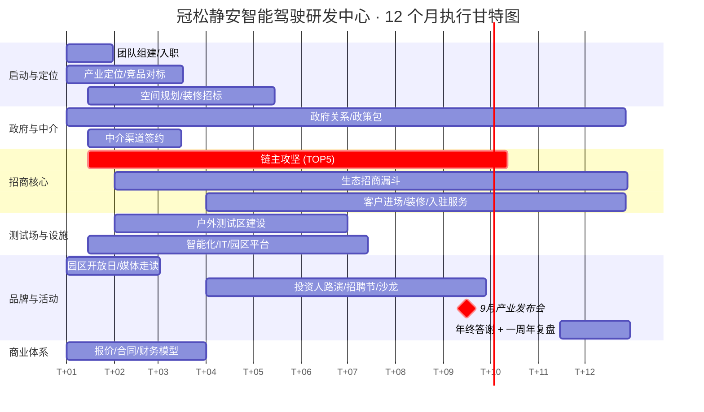

# 任务8 ｜ 12 个月执行甘特图

> **项目名称**：冠松静安智能驾驶研发中心
> **文档类型**：12 个月执行甘特图（里程碑 + 工作流）
> **版本**：v1.0｜状态：基线版
> **基线起点**：以 T+0（项目启动）为零月，覆盖 T+0 ~ T+12（共 13 列）

---

## 一、关键里程碑（Milestones）

| 里程碑 | 时间 | 衡量标准 |
|---|:-:|---|
| **M1** 项目启动 + 团队到位 | T+1 月底 | 4 人核心团队全部到岗 |
| **M2** 产业定位 + 政策包 v1.0 | T+3 月底 | 任务1/5 输出文档评审通过 |
| **M3** 首批中介签约 | T+3 月底 | 5 家中介至少签 3 家 |
| **M4** 户外测试区一期通车 | T+6 月底 | 闭环 1.2 km 启用 |
| **M5** 首家链主 LOI | T+6 月底 | TOP5 中至少 1 家 LOI |
| **M6** 9 月产业发布会 | T+8 / T+9 | 现场链主 ≥ 1 家、生态 ≥ 5 家签约 |
| **M7** 累计签约 12 家 + 入驻面积 ≥ 22,000 ㎡ | T+12 月底 | 入驻率 ≥ 65% 加权（A 栋 100%） |
| **M8** 一周年复盘 + 二期定调 | T+12 月底 | 复盘大会召开 |

---

## 二、12 个月甘特图（ASCII 版）

> 每一行为一个工作流；■ 表示主体执行月，▒ 表示延伸 / 维护性月份；★ 表示里程碑节点。

```
工作流 / 月份                    │ T+1│ T+2│ T+3│ T+4│ T+5│ T+6│ T+7│ T+8│ T+9│T+10│T+11│T+12│
─────────────────────────────────┼────┼────┼────┼────┼────┼────┼────┼────┼────┼────┼────┼────┤
W1 团队组建 / 入职                │ ■★ │ ■  │ ▒  │ ▒  │    │    │    │    │    │    │    │    │
W2 产业定位 / 竞品对标              │ ■  │ ■  │ ■★ │ ▒  │    │    │    │    │    │    │    │ ▒  │
W3 空间规划 / 设计 / 装修招标       │ ■  │ ■  │ ■  │ ■  │ ▒  │ ▒  │ ▒  │ ▒  │ ▒  │ ▒  │ ▒  │ ▒  │
W4 户外测试区建设 / 联调            │    │ ■  │ ■  │ ■  │ ■  │ ■★ │ ▒  │ ▒  │ ▒  │ ▒  │ ▒  │ ▒  │
W5 政府关系 / 政策包 / 申报          │ ■  │ ■  │ ■★ │ ■  │ ■  │ ■  │ ■  │ ■  │ ■  │ ■  │ ■  │ ■  │
W6 中介渠道签约 + 培训              │ ■  │ ■★ │ ■  │ ▒  │ ▒  │ ▒  │ ▒  │ ▒  │ ▒  │ ▒  │ ▒  │ ▒  │
W7 链主攻坚 (TOP5)                 │ ■  │ ■  │ ■  │ ■  │ ■  │ ■★ │ ■  │ ■  │ ■★ │ ▒  │ ▒  │ ▒  │
W8 生态企业招商漏斗                  │    │ ■  │ ■  │ ■  │ ■  │ ■  │ ■  │ ■  │ ■  │ ■  │ ■  │ ■★ │
W9 园区开放日 / 媒体走读              │ ■  │ ■  │ ▒  │    │    │    │    │    │    │    │    │    │
W10 投资人路演 / 招聘节 / 沙龙        │    │    │    │ ■  │ ■  │ ■  │ ■  │ ■  │    │ ■  │    │    │
W11 9 月产业发布会筹备 + 执行          │    │    │    │    │ ■  │ ■  │ ■  │ ■★ │ ■★ │    │    │    │
W12 商业模式 / 报价 / 合同 / 财务模型 │ ■  │ ■  │ ■  │ ▒  │ ▒  │ ▒  │ ▒  │ ▒  │ ▒  │ ▒  │ ▒  │ ▒  │
W13 智能化 / IT / 物业 / 园区平台    │ ■  │ ■  │ ■  │ ■  │ ■  │ ■  │ ▒  │ ▒  │ ▒  │ ▒  │ ▒  │ ▒  │
W14 客户进场 / 装修 / 入驻服务        │    │    │    │ ■  │ ■  │ ■  │ ■  │ ■  │ ■  │ ■  │ ■  │ ■  │
W15 一周年复盘 / 二期定调            │    │    │    │    │    │    │    │    │    │ ▒  │ ▒  │ ■★ │
─────────────────────────────────┴────┴────┴────┴────┴────┴────┴────┴────┴────┴────┴────┴────┘
                                  ★M1   ★M2★M3        ★M4★M5         ★M6★M6                ★M7M8
```

> 上方"★"分布在每个工作流的关键节点上，与 §一 的 M1~M8 一一对应。

---

## 三、按月度任务卡

> 每月输出一份《月度执行报告》，固定结构：① 完成项 ② 在途项 ③ 风险 ④ 下月计划。

### T+1 月（启动）

- 4 人核心团队到位（项目总监 / 招商总监 / GR 总监 / 财务/运营总监）
- 项目章程签发；预算与权限矩阵确定
- 启动产业定位研究 + 空间规划设计
- 园区开放日 #1（小规模）
- 政府对接首轮预约

### T+2 月

- 产业定位报告 v0.5 内审
- 户外测试区设计方案完成
- 中介接触：戴德 / JLL / 高力初步方案
- 媒体走读：智驾静安活动
- 链主拜访：联系全部 TOP5 中至少 3 家

### T+3 月（M2 / M3）

- **M2**：产业定位 + 政策包 v1.0 评审通过
- **M3**：5 家中介至少 3 家签约
- 静安区投促办首轮汇报完成
- 中介渠道培训
- 链主：完成所有 TOP5 首接（T-Touch）；启动 T-Visit

### T+4 月

- 户外测试区动工
- 投资人路演日
- 链主：3~5 家进入 T-Visit
- 客户开始装修进场

### T+5 月

- 暑期人才招聘节启动
- 链主：1~2 家进入 T-Site
- 生态企业漏斗：意向 ≥ 30 家
- 9 月发布会方案 v0.8

### T+6 月（M4 / M5）

- **M4**：户外测试区一期通车
- **M5**：链主首家 LOI
- 智驾沙龙 #1
- 招聘节继续；签约入驻 5~6 家生态客户

### T+7 月

- 校企论坛
- 链主：MOU/合同推进
- 9 月发布会嘉宾确认 80%
- 生态客户继续装修进场

### T+8 月（M6 启动）

- 链主对话 CXO Roundtable
- 9 月发布会全要素彩排
- 链主签约 1 家 / 备选 2 家进入 MOU
- 媒体预热 + 通稿铺设

### T+9 月（M6 高潮）

- **M6**：产业发布会 → 链主签约 + 生态批量签约 + 中介签约 + 政策包发布
- 媒体大面积曝光
- 现场新增 LOI ≥ 5 家

### T+10 月

- 沙龙 #2 / #3
- 客户后续踏勘 / 谈判
- 财务模型刷新（基线 → 实际）

### T+11 月

- 年终客户答谢
- 二期招商策略输出
- 入驻率达 60%+

### T+12 月（M7 / M8）

- **M7**：累计签约 ≥ 12 家、入驻 ≥ 22,000 ㎡（加权入驻率 65%+，其中 A 栋 100%）
- **M8**：一周年复盘 + 二期产业定位发布
- 全年财务关账与审计
- 政府层面年度汇报

---

## 四、Mermaid 甘特图（机器可读版）

> 适合粘贴进 Notion / Confluence / GitLab Wiki 渲染。



---

## 五、配套节奏（管理机制）

| 机制 | 频率 | 出席 |
|---|---|---|
| 项目晨会 | 每日 15 分钟 | 4 人核心团队 |
| 招商周例会 | 每周三 下午 | 4 人 + 招商经理团 |
| GR 双周例会 | 每两周 一次 | GR 总监 + 项目总监 |
| 月度复盘 | 每月最后一周 | 4 人核心 + 业主代表 |
| 季度董事会 | 每季度末 | 冠松董事 + 项目总监 + 财务 |

---

> **文档负责人**：项目总监
> **节奏**：月度刷新 + 季度复盘
> **配套文件**：[`task8-team-roles.md`](./task8-team-roles.md)
