# 以韩为鉴

> 压缩式现代化之后的就业、民生与周期——一个追赶型经济体的高光与代价 · 供中国借鉴

# 《以韩为鉴》全书提纲

> 副标题：压缩式现代化之后的就业、民生与周期——一个追赶型经济体的高光与代价（供中国借鉴）

## 一、写作定位

| 维度 | 《以日为鉴：衰退时代生存指南》 | 《以韩为鉴》（本书） |
| --- | --- | --- |
| 观察对象 | 泡沫破裂后“失去的三十年”的日本 | 1997 年危机后快速出清、又陷入“高收入低活力”的韩国 |
| 叙事主线 | 失业潮、冰河世代、职业众生相、医疗、出海 | 保留上述五条主线，新增“周期坐标篇”和“养老民生底座篇” |
| 核心问题 | 衰退时代普通人如何生存 | 增长仍在、出口创纪录，为什么普通人感觉越来越难？ |
| 方法 | 历史回顾 + 群体命运 | 历史回顾 + 群体命运 + **数据对照** + **康波/库兹涅茨周期定位** + **中国对照表** |
| 落点 | 个人生存法则 | 政策借鉴（国家与城市）+ 家庭与个人决策（就业、负债、教育、养老、资产） |

为什么韩国对中国更有参照价值：

1. **同为追赶国**：韩国在第四、第五次康波中完成“出口导向—重化工业—半导体与电子”的追赶，路径比日本更接近今天的中国。
2. **时间差更短**：韩国 2017 年进入老龄社会、2024 年底进入超老龄社会（65 岁以上占 20%）；中国 65 岁以上占比 2025 年末为 15.9%，大约落后韩国 8—10 年。
3. **民生压力结构高度相似**：高教育竞争、高房价、低生育、青年就业难、中年早退、老年贫困、个体户过多。
4. **韩国做过日本没做过的选择**：1997 年快速出清、2015 年公务员年金改革、2025 年国民年金改革、2024 年医学院扩招风波，每一次都是“另一条路”的实验。

## 二、章节结构（七篇二十二章 + 附录）

每章统一采用“**民生画像 → 发生了什么 → 数据说话 → 周期定位 → 代价与反馈 → 中国对照 → 借鉴与反思 → 本章要点**”八段式结构。

### 前言  为什么要“以韩为鉴”

- 韩国的“两张面孔”：KOSPI 9000 点、半导体出口 1734 亿美元 vs 生育率 0.72、自杀率 OECD 第一
- 本书如何使用康波周期：框架而非预言
- 读者指南：政策读者看“借鉴”，家庭读者看“生存法则”

### 总论篇  周期坐标：康波、地产与韩国的六十年

- 第一章  康波中的追赶者——韩国如何搭上第四、第五次康波
- 第二章  房子的二十年轮回——韩国房地产库兹涅茨周期与“传贳”
- 第三章  外热内冷——出口创纪录与民生体感的剪刀差（周期反馈）

### 第一篇  失业潮下的决策（对标《以日为鉴》第一篇）

- 第四章  保就业，还是保发展？——1997 年 IMF 危机：韩国选择了“快速出清”
- 第五章  救中年，还是救青年？——“休息的青年”与“52.9 岁退休的中年”
- 第六章  留在首都圈，还是回地方？——“首尔共和国”与地方消亡

### 第二篇  无法与自己和解的一代人（对标《以日为鉴》第二篇）

- 第七章  N 抛世代——从“三抛”到生育率 0.72，以及 2025 年的意外反弹
- 第八章  考试地狱与学历通胀——课外补习 29 万亿韩元的军备竞赛
- 第九章  金汤匙与土汤匙——“地狱朝鲜”、“灵魂贷款”与投机化的一代

### 第三篇  就业众生相（对标《以日为鉴》第三篇）

- 第十章  考公热的退潮——9 级公务员竞争率从 93:1 跌到 21.8:1
- 第十一章  教师：从铁饭碗到“教权崩溃”
- 第十二章  医生：神的职业与 18 个月的医疗空白
- 第十三章  工程师：K 芯片的荣光与理工人才的出走
- 第十四章  个体户：一年一百万家关店

### 第四篇  老龄化冲击下的民生底座（对标《以日为鉴》第四篇医疗篇，扩展至养老）

- 第十五章  OECD 最贫困的老人——为什么富裕的国家有一群穷老人
- 第十六章  年金改革——9% 到 13%，以及“退休—领年金”之间的十年空窗
- 第十七章  孤独、照护与死亡——长期护理保险、孤独死与自杀

### 第五篇  外热内冷下的出海（对标《以日为鉴》第五篇）

- 第十八章  文化与消费品出海——K-beauty、K-food 为何能卖向世界
- 第十九章  资本出海——“西学蚂蚁”、国民年金与汇率
- 第二十章  人才与工厂出海——在美国建厂、在硅谷就业

### 终篇  以韩为鉴

- 第二十一章  给中国的十五条政策借鉴
- 第二十二章  康波回升期的家庭生存法则（十二条）

### 附录

- 附录 A  中韩关键民生指标对照表
- 附录 B  韩国经济与民生大事年表（1962—2026）
- 附录 C  参考资料与数据来源
- 附录 D  术语表（韩语新词与经济学概念）

## 三、核心论点（一页纸版本）

1. **增长 ≠ 民生**：韩国 2026 年一季度名义 GDP 同比增 17.1%，青年就业人数却连续 46 个月下降。半导体超级周期带来的收益集中在少数企业、股东和高技能员工手中，K 型分化是追赶国进入成熟期后的常态。
2. **快速出清也有代价**：1997 年韩国没有像日本那样“保僵尸企业”，而是在两年内让大宇等财阀解体，换来了经济 V 型反弹，代价是终身雇佣瓦解、非正规就业扩张和中年提前退出。
3. **人口问题本质上是“生活成本 + 竞争强度”问题**：首尔生育率 0.63、首尔中等收入家庭购房需 10.5 年收入、课外补习人均每月 60 万韩元，这三个数字是同一个问题的不同面。
4. **养老金制度晚成熟一代人，就会有一代穷老人**：韩国国民年金 1988 年才建立，今天 76 岁以上老人贫困率 54%。中国必须避免“制度老龄化快于制度成熟”。
5. **康波回升期的机会是结构性的，不是普惠的**：第六次康波（人工智能、新能源、生物技术）的红利会先流向技术、资本与头部城市，政策要主动做“二次分配”和“机会再分配”，个人要主动做“技能迁移”和“资产再平衡”。

# 前言  为什么要“以韩为鉴”

## 一个国家的两张面孔

2026 年 6 月 18 日，韩国综合股价指数（KOSPI）收于 9063.84 点，历史上第一次站上 9000 点。同一个月，韩国单月出口额首次突破 1000 亿美元，其中半导体出口 448.2 亿美元，同比增长将近两倍。2026 年一季度，韩国名义 GDP 同比增长 17.1%，是 1995 年以来最快的速度。

如果只看这些数字，韩国正处在一个黄金时代。

但同一时期的另一组数字是这样的：

- 2026 年 8 月，韩国 15—29 岁青年就业人数同比减少 14.3 万人，**连续 46 个月下降**；青年就业率 44.1%，连续 28 个月下降。
- 2025 年，20—39 岁“只是在休息”（既不工作也不找工作，且无疾病、育儿等原因）的青年达到 **71.7 万人**，创 2003 年有统计以来新高。
- 2024 年，韩国停业的经营者 **100.8 万**，首次突破一百万。
- 2024 年，韩国自杀死亡率为每 10 万人 **29.1 人**，自杀是 10—40 岁人群的第一死因；按 OECD 标准化口径为 26.2 人，是 OECD 平均水平的约 2.4 倍。
- 66 岁以上老人相对收入贫困率 **39.7%**，OECD 最高，是 OECD 平均（14.8%）的 2.7 倍。
- 2023 年总和生育率 **0.72**，人类有统计以来和平时期的最低值之一。

这就是韩国的两张面孔：一张是全球化、技术化、资本化的“公司韩国”，另一张是高压、低生育、早退休、老年贫困的“家庭韩国”。

本书要回答的问题是：**一个追赶成功的国家，为什么普通人越来越难？中国在哪些地方已经走在韩国的路上，又能在哪些地方提前避开？**

## 为什么不是只看日本

《以日为鉴：衰退时代生存指南》以泡沫破裂后的日本为镜子，讲述了失业潮、就业冰河期、学历贬值、考公热、医疗崩坏与全民出海。它的价值在于：把宏观衰退落到了具体人群的命运上。

本书借用它的结构，但把镜子换成韩国，理由有四条：

1. **韩国和中国同属追赶国**。日本在第四次康波中已经追上美国，泡沫破裂时人均收入已经接近美国；韩国则在第五次康波中仍在追赶，靠半导体、手机、汽车、造船、电池爬坡，这条“制造业 + 出口 + 产业政策”的路径与今天的中国更接近。
2. **韩国的时间差更短、可借鉴的窗口更近**。韩国 65 岁以上人口占比 2024 年底超过 20%，进入超老龄社会；中国 2025 年末为 15.9%。按目前速度，中国大约在 2030 年代前期走到韩国今天的位置。
3. **韩国走了另一条路**。1997 年危机中，韩国没有像日本那样长期“保就业、保企业”，而是在国际货币基金组织（IMF）的条件下快速出清。两种选择的结果放在一起，比单看日本更能说明问题。
4. **韩国的民生压力在结构上和中国高度相似**：教育军备竞赛、首都圈虹吸、高房价与婚育推迟、个体户过多、养老金不足、医生与工程师之间的人才争夺。

## 本书如何使用“周期”

本书大量使用周期语言，但需要先说清楚边界。

- **康德拉季耶夫周期（康波）**：约 50—60 年，以技术革命为主线，分为回升、繁荣、衰退、萧条四个阶段。本书参照周金涛等人的分期：第五次康波以信息技术为核心，大约 1991—2007 年为繁荣期，2008—2015 年为衰退期，2015—2025 年为萧条期；2025 年前后以人工智能、新能源、生物技术为代表的第六次康波进入回升窗口。
- **库兹涅茨周期**：约 20—30 年，与人口结构和房地产相关。
- **朱格拉周期**：约 8—10 年，与设备投资相关；半导体行业的“超级周期”大致在这一层级。
- **基钦周期**：约 3—4 年，与库存相关。

康波是一种**分析框架**，不是确定的预言。本书用它来回答三个问题：一个群体遭遇冲击时，处在哪个周期的哪个阶段；这个冲击是周期性的（会过去），还是结构性的（不会自动过去）；在下一个阶段，谁会先受益，谁会被落下。

## 每章怎么读

每章都按照以下八个部分组织，读者可以按需跳读：

1. **民生画像**：基于公开报道整理的典型人物画像（综合案例，非特定个人）。
2. **发生了什么**：时间线与政策过程。
3. **数据说话**：核心指标表，均注明来源与年份。
4. **周期定位**：这个问题处在哪个周期层级。
5. **代价与反馈**：政策选择的副作用，以及社会如何反过来影响经济。
6. **中国对照**：中国目前的数据与相似之处、不同之处。
7. **借鉴与反思**：分为“政策层”和“家庭与个人层”。
8. **本章要点**。

## 关于数据

本书数据优先采用一手官方来源：韩国国家数据处（2025 年由统计厅改组）、韩国银行、韩国人事革新处、教育部、保健福祉部、国税厅、OECD、BIS；中国数据来自国家统计局、教育部、国家公务员局、国家金融与发展实验室等。部分数据通过主流媒体（韩联社、东亚日报、首尔经济日报、财新网等）转引，均在附录 C 列出。

需要提醒的是：

- 韩国统计有“确定值”和“初步值”之分，不同时间发布的数据可能有细微修订。
- 中韩两国统计口径不同（例如中国青年失业率不含在校生，韩国青年就业率按 15—29 岁计算），对照表中的数字用于“看方向、看量级”，不宜直接做精确比较。
- 截稿时间为 2026 年 10 月。

# 总论篇  周期坐标：康波、地产与韩国的六十年

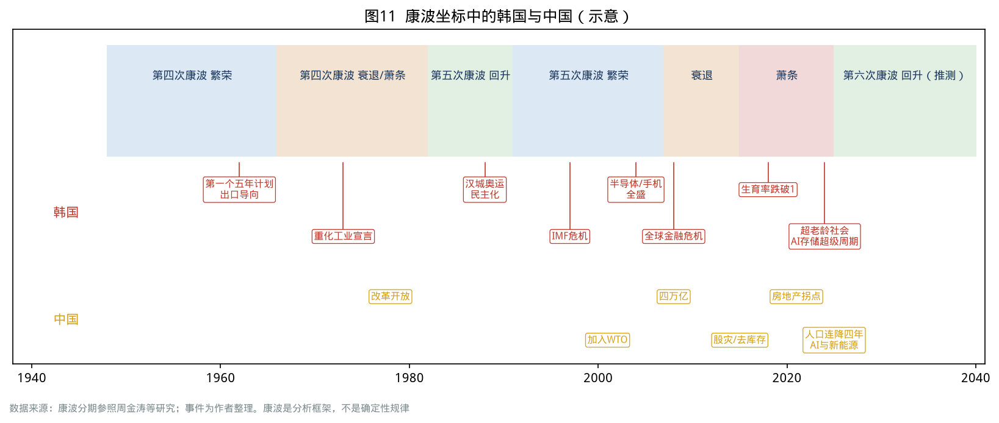

## 第一章  康波中的追赶者——韩国如何搭上第四、第五次康波

### 民生画像

1962 年出生的金先生，赶上了韩国“汉江奇迹”最好的三十年：20 岁进入现代重工业的造船厂，30 岁在首尔郊区分到一套公寓，35 岁那年遇上 1997 年金融危机，工厂裁员三成，他靠着资历留了下来。2015 年，他 53 岁，在法定 60 岁退休之前被“劝退”，用退休金在小区门口开了一家炸鸡店，七年后关门。到 2026 年，他 64 岁，刚刚开始领取国民年金，每月约 70 万韩元。

他的一生几乎就是一张康波阶段图：**繁荣期入职、衰退期被裁、萧条期创业失败、回升期领着微薄的年金看着股市创新高。**

### 发生了什么

| 阶段 | 时间 | 全球康波背景 | 韩国在做什么 |
| --- | --- | --- | --- |
| 起飞 | 1962—1972 | 第四次康波繁荣期（汽车、石化、电气化） | 第一、二个五年计划，出口导向，轻工业（纺织、假发、胶合板） |
| 重化工业 | 1973—1979 | 第四次康波衰退期，石油危机 | 朴正熙“重化工业宣言”，钢铁（浦项）、造船、汽车、石化，财阀体制成型 |
| 调整与民主化 | 1980—1991 | 第四次康波萧条、第五次康波回升 | 1980 年负增长后稳定化改革；1986—1988“三低”（低油价、低利率、低美元）景气；1988 年汉城奥运；三星 1983 年进入存储芯片 |
| 信息技术追赶 | 1991—2007 | 第五次康波繁荣期（互联网、个人电脑、手机） | 1996 年加入 OECD；1997 年 IMF 危机；危机后宽带、手机、液晶、存储芯片全面崛起 |
| 衰退期 | 2008—2015 | 第五次康波衰退期 | 全球金融危机后靠出口快速复苏，但潜在增速从 4% 降到 3% 以下 |
| 萧条期 | 2015—2025 | 第五次康波萧条期 | 增速降到 2% 左右；生育率跌破 1；房价 2021 年见顶后暴跌；2025 年增长仅 1.0% |
| 新回升窗口 | 2025— | 第六次康波回升（人工智能、能源转型） | AI 带动存储芯片超级周期，2025 年半导体出口 1734 亿美元，2026 年 KOSPI 首破 9000 点 |

### 数据说话

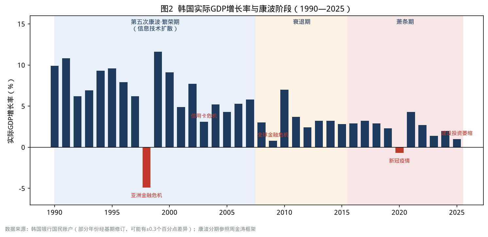

| 指标 | 1990 年代平均 | 2000 年代平均 | 2010 年代平均 | 2020—2025 年 |
| --- | --- | --- | --- | --- |
| 实际 GDP 增速 | 约 7% | 约 5% | 约 3% | 约 1.6%（2025 年仅 1.0%） |
| 总和生育率 | 1.5 左右 | 1.1—1.3 | 0.9—1.2 | 0.72—0.84 |
| 65 岁以上人口占比 | 5%—7% | 7%—11% | 11%—16% | 16%—20%+ |

数据来源：韩国银行国民账户；韩国国家数据处人口统计。

### 周期定位

韩国在康波中的身份是**追赶国**。周金涛把每一次康波中的国家分为主导国、追赶国和资源国：第四次康波的追赶国是日本，第五次康波的主要追赶国是中国，而韩国处在两者之间——它在第四次康波后半段起飞，在第五次康波的繁荣期完成了最关键的产业升级。

追赶国有三个规律：

1. **繁荣期最容易出金融危机**。追赶国在繁荣期借外债、扩产能，一旦主导国收紧流动性，就会出现货币危机。1997 年韩国危机发生在第五次康波繁荣期的中段，而不是萧条期。
2. **追赶红利的末期，增长会突然失速**。当技术在追赶国渗透到“无孔不入”，就意味着该技术进入生命周期末段。韩国 2010 年代的增长失速，正是信息技术红利边际递减的表现。
3. **新康波的回升期，追赶国能否换道，决定下一个三十年**。韩国在存储芯片上抓住了人工智能浪潮，但在人工智能模型、云计算、平台上并不领先，“出口一枝独秀”的结构风险很大。

### 代价与反馈

追赶成功的代价是“压缩式现代化”：英国用两百年、日本用一百年走完的工业化、城市化、民主化和老龄化，韩国用了六十年。所有社会制度——养老金、医保、住房、教育、劳动法——都是在“边跑边补”的状态下建立起来的。

- 国民年金 1988 年才建立，1999 年才覆盖全民，导致今天的高龄老人几乎没有积累。
- 城市化率从 1960 年的约 28% 升到 1990 年代的 80% 左右，首尔都市圈吸纳了一半人口，住房长期短缺。
- 教育成为阶层上升的唯一通道，最终演化为全民补习的军备竞赛。

### 中国对照

| 维度 | 韩国 | 中国 |
| --- | --- | --- |
| 起飞时点 | 1962 年 | 1978 年 |
| 康波中的身份 | 第四次康波后半段起飞、第五次康波完成追赶 | 第五次康波的主要追赶国 |
| 人均 GDP | 约 3.6 万美元（2024 年） | 99665 元，约 1.4 万美元（2025 年） |
| 2025 年实际增速 | 1.0% | 5.0% |
| 城镇化率 | 约 81% | 67.89%（2025 年末） |
| 65 岁以上占比 | 20.3%（2025 年） | 15.9%（2025 年末） |

中国与韩国的根本差异在于**规模**：中国拥有完整工业体系和超大规模国内市场，不必像韩国那样把增长押在少数出口品上。但中国与韩国在“压缩式现代化”上高度相似——制度建设的速度跟不上人口结构变化的速度。

### 借鉴与反思

**政策层**

- 在追赶红利末期，要把增长目标从“速度”转向“分配与可持续”，避免把社会制度的欠账留给下一代。
- 新康波回升期的产业政策，要“既押硬件，也押软件和平台”，避免像韩国那样只在制造环节获益。

**家庭与个人层**

- 职业生涯平均约 40 年，几乎必然跨越一次康波的两个以上阶段。职业规划要按“阶段”而非“行业”来做：繁荣期积累技能和现金流，衰退期降低负债，萧条期保住岗位与健康，回升期主动换道。

### 本章要点

- 韩国是第五次康波中最成功的追赶国之一，但追赶成功并不自动带来民生改善。
- 1997 年危机发生在康波繁荣期，说明追赶国最大的风险来自“扩张期的过度负债”。
- 第六次康波回升已经开始，韩国靠存储芯片受益，但受益面很窄。

---

## 第二章  房子的二十年轮回——韩国房地产库兹涅茨周期与“传贳”

### 民生画像

2021 年，31 岁的首尔上班族朴小姐“灵魂贷款”（韩语“영끌”，意为把灵魂都押上去贷款）买下了首尔卢原区一套 59 平方米的旧公寓，总价 9 亿韩元，其中 5 亿是银行贷款和信用贷款，2 亿是父母的支援。2022 年韩国银行连续加息，她的月供从 180 万韩元涨到 260 万韩元，房价一度下跌超过两成。2026 年，首尔房价重新创下新高，她终于“解套”了，但这五年里她推迟了结婚，也放弃了生孩子的计划。

### 发生了什么

韩国房地产大致经历了三轮库兹涅茨级别的周期：

| 周期 | 上行期 | 顶部 | 下行与底部 | 主要特征 |
| --- | --- | --- | --- | --- |
| 第一轮 | 1986—1991 | 1991 年 | 1991—1998，1998 年危机中暴跌 | 奥运景气与地价暴涨；政府推出“200 万户住宅建设”，供给放量后房价长期横盘 |
| 第二轮 | 2001—2008 | 2006—2008 年 | 2009—2013 年首尔下跌，出现“房奴贫困族（하우스푸어）” | 危机后低利率、信用扩张；卢武铉政府推出综合不动产税仍压不住涨势 |
| 第三轮 | 2014—2021 | 2021 年 | 2022—2023 年快速下跌，地方持续低迷 | 超低利率、疫情宽松；文在寅政府 20 多次调控未能抑制首尔房价 |
| 新一轮（进行中） | 2024— | 待观察 | — | 首尔与地方严重分化；2026 年首尔公寓均价 13.62 亿韩元，传贳与月租同时创新高 |

**传贳（전세）制度**是理解韩国住房的关键：租客一次性向房东交纳房价 50%—80% 的押金，租期内不再付租金，到期全额退还。房东用押金去买第二套、第三套房。它本质上是一种**居民之间的无息借贷**，在房价上涨时运转良好，在房价下跌时会变成“空心房”和“传贳诈骗”。

- 截至 2026 年 8 月，韩国累计认定的传贳诈骗受害者 **40278 人**，其中 40 岁以下青年占 **75.9%**，97.6% 的受害押金在 3 亿韩元以下，多集中在多户住宅（빌라）和写字楼式公寓（오피스텔）。
- 2026 年 1—8 月，首尔住宅传贳价格累计上涨 5.91%，为 15 年来最快；首尔月租价格连续创下有统计以来的新高。

### 数据说话

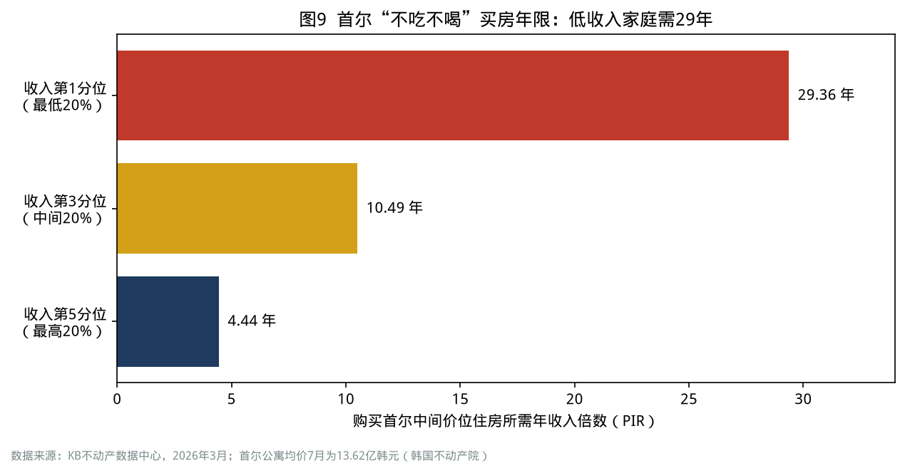

| 指标 | 数值 | 时间 | 来源 |
| --- | --- | --- | --- |
| 首尔公寓平均成交价 | 13.62 亿韩元 | 2026 年 7 月 | 韩国不动产院 |
| 首尔中等收入家庭购买中等价位住房的 PIR | 10.43—10.49 倍 | 2026 年 3—6 月 | KB 不动产 |
| 首尔最低 20% 收入家庭的 PIR | 29.36 倍 | 2026 年 3 月 | KB 不动产 |
| 全国中等收入家庭 PIR | 4.36 倍 | 2026 年 6 月 | KB 不动产 |
| 居民债务/GDP | 88.6%（峰值 99.1%） | 2025 年末 | BIS |
| 银行传贳贷款余额（不计入国际口径） | 约 165.7 万亿韩元 | 2026 年一季度末 | 朝鲜日报经济版 |

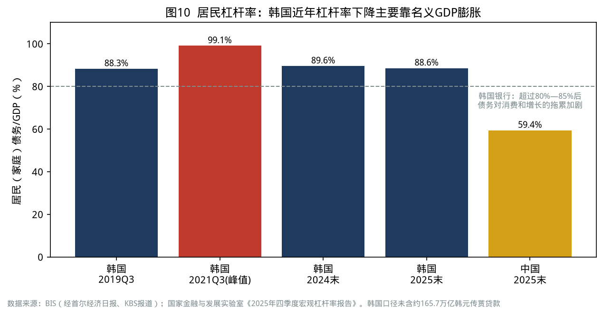

需要注意的是，韩国家庭债务/GDP 从 99.1% 降到 88.6%，主要不是因为家庭还了钱——2026 年韩国家庭债务余额已突破 2000 万亿韩元——而是因为半导体出口和物价上涨推高了名义 GDP 这个“分母”。如果把传贳贷款计入，韩国的居民杠杆率可能超过瑞士，位居全球第一。

### 周期定位

房地产是**库兹涅茨周期**，周金涛认为一个人一生通常会遇到两次房地产大周期：第一次在结婚前后（约 27 岁）买房，第二次在 42 岁前后改善型置业。韩国的三轮周期验证了两个规律：

1. **人口结构决定大趋势，信贷决定波动幅度**。韩国第一轮周期由婴儿潮一代（1955—1963 年生）成家推动，第三轮周期由超低利率推动。
2. **全国性周期会分化为“首都圈周期”和“地方周期”**。2020 年代的韩国，首尔仍在上涨，部分地方城市已陷入长期下行，人口流出地的房价不再有“下一轮”。

### 代价与反馈

- **房价—生育的负反馈**：首尔生育率 0.63，全国最低；地方生育率最高的全罗南道为 1.09。房价越高的地方，年轻人推迟结婚生育越明显。
- **房价—消费的负反馈**：韩国银行研究指出，居民债务/GDP 超过约 80%—85% 后，债务增加对消费和增长的负面作用会加剧，这正是韩国“出口强、内需弱”的原因之一。
- **房价—政治的反馈**：房价成为每届政府的“政治晴雨表”，文在寅政府的 20 多次调控被普遍视为失败，2026 年政府仍在推出“8·13 房地产金融对策”，限制首都圈一套房持有者申请传贳贷款。

### 中国对照

| 维度 | 韩国 | 中国 |
| --- | --- | --- |
| 本轮周期顶部 | 2021 年 | 2021 年前后（销售面积与新开工见顶） |
| 居民杠杆率 | 88.6%（2025 年末，BIS） | 59.4%（2025 年末，国家金融与发展实验室） |
| 居民去杠杆 | 名义 GDP 高增长被动降杠杆 | 房贷连续 11 个季度负增长，主动提前还贷 |
| 特殊制度 | 传贳 | 预售制、期房 |
| 首都圈/核心城市 | 首尔与地方分化 | 一线与核心二线城市企稳快于三四线 |

中国与韩国最大的相似点是 2021 年同步见顶；最大的不同是中国的居民杠杆率更低，但**预售制**让购房者承担了开发商的部分风险，与韩国传贳让租客承担房东风险在机制上类似：都是“把风险转移给普通家庭”的制度设计。

### 借鉴与反思

**政策层**

- 风险转移型制度（传贳、预售）在下行期必须有“兜底机制”，例如保证金保险、资金监管账户，否则受害者集中在青年群体。
- 房地产政策要“分城施策”，人口流入城市以保障性租赁住房为主，人口流出城市以存量收储、城市更新为主。
- 降杠杆不能只靠“名义 GDP 膨胀”，否则会以通胀和实际收入下降为代价。

**家庭与个人层**

- 库兹涅茨底部区域不宜全仓抄底，也不宜过度恐慌，要用“居住需求 + 现金流可承受”来做决策：月供不超过家庭税后收入的 35%—40%。
- 人口持续流出、产业单一的城市，房产应视为消费品而非投资品。
- 押金类、预付类资金是普通家庭最大的“隐性风险敞口”，签约前务必核查产权和抵押状态。

### 本章要点

- 韩国房地产已经走完三轮库兹涅茨周期，每一轮的“牺牲者”都是在顶部入场的年轻人。
- 传贳制度说明：任何以“房价永远上涨”为前提设计的制度，都会在下行期变成风险源。
- 中韩房地产同步在 2021 年前后见顶，韩国的分化路径值得中国提前研究。

---

## 第三章  外热内冷——出口创纪录与民生体感的剪刀差

### 民生画像

2026 年夏天，京畿道华城市三星电子半导体工厂的一位工程师拿到了公司承诺的巨额绩效奖金；同一个城市的一家五金加工厂老板，因为订单减少、电费上涨，正在考虑是否关门。工程师所在的小区附近，新开的咖啡店和健身房生意兴隆；而老板所在的工业园区，路边的韩式餐馆有三成已经转让。两个人同一年出生，同一年大学毕业。

### 发生了什么

2025—2026 年的韩国经济呈现典型的“外热内冷”：

- **出口**：2025 年出口 7097 亿美元，首次突破 7000 亿美元；半导体出口 1734 亿美元，同比增长 22.2%，均创历史纪录。2026 年 6 月单月出口 1022.5 亿美元，同比增长 70.9%。
- **增长**：2025 年实际增长仅 1.0%，四季度环比 -0.3%，建设投资大幅萎缩；2026 年一季度环比增长 1.8%、二季度 0.6%，同比增速约 3.7%—3.8%。
- **资产**：KOSPI 在 2026 年 6 月创下 9063.84 点的纪录，三星电子和 SK 海力士两家公司占总市值一半以上。
- **民生**：2026 年 8 月，全体就业人数同比增加 18.4 万人，但青年就业人数减少 14.3 万人；制造业和建筑业就业持续疲弱；2026 年 2 月爆发的美伊冲突推高油价，韩国 6 月消费者物价同比上涨 3.2%，韩国银行 7 月加息至 2.75%。

### 数据说话

| 指标 | 数值 | 时间 |
| --- | --- | --- |
| 2025 年实际 GDP 增速 | 1.0% | 2025 年 |
| 2026 年一季度名义 GDP 同比 | +17.1% | 2026 年一季度 |
| 2025 年半导体出口 | 1734 亿美元（+22.2%） | 2025 年 |
| 2026 年 6 月出口 | 1022.5 亿美元（+70.9%） | 2026 年 6 月 |
| 15—29 岁就业人数 | 连续 46 个月同比下降 | 截至 2026 年 8 月 |
| 15—64 岁就业率 | 70.4%（同月历史最高） | 2026 年 8 月 |
| 韩国银行基准利率 | 2.75%（2023 年 1 月以来首次加息） | 2026 年 7 月 |
| 美元兑韩元 | 6 月约 1520，10 月初约 1350 | 2026 年 |

数据来源：韩国银行、韩国产业通商资源部、韩国国家数据处、Businesskorea。

### 周期定位

这是**朱格拉级别的半导体超级周期叠加在康波回升起点上**：

- 半导体周期本身约 4—5 年一个小循环、约 10 年一个大循环，2023 年存储价格触底，2024—2026 年在 AI 数据中心需求下进入超级上行。
- 但康波回升期的特点是：新技术先在少数部门产生利润，就业带动有限，传统部门（建筑、零售、餐饮、传统制造）仍在萧条期的“余波”中。
- 因此，“总量数据回升”与“多数人体感变差”可以同时成立。

### 代价与反馈

1. **利润留在海外，内需得不到滋养**：韩国 DB 证券等机构指出，韩元长期偏弱时，出口企业倾向把美元利润留存海外，削弱了家庭收入和本土投资。
2. **单一产业依赖**：两家公司占股市一半市值，意味着全国养老金、居民财富和财政收入都在押注同一个周期。
3. **“就业率创新高”与“青年就业下降”并存**：新增就业主要来自 60 岁以上老人和服务业，青年获得的“好工作”反而减少。
4. **通胀与加息**：油价冲击叠加资产上涨，央行被迫加息，背负房贷和个体户贷款的家庭承受压力。

### 中国对照

中国 2025 年 GDP 增长 5.0%，其中货物和服务净出口拉动 1.6 个百分点，最终消费拉动 2.6 个百分点；居民人均可支配收入中位数增长 4.5%，为历史低位（2020 年除外）。中国同样存在“出口与新兴产业强、内需与传统部门弱”的结构，但规模更大、产业更多元。

| 维度 | 韩国 | 中国 |
| --- | --- | --- |
| 新动能 | 存储芯片 | 新能源汽车、锂电、光伏、AI、工业机器人等多点 |
| 弱项 | 建设投资、自营业者、青年就业 | 房地产、地方财政、青年就业、居民消费 |
| 政策难点 | 汇率与通胀约束下难以放松 | 价格水平偏低，需提振名义增长 |

### 借鉴与反思

**政策层**

- 统计口径上，要同时发布“总量增速”和“中位数指标”（中位数收入、中位数工资、青年就业），避免总量掩盖分布。
- 新兴产业的超额利润要通过税收、员工持股、产业链本地配套等方式回流国内，“企业赚钱”与“居民增收”之间要有传导机制。
- 防止单一产业依赖：鼓励多点突破，避免“一个行业周期决定一个国家的情绪”。

**家庭与个人层**

- 回升期要分清“我所在的行业处在哪个周期”，而不是看总量新闻判断形势。
- 个人资产配置不宜与工作收入“同向押注”：在半导体公司工作的人，不宜再把全部资产押在半导体股票上。

### 本章要点

- 韩国的“外热内冷”是康波回升初期的典型形态：新技术部门繁荣，旧部门仍在萧条。
- 总量数据改善，不等于多数人的处境改善；中位数指标比平均数更能反映民生。
- 中国要提前设计新兴产业收益向居民部门传导的机制。

# 第一篇  失业潮下的决策

> 《以日为鉴》第一篇讲的是日本在泡沫破裂后“保就业还是保发展、救老员工还是救大学生、留城市还是回乡”的三重抉择。韩国面对过同样的三道题，但给出了不同的答案。

## 第四章  保就业，还是保发展？——1997 年 IMF 危机：韩国选择了“快速出清”

### 民生画像

1998 年春天，首尔站的地下通道里出现了一批穿着西装、提着公文包的“新流浪者”。他们大多四五十岁，原本是大企业或银行的职员，被裁员后不敢告诉家人，每天照常“出门上班”，在公园和地铁站坐到下班时间。当时的韩国社会流行两个新词：“사오정”（四五停，45 岁就停止工作）和“오륙도”（五六盗，56 岁还在公司就是“盗贼”）。

### 发生了什么

- **1997 年 1 月**：财阀排名第 14 的韩宝集团破产，揭开连锁破产序幕；7 月，排名第 4 的起亚汽车陷入破产。
- **1997 年 11 月**：外汇储备枯竭，韩国向 IMF 申请救助，最终获得 IMF、世界银行、亚洲开发银行及主要国家合计约 550 亿—580 亿美元的一揽子援助，条件包括高利率、财政紧缩、金融与企业结构调整、劳动市场灵活化。
- **1998 年 1—4 月**：全民“收集黄金运动”，约 351 万人参与，收集黄金约 227 吨，出口所得约 22 亿美元。
- **1998 年 2 月**：劳资政委员会达成协议，《劳动标准法》修订，允许“经营上的紧急需要”时整理解雇，派遣劳动合法化。
- **1999 年 10 月**：排名第 2 的大宇集团进入重组并最终解体，大宇汽车 2002 年被通用汽车收购；三星汽车 2000 年被雷诺收购。
- **1999 年**：经济增长 11.6%，V 型反弹；2001 年 8 月提前偿还 IMF 贷款。

### 数据说话

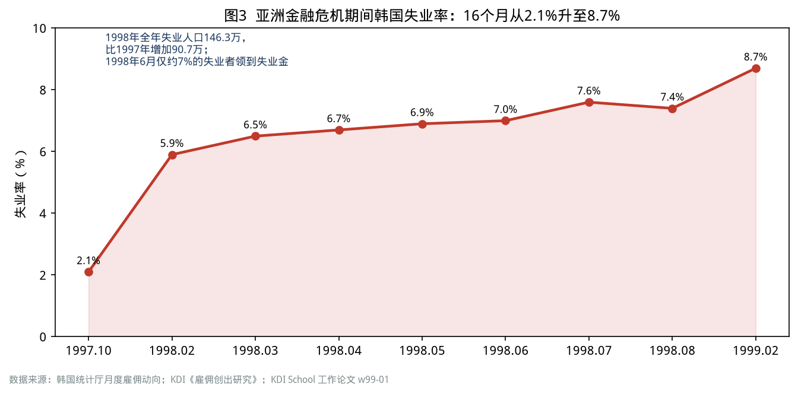

| 指标 | 数值 | 来源 |
| --- | --- | --- |
| 失业率 | 1997 年 10 月 2.1% → 1998 年 7 月 7.6% → 1999 年 2 月 8.7% | 韩国统计厅；KDI School |
| 失业人数 | 1997 年 10 月 45.2 万 → 1998 年 3 月 137.8 万（5 个月增加 92.6 万） | KDI |
| 1998 年全年 | 失业 146.3 万人，失业率 6.8%，比 1997 年增加 90.7 万人 | KDI |
| 就业人数降幅 | 1998 年 8 月同比 -6.8%，1982 年有统计以来最大 | 韩国统计厅（经文化日报） |
| 失业保险覆盖 | 1998 年 6 月约 150 万失业者中，仅约 7%（约 10.5 万人）领到失业金 | KDI School 工作论文 |
| 1998 年 GDP | -4.9%（不同修订版为 -5.1%～-4.9%） | 韩国银行 |

### 周期定位

1997 年危机发生在**第五次康波繁荣期**，本质上是追赶国在扩张期“过度投资 + 短借长投 + 外债依赖”的结果：财阀靠高负债扩张产能，短期外债支撑长期投资，国际资本撤离时货币危机转化为企业连锁破产。

与日本相比，韩国危机的触发点是**外部流动性冲击**，而日本是**内部资产泡沫破裂**；韩国处理的方式是**快速出清**，日本是**缓慢消化**。

| 对比项 | 日本（1990 年代） | 韩国（1997—1999） |
| --- | --- | --- |
| 政策取向 | 保就业、保企业，银行持续向僵尸企业放贷 | IMF 条件下高利率、关停并转、引入外资 |
| 出清速度 | 十年以上 | 约两年 |
| 短期失业率峰值 | 约 5.5%（2002 年） | 8.7%（1999 年 2 月） |
| 经济恢复 | 长期低增长 | 1999 年增长 11.6% |
| 长期代价 | 失去的三十年、就业冰河期 | 终身雇佣瓦解、非正规就业扩张、中年提前退出、两极化劳动市场 |

### 代价与反馈

快速出清换来了 V 型反弹，但社会账单被转移给了劳动者和家庭：

1. **非正规就业制度化**：危机后韩国非正规就业比例迅速上升，“正规职—非正规职”的二元结构延续至今，成为青年“宁可等待也不进中小企业”的根源。
2. **中年提前退出**：企业大量采用“名誉退休”，主力岗位平均退休年龄提前，形成了今天“法定 60 岁、实际 52.9 岁退休”的格局。
3. **退休者涌入自营业**：被裁员的中年人用退休金开炸鸡店、便利店、网吧，埋下了“自营业者过多”的结构性问题（见第十四章）。
4. **社会保障被迫扩张**：危机后金大中政府扩大失业保险覆盖面至所有企业，1999 年建立“国民基础生活保障制度”，国民年金扩大至城市自营业者。危机倒逼了福利国家的雏形。

### 中国对照

中国在 1990 年代后期经历过国企改革与下岗潮，1998—2002 年国有企业职工大规模下岗分流，同样是一场“快速出清”，并配套建立了再就业服务中心、失业保险和城市低保。今天的中国面对的是不同的问题：不是企业负债危机，而是**房地产链条收缩、地方债约束和传统行业产能过剩**带来的就业压力。

| 对比项 | 韩国 1997 年 | 中国 1990 年代末 | 中国 2020 年代 |
| --- | --- | --- | --- |
| 冲击来源 | 外债与财阀负债 | 国企亏损 | 房地产与地方财政调整、产业转型 |
| 主要受冲击群体 | 大企业中年白领、中小企业工人 | 国企工人 | 建筑与房地产链条从业者、青年、灵活就业者 |
| 安全网 | 失业保险覆盖仅 7% | 再就业中心 + 低保 | 失业保险、灵活就业社保、职业技能补贴 |

### 借鉴与反思

**政策层**

- 出清可以快，但**安全网必须先于出清**。韩国 1998 年只有约 7% 的失业者能领到失业金，大量中年人只能靠自营业自救，这一代价持续了二十多年。
- “保就业”与“保发展”不是二选一：可以“保人不保企业”，用失业保险、再培训、公共就业项目保护劳动者，让低效企业有序退出。
- 劳动市场灵活化要配套“正规—非正规”转换通道，否则会固化二元结构。

**家庭与个人层**

- 危机来临时，大企业不等于安全；真正的“安全垫”是可迁移技能、低负债和 6—12 个月的家庭应急金。
- 中年被裁后，不要把全部退休金投入门槛低、竞争激烈的餐饮零售自营业。

### 本章要点

- 韩国用两年时间完成了日本用十年都没完成的出清，换来了 V 型反弹。
- 代价是劳动市场的二元化和中年的提前退出，这笔账今天仍在支付。
- 对中国的启示：出清可以快，但安全网要先行；保护“人”，而不是保护“企业”。

---

## 第五章  救中年，还是救青年？——“休息的青年”与“52.9 岁退休的中年”

### 民生画像

26 岁的李同学是首尔一所私立大学经营学专业毕业生，毕业两年投了 80 多份简历，拿到的录用通知都来自 300 人以下的中小企业，月薪约 250 万韩元。她拒绝了，选择“休息”：在家准备公务员和公共机构考试，偶尔做便利店兼职。她的父亲 54 岁，刚从一家中坚企业“提前退休”，正在考虑用退休金加盟一家咖啡店。一家两代人，同时处在劳动市场的门外。

### 发生了什么

- 2024 年 5 月起，韩国 15—29 岁青年就业率持续下降；到 2026 年 8 月，青年就业人数已连续 46 个月同比减少，就业率 44.1%，连续 28 个月下降，劳动参与率 46.6%，为 2020 年以来同月最低。
- 2025 年，20—39 岁“只是在休息”的人数达到 71.7 万，首次突破 70 万，创有统计以来新高。
- 韩国银行研究发现：15—29 岁非经济活动人口中“休息”者的比例从 2019 年的 14.6% 升至 2025 年的 22.3%；**不想工作**的“休息青年”从 28.7 万增至 45 万，增长 56.8%。
- 与之形成对照的是：主力岗位的平均退休年龄只有 52.9 岁，而法定退休年龄是 60 岁，国民年金领取年龄正逐步推迟到 65 岁；65 岁以上老人就业率高达 37.3%，OECD 第一。

### 数据说话

| 指标 | 数值 | 时间 | 来源 |
| --- | --- | --- | --- |
| 15—29 岁就业率 | 44.1%（同比 -1.0 个百分点） | 2026 年 8 月 | 韩国国家数据处 |
| 15—29 岁失业率 | 5.4% | 2026 年 8 月 | 同上 |
| 20—24 岁就业率 | 41.3%（2025 年均值 43.6%） | 2026 年二季度 | 韩联社 |
| “休息”青年（20—39 岁） | 71.7 万（历史最高） | 2025 年 | 经济活动人口调查 |
| 有工作经历的“休息”青年中，离开 300 人以下中小企业者占比 | 92.7% | 2025 年 | 同上（经 MoneyToday） |
| 每多失业一年，进入“休息”状态的概率 | +4.0 个百分点 | 2026 年研究 | 韩国银行 BOK Issue Note |
| 主力岗位平均退休年龄 | 52.9 岁 | 2025 年 | 韩国国家数据处 |
| 65 岁以上就业率 | 37.3%（OECD 平均 13.6%，日本 25.3%） | 2023 年 | 国会预算政策处 |

### 周期定位

青年就业困难在韩国已经不是周期性问题，而是**结构性问题**：

- 周期层面，2024—2025 年建筑业与制造业低迷、内需不振，压缩了入门岗位。
- 结构层面，好岗位（大企业与公共部门）只占全部就业的一小部分，大企业与中小企业工资相差一倍（见第十三、十四章），青年宁可“等待”也不愿“将就”。
- 人口层面，青年人口在减少，但“好工作”减少得更快；与此同时，老人为了弥补年金不足而大量进入低端服务岗位。

韩国银行的研究给出了一个重要结论：**“休息”不是因为期望太高，而是因为失业时间太长。** 失业持续时间越长，越可能退出劳动市场；专科及以下学历和职业适应能力低的青年更容易陷入“休息”。这与日本“就业冰河期”一代的轨迹相似：一旦错过毕业后的第一份正规工作，一生的收入曲线都会被压低。

### 代价与反馈

1. **人力资本折旧**：长期“休息”导致技能和工作习惯的流失，重返劳动市场越来越难。
2. **婚育推迟**：没有稳定工作，就没有结婚与购房的基础（见第七章）。
3. **代际反馈**：父母用退休金和养老储蓄支持“休息”的子女，进一步削弱了自身养老能力。
4. **政治反馈**：青年议题成为选举焦点，政府推出“青年游乐场”（Youth Playground，跨部门青年就业平台）、承诺 2030 年前创造 30 万个青年岗位，但“岗位数量”与“岗位质量”之间的矛盾并未解决。

### 中国对照

| 指标 | 韩国 | 中国 |
| --- | --- | --- |
| 青年就业/失业指标 | 15—29 岁就业率 44.1%，失业率 5.4%（2026 年 8 月） | 不含在校生 16—24 岁失业率 18.9%，25—29 岁 7.5%（2026 年 8 月） |
| 毕业生规模 | 大学升学率约七成以上，青年人口持续减少 | 2026 届高校毕业生约 1270 万，同比增加 48 万 |
| 中年就业 | 实际退休 52.9 岁 | “35 岁门槛”现象，部分行业中年再就业难 |
| 老年就业 | 65 岁以上就业率 37.3% | 低龄老人参与度高，渐进式延迟退休自 2025 年起实施 |

中国的特殊之处在于，青年人口规模仍在高位（毕业生连年创新高），而韩国青年人口已在快速下降。这意味着中国的青年就业压力在未来几年仍然较大，但 2030 年代后，随着 2017 年以后出生人口的骤减，劳动市场将迅速从“人找岗位”转向“岗位找人”。**真正需要警惕的，是这一代青年在等待期中的人力资本损耗。**

### 借鉴与反思

**政策层**

- 把“毕业后两年内的首份工作”作为政策重点，因为这是决定一生收入曲线的关键窗口。可借鉴韩国的“青年内日填充共济”（企业、青年、政府三方共同储蓄，鼓励青年在中小企业工作满两年）。
- 缩小大企业与中小企业的工资和福利差距，比单纯增加岗位数量更重要。
- 建立“长期未就业青年”的主动识别与追踪机制，提供职业咨询与过渡性岗位，防止从“失业”滑向“休息”。

**家庭与个人层**

- 对青年：先就业再择业。第一份工作的意义在于积累“可迁移的工作履历”，等待超过一年的代价往往高于“将就”的代价。
- 对父母：支持子女要有边界，不宜用自己的养老储蓄长期供养“休息”的子女。
- 对中年人：40 岁以后就要规划“第二职业”，不要等到被劝退时才开始。

### 本章要点

- 韩国青年就业连续 46 个月下降，“休息青年”创新高，问题根源是长期失业和好岗位稀缺，而不是“青年太挑剔”。
- 中年提前退出、老年被迫就业，与青年就业难同时存在，构成“三代人同时焦虑”的劳动市场。
- 中国青年就业压力更大但窗口更短，关键是防止人力资本在等待中流失。

---

## 第六章  留在首都圈，还是回地方？——“首尔共和国”与地方消亡

### 民生画像

全罗南道一个郡的高中毕业生，几乎全部去了首尔、京畿道或光州读大学，毕业后很少回来。郡里的小学 2026 年新生只有个位数，产科医院早已关闭，孕妇要开车一个多小时去邻市产检。讽刺的是，这个郡的生育率高于首尔，但因为年轻人都走了，出生人数依然在下降。

### 发生了什么

- 2019 年，首都圈（首尔、京畿、仁川）人口首次超过全国一半；2024 年为 2630 万人，占 **50.8%**。
- 2005 年起，韩国推动 150 多家公共机构迁往地方“革新城市”，并建设世宗行政中心城市。二十年后，首都圈集中度不降反升。
- 高收入岗位向首都圈集中：收入最高 20% 岗位在首都圈的集中度，从 2015 年的 21.3% 升至 2024 年的 27.1%；研发人力和经费约七成集中在首都圈。
- 韩国雇佣信息院测算，以“20—39 岁女性人口 / 65 岁以上人口”衡量的“地方消亡风险指数”，2023 年有 119 个市郡区进入“消亡风险”区间（2010 年为 61 个）；按 2025 年的新分类体系，有 62 个市郡区被列为消亡风险地区，其中 7 个为“严重”。
- 地方“归农归村”政策持续多年，但流入者以退休人群为主，难以改变人口结构。

### 数据说话

| 指标 | 数值 | 时间 | 来源 |
| --- | --- | --- | --- |
| 首都圈人口占比 | 50.8%（2630 万人） | 2024 年 | 韩国统计厅 |
| 首尔总和生育率 | 0.63（全国最低） | 2025 年 | 韩国国家数据处 |
| 全罗南道总和生育率 | 1.09（全国最高） | 2025 年 | 同上 |
| 首都圈高收入岗位集中度 | 21.3%（2015）→ 27.1%（2024） | — | 韩国雇佣信息院 |
| 消亡风险市郡区（旧口径） | 61 个（2010）→ 119 个（2023） | — | 韩国雇佣信息院 |
| 课外补习人均月支出 | 首尔 66.3 万韩元，邑面地区 32.5 万韩元 | 2025 年 | 韩国国家数据处 |

### 周期定位

区域分化是**库兹涅茨周期 + 康波**共同作用的结果：

- 在康波繁荣期，工业化带动人口向制造业城市（蔚山、浦项、昌原、巨济）集中；
- 进入康波萧条期，传统制造业城市失去吸引力，人口与资本进一步向服务业和科技集中的首都圈聚集；
- 康波回升期的新产业（人工智能、半导体设计、生物医药）高度依赖人才密度，会进一步强化“头部城市”的虹吸效应。

这意味着：**地方的衰退不是周期性的，下一轮回升也很难自动惠及地方。**

### 代价与反馈

1. **首都圈的“高成本—低生育”陷阱**：年轻人涌入首都圈寻找好工作，却在高房价和高竞争中推迟婚育，首尔成为全国生育率最低的地方。
2. **地方的“低成本—无人口”陷阱**：地方生活成本低、生育率高，但青年持续流出，学校、医院、商业设施相继关闭，进一步推动外流。
3. **公共服务的“马太效应”**：地方国立大学医院医生补充率不足（见第十二章），产科、儿科首先消失。
4. **政策失灵**：公共机构迁移带来了建筑和公务员，却没有带来民间企业和高端岗位，革新城市出现“周末空城”。

### 中国对照

中国的城镇化率 2025 年末为 67.89%，仍在提升，乡村常住人口一年减少 1369 万人。中国的“首都圈”不是一个，而是多个都市圈（长三角、粤港澳、京津冀、成渝等），这是比韩国更有韧性的结构。但中国也存在相似风险：

- 人口向省会和核心都市圈集中，大量县城与资源型城市人口流出；
- “回乡”主要发生在经济下行期，往往是被动的、短暂的，与日本“返乡潮—再回流城市”的轨迹相似；
- 县域的教育、医疗资源正在向县城和地级市集中，农村学校与乡镇卫生院面临“空心化”。

### 借鉴与反思

**政策层**

- 区域政策的重点不是“把人留在原地”，而是“让人在哪里都能获得基本公共服务”：教育、医疗、养老要按常住人口而非户籍配置。
- 公共机构迁移不能替代产业迁移，地方需要的是“有自生能力的产业集群”，而不是政府大楼。
- 对人口持续流出的地区，要从“扩张型规划”转向“收缩型规划”：集约化公共服务、撤并低效设施、发展适合老龄人口的服务业。

**家庭与个人层**

- 职业起步阶段，选择人才密度高的城市有利于技能积累；成家阶段，可以考虑“核心城市工作 + 周边城市居住”的组合，降低居住成本。
- “回乡”要基于真实的产业机会（例如远程工作、县域电商、特色农业、养老服务），而不是作为失业后的退路。

### 本章要点

- 韩国二十年的分散化政策没有阻止首都圈集中，首都圈人口已超过一半。
- 首都圈的高成本导致低生育，地方的低成本却留不住人，两者共同压低了全国生育率。
- 中国的多中心都市圈结构更有韧性，但县域收缩已经开始，需要提前规划“收缩中的公共服务”。

# 第二篇  无法与自己和解的一代人

> 《以日为鉴》第二篇写的是就业冰河世代、学历贬值和硕博扩招。韩国的版本更极端：一代人从小在补习班里长大，成年后发现“努力”不再能兑换“房子、婚姻和孩子”，于是选择了放弃。

## 第七章  N 抛世代——从“三抛”到生育率 0.72，以及 2025 年的意外反弹

### 民生画像

2011 年，韩国媒体发明了“三抛世代”（삼포세대）一词：放弃恋爱、结婚、生育。几年后变成“五抛”（再加上放弃买房和人际关系）、“七抛”（再加上梦想和希望），最后干脆叫“N 抛世代”（N포세대）——放弃的东西多到数不过来。

34 岁的崔先生是首尔一家 IT 公司的开发者，年薪 6000 万韩元，有一位交往五年的女朋友。他们算过一笔账：在首尔租一套两居室的传贳押金约 5 亿韩元，孩子从幼儿园到高中的课外补习费至少 2 亿韩元，女方生育后大概率要中断职业。“不是不想生，是不敢生。”

### 发生了什么

- **1960 年代—1980 年代**：韩国推行强力计划生育，口号从“不分男女，生两个好好养”到“好好养一个，胜过十个儿子”；总和生育率从 1970 年的 4.53 降到 1983 年的 2.06，跌破更替水平。
- **1996 年**：废止抑制生育政策，但生育率继续下跌；2002 年跌破 1.3，进入“超低生育”。
- **2006 年起**：实施《低生育与老龄社会基本计划》，2006—2021 年累计投入约 280 万亿韩元（含大量住房、教育等间接项目，被批评“过度包装”）；生育率仍从 1.13 跌到 0.81。
- **2018 年**：生育率 0.98，首次跌破 1，成为 OECD 唯一低于 1 的国家。
- **2023 年**：生育率 0.72，出生人口 23 万，均为历史最低。
- **2024—2025 年**：意外反弹。2024 年出生人口增长 3.6%，9 年来首次增长；2025 年出生 25.43 万人，增长 6.7%，生育率回升至 0.80；2026 年上半年出生人口同比增长 15.4%，二季度生育率 0.88。

### 数据说话

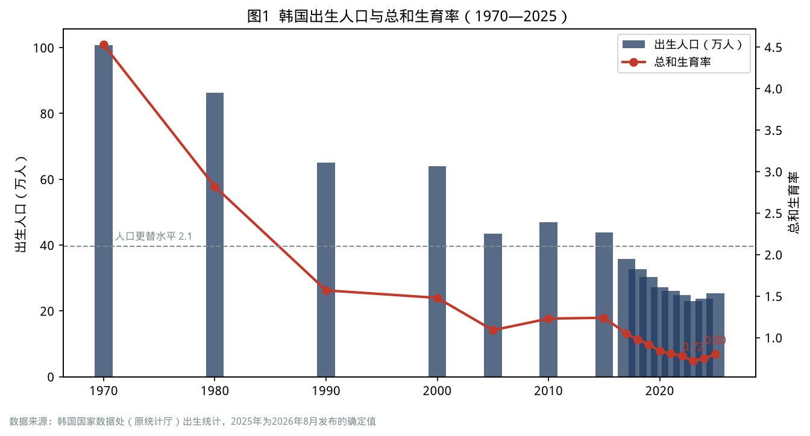

| 指标 | 数值 | 时间 | 来源 |
| --- | --- | --- | --- |
| 总和生育率 | 0.72（2023）→ 0.75（2024）→ 0.80（2025） | — | 韩国国家数据处 |
| 出生人口 | 23.0 万（2023）→ 25.43 万（2025） | — | 同上 |
| 首尔生育率 | 0.63 | 2025 年 | 同上 |
| 母亲平均生育年龄 | 33.8 岁；35 岁以上高龄产妇占 37.3% | 2025 年 | 同上 |
| 头胎占全部出生的比例 | 62.4% | 2025 年 | 同上 |
| 2026 年上半年出生 | 14.58 万人（+15.4%），二季度生育率 0.88 | 2026 年 | 同上 |
| 家庭相关公共支出/GDP | 1.37%—1.56%（OECD 平均约 2.1%—2.3%） | 2019 年 | 韩国保健社会研究院、国会预算政策处 |

### 周期定位

生育率是**库兹涅茨级别的人口周期**，但韩国的下跌速度远远超过了“周期”能解释的范围：

- 人口周期层面：1991—1996 年出生的“回声婴儿潮”一代（每年约 70 万人）在 2020 年代中期进入 30 岁出头，这是 2024—2026 年出生反弹的重要原因，属于**人口结构的回波**。
- 经济周期层面：房价在 2021 年见顶后下跌、疫情结束后婚姻反弹，为 2024—2025 年的婚育提供了窗口。
- 结构层面：生育率低于 1 的根本原因——高住房成本、教育竞争、职场对女性的惩罚、长工时——并没有根本改变。

因此，2025 年的反弹应被视为“**回波 + 补偿**”，而不是趋势逆转。1996 年后出生人口迅速下降，2030 年代 30 岁出头的女性人数将明显减少，出生人数届时将面临新的压力。

### 代价与反馈

1. **学校与教师过剩**：小学一年级学生 2026 年约 29 万，预计 2029 年降到约 24.5 万（见第十一章）。
2. **兵源危机**：韩国实行义务兵役制，适龄男性减少直接冲击国防体系。
3. **养老金与财政**：缴费人口减少，国民年金基金耗尽时间成为改革焦点（见第十六章）。
4. **地方消亡**：年轻女性外流叠加低生育，地方的消亡风险指数持续恶化。

### 中国对照

| 指标 | 韩国 | 中国 |
| --- | --- | --- |
| 出生人口 | 25.43 万（2025 年） | 792 万（2025 年），比 2016 年高峰的约 1786 万减少一半以上 |
| 总人口变化 | 自然减少已持续多年 | 2025 年减少 339 万，连续第四年下降 |
| 生育率 | 0.80（2025 年） | 官方未按年公布；多数研究估计约 1.0 左右 |
| 政策 | 育儿休假、新婚购房补贴、父母津贴 | 育儿补贴、延长产假、托育服务、个税专项附加扣除 |

中国与韩国的相似之处在于：低生育的核心约束都是**大城市居住成本、教育竞争和女性职业代价**。不同之处在于，中国城乡与区域差异大，政策有更大的“分地区试验”空间。

### 借鉴与反思

**政策层**

- 韩国 16 年投入约 280 万亿韩元效果有限，关键原因是钱分散在大量间接项目中，**直接的家庭现金支持和托育服务占比偏低**。政策要从“项目多”转向“直接、可预期、长期”。
- 抓住“回波窗口”：中国 1985—1990 年出生的大规模人群正处于 35—40 岁，已接近生育窗口末期；之后的人群规模迅速缩小，政策时间窗口有限。
- 降低“生育的机会成本”：育儿休假要让男性也休、企业不吃亏；托育要普惠、离家近；住房政策要向多孩家庭倾斜。

**家庭与个人层**

- 生育决策要看“家庭现金流”和“支持系统”（父母、托育、灵活工作），而不是只看收入。
- 教育支出是生育的最大隐性成本，家庭要在孩子出生前就想清楚“教育预算上限”（见第八章）。

### 本章要点

- 韩国生育率从 4.53 跌到 0.72 只用了半个世纪，是压缩式现代化最极端的结果。
- 2025 年的反弹主要来自人口回波和婚姻补偿，结构性障碍并未消除。
- 中国出生人口已经减半，政策窗口正在关闭，直接、长期的家庭支持比分散项目更有效。

---

## 第八章  考试地狱与学历通胀——课外补习 29 万亿韩元的军备竞赛

### 民生画像

首尔江南区大峙洞是韩国最著名的“补习一条街”，聚集着上千家补习机构。晚上十点，补习班下课，街上挤满了接孩子的车。一位母亲给读初二的女儿报了数学、英语、科学、论述四门课，每月花费约 200 万韩元，相当于家庭税后收入的四分之一。她说：“别人都在补，我们不补就是放弃。”

### 发生了什么

- **大学升学率**：1990 年约 33%，2000 年代快速上升，2008 年前后达到约 84% 的高峰，此后回落到七成多。韩国成为全球高等教育普及率最高的国家之一。
- **高考（修能）**：一年一考，决定大学档次；“SKY”（首尔大、高丽大、延世大）和医学院位于金字塔顶端。
- **课外补习**：2024 年初中小学课外补习总额约 29.2 万亿韩元，创历史新高；2025 年降至约 27.5 万亿韩元（-5.7%），主要因为学生人数减少，但**参与补习学生的人均月支出仍在上升**，为 60.4 万韩元。
- **政策尝试**：从 1980 年全斗焕政府的“禁止课外补习”，到历届政府的“EBS 联系出题”“删除超纲题（킬러문항）”“补习班晚上十点禁课”，补习市场始终没有被压下去。
- **医学院热**：理科最优秀的学生集中报考医学院，形成“医大垄断”（의대 쏠림），首尔大学自然科学类（不含医药）报考人数一年下降 18.7%。

### 数据说话

| 指标 | 数值 | 时间 | 来源 |
| --- | --- | --- | --- |
| 课外补习总额 | 约 29.2 万亿韩元（2024，历史最高）→ 约 27.5 万亿韩元（2025） | — | 韩国国家数据处、教育部 |
| 补习参与率 | 75.7%（2025，-4.3 个百分点） | 2025 年 | 同上 |
| 全体学生人均月补习费 | 45.8 万韩元 | 2025 年 | 同上 |
| 参与学生人均月补习费 | 60.4 万韩元（+2.0%）；高中 79.3 万韩元 | 2025 年 | 同上 |
| 家庭月收入 800 万韩元以上 vs 300 万韩元以下 | 66.2 万 vs 19.2 万韩元（约 3.4 倍） | 2025 年 | 同上 |
| 首尔 vs 邑面地区 | 66.3 万 vs 32.5 万韩元 | 2025 年 | 同上 |
| 独生子女家庭 vs 三孩及以上家庭 | 51.8 万 vs 35.8 万韩元 | 2025 年 | 同上 |

### 周期定位

教育竞争本身是一种**“地位商品”的军备竞赛**，与经济周期关系不大，但与康波阶段高度相关：

- 在康波繁荣期，学历带来的回报高，教育投资“值得”；
- 在康波萧条期，好岗位稀缺，学历竞争从“获得工作”转向“获得少数好工作”，竞争更激烈、回报更低，出现学历通胀；
- 在康波回升期，新技术会重塑“什么学历有用”，人工智能可能大幅降低部分白领技能的价值，传统的“考试—学历—白领”通道将被重新定价。

### 代价与反馈

1. **生育抑制**：独生子女家庭人均补习费最高，说明家庭倾向于“少生、精养”，教育支出直接压低生育意愿。
2. **阶层固化**：高收入家庭补习费是低收入家庭的 3.4 倍，首尔是邑面地区的 2 倍，教育成为阶层再生产的工具。
3. **人才错配**：最优秀的理科学生涌向医学院，而半导体、人工智能等战略产业面临人才短缺（见第十二、十三章）。
4. **青少年心理健康**：自杀是 10—19 岁青少年的第一死因（见第十七章）。
5. **“高学历—低就业”**：大学毕业生过剩，大量毕业生不愿进入中小企业，转而进入“休息”或备考状态（见第五章）。

### 中国对照

| 维度 | 韩国 | 中国 |
| --- | --- | --- |
| 高等教育 | 升学率七成以上 | 毛入学率已超过 60%，2026 届毕业生约 1270 万 |
| 校外培训政策 | 多次限制均未奏效，市场长期存在 | 2021 年“双减”，学科类培训大幅压缩，部分转为隐形化 |
| 顶端竞争 | 医学院、SKY | 名校、热门专业、考研考公 |
| 研究生扩招 | 硕博人数增加，部分领域就业困难 | 研究生招生持续扩大，学历门槛上移 |

中国的“双减”比韩国历届政府的限制更彻底，但教育竞争的根源——**好岗位稀缺 + 学历筛选**——与韩国相同。只要劳动市场的二元结构存在，教育竞争就会以不同形式回流。

### 借鉴与反思

**政策层**

- 教育竞争的“治本之策”在劳动市场：缩小大企业与中小企业、体制内与体制外、不同学历之间的收入与保障差距。
- 拓宽职业教育通道，提升职业院校毕业生的待遇和社会认可，避免“只有一条路”。
- 招生政策要稳定、可预期，频繁改革反而会催生新的补习需求。

**家庭与个人层**

- 设置“教育预算上限”：教育支出建议不超过家庭可支配收入的 15%—20%，避免挤占养老储蓄。
- 在人工智能时代，比学历更重要的是“学习能力、解决问题的能力和跨学科能力”，盲目追逐“热门专业”可能在毕业时已经过时。
- 医学、公务员、教师这类“稳定职业”在人口结构变化下也会被重新定价（见第三篇）。

### 本章要点

- 韩国课外补习市场在学生减少的情况下仍保持 27 万亿韩元以上，参与学生的人均支出继续上升。
- 教育竞争的根源在劳动市场的二元结构，而不在补习班本身。
- 中国“双减”力度更大，但只要好岗位稀缺，竞争就会转移，家庭要理性设置教育预算。

---

## 第九章  金汤匙与土汤匙——“地狱朝鲜”、“灵魂贷款”与投机化的一代

### 民生画像

2015 年前后，韩国网络上流行两个词：“地狱朝鲜”（헬조선）——韩国像地狱一样难以生存；“汤匙阶级论”（수저계급론）——出身决定命运，分为金汤匙、银汤匙、铜汤匙和土汤匙。

2020 年，疫情期间的超低利率和股市暴涨，让一部分年轻人决定“不再等待”：他们“灵魂贷款”买房，用信用贷款炒股（被称为“东学蚂蚁”，동학개미），投资加密货币。2021 年，30 岁以下投资者成为韩国加密货币市场的主力之一。2022 年加息后，一些人资产缩水、负债累累。

### 发生了什么

- **1997 年后的“IMF 一代”**：1997—2003 年毕业的大学生，赶上大企业缩招和非正规化，成为韩国最早的“就业冰河期”一代，今天他们处于 45—55 岁，也正是今天被“劝退”和孤独死风险最高的群体之一。
- **2010 年代的“N 抛世代”**：增长放缓、房价上涨、岗位二元化，“三抛”“五抛”“N 抛”相继出现。
- **2020—2021 年的“灵魂贷款一代”**：超低利率下，首尔公寓价格大幅上涨，年轻人担心“永远买不起”，集中入市；同期大量年轻人进入股市和加密货币市场。
- **2022—2023 年的“去杠杆一代”**：韩国银行快速加息，首尔房价下跌超过两成，部分“灵魂贷款”者陷入还款困难；传贳诈骗集中爆发，受害者四分之三是 40 岁以下青年。
- **2024—2026 年的“美股一代”**：年轻人大量投资美股，2025 年净买入美股 326 亿美元，创历史纪录（见第十九章）；同时，KOSPI 在 2026 年创新高，部分早期入场者获利丰厚，财富分化进一步拉大。

### 数据说话

| 指标 | 数值 | 时间 | 来源 |
| --- | --- | --- | --- |
| 传贳诈骗受害者中 40 岁以下占比 | 75.9% | 截至 2026 年 8 月 | 国土交通部 |
| 首尔最低收入 20% 家庭购房 PIR | 29.36 倍（一年增加 2 年以上） | 2026 年 3 月 | KB 不动产 |
| 2025 年净买入美股 | 326 亿美元，约为 2024 年的 3 倍 | 2025 年 | 韩国预托结算院 |
| 20 多岁工资劳动者平均月收入 | 271 万韩元（低于 60 多岁的 293 万韩元） | 2024 年 | 韩国国家数据处 |
| 自杀死亡率增幅最大的年龄段 | 30 多岁（+14.9%）、40 多岁（+14.7%） | 2024 年 | 统计厅 |

### 周期定位

这一代人的命运与**信贷周期和资产价格周期**深度绑定：

- 在利率下行、资产上涨的阶段，“上车”的人获益，“没上车”的人焦虑；
- 在利率上行、资产下跌的阶段，“高位上车”的人受损，焦虑转化为债务压力；
- 结果是：**同一代人内部，因为“入场时点”不同而出现巨大分化**，这比代际差距更容易引发社会撕裂。

### 代价与反馈

1. **公平感丧失**：财富积累越来越依赖“入场时点”和“父母支持”，而不是劳动和储蓄。
2. **风险偏好极化**：一部分年轻人选择极度保守（考公、休息），另一部分选择极度冒险（杠杆投资、加密货币）。
3. **婚育进一步推迟**：没有资产的年轻人推迟婚育，有资产但背负重债的年轻人同样推迟婚育。
4. **政治与性别对立**：青年男性与女性在兵役、就业公平、性别政策上的分歧扩大，成为选举中的重要变量。

### 中国对照

“躺平”“内卷”“润学”“上岸”“全款上车”……中国青年网络语言的流行，与韩国“地狱朝鲜”“N 抛世代”有相似的社会心理背景：**当努力与回报之间的联系变弱，年轻人要么退出竞争，要么寻找捷径。**

中国的不同之处在于：居民杠杆率更低，资本市场和加密货币监管更严格，青年在 2021—2025 年房地产调整中受到的直接冲击相对小于韩国的“灵魂贷款一代”；但房地产调整带来的就业与收入预期变化，同样影响了青年的婚育与消费决策。

### 借鉴与反思

**政策层**

- 资产价格上涨期要严控青年的高杠杆入市，避免“上车焦虑”引发系统性风险；下行期要提供债务重组与再出发机制。
- 建立“青年资产形成”的正规通道，例如带政府配额的长期储蓄账户、个人养老金账户的税收优惠，让劳动和储蓄重新“有回报”。
- 打击针对青年的金融诈骗（租赁押金、网贷、虚拟资产），并提高金融教育水平。

**家庭与个人层**

- 不要因为“错过焦虑”在周期高位加杠杆；资产配置要跨周期，用定投、分散和长期持有替代“一把梭”。
- 区分“投资”和“投机”：杠杆投资、高波动资产的仓位应控制在可承受亏损的范围内。
- 家庭财富代际支持要“救急不救穷”，优先帮助子女建立职业能力和应急储备，而不是一次性押上全部积蓄帮其“上车”。

### 本章要点

- 韩国青年在“地狱朝鲜”“N 抛”“灵魂贷款”“美股热”之间摇摆，是信贷周期和资产周期放大社会焦虑的结果。
- 同代人因入场时点不同而分化，比代际差距更具撕裂性。
- 中国青年的“躺平”与“上岸”心态有相似背景，政策要让劳动和储蓄重新获得回报。

# 第三篇  就业众生相

> 《以日为鉴》第三篇追问：公务员、教师、医生、工程师，这些“好职业”在衰退中是否依然是好选择。韩国给出的答案更复杂：考公热已经退潮，教师在过剩，医生在罢工，工程师在出走，而最大的就业群体——个体户——一年关掉一百万家店。

## 第十章  考公热的退潮——9 级公务员竞争率从 93:1 跌到 21.8:1

### 民生画像

鹭梁津曾是首尔最著名的“考公村”，高峰时聚集着数万名备考公务员的年轻人，狭小的考试院（고시원）、便宜的杯饭摊和补习班连成一片。到 2020 年代，鹭梁津的补习班大量关门，考试院空置。一位在这里经营杯饭摊二十年的老板说：“以前一天卖上千份，现在一百份都难。”

### 发生了什么

- **2000 年代—2010 年代初**：IMF 危机后，“铁饭碗”成为年轻人的首选，2011 年国家职 9 级公务员公开招聘平均竞争率高达 93.3:1。
- **2015 年**：公务员年金改革，缴费率从 7% 逐步提高到 9%，领取额降低，“退休后有保障”的吸引力下降。
- **2016—2024 年**：竞争率连续 8 年下降，从 53.8:1 降到 21.8:1，为 32 年来最低。
- **原因**：起薪低（2024 年 9 级起薪含津贴约 269 万韩元/月）、基层公务员遭遇“恶性投诉”、年金吸引力下降、青年人口减少、民间就业选择增多；入职 5 年以内低年资公务员离职增多。
- **2025 年**：竞争率反弹至 24.3:1，为 9 年来首次上升；政府宣布 2027 年前将 9 级起薪提高到 300 万韩元，并新设入职不满一年的“精勤津贴”。经济低迷也让部分青年重新回到考公赛道。

### 数据说话

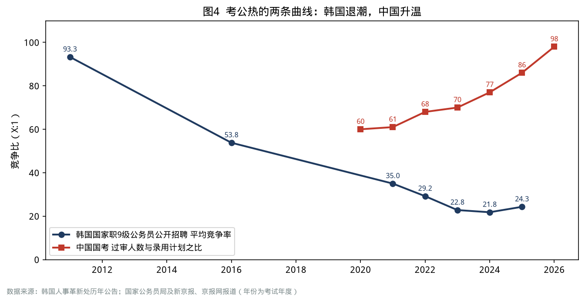

| 指标 | 数值 | 来源 |
| --- | --- | --- |
| 国家职 9 级平均竞争率 | 93.3:1（2011）→ 53.8:1（2016）→ 21.8:1（2024）→ 24.3:1（2025） | 韩国人事革新处 |
| 2025 年报名人数/招录人数 | 105111 人 / 4330 人 | 同上 |
| 最热门岗位 | 教育行政职 363.8:1 | 同上 |
| 2025 年最终合格者平均年龄 | 29.3 岁，20 多岁占 62.3% | 同上 |
| 9 级起薪 | 269 万韩元（2024）→ 目标 300 万韩元（2027） | 同上（经世界日报） |

### 周期定位

考公热是典型的**逆周期职业偏好**：

- 经济下行、民间岗位不稳定时，公务员的“稳定溢价”上升，考公热升温；
- 但当财政压力上升、公务员待遇和养老金被改革时，“稳定溢价”会被侵蚀；
- 人口老龄化还会改变公务员的工作内容：基层窗口、社会福利、照护服务的压力增大，而岗位吸引力下降。

日本的经验是“考公热十年即退潮”，韩国的经验是“考公热二十年，在年金改革和工作压力上升后退潮”，两者的共同点是：**“铁饭碗”的价值取决于财政的可持续性。**

### 代价与反馈

1. **人才配置的“稳定化”扭曲**：大量最优秀的年轻人把最好的几年用于备考，社会创新活力下降。
2. **基层治理的“空心化”**：低年资公务员离职增加，基层窗口服务压力传导给仍在岗的人。
3. **改革的长期效应**：年金改革在财政上是必要的，但也降低了公共部门对人才的吸引力，需要用工资、晋升和工作环境来弥补。

### 中国对照

| 指标 | 韩国 | 中国 |
| --- | --- | --- |
| 中央/国家层级招考竞争比 | 24.3:1（2025 年 9 级） | 98:1（2026 年度国考，过审 371.8 万人，招录 3.81 万人） |
| 趋势 | 2016—2024 年持续退潮，2025 年小幅反弹 | 2020—2026 年持续升温，屡创新高 |
| 养老制度 | 2015 年公务员年金改革 | 2014 年机关事业单位养老保险并轨 |
| 未来压力 | 人口减少、起薪低 | 地方财政压力、编制收紧、基层工作负荷 |

中国的考公热正处在韩国 2011 年前后的位置。韩国的轨迹提示：考公热可能在**财政约束、待遇调整和基层压力**的共同作用下降温，而不是一直升温。

### 借鉴与反思

**政策层**

- 公务员制度的吸引力要依靠“职业发展通道 + 合理薪酬 + 工作环境”，而不是单纯依赖“稳定”。
- 防止考公过度挤占青年的“黄金就业期”，可以对多年备考者提供职业转换辅导。
- 基层公务员应建立“恶性投诉”防护与心理支持机制。

**家庭与个人层**

- 考公要设“止损线”：备考超过两年仍未上岸，应同步积累可迁移的工作经验。
- “铁饭碗”的价值取决于财政和制度，选择公职要看所在地财政实力与岗位的长期需求（如税务、医保、养老服务等领域需求会持续）。

### 本章要点

- 韩国考公竞争率十余年间下降约四分之三，原因是待遇、年金改革、工作压力与人口减少共同作用。
- 中国的考公热仍在升温，正处于韩国十多年前的位置。
- “稳定”是有价格的，财政可持续性决定了“铁饭碗”的真实价值。

---

## 第十一章  教师：从铁饭碗到“教权崩溃”

### 民生画像

2023 年 7 月，首尔瑞草区一所小学的一位 20 多岁的新任教师在学校身亡，此前她长期承受部分家长的恶意投诉。这一事件引发数十万教师走上街头，要求保护“教权”。同一时期，教育大学（培养小学教师的师范院校）的录取分数持续下降，小学教师录用名额大幅缩减。一位教育大学的毕业生说：“我们这一届，一半人考不上编制。”

### 发生了什么

- **学生减少**：2025 年韩国幼儿园、小学、初中、高中在校生合计 536 万人，一年减少 18.9 万人；小学生减少 5.4%。幼儿园一年关闭 167 所，首次跌破 8000 所。
- **教师录用缩减**：公立小学教师新录用人数从 2014 年的 7386 人减少到 2024 年的 3157 人，十年减少约 57%；2026 学年度确定为 3113 人，比上一年减少 27.1%。
- **合格率下降**：小学教师录用考试合格率从 2018 年的 68.9% 降至 2024 年的 43.6%。
- **教育大学缩招**：2025 学年度起，全国教育大学入学定员从 3847 人减少到约 3390 人，为 13 年来首次大幅缩招（约 -12%）。
- **教权事件**：2023 年瑞草区小学教师事件后，国会通过“教权保护四法”，限制家长对教师的不当投诉和以“虐待儿童”为由的滥诉。

### 数据说话

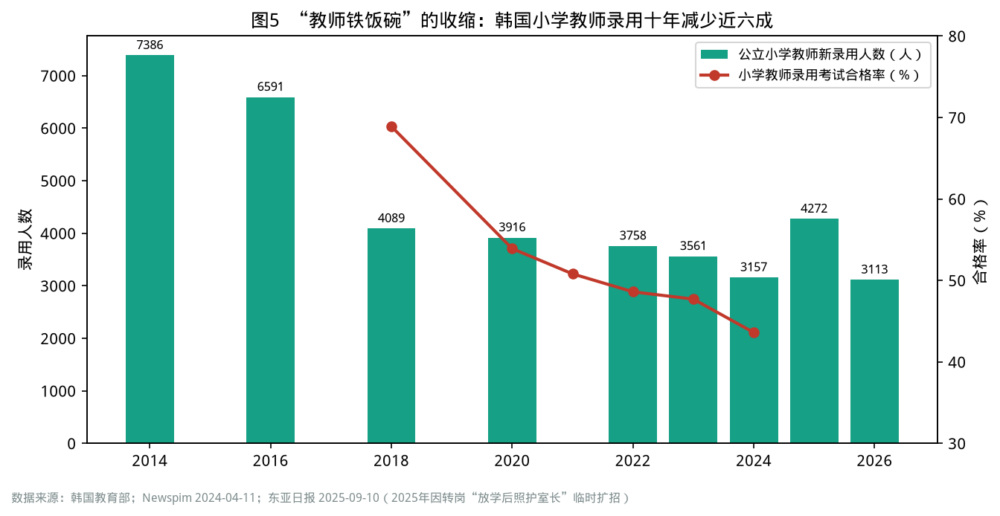

| 指标 | 数值 | 时间 | 来源 |
| --- | --- | --- | --- |
| 小学一年级学生 | 约 29.1 万（2026）→ 预计约 24.5 万（2029） | — | 韩国教育开发院 |
| 小学教师人数 | 19.15 万，一年减少 1599 人 | 2025 年 | 韩国教育部（经 edupress） |
| 小学班级平均人数 | 18.6 人 | 2025 年 | 同上 |
| 公立小学教师新录用 | 3113 人（-27.1%） | 2026 学年度 | 教育部（经东亚日报） |
| 小学教师录用合格率 | 43.6% | 2024 学年度 | 教育部 |

### 周期定位

教师需求由**出生人口的长周期**决定，且有约 6—7 年的滞后：今天出生的孩子决定 6 年后的小学需求、12 年后的中学需求、18 年后的大学需求。韩国的问题在于，出生人口在 2015 年后开始“断崖式”下降，而教师培养体系的调整滞后了近十年。

### 代价与反馈

1. **师范生过剩**：教育大学毕业生数量长期高于录用数量，大量毕业生陷入多年备考。
2. **学校撤并**：地方学校率先关闭，加剧地方人口外流。
3. **职业声望下降**：“教权崩溃”与录用困难叠加，教师从“最受欢迎的职业”之一跌落；2026 学年度教育大学录取竞争率虽然回升，但主要是“合格线下降带来的报考策略性选择”。
4. **积极的一面**：小班化成为可能，班级规模降至 18.6 人，为提升教育质量提供了空间。

### 中国对照

中国出生人口从 2016 年约 1786 万降到 2025 年的 792 万，减少一半以上。按 6 年滞后计算，小学入学人数已从 2023 年前后开始下降，幼儿园数量和在园人数已连续下降。多家研究机构测算，未来十年中国小学阶段将出现较大规模的教师结构性过剩，同时农村与城市、学科与学科之间的结构矛盾突出。

### 借鉴与反思

**政策层**

- 用“出生人口—入学人口—教师需求”的滚动预测，提前 5—10 年调整师范招生规模，避免韩国式的“十年滞后”。
- 把教师过剩转化为教育质量红利：推进小班化、增加心理健康、特殊教育、职业教育和课后服务教师。
- 建立教师转岗通道：例如韩国把部分小学教师转为“放学后照护（늘봄）”管理岗位。
- 保护教师的职业尊严，建立家校沟通的制度化渠道，防止“恶意投诉”。

**家庭与个人层**

- 报考师范专业要看地区和学段：小学和幼儿园需求下降最早，高中、职业教育、特殊教育、心理健康等领域的需求相对稳定。
- 教师要提前培养“复合能力”（课程设计、心理辅导、数字化教学、成人教育），以适应岗位变化。

### 本章要点

- 韩国小学教师录用人数十年减少约六成，合格率跌破 45%。
- 教师需求由出生人口决定，有 6—7 年的滞后，调整必须提前。
- 中国出生人口已减半，教师结构性过剩的压力即将到来，可以转化为小班化和教育质量提升的机会。

---

## 第十二章  医生：神的职业与 18 个月的医疗空白

### 民生画像

2024 年春天，首尔一位癌症患者原定的手术被无限期推迟，因为医院 90% 以上的住院医生集体辞职。她辗转三家医院才找到愿意接诊的医生。与此同时，一名在辞职队伍中的 28 岁住院医生说：“我们每周工作 80 小时，月薪只有 300 多万韩元，政府却说医生太多赚太多。”

### 发生了什么

- **背景**：韩国医学院招生名额自 2006 年起冻结在 3058 人，每千人临床医生数长期低于 OECD 平均，地方和必需医疗科室（急诊、儿科、妇产科、胸外科）医生短缺严重。
- **2024 年 2 月**：尹锡悦政府宣布从 2025 学年度起每年增加约 2000 名医学院招生名额。
- **医生集体辞职**：上万名实习医生和住院医生辞职，医学生集体休学，政府将医疗系统危机级别提升至最高级“严重”。
- **连锁反应**：2025 年医师国家考试最终合格者仅 269 人，为上一年 3045 人的 8.8%；新专科医生仅 509 人，为上一年 2727 人的 18.7%。
- **2025 年 4 月**：政府让步，宣布 2026 学年度医学院名额恢复至 3058 人。
- **2025 年 9 月**：李在明政府与医疗界重建协商机制，大部分辞职医生返岗，持续约 18 个月的风波基本平息。
- **后遗症**：2026 年 5 月，全国 16 所国立大学医院医生补充率为 73.5%，仍缺 2602 人；2025 年 6 月一度低至 54.9%。

### 数据说话

| 指标 | 数值 | 时间 | 来源 |
| --- | --- | --- | --- |
| 医学院招生定员 | 3058 人（2006 年起冻结）；2025 学年度定员增至 5058 人，各校实际招生 4500 余人；2026 年恢复 3058 人 | — | 韩国教育部 |
| 医师国考最终合格者 | 3045 人（2024）→ 269 人（2025） | — | 韩联社 |
| 新专科医生 | 2727 人（2024）→ 509 人（2025） | — | 同上 |
| 国立大学医院医生补充率 | 73.1%（2024.6）→ 54.9%（2025.6）→ 73.5%（2026.5） | — | 国会保健福祉委员会 |
| 国立大学医院住院医生人数 | 1271 人 → 503 人 → 2650 人 | 同上 | 同上 |
| 首尔大学自然科学类报考人数（不含医药） | 一年减少 18.7% | 2025 学年度 | 易投今日 |

### 周期定位

医疗体系问题与**人口老龄化的长周期**相关，与经济周期关系较弱：

- 老龄化意味着医疗需求持续上升（2023 年 65 岁以上人均诊疗费 530.6 万韩元）；
- 医生供给由医学院招生决定，从入学到成为专科医生需要 10 年以上，政策调整的效果严重滞后；
- 医疗费用由健康保险支付，财政约束会通过“控费”影响医生收入和医院经营。

日本在 1990 年代经历了“医疗崩坏”和“医药寒冬”（见《以日为鉴》第四篇），韩国的危机则是**医生供给与分配的冲突**：总量不足、结构失衡（首都圈、皮肤科和整形外科过多，地方和必需医疗不足），而改革方式引发了职业群体的集体对抗。

### 代价与反馈

1. **患者承担了最大代价**：手术推迟、急诊“转院难”，地方医疗空白扩大。
2. **人才培养链条断裂**：两年内新医生和新专科医生骤减，影响将持续数年。
3. **“医大垄断”的另一面**：医生职业的高收入与高稳定性吸引了理科最优秀的学生，进一步加剧了理工科人才短缺（见第十三章）。
4. **改革信用受损**：政府的“扩招—让步”使未来医疗改革的推进更加困难。

### 中国对照

中国的医疗问题与韩国有所不同：中国医生总量增长较快，但收入结构、基层医疗能力和医患关系存在挑战；药品和耗材集中带量采购、医保支付方式改革（DRG/DIP）、医药领域反腐，正在重塑医院和医药行业的收入结构。与日本 1990 年代的“大控费”有相似之处。

### 借鉴与反思

**政策层**

- 医疗人力改革要“渐进、可预期、有协商”，一次性大幅扩招容易引发职业群体的对抗。
- 重点解决“结构问题”而非仅仅“总量问题”：提高必需医疗科室和地方医院的报酬与工作条件，实行“地区医生”定向培养。
- 医疗控费要配套“医生劳动价值”的合理定价，避免“控药价—医生收入下降—人才流失”的恶性循环。

**家庭与个人层**

- 医生仍然是长期需求稳定的职业，但收入结构会变化：公立医院、医保支付改革、集采会压缩“药品和耗材收入”，未来医生收入更依赖“技术与服务”。
- 老龄化社会中，康复、护理、全科、精神心理、老年医学等领域的需求增长更快。
- 家庭要重视商业健康险和长期护理保障，以应对公立医疗体系的“排队”与“控费”。

### 本章要点

- 韩国医学院扩招引发了 18 个月的医疗空白，新医生数量在两年内骤减九成。
- 问题的本质是医生供给的结构失衡与改革方式的失误。
- 中国医疗改革正处在“控费 + 支付改革”的阶段，要注意医生劳动价值的合理定价。

---

## 第十三章  工程师：K 芯片的荣光与理工人才的出走

### 民生画像

一位 32 岁的韩国人工智能芯片设计博士，在三星电子工作四年后，接受了美国一家科技公司的邀请，年薪是原来的三倍多。他说：“在韩国，研发岗位的晋升按年资排队，加班是常态，但收入天花板很低。最重要的是，孩子在美国不用上补习班。”

### 发生了什么

- **产业荣光**：2025 年韩国半导体出口 1734 亿美元，创历史纪录；SK 海力士在 AI 用高带宽存储（HBM）领域占据领先地位；2026 年两家芯片公司承诺向员工发放大额奖金。
- **人才困境**：韩国银行 2025 年调查显示，在韩国工作的理工科硕博人才中，**42.9% 考虑在 3 年内出国工作**，20—30 多岁群体中这一比例接近 70%；考虑出国的首要原因是薪酬（66.7%），其次是研究生态与网络（61.1%）、职业机会（48.8%）和子女教育（33.4%）。
- **留学与回流**：在美国工作的韩国理工科博士从 2010 年约 0.9 万人增加到 2021 年约 1.8 万人；斯坦福大学《AI 指数 2025》显示，韩国 AI 人才净流动为每万人 -0.36 人，在 OECD 38 国中排第 35 位。
- **人才入口**：2020—2025 年，首尔大学 1737 名退学者中有 523 名是工学院学生（约 30%），而医学院退学者只有 3 名；理科最优秀的学生持续流向医学院。
- **工时争议**：半导体行业要求放宽“每周 52 小时工作制”，与劳动界的工时保护诉求冲突，成为《半导体特别法》讨论的焦点。

### 数据说话

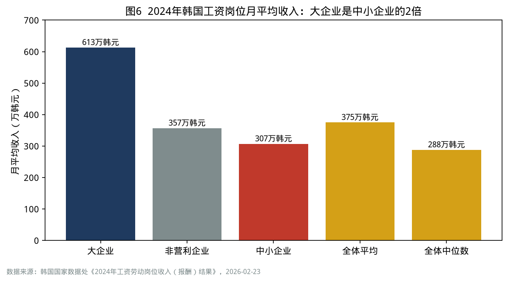

| 指标 | 数值 | 时间 | 来源 |
| --- | --- | --- | --- |
| 半导体出口 | 1734 亿美元（+22.2%） | 2025 年 | 产业通商资源部 |
| 考虑 3 年内出国的理工科硕博比例 | 42.9%（20—30 多岁约 70%） | 2025 年 | 韩国银行 |
| 生物医药领域出国意向 | 48.7%；IT 软件 44.9%；造船与能源 43.5% | 2025 年 | 同上 |
| 首尔大学工学院退学人数（2020—2025） | 523 人，占全校退学者约 30% | 2025 年国政监查 | 韩国大学新闻 |
| 大企业 vs 中小企业月平均收入 | 613 万 vs 307 万韩元（差距 306 万韩元，历史最大） | 2024 年 | 韩国国家数据处 |

### 周期定位

工程师的处境与**半导体朱格拉周期**和**康波回升期的人才竞争**同时相关：

- 半导体周期上行时，头部企业利润和奖金大幅增加，但这只覆盖少数大企业员工；
- 康波回升期的核心竞争是人才竞争，人工智能、芯片设计、生物技术领域的顶尖人才在全球范围内流动，薪酬和研究环境决定流向；
- 一个国家如果只能“培养人才”而“留不住人才”，就会出现“韩国培养、海外收获”的格局。

### 代价与反馈

1. **“理科劝退”与“医学独大”**：在高考端，最优秀的学生选医学；在职业端，优秀工程师选择出国。
2. **中小企业工程师的“韩国式失落”**：大企业和中小企业的收入差距高达一倍，大多数工程师在中小企业工作，享受不到半导体繁荣的红利。
3. **研发集中于首都圈**：研发人力和经费约七成集中在首都圈，地方产业升级困难。

### 中国对照

中国拥有全球规模最大的理工科毕业生群体，“工程师红利”是中国制造业竞争力的核心来源之一。但也存在相似的隐忧：互联网和部分科技行业的“35 岁危机”、高强度工作文化、顶尖 AI 人才的国际竞争，以及医学、金融等高收入专业对理科尖子生的吸引。

### 借鉴与反思

**政策层**

- 人才政策要从“培养数量”转向“留住质量”：薪酬改革（绩效与股权激励）、研究自主权、科研经费的灵活使用。
- 建立“人才循环”机制：吸引海外人才回流，允许科研人员在高校、企业和创业之间流动。
- 在工时问题上，用“灵活工时 + 总量控制 + 健康保护”替代“一刀切”。

**家庭与个人层**

- 理工科仍是康波回升期最有价值的赛道之一，但要选择“与新技术结合的方向”（AI + 制造、AI + 生物、能源电子）。
- 工程师职业规划要关注“可迁移性”：通用技术能力、国际化经验、跨行业项目经历。

### 本章要点

- 韩国半导体出口创纪录，但四成理工科硕博考虑出国，优秀学生流向医学院。
- 康波回升期的竞争是人才竞争，留住人才比培养人才更难。
- 中国的工程师红利是最宝贵的资产，需要通过薪酬、科研环境和职业发展通道来维护。

---

## 第十四章  个体户：一年一百万家关店

### 民生画像

韩国被戏称为“炸鸡共和国”：全国炸鸡店的数量一度超过全球麦当劳门店总数。一位 58 岁的前银行职员，在 52 岁被劝退后用退休金和贷款开了一家炸鸡加盟店，起初每月能赚 300 万韩元。疫情、外卖平台抽成、原材料涨价和周边新店开张，让他的利润一路下滑。2024 年，他关掉了店，还背着 8000 万韩元的贷款。像他这样关店的经营者，那一年有 100 万个。

### 发生了什么

- **自营业者比重高**：2025 年 4 月，韩国自营业者 561.5 万人，占全部就业者的 19%；按 OECD 口径（含无薪家庭工作者）为 23.2%，在 OECD 中排第 7，远高于日本（约 10%）和美国（约 6%）。
- **关店潮**：2024 年韩国停业的经营者 100.8 万，1995 年有统计以来首次突破 100 万；其中零售业和餐饮业占近一半。2025 年为 97.6 万家，停业率 8.64%，但小商工人主要六大行业的停业率仍达 11.08%。
- **老龄化**：60 岁以上的自营业者从 2015 年的 184.2 万人增至 2025 年的 269.7 万人，占全部自营业者的 41.2%；60 岁以上自营业者的金融负债十年间从 96 万亿韩元增至 405.7 万亿韩元，增长 4 倍多。
- **债务**：2025 年二季度自营业者贷款余额约 1069.6 万亿韩元，历史最高；低收入自营业者的逾期率达到 2.07%，为近 12 年最高；“脆弱自营业者”（多重债务且低收入或低信用）逾期率 12.24%。
- **经营困境**：52.2% 的自营业者年销售额不足 5000 万韩元；自营业者数量占全部企业的 95.2%，但销售额只占 17.4%；创业后 5 年内停业比例约 60%。

### 数据说话

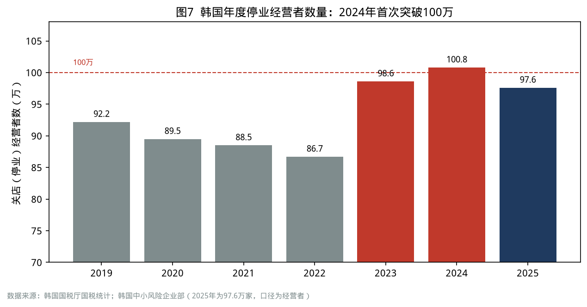

| 指标 | 数值 | 时间 | 来源 |
| --- | --- | --- | --- |
| 自营业者占就业比重 | 19%（OECD 口径 23.2%，OECD 第 7） | 2025 年 / 2023 年 | 韩国统计厅；韩国银行 |
| 年度停业经营者 | 100.8 万（2024）；97.6 万（2025） | — | 国税厅；中小风险企业部 |
| 停业原因“经营不振”占比 | 约 50% | 2024 年 | 国税厅 |
| 60 岁以上自营业者 | 269.7 万（占 41.2%） | 2025 年 | 韩国银行金融稳定报告 |
| 自营业者贷款余额 | 约 1069.6 万亿韩元 | 2025 年二季度 | 韩国银行 |
| 停业平均成本 | 1286 万韩元，平均耗时 7.7 个月 | 2025 年调查 | 中小风险企业部 |
| 自营业者平均年收入 vs 工薪族 | 4157 万 vs 4332 万韩元 | 2024 年 / 2023 年 | 国税厅（经 Numbers） |

### 周期定位

自营业是**劳动市场的“蓄水池”**，具有明显的逆周期特征：

- 经济下行、企业裁员时，被裁者涌入自营业（1997 年后、2008 年后、2015 年婴儿潮退休潮）；
- 自营业门槛低、同质化严重，过度进入导致利润被摊薄；
- 内需不振和利率上升时，自营业者首当其冲，形成“开店—关店—负债”的循环。

韩国银行预测，第二次婴儿潮一代（1964—1974 年出生，约 964 万人）全面退休后，2032 年 60 岁以上的自营业者可能达到 248 万人（按 2015 年口径测算），自营业的结构性风险将进一步扩大。

### 代价与反馈

1. **养老储蓄的“消失”**：中年人用退休金创业失败，直接导致老年贫困（见第十五章）。
2. **金融风险**：自营业者贷款超过 1000 万亿韩元，大量集中在非银行金融机构，经济下行时可能形成系统性风险。
3. **内需的脆弱性**：自营业者既是生产者也是消费者，自营业不振直接拖累内需。
4. **平台化的冲击**：外卖平台、电商平台改变了零售和餐饮的竞争格局，小商户的议价能力下降。

### 中国对照

中国的个体工商户超过 1.2 亿户，是吸纳就业的“蓄水池”；外卖骑手、网约车司机、直播带货等平台灵活就业者规模庞大。中国与韩国面临的共同问题是：**门槛低、同质化、平台抽成、社会保障覆盖不足**。在房地产和建筑业调整中，大量农民工和中年从业者转向灵活就业，与韩国 1997 年后的“退休者涌入自营业”有相似之处。

### 借鉴与反思

**政策层**

- 减少“被迫创业”：通过延长雇佣、再就业培训和稳定的工资岗位，降低中年人“只能开店”的比例。
- 建立“有序退出”机制：停业补贴、债务重组、再就业支持，让关店不等于破产。
- 规范平台抽成与算法，保护小商户和灵活就业者的议价能力和社会保障。
- 对自营业者推行养老保险、失业保险和工伤保险的强制或半强制覆盖。

**家庭与个人层**

- 中年创业前要做“三问”：这个行业的进入门槛是否很低？我是否有差异化能力？如果亏损，我的养老储蓄是否会受影响？
- 不要用全部退休金和高息贷款开加盟店；先小规模试错，设定止损线。
- 灵活就业者要主动缴纳社保，尤其是养老和医疗保险。

### 本章要点

- 韩国自营业者占比远高于发达国家平均，2024 年停业经营者首次突破 100 万。
- 自营业是劳动市场的蓄水池，也是中年人养老储蓄“消失”的主要渠道。
- 中国个体户和平台灵活就业者规模庞大，需要提前补齐社保与有序退出机制。

# 第四篇  老龄化冲击下的民生底座

> 《以日为鉴》第四篇聚焦老龄化对医疗与医药行业的冲击。韩国的老龄化更快、制度更晚，冲击首先落在老人自己身上：OECD 最高的老年贫困率、最高的老年就业率，以及最高的自杀率。本篇把视角从“医疗行业”扩展到“养老民生底座”。

## 第十五章  OECD 最贫困的老人——为什么富裕的国家有一群穷老人

### 民生画像

清晨五点，首尔钟路区的一位 78 岁老奶奶推着手推车出门，在街头捡拾废纸箱，一天下来能收集约 100 公斤，卖得 1 万韩元左右。她的丈夫早逝，她一生务农和打零工，没有缴纳过国民年金，每月靠基础年金（约 30 多万韩元）和捡废品为生。她的子女住在京畿道，各自背负房贷，“自己都顾不过来”。

韩国保健福祉部 2024 年发布的首次全国实态调查估计，以捡废纸为生的老人约有 4.2 万人，平均每月从中获得的收入只有约 15.9 万韩元。

### 发生了什么

- **养老金制度起步晚**：国民年金 1988 年才建立，最初只覆盖 10 人以上企业员工，1999 年扩大到城市自营业者，实现“全民年金”。今天 75 岁以上的老人，在工作年龄时大多没有加入年金的机会。
- **家庭养老瓦解**：传统上，韩国老人依靠子女赡养。1997 年危机后，中年人失业、提前退休，加上子女教育和住房支出，“养儿防老”迅速失效。
- **补救措施**：2008 年实施基础老龄年金（2014 年改为基础年金），向收入下位 70% 的 65 岁以上老人发放；2008 年实施长期护理保险。
- **贫困率下降但仍居高位**：OECD 口径的老年贫困率从 2015 年版报告的 49.6% 降至 2025 年版的 39.7%，首次跌破 40%；按韩国国内可支配收入口径，2024 年 65 岁以上老人相对贫困率为 35.9%，为有统计以来最低。

### 数据说话

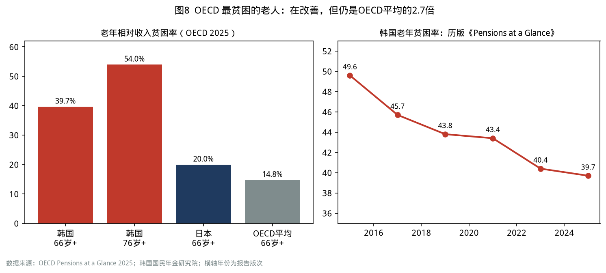

| 指标 | 韩国 | 日本 | OECD 平均 | 来源 |
| --- | --- | --- | --- | --- |
| 66 岁以上相对收入贫困率 | 39.7% | 20.0% | 14.8% | OECD Pensions at a Glance 2025 |
| 66—75 岁 | 29.8% | — | 13.1% | 同上 |
| 76 岁以上 | 54.0% | — | 17.2% | 同上 |
| 女性老人 | 45.0% | — | — | 同上 |
| 65 岁以上就业率 | 37.3% | 25.3% | 13.6% | 国会预算政策处（2023 年数据） |
| 国民年金平均月领取额 | 约 66 万韩元（单人最低生活费约 134 万韩元） | — | — | 国民年金研究院 |
| 65 岁以上家庭平均净资产 | 4.66 亿韩元（大部分为房产） | — | — | 2025 年高龄者统计 |

一个值得注意的反差是：韩国老人的**资产贫困率**并不高。按流动金融资产衡量，韩国全体人口的资产贫困率为 17.0%，低于 OECD 平均（39.3%）的一半；65 岁以上家庭平均净资产约 4.66 亿韩元。问题在于，**资产主要是房产，现金流很少**——“有房无钱”是韩国老人的典型状态。

### 周期定位

老年贫困是**制度周期与人口周期错配**的结果：

- 养老金制度需要约 40 年才能“成熟”（一个人完整缴费 40 年才能领取足额年金）；
- 韩国的老龄化只用了约 25 年就从 7%（2000 年）走到 20%（2024 年），制度成熟的速度远远赶不上人口老化的速度；
- 结果是：**当前的高龄老人处于“制度空窗期”**——既没有足够的年金，也无法依靠子女。

随着年金制度成熟，新一代退休者的年金收入会改善（66—75 岁贫困率已低于 76 岁以上群体约 24 个百分点），但这需要时间。

### 代价与反馈

1. **“被迫工作的老人”**：65 岁以上就业率 OECD 第一，但大多数是低工资、不稳定的岗位（保安、清洁、公共老人岗位、捡废品）；70 岁以上工资劳动者平均月收入仅 165 万韩元。
2. **老人自杀**：韩国 80 岁以上老人的自杀率长期位居各年龄段前列。
3. **代际财政负担**：基础年金等财政补救支出迅速增长，挤压其他公共支出。
4. **房产锁定**：老人的财富锁定在房产中，“以房养老”（住房年金）的使用率仍然有限。

### 中国对照

| 维度 | 韩国 | 中国 |
| --- | --- | --- |
| 养老金制度建立 | 国民年金 1988 年（1999 年全民） | 城镇职工养老保险 1990 年代建立；城乡居民养老保险 2009—2014 年建立并整合 |
| 老年人口 | 65 岁以上 20.3%（2025 年） | 60 岁以上 3.23 亿（23.0%），65 岁以上 2.24 亿（15.9%）（2025 年末） |
| 结构性风险 | 高龄老人无年金积累 | 城乡居民基础养老金水平较低，与职工养老金差距较大 |
| 家庭养老 | 快速瓦解 | 正在弱化，“421”家庭结构下赡养压力集中 |
| 资产结构 | 房产占比高 | 房产占比高，部分地区房价调整削弱了“以房养老”能力 |

中国最需要警惕的是：**城乡居民基础养老金水平偏低的庞大农村老年群体**，在结构上与韩国“制度空窗期”的高龄老人相似。

### 借鉴与反思

**政策层**

- 在制度成熟之前，要用“非缴费型基础年金”托底高龄、农村和女性老人，并建立与物价和工资挂钩的调整机制。
- 推动“以房养老”的制度化（住房反向抵押、住房年金），盘活老人的房产资产。
- 老年就业要从“被迫就业”转向“体面就业”：发展适合老年人的弹性岗位，同时提供职业安全保护。

**家庭与个人层**

- 养老规划的核心是“现金流”，而不是“资产总额”：退休后每月的稳定收入应覆盖基本生活支出的 70% 以上。
- 构建“三支柱”：基本养老保险（不断缴）、企业/职业年金（如有）、个人养老金账户与商业年金。
- 不要把全部养老资产锁定在一套房产中；在 50 岁前后逐步调整资产结构，提高流动性资产比例。

### 本章要点

- 韩国老年贫困率 OECD 最高，根源是养老金制度成熟太晚、家庭养老瓦解太快。
- 韩国老人“有房无钱”，资产贫困率低但收入贫困率高。
- 中国农村老人与城乡居民养老金水平偏低的群体，需要提前托底。

---

## 第十六章  年金改革——9% 到 13%，以及“退休—领年金”之间的十年空窗

### 民生画像

一位 1966 年出生的韩国上班族，2025 年 59 岁，按法定年龄应在 60 岁退休，但他所在的公司从 55 岁起就开始“工资峰值制”降薪。他的国民年金要到 64 岁才能领取。他计算过：从 52 岁那年被调岗降薪开始，到领年金的 64 岁，他有超过 10 年的“收入断崖”。

### 发生了什么

- **国民年金的困境**：在 2025 年改革前，缴费率自 1998 年起一直是 9%，远低于 OECD 主要国家；按此前的财政推算，基金将在 2041 年出现收支赤字、2057 年耗尽。
- **2025 年 4 月改革**：时隔 18 年的参数改革获得通过——缴费率从 9% 每年提高 0.5 个百分点，2033 年达到 13%（劳资各半）；替代率目标从 40% 提高到 43%；生育抵免（childcare credit）从第一个孩子开始计算；对低收入地区参保者提供缴费支持。改革后，基金赤字时间预计推迟到 2048 年前后，耗尽时间推迟到 2065 年前后。
- **2026 年起**：缴费率开始提高到 9.5%。
- **退休年龄争议**：法定退休年龄为 60 岁，国民年金领取年龄逐步推迟到 65 岁（1969 年以后出生者）。2025 年，经济社会劳动委员会公益委员建议：维持 60 岁法定退休年龄，但从 2028 年起分阶段引入“继续雇佣义务”，2033 年达到 65 岁，使继续雇佣年龄与年金领取年龄一致。
- **工资峰值制**：许多企业对 55 岁以上员工实施降薪，以换取延长雇佣，引发诉讼和争议。

### 数据说话

| 指标 | 改革前 | 改革后 | 来源 |
| --- | --- | --- | --- |
| 缴费率 | 9%（1998 年起） | 每年 +0.5 个百分点，2033 年 13% | OECD；韩国保健福祉部 |
| 名义替代率（40 年缴费的平均收入者） | 40%（原计划 2028 年降至 40%） | 43% | 同上 |
| 基金收支赤字年份（预测） | 2041 年 | 约 2048 年 | OECD |
| 基金耗尽年份（预测） | 2057 年 | 约 2065 年 | OECD |
| OECD 模型下净替代率（2024 年 22 岁入职、平均工资全职业生涯） | — | 39%（OECD 平均 63%） | OECD Pensions at a Glance 2025 |
| 公共年金支出/GDP | 3.8%（2021 年） | — | 国会预算政策处 |

### 周期定位

年金改革是**人口长周期**下的制度调整，与经济周期的关系体现在：

- 康波繁荣期，缴费人口多、工资增长快，年金看起来“很充裕”，改革的政治动力弱；
- 康波萧条期，增长放缓、老龄化加速，财政压力暴露，但改革的政治代价更大；
- 结果是：大多数国家的年金改革都“晚了一步”。韩国的缴费率 27 年没有提高，就是“繁荣期不改、萧条期难改”的典型。

### 代价与反馈

1. **代际公平争议**：改革提高了年轻一代的缴费负担，而替代率提高主要惠及即将退休的人群，引发青年的不满。
2. **“收入断崖”**：实际退休年龄（52.9 岁）与年金领取年龄（63—65 岁）之间存在 10 年以上的空窗，导致中老年人涌入自营业和低端劳动市场。
3. **改革仍不彻底**：即使改革后，基金依然会在 2060 年代耗尽，结构性改革（自动调节机制、与预期寿命挂钩）仍需推进。

### 中国对照

| 维度 | 韩国 | 中国 |
| --- | --- | --- |
| 缴费率 | 9% → 13%（2033 年） | 城镇职工基本养老保险单位缴费 16% + 个人 8% |
| 退休年龄 | 法定 60 岁，年金领取 63—65 岁 | 2025 年起渐进式延迟法定退休年龄：男职工 60 岁逐步延至 63 岁，女职工 50/55 岁分别逐步延至 55/58 岁 |
| 主要矛盾 | 缴费率低、替代率低、基金耗尽 | 地区间基金结余不平衡、城乡待遇差距大、灵活就业者参保不足 |
| 第三支柱 | 个人年金、退休年金（企业型） | 个人养老金制度 2024 年底推广至全国 |

中国的缴费率远高于韩国，制度覆盖面更广，但面临地区不平衡、灵活就业者参保不足和城乡待遇差距等问题。韩国“退休—领年金”空窗的教训尤其值得关注：**延迟退休必须与延长雇佣同步**，否则会产生“收入断崖”。

### 借鉴与反思

**政策层**

- 年金改革要“早改、小步、可预期”，避免在压力爆发时被迫大幅调整。
- 延迟退休必须配套“延长雇佣、反年龄歧视、灵活工时、再培训”，避免出现“年龄空窗”。
- 引入与预期寿命和人口结构挂钩的自动调节机制，减少政治博弈。
- 把灵活就业者和平台劳动者纳入养老保险，是防止下一代“穷老人”的关键。

**家庭与个人层**

- 计算自己的“空窗期”：可能的实际退休年龄、法定领取年龄、两者之间需要多少储蓄来过渡。
- 50 岁以后的职业安排要提前规划：内部转岗、技能更新、兼职顾问或“第二职业”。
- 尽早开立个人养老金账户，利用税收优惠进行长期积累。

### 本章要点

- 韩国国民年金缴费率 27 年未变，2025 年改革将其提高到 13%，基金耗尽时间推迟约 8 年。
- 实际退休年龄与年金领取年龄之间的 10 年空窗，是中老年贫困和自营业过度的重要原因。
- 中国延迟退休要与延长雇佣同步推进，避免“收入断崖”。

---

## 第十七章  孤独、照护与死亡——长期护理保险、孤独死与自杀

### 民生画像

2024 年，韩国一位 63 岁的独居男性在出租的考试院（狭小的单人房间）中去世，十几天后才被房东发现。他曾是一名建筑工人，十年前离婚，与子女断了联系，晚年靠打零工维生。在韩国，像他这样的“孤独死”者，2024 年有 3924 人，其中 81.7% 是男性，50—60 多岁的中年男性占六成。

### 发生了什么

- **长期护理保险（2008 年）**：韩国借鉴日本和德国的经验，建立了独立于健康保险的长期护理保险，为 65 岁以上或患有老年性疾病的人提供居家护理、日间照护和机构护理服务。这是韩国社会保障体系中较为成功的制度之一。
- **孤独死**：2021 年实施《孤独死预防及管理法》，2023 年制定孤独死预防五年基本计划。孤独死人数从 2017 年的 2412 人增至 2024 年的 3924 人，每 10 万人口约 7.7 人；发生地点中，旅馆和考试院的比例上升。
- **自杀**：2024 年自杀死亡 14872 人，每 10 万人 29.1 人，比上一年增长 6.6%，为 2011 年以来最高；每天约 40.7 人自杀；自杀是 10—40 多岁人群的第一死因、50 多岁人群的第二死因；30 多岁和 40 多岁人群的自杀率增长最快（分别 +14.9%、+14.7%）。
- **社会孤立**：保健福祉部指出，19 岁以上国民中约三分之一“需要帮助时无人可求”。

### 数据说话

| 指标 | 数值 | 时间 | 来源 |
| --- | --- | --- | --- |
| 自杀死亡率 | 29.1 人/10 万（+6.6%） | 2024 年 | 统计厅死亡原因统计 |
| OECD 年龄标准化自杀率 | 韩国 26.2 人，OECD 平均约 10.7—11.2 人，第二名立陶宛 18.0 人 | 2024 年 | 同上 |
| 孤独死人数 | 2412（2017）→ 3924（2024） | — | 保健福祉部 |
| 孤独死中男性占比 | 81.7% | 2024 年 | 同上 |
| 孤独死中 50—60 多岁占比 | 约 62.9% | 2024 年 | 同上 |
| 65 岁以上人均年诊疗费 | 530.6 万韩元 | 2023 年 | 2025 年高龄者统计 |
| 75 岁以上有 3 种以上慢性病的比例 | 46.2% | — | 韩国保健社会研究院 |

### 周期定位

孤独与自杀问题看似“社会问题”，实则与**经济周期和结构转型**高度相关：

- 1997 年危机后、2003 年信用卡危机后、2008 年全球金融危机后，韩国自杀率都出现过明显上升；
- 2024 年 30—40 多岁人群自杀率大幅上升，与就业不稳定、债务压力、住房成本和家庭关系变化密切相关；
- 孤独死高发的 50—60 多岁男性，很多是 1997 年危机和随后结构调整中的“失落一代”。

### 代价与反馈

1. **人力资本与家庭的损失**：自杀主要发生在劳动年龄人口中，对家庭和社会的冲击巨大。
2. **社会信任下降**：社会孤立和信任下降，削弱了社区互助和家庭支持网络。
3. **公共服务压力**：长期护理、精神卫生、社区照护的需求快速增长，但专业人员不足。

### 中国对照

- 中国已在多个城市开展长期护理保险试点，正在向全国推广，可借鉴韩国“独立险种、居家优先、分级评估”的设计。
- 中国单人户比例持续上升，空巢老人、独居中年男性和外出务工人员的社会孤立风险需要关注。
- 精神卫生服务的可及性仍有较大提升空间，尤其是对青少年和中年群体。

### 借鉴与反思

**政策层**

- 把长期护理保险作为“第六险”加快推广，优先发展居家和社区照护。
- 建立“社会孤立高风险人群”的主动发现机制：利用水电燃气数据、社区网格、邮递员和快递员的日常接触，提前识别独居高风险人群。
- 把精神卫生服务纳入基本公共卫生服务，扩大心理咨询和危机干预热线的覆盖。
- 对失业、离婚、债务危机等“人生断崖”人群提供综合支持（就业、法律、心理、债务重组）。

**家庭与个人层**

- 中年人尤其是男性，要有意识地维护“工作之外的关系网络”（朋友、社区、兴趣团体）。
- 家庭要尽早讨论老人的照护安排：居家照护、社区日间照护、机构照护的成本与可得性。
- 遇到心理危机时，及时寻求专业帮助；身边人出现异常信号时，主动关心并引导其求助。

### 本章要点

- 韩国长期护理保险是值得借鉴的制度，但孤独死和自杀问题仍在恶化。
- 自杀和孤独死与经济周期、就业和债务压力密切相关，50—60 多岁男性和 30—40 多岁人群是高风险群体。
- 中国要加快长期护理保险推广，并建立社会孤立人群的主动发现机制。

# 第五篇  外热内冷下的出海

> 《以日为鉴》第五篇讲日本泡沫后长达二十年的“全民出海潮”，认为出海是失落经济中少数的黄金赛道。韩国从一开始就是“被迫出海”的国家：国内市场只有 5000 万人，企业、资本、文化和人才都必须面向世界。韩国的经验说明：出海能让企业和资本变强，但未必能让国内的普通人变富。

## 第十八章  文化与消费品出海——K-beauty、K-food 为何能卖向世界

### 民生画像

首尔明洞的一家化妆品店，十年前的顾客主要是中国游客；到 2025 年，店员需要会说英语、日语、阿拉伯语和西班牙语。一家只有 30 名员工的韩国护肤品牌，产品通过亚马逊和东南亚电商平台卖到了 60 多个国家，海外销售占八成。创始人说：“韩国市场太小、太卷了，不出海就活不下去。”

### 发生了什么

- **韩流的“国家工程”**：1997 年危机后，金大中政府把文化产业作为新的增长引擎，设立文化产业振兴基金，支持影视、音乐、游戏出口。
- **从内容到消费品**：电视剧、K-pop、电影带动了化妆品、食品、时尚、旅游的出口，形成“内容引流—消费品变现”的链条。
- **2025 年成绩单**：化妆品出口 114 亿美元，同比增长 12.3%，创历史纪录，月度出口额每月都刷新同月纪录；K-food+（农食品与农业产业）出口 136.2 亿美元，同比增长 5.1%，创历史纪录；美国超过中国成为化妆品最大出口市场，阿联酋和波兰进入前十。
- **市场多元化**：在中国市场受挫（2017 年“萨德”事件后）之后，韩国消费品转向美国、日本、东南亚、中东和欧洲。

### 数据说话

| 指标 | 数值 | 时间 | 来源 |
| --- | --- | --- | --- |
| 化妆品出口 | 114 亿美元（+12.3%） | 2025 年 | 韩国食品医药品安全处（经 KDI） |
| 化妆品主要出口市场 | 美国 22 亿美元、中国 20 亿美元、日本 11 亿美元 | 2025 年 | 同上 |
| K-food+ 出口 | 136.2 亿美元（+5.1%），其中农食品 104.1 亿美元 | 2025 年 | 韩国农林畜产食品部 |
| 2026 年 K-food+ 出口目标 | 160 亿美元 | 2026 年 | 同上 |

### 周期定位

文化与消费品出海的窗口与**康波和国家地位**相关：

- 一国的文化影响力通常在其经济追赶的后半段上升（日本在 1980—1990 年代、韩国在 2000—2020 年代）；
- 在国内萧条期，消费品企业被迫向外寻找增量，出海成为“逆周期的增长通道”；
- 平台经济（跨境电商、短视频、流媒体）降低了中小品牌出海的门槛，这是第五次康波萧条期、第六次康波回升期的新特征。

### 代价与反馈

1. **国内与海外的“温差”**：出海企业的增长很快，但在国内创造的岗位有限，大量生产、物流和营销环节布局在海外。
2. **文化产业的“劳动强度”**：K-pop 练习生制度、影视行业的低薪与长工时长期受到批评。
3. **地缘政治风险**：中国市场的波动、美国关税政策的变化都会影响出口。

### 中国对照

中国的消费品与文化出海正在加速：新茶饮、潮玩、游戏、短剧、跨境电商、新能源汽车等在海外市场快速增长。中国与韩国的差异在于，中国有更完整的供应链和更大的国内市场，出海可以是“国内 + 海外”双轮驱动，而不是韩国式的“被迫出海”。

### 借鉴与反思

**政策层**

- 文化软实力需要长期投入和创作自由，“内容引流—消费品变现”的链条值得借鉴。
- 支持中小品牌出海：跨境支付、海外仓、知识产权保护、海外合规服务。
- 推动出海企业把研发、设计、品牌和高附加值环节留在国内，形成“海外市场—国内就业”的正循环。

**家庭与个人层**

- 外语能力、跨文化沟通能力、跨境电商与海外营销经验，是未来十年最具“可迁移性”的技能之一。
- 小企业和个体创业者可以考虑“国内供应链 + 海外市场”的模式，避开国内同质化竞争。

### 本章要点

- 韩国化妆品和食品出口在 2025 年创下纪录，是文化引流与消费品变现的成功案例。
- 出海让企业增长，但国内就业和民生的受益程度取决于价值链布局。
- 中国出海可以“双轮驱动”，关键是把高附加值环节留在国内。

---

## 第十九章  资本出海——“西学蚂蚁”、国民年金与汇率

### 民生画像

2025 年，一位 35 岁的首尔上班族把每月工资的三分之一定投美国纳斯达克 100 指数 ETF。她说：“韩国股市十年不涨，美国股市才是养老钱该去的地方。”到 2026 年，KOSPI 一度冲上 9000 点，她的同事因为长期持有韩国半导体股票获利数倍，而她的美股组合因为韩元升值出现了汇兑损失。

### 发生了什么

- **“西学蚂蚁”（서학개미）**：韩国散户投资海外股票的热潮，始于 2020 年疫情期间，2025 年达到高峰。2025 年净买入美股 326 亿美元，创历史纪录，约为 2024 年的 3 倍；2025 年三季度末，韩国投资者外币证券保管额达到 2202.6 亿美元，其中外币股票 1660.1 亿美元，同比增长约 63%；美国股票占外币股票的 93.7%，持仓前几位是特斯拉、英伟达、Palantir、苹果。
- **“韩国折价”（Korea discount）**：长期以来，韩国股市因财阀治理、低分红、地缘风险等原因估值偏低，散户“用脚投票”。2024 年起，政府推出“企业价值提升计划”（Value-up），推动分红、回购和公司治理改革。
- **2026 年的反转**：AI 带动存储芯片超级周期，KOSPI 在 2026 年 6 月 18 日升至 9063.84 点；10 月初在 7000 点附近。
- **国民年金的海外配置**：国民年金基金规模超过 1200 万亿韩元，海外资产占比已超过一半，是韩国资本出海的最大主体。
- **汇率波动**：美元兑韩元在 2026 年 6 月约 1520，10 月初回落至约 1350；巨额经常账户顺差与资本外流相互作用，汇率成为影响居民海外资产收益的重要变量。

### 数据说话

| 指标 | 数值 | 时间 | 来源 |
| --- | --- | --- | --- |
| 净买入美股 | 326 亿美元（创纪录） | 2025 年 | 韩国预托结算院 |
| 外币证券保管额 | 2202.6 亿美元 | 2025 年三季度末 | 同上 |
| 外币股票中美国股票占比 | 93.7% | 2025 年三季度末 | 同上 |
| KOSPI 历史高点 | 9063.84 点 | 2026 年 6 月 18 日 | 韩国交易所 |
| 美元兑韩元 | 约 1520（6 月）→ 约 1350（10 月初） | 2026 年 | Businesskorea |
| 韩国银行基准利率 | 2.75% | 2026 年 7 月 | 韩国银行 |

### 周期定位

资本出海与**康波主导国的资产表现**和**本国的周期阶段**相关：

- 在第五次康波萧条期，主导国（美国）的科技巨头集中了全球数字经济的利润，追赶国的居民自然会把资金配置到主导国资产；
- 在第六次康波回升初期，追赶国中掌握关键硬件环节的企业（如韩国存储芯片）会迎来估值重估，本国资产可能阶段性跑赢；
- 汇率是追赶国居民海外投资的“第二个周期”：本币贬值时海外资产赚钱，本币升值时海外资产可能亏钱。

### 代价与反馈

1. **国内资本市场“失血”**：居民储蓄大量流出，国内企业融资和估值受影响，“韩国折价”自我强化。
2. **汇率压力**：资本外流在一定时期内对韩元形成贬值压力，进口通胀上升，央行政策空间受限。
3. **财富分化**：有能力配置海外资产和国内龙头股的家庭，财富增长快；只有房产或存款的家庭，财富增长慢。
4. **倒逼改革**：散户外流促使政府推动资本市场改革，这是“用脚投票”的积极效应。

### 中国对照

中国居民的海外资产配置渠道相对有限（QDII、跨境理财通、港股通等），资本账户尚未完全开放；居民资产中房产占比高，金融资产以存款为主。中国与韩国的相似之处在于：居民对国内资本市场长期回报的信心不足，“提高分红、回购、改善治理”的资本市场改革正在推进。

### 借鉴与反思

**政策层**

- 资本市场改革的核心是“让股东获得回报”：提高分红比例、规范回购、保护中小股东、打击财务造假。
- 养老金（基本养老保险基金、全国社保基金、企业年金和个人养老金）可以适度提高全球多元化配置比例，以分散单一市场风险。
- 汇率与资本流动的管理要循序渐进，避免短期大规模资本流出冲击国内金融稳定。

**家庭与个人层**

- 资产配置要“全球视野、本币负债匹配”：未来以人民币消费为主的家庭，海外资产比例要适度，并关注汇率风险。
- 不要把“过去十年涨得最好的市场”简单外推为“未来十年最好的市场”，周期会轮动。
- 长期投资宜采用宽基指数、分散配置和定期再平衡。

### 本章要点

- 韩国散户大规模投资美股，2025 年净买入创纪录，反映了对国内资本市场的不信任。
- 2026 年 KOSPI 创新高说明周期会轮动，汇率是海外投资的“第二个周期”。
- 中国要通过资本市场改革提升居民对国内资产的信心，同时稳妥推进全球配置。

---

## 第二十章  人才与工厂出海——在美国建厂、在硅谷就业

### 民生画像

2025 年 9 月，美国移民执法部门在佐治亚州现代汽车与 LG 新能源合资的电池工厂工地，拘留了 300 多名韩国员工，理由是签证问题。这一事件在韩国引发轩然大波：一方面，韩国企业承诺向美国投资数千亿美元；另一方面，派驻美国的韩国工程师却在工地上被铐走。一位在场工程师的家属说：“我们是去帮美国建工厂的，为什么像罪犯一样被对待？”

### 发生了什么

- **工厂出海**：在美国《通胀削减法案》和《芯片与科学法案》的激励下，以及关税压力下，三星、SK、现代、LG 等企业在美国大规模建厂；2025 年韩美贸易协议中，韩国承诺对美投资约 3500 亿美元。
- **出口结构变化**：2025 年韩国对美出口 1229 亿美元，下降 3.8%，汽车和机械出口减少，部分产能已转移到美国本土。
- **人才出海**：理工科硕博人才中 42.9% 考虑 3 年内出国（见第十三章）；在美国工作的韩国理工科博士十年间翻倍。
- **“产业空心化”担忧**：制造业就业持续疲弱，2026 年 8 月制造业就业降幅虽然收窄，但仍是“脆弱部门”。

### 数据说话

| 指标 | 数值 | 时间 | 来源 |
| --- | --- | --- | --- |
| 韩国对美投资承诺 | 约 3500 亿美元 | 2025 年韩美贸易协议 | 公开报道 |
| 对美出口 | 1229 亿美元（-3.8%） | 2025 年 | 产业通商资源部 |
| 对美贸易顺差 | 495 亿美元（减少 61 亿美元） | 2025 年 | 同上 |
| 在美工作的韩国理工科博士 | 约 0.9 万（2010）→ 约 1.8 万（2021） | — | 韩国银行 |
| AI 人才净流动 | 每万人 -0.36 人，OECD 38 国第 35 位 | 2025 年 | 斯坦福大学 AI Index 2025 |

### 周期定位

工厂和人才出海是**康波主导国“再工业化”与追赶国“产业外移”**的结果：

- 在第六次康波回升期，主导国（美国）为了争夺关键产业链，通过补贴和关税吸引制造业回流；
- 追赶国的龙头企业为了保住市场，必须“到市场所在地去生产”；
- 这会带来“企业全球化、国内空心化”的风险：企业利润增长，但国内的制造业岗位和产业配套流失。

### 代价与反馈

1. **国内制造业岗位减少**：海外建厂直接减少了国内的产能扩张和岗位创造。
2. **地方工业城市衰退**：蔚山、巨济、昌原等传统工业城市受到冲击。
3. **人才与技术外溢**：派驻海外的工程师和技术，可能在当地形成新的竞争者。
4. **地缘政治风险**：佐治亚州工厂事件说明，即使在盟友国家，出海企业和员工也面临政策风险。

### 中国对照

中国企业正在经历大规模的“出海建厂”：新能源汽车、锂电池、光伏、家电等企业在东南亚、墨西哥、匈牙利、中东等地布局产能。与韩国相似，中国也面临“企业出海、国内岗位与产业配套如何保持”的问题，以及海外政策与地缘风险。

### 借鉴与反思

**政策层**

- 出海要坚持“总部、研发、核心零部件和高端制造留在国内”，形成“国内母工厂 + 海外组装厂”的格局。
- 为出海企业和员工提供海外法律、签证、劳工合规与安全保障服务。
- 对受产业外移冲击的地区和工人提供转型支持，避免形成“锈带”。

**家庭与个人层**

- 外派工作是积累国际经验和提高收入的机会，但要关注当地法律、签证和安全风险。
- 在制造业领域工作的人，要关注所在企业的海外布局，提前规划技能升级与岗位转换。
- 对于希望出国发展的人才，要综合考虑薪酬、职业发展、家庭和子女教育，而不只是“逃离内卷”。

### 本章要点

- 韩国企业大规模在美国建厂，人才流向海外，企业全球化与国内空心化同时发生。
- 第六次康波回升期，主导国的再工业化会加速追赶国的产业外移。
- 中国企业出海要坚持“核心留在国内”，同时为海外员工和企业提供安全与合规保障。

# 终篇  以韩为鉴

## 第二十一章  给中国的十五条政策借鉴

本章把前二十章的教训归纳为十五条政策借鉴，按“就业与收入、家庭与人口、民生底座、周期与产业”四组排列。每条都给出“韩国的教训”和“可以怎么做”。

### 一、就业与收入

**1. 出清可以快，但安全网要先行。**
韩国教训：1998 年只有约 7% 的失业者领到失业金，中年人被迫涌入自营业，代价持续二十多年。
可以怎么做：在产业调整和房地产链条收缩中，优先扩大失业保险覆盖面（尤其是灵活就业者），把“保企业”转向“保人”。

**2. 把“毕业后两年”作为青年政策的核心窗口。**
韩国教训：失业每延长一年，进入“休息”状态的概率上升 4 个百分点，长期失业是青年退出劳动市场的主因。
可以怎么做：建立长期未就业青年的追踪与职业指导机制；推广企业、青年、政府三方共担的“就业储蓄账户”，鼓励青年进入中小企业。

**3. 缩小“好岗位”与“普通岗位”的差距，比增加岗位数量更重要。**
韩国教训：大企业月均收入 613 万韩元，中小企业 307 万韩元，差距越大，青年越愿意“等待”，教育竞争越激烈。
可以怎么做：推动中小企业的薪酬、社保、职业发展通道改善；对吸纳青年就业的中小企业给予社保减免和税收优惠。

**4. 延迟退休必须与延长雇佣同步。**
韩国教训：实际退休 52.9 岁、年金领取 63—65 岁，十年空窗催生了自营业过度和老年贫困。
可以怎么做：在渐进式延迟退休的同时，推行反年龄歧视、弹性工时、中年再培训和企业继续雇佣激励。

### 二、家庭与人口

**5. 生育支持要直接、长期、可预期。**
韩国教训：16 年约 280 万亿韩元投入中，大量是间接项目，直接现金支持和托育服务占比偏低。
可以怎么做：以育儿补贴、普惠托育、带薪育儿假（含父亲）为核心，形成稳定的长期政策，而非频繁变化的短期项目。

**6. 抓住人口“回波窗口”。**
韩国教训：2024—2026 年的出生反弹主要来自 1991—1996 年出生的大规模人群进入 30 岁出头。
可以怎么做：中国 1985—1990 年出生的大规模人群正接近生育窗口末期，此后人群规模快速缩小，政策需要“前置”。

**7. 教育竞争的“治本”在劳动市场。**
韩国教训：从 1980 年禁止补习到各种限制措施，补习市场始终存在，参与学生的人均支出持续上升。
可以怎么做：在“双减”之后，重点拓宽职业教育通道、稳定招生政策、缩小不同学历与岗位之间的收入差距。

**8. 区域政策要“按常住人口配置公共服务”。**
韩国教训：二十年公共机构迁移没有阻止首都圈集中度突破 50%。
可以怎么做：推进基本公共服务按常住人口配置；对人口流出地区实施“收缩型规划”，集约化教育、医疗、养老设施。

### 三、民生底座

**9. 在养老金制度成熟之前，必须为“制度空窗期”的老人托底。**
韩国教训：国民年金 1988 年才建立，今天 76 岁以上老人贫困率 54%。
可以怎么做：逐步提高城乡居民基础养老金水平，建立与物价、工资挂钩的调整机制，重点覆盖高龄、农村和女性老人。

**10. 年金改革要“早改、小步、自动化”。**
韩国教训：缴费率 27 年未变，改革在压力爆发时才推进，且仍不彻底。
可以怎么做：引入与预期寿命、人口结构挂钩的自动调节机制；扩大灵活就业者参保，发展第二、第三支柱。

**11. 加快推广长期护理保险。**
韩国经验：2008 年建立的长期护理保险是较为成功的制度设计。
可以怎么做：借鉴“独立险种、居家优先、分级评估”的设计，在试点基础上加快全国推广。

**12. 把社会孤立和心理健康纳入公共政策。**
韩国教训：自杀率 OECD 最高，孤独死人数持续上升，中年男性风险最高。
可以怎么做：建立社会孤立高风险人群的主动发现机制，扩大心理健康服务和危机干预的覆盖面。

### 四、周期与产业

**13. 发布“中位数指标”，防止总量掩盖分布。**
韩国教训：名义 GDP 高增长、股市创新高，但青年就业连续 46 个月下降。
可以怎么做：常态化发布中位数收入、中位数工资、分年龄就业等指标，并将其纳入政策评估。

**14. 新兴产业的收益要有回流居民部门的机制。**
韩国教训：两家芯片公司占股市一半市值，利润和奖金集中于少数人群。
可以怎么做：通过资本市场分红、员工持股、产业链本地配套、税收和二次分配，让新动能惠及更多家庭；同时坚持多点突破，避免单一产业依赖。

**15. 风险转移型制度在下行期必须有兜底。**
韩国教训：传贳制度在房价下跌时变成诈骗和违约的温床，受害者四分之三是青年。
可以怎么做：对预售资金、租赁押金、预付消费等“风险转移”环节实施资金监管和保险制度。

---

## 第二十二章  康波回升期的家庭生存法则（十二条）

《以日为鉴》的结论是：衰退时代比的不是“谁更努力”，而是“谁犯错更少、负担更轻、跑路能力更强”。韩国的经验补充了另一半：**即使在回升期，机会也是结构性的，不是普惠的。** 普通家庭要做的，是在周期中找到自己的位置。

### 先看坐标：未来十五年的周期地图（参考框架）

| 时间段 | 康波阶段（推测） | 房地产周期 | 就业市场特征 | 家庭策略重点 |
| --- | --- | --- | --- | --- |
| 2025—2030 | 第五次康波萧条末期 → 第六次康波回升初期 | 库兹涅茨底部区域，城市分化 | 新兴产业岗位增加但总量有限，传统行业持续调整，青年就业压力仍大 | 保现金流、降负债、学新技能 |
| 2030—2035 | 回升期加速（人工智能、能源、生物技术产业化） | 核心城市企稳，人口流出地区继续收缩 | 新技术岗位快速扩张，部分白领岗位被替代，出生人口骤减带来的劳动力短缺开始显现 | 职业换道、资产再平衡、子女教育转向能力培养 |
| 2035—2045 | 繁荣期（推测） | 新的结构性需求（养老、改善型住房） | 劳动力短缺更明显，老年就业比例上升 | 养老规划落地、健康投资、财富传承 |

说明：康波是分析框架，不是预言。上述时间段仅供参考，需要随实际情况调整。

### 十二条生存法则

**一、现金流优先于资产规模。**
保持 6—12 个月家庭支出的应急储备；月供与固定负债支出不超过税后收入的 35%—40%。韩国自营业者和“灵魂贷款”一代的教训是：资产可以等待回升，现金流断裂却等不了。

**二、不在周期高位加杠杆，不在底部全仓抄底。**
用“自住需求 + 可承受的现金流”判断是否买房，而不是用“错过焦虑”。在人口持续流出、产业单一的城市，房产应视为消费品。

**三、技能的可迁移性比学历更重要。**
韩国的“休息青年”和日本的“冰河世代”都说明，第一份工作的意义在于积累可迁移的经验。人工智能时代，学会使用 AI 工具、理解数据、具备跨学科能力，是最重要的“职业保险”。

**四、给职业设“止损线”。**
考公、考研、考编、备考专业资格，建议设置两年左右的止损线，同步积累工作经验。

**五、40 岁开始规划“第二职业”。**
不要等到被劝退时才开始。可以是内部转岗、专业顾问、教学培训、副业、技能型自雇。避免把全部退休金投入门槛低、竞争激烈的餐饮零售。

**六、教育支出要有预算上限。**
建议不超过家庭可支配收入的 15%—20%，且不挤占养老储蓄。比补习更重要的，是孩子的学习能力、身心健康和兴趣。

**七、养老看“空窗期”，三支柱都要建。**
计算从可能的实际退休年龄到领取养老金之间的空窗；基本养老保险不断缴，尽早开立个人养老金账户，适度配置商业年金和长期护理保障。

**八、资产要跨市场、跨类别、跨周期。**
不要让工作收入与资产配置“同向押注”；宽基指数、分散配置、定期再平衡，比追逐热点更可靠。关注汇率对海外资产收益的影响。

**九、城市选择分阶段。**
职业起步阶段选择人才密度高的城市；成家阶段考虑“核心城市工作 + 周边城市居住”；退休阶段考虑医疗资源和生活成本的平衡。

**十、警惕风险转移型合同。**
租赁押金、预付消费、期房、高收益理财、加盟合同，签约前核查产权、资金监管和退出条款。

**十一、健康是最重要的资产。**
在老龄化社会，医疗资源会越来越紧张；规律体检、慢病管理、商业健康险是家庭财务安全的一部分。

**十二、维护工作之外的关系网络。**
韩国孤独死与自杀的数据说明，社会孤立是被低估的风险。朋友、家人、社区和兴趣团体，是任何周期中最可靠的“安全网”。

### 结语：镜子里的不是命运

韩国的故事不是“中国的未来”，而是一面镜子。镜子里有高光——汉江奇迹、半导体、K 文化、1997 年的快速复苏；也有阴影——0.72 的生育率、OECD 最高的老年贫困率和自杀率、一年一百万家关店、70 万“休息”的青年。

中国与韩国最大的不同，是规模、纵深和制度工具箱。中国有更大的国内市场、更完整的产业体系、更多元的区域结构，也有更长的政策窗口。以韩为鉴，不是为了恐惧，而是为了**在周期的拐点上，提前做对几件事**：让劳动重新有回报，让家庭敢于生养，让老人有体面的晚年，让新技术的红利惠及更多人。

对于每一个普通人，以韩为鉴的意义在于：**看清周期，降低负担，保留选择，守住健康和关系。** 周期会轮动，但一个家庭的韧性，是可以提前建立的。

# 附录

## 附录 A  中韩关键民生指标对照表

| 领域 | 指标 | 韩国 | 中国 | 备注 |
| --- | --- | --- | --- | --- |
| 宏观 | 实际 GDP 增速（2025 年） | 1.0% | 5.0% | 韩国银行；国家统计局 |
| 宏观 | 人均 GDP | 约 3.6 万美元（2024 年） | 99665 元，约 1.4 万美元（2025 年） | 汇率折算为近似值 |
| 人口 | 出生人口（2025 年） | 25.43 万 | 792 万 | 韩国国家数据处；国家统计局 |
| 人口 | 总和生育率 | 0.80（2025 年） | 官方未按年公布，研究估计约 1.0 | — |
| 人口 | 65 岁以上占比 | 20.3%（2025 年） | 15.9%（2025 年末） | — |
| 人口 | 城镇化率 / 首都圈集中度 | 首都圈人口 50.8%（2024 年） | 城镇化率 67.89%（2025 年末） | 口径不同 |
| 就业 | 青年就业 / 失业 | 15—29 岁就业率 44.1%，失业率 5.4%（2026 年 8 月） | 不含在校生 16—24 岁失业率 18.9%，25—29 岁 7.5%（2026 年 8 月） | 口径不同，仅看方向 |
| 就业 | 高校毕业生 | 青年人口持续减少 | 2026 届约 1270 万 | — |
| 就业 | 考公竞争比 | 9 级公务员 24.3:1（2025 年） | 国考 98:1（2026 年度） | — |
| 就业 | 自营业 / 个体户 | 自营业者占就业 19%（OECD 口径 23.2%） | 个体工商户超过 1.2 亿户 | 口径不同 |
| 债务 | 居民债务/GDP | 88.6%（2025 年末，BIS） | 59.4%（2025 年末，NIFD） | 韩国未含传贳贷款 |
| 住房 | 核心城市房价收入比 | 首尔中等收入 PIR 约 10.4—10.5 | — | KB 不动产 |
| 养老 | 老年贫困率 | 66 岁以上 39.7%（OECD 最高） | — | OECD |
| 养老 | 养老保险缴费率 | 9% → 13%（2033 年） | 单位 16% + 个人 8%（城镇职工） | — |
| 养老 | 退休年龄 | 法定 60 岁，年金领取 63—65 岁 | 2025 年起渐进延迟：男 60→63，女 50/55→55/58 | — |
| 健康 | 自杀率 | 29.1/10 万（2024 年），OECD 标准化 26.2 | — | 统计厅 |
| 教育 | 课外补习 | 总额约 27.5 万亿韩元，参与学生人均月 60.4 万韩元（2025 年） | 2021 年“双减”后学科类培训大幅压缩 | — |

## 附录 B  韩国经济与民生大事年表（1962—2026）

| 年份 | 事件 |
| --- | --- |
| 1962 | 第一个经济开发五年计划启动，出口导向工业化 |
| 1973 | 朴正熙政府发表“重化工业宣言” |
| 1983 | 三星进入存储芯片领域；总和生育率跌破更替水平（2.06） |
| 1988 | 汉城奥运会；国民年金制度建立 |
| 1989—1991 | “200 万户住宅建设”计划 |
| 1996 | 加入 OECD；废止抑制生育政策 |
| 1997 | 韩宝、起亚相继破产；11 月申请 IMF 救助 |
| 1998 | 全民收集黄金运动；整理解雇与派遣劳动合法化；失业率升至 7% 以上 |
| 1999 | 大宇集团重组并解体；经济增长 11.6%；国民年金扩大至城市自营业者 |
| 2001 | 提前偿还 IMF 贷款 |
| 2003 | 信用卡危机 |
| 2005 | 公共机构地方迁移（革新城市）启动 |
| 2006 | 第一次低生育与老龄社会基本计划启动 |
| 2008 | 长期护理保险、基础老龄年金实施；全球金融危机 |
| 2011 | 9 级公务员竞争率 93.3:1；“三抛世代”一词流行 |
| 2015 | 公务员年金改革；“地狱朝鲜”“汤匙阶级论”流行 |
| 2017 | 65 岁以上人口占比超过 14%，进入老龄社会；“萨德”事件冲击对华消费品出口 |
| 2018 | 总和生育率 0.98，首次跌破 1 |
| 2019 | 首都圈人口首次超过全国一半 |
| 2020—2021 | 超低利率与“灵魂贷款”；首尔房价见顶；家庭债务/GDP 达 99.1% 峰值 |
| 2022—2023 | 快速加息、房价下跌、传贳诈骗爆发；2023 年生育率 0.72，瑞草区小学教师事件 |
| 2024 | 医学院扩招引发医生集体辞职；停业经营者突破 100 万；年底 65 岁以上占比超过 20%，进入超老龄社会；出生人口 9 年来首次增长 |
| 2025 | 国民年金改革（缴费率 9%→13%）；GDP 增长 1.0%；半导体出口 1734 亿美元；生育率回升至 0.80；9 月医生大部分返岗；佐治亚州工厂韩国员工被拘事件 |
| 2026 | 一季度名义 GDP 同比 +17.1%；6 月 KOSPI 突破 9000 点、单月出口突破 1000 亿美元；7 月韩国银行加息至 2.75%；8 月青年就业连续 46 个月下降；“8·13 房地产金融对策” |

## 附录 C  参考资料与数据来源

### 韩国官方与研究机构

1. 韩国国家数据处：《2025 年出生统计（确定值）》，2026-08-26；《2025 年出生死亡统计（初步）》。
2. 韩国国家数据处、教育部：《2025 年初中小学课外补习费调查结果》，2026-03-12。
3. 韩国国家数据处：《2024 年工资劳动岗位收入（报酬）结果》，2026-02-23。
4. 韩国国家数据处：《2025 年高龄者统计》。
5. 韩国统计厅：《2024 年死亡原因统计》，2025-09。
6. 韩国国家数据处：2026 年 8 月雇佣动向（经 Herald Business、首尔经济日报报道），2026-09-09。
7. 韩国银行：《2025 年四季度及全年实际 GDP（速报）》，2026-01-22；2026 年二季度 GDP 速报，2026-07-23。
8. 韩国银行 BOK Issue Note：《“休息”青年的特征与评价》，2026-01；《理工科人才海外流出的决定因素与政策应对方向》（第 2025-31 号）。
9. 韩国银行：《2026 年上半年金融稳定报告》；自营业者贷款现况（向国会提交资料），2025-10。
10. 韩国产业通商资源部：2025 年全年进出口动向。
11. 韩国人事革新处：2025 年国家公务员 9 级公开竞争招聘报名结果与最终合格者公告。
12. 韩国教育部：2026 学年度幼儿园、小学、特殊学校新教师录用规模；教育大学入学定员调整方案（2024-04）。
13. 韩国保健福祉部：《2024 年孤独死死亡者实态调查》；2025 年孤独死统计发布。
14. 韩国国土交通部：传贳诈骗受害者认定现况，2026-08。
15. 韩国国税厅：国税统计（停业经营者）；韩国中小风险企业部：停业小商工人实态调查，2026-06。
16. 韩国雇佣信息院：《地区产业与雇佣》2025 年秋季号（地方消亡风险指数）。
17. 国会预算政策处：《高龄层的经济活动实态与收入空白》，2025-05。
18. 经济社会劳动委员会公益委员：继续雇佣制度建议，2025-05。
19. 韩国食品医药品安全处：2025 年化妆品出口统计；农林畜产食品部：2025 年 K-food+ 出口实绩。
20. 韩国预托结算院：外币证券保管与结算统计（2025 年）。
21. KB 不动产数据中心：月度住房价格时间序列与 PIR（2026 年）。
22. 韩国不动产院：2026 年 7、8 月全国住房价格动向。
23. KDI：《雇佣创出研究》；KDI School 工作论文 w99-01《Labor Market Policy and the Social Safety Net in Korea: After 1997 Crisis》。
24. 1997 外汇危机档案馆（97imf.kr）；《韩国民族文化大百科》“收集黄金运动”条目。

### 国际机构

25. OECD：《Pensions at a Glance 2025》（韩国国别报告与老年收入贫困章节）。
26. BIS：家庭债务/GDP 统计（经首尔经济日报、KBS World、朝鲜日报经济版报道，2026-06/08）。
27. Stanford HAI：《AI Index 2025》。

### 中国官方与研究机构

28. 国家统计局：《中华人民共和国 2025 年国民经济和社会发展统计公报》，2026-02-28；2025 年人口数据，2026-01-19。
29. 国家统计局：2026 年 8 月分年龄组失业率，2026-09-17。
30. 教育部：2026 届高校毕业生规模预计 1270 万人，2025-11-20。
31. 国家公务员局：2026 年度考试录用公务员报名与资格审查结果，2025-10-26。
32. 国家金融与发展实验室：《2025 年四季度宏观杠杆率报告》，2026-01。

### 媒体与其他

33. 韩联社、东亚日报、中央日报、韩国日报、每日经济、世界日报、首尔新闻、韩国经济、文化日报、MoneyToday、首尔经济日报、Businesskorea、朝鲜日报经济版、阿视亚经济、财新网、澎湃新闻、新京报、京报网、证券时报、ING THINK 等相关报道（2024—2026）。
34. 周金涛：《康波理论及宏观对冲框架》（南开大学学术报告，2015）；中国基金报《人生就是一场康波》。
35. 分析师 Boden：《以日为鉴：衰退时代生存指南》目录与前言（豆瓣读书、QQ 阅读）。

## 附录 D  术语表

| 术语 | 韩语 | 含义 |
| --- | --- | --- |
| 三抛 / N 抛世代 | 삼포세대 / N포세대 | 放弃恋爱、结婚、生育（以及更多）的一代 |
| 地狱朝鲜 | 헬조선 | 形容韩国社会像地狱一样难以生存 |
| 汤匙阶级论 | 수저계급론 | 金汤匙、土汤匙，比喻出身决定命运 |
| 灵魂贷款 | 영끌 | “连灵魂都押上”的极限贷款买房或投资 |
| 东学蚂蚁 / 西学蚂蚁 | 동학개미 / 서학개미 | 投资韩国股市 / 海外股市的散户 |
| 传贳 | 전세 | 一次性交纳高额押金、租期内不付租金的租房制度 |
| 休息青年 | 쉬었음 청년 | 既不工作也不找工作、且无特殊原因的青年 |
| 四五停 / 五六盗 | 사오정 / 오륙도 | 45 岁就被迫停止工作；56 岁还在公司就是“盗贼” |
| 医大垄断 | 의대 쏠림 | 理科优秀学生集中报考医学院 |
| 工资峰值制 | 임금피크제 | 达到一定年龄后降薪以换取延长雇佣 |
| 孤独死 | 고독사 | 社会孤立状态下的独自死亡 |
| 康波 | — | 康德拉季耶夫长波，约 50—60 年的技术与经济长周期 |
| 库兹涅茨周期 | — | 约 20—30 年，与人口和房地产相关的周期 |
| 朱格拉周期 | — | 约 8—10 年，与设备投资相关的周期 |
| PIR | — | 房价收入比，住房价格除以家庭年收入 |
