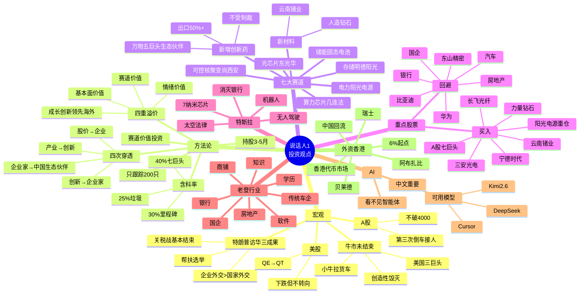

# 说话人1 投资观点 · 思维导图

> 本文同时提供 **Markmap / 大纲式** 和 **Mermaid** 两种思维导图格式。
> - Markmap：复制全文到 [markmap.js.org/repl](https://markmap.js.org/repl) 即可渲染。
> - Mermaid：可在 GitHub、Typora、Obsidian、Notion 等支持 mermaid 的环境中直接渲染。

---

## A. Markmap / 大纲式思维导图

```markdown
# 说话人1 投资观点

## 1. 宏观判断
- 特朗普访华三大成果
  - 关税战基本结束（震荡）
  - 国家间外交 < 企业间外交（新时代）
  - 帮扶选举：美联储换帅 / QE→QT / 通胀高企
- 美股
  - 开始下跌，跌幅小于上次，不会转向
- A股
  - 第三次倒车接人
  - 不会跌破 4000，4000=再起跳起点
- 牛市未结束
  - "小牛拉货车"
  - 小牛 = 美国科技三巨头（原7→3）
  - 又一次科技革命起点（创造性毁灭）

## 2. 核心方法论
- 赛道价值投资（反对传统巴菲特派）
- 四重溢价
  - ① 基本面价值（钢筋）
  - ② 赛道价值（20→30）
  - ③ 成长/创新/领先/海外四叠加（30→60）
  - ④ 情绪价值（60→100）
- 四次穿透
  - 穿透股价看企业
  - 穿透产业看创新
  - 穿透创新看企业家
  - 穿透企业家看中国生态伙伴 ← 跟踪标准
- 四维框架
- 持仓节奏
  - 短线干不过量化
  - 长线干不过国家队
  - 只做中间 3–5 个月
- 在风险中寻找机会，在泡沫中兑现财富
- 含科率
  - <25% 垃圾
  - 30% 第一里程碑
  - 40% A股七巨头
- 5500 只票只跟踪 200 只
  - 一半以上=美国三巨头中国生态伙伴
  - 历史涨幅 1×–46×

## 3. 主线 + 七大赛道
- 主线：算力 → 电力
- 算力芯片：几连法
- 光芯片：东光华（东山精密+光迅科技+华工科技）；原选易中天
- 可控核聚变：尚西安
- 存储：明德、阳光
- 电力：阳光电源
- 新材料
  - 锗（云南锗业）
  - 人造钻石（黄河旋风/力量钻石）
  - 玻璃 / PCB
- 储能/固态电池：宁德时代（钠电池）
- 新增第9赛道：创新药
  - 出口占比 ≥50% 且上升
  - 不受美国制裁
  - 美国医药五巨头的中国生态伙伴
  - 全中国（含港股）共 10 家

## 4. 重点股票
- 买入
  - 三安光电（周一买入）
    - 磷化铟芯片，缺口30%
    - 8个万亿级市场领袖
    - 董事长被留置 → 机会
    - 福建国资委想抢
  - 阳光电源（重仓）
    - 目标 170–230
    - 海外 4% → 全球，覆盖 18 国
    - 下月香港上市
  - 宁德时代
    - 钠电池替代锂电池（6 个月内）
  - 云南锗业（跌至 90 是买点）
  - 黄河旋风 / 力量钻石（光模块新材料）
  - 长飞光纤（英伟达美国建3厂，10年10倍）
  - A 股七巨头（即将推出，不管多高都买）
- 谨慎
  - 东山精密（华西村出身，财报水分，但弹性大）
- 回避
  - 华为及关联（无耻，压榨，AI 落后）
  - 比亚迪（实际已破产，压榨供应商）
  - 银行（时代终结）
  - 汽车（下一个全线崩溃赛道）
  - 房地产（50年起不来）
  - 国企（三光：赔/偷/抢）
  - 青龙行者

## 5. 特斯拉：四条赛道
- 机器人
- 无人驾驶
- 太空法律
- 消灭银行（特斯拉版微信，6%年息）
- 衍生：马斯克芯片厂量产（起手 7nm）
- 周边：马斯克母亲 520 饰品爆款

## 6. 老登行业（八大贬值领域）
- 房地产
- 商铺
- 知识（大模型 > 90% 教授）
- 学历（美国招高中生）
- 软件 / 码农
- 传统车企
- 银行
- 国企

## 7. AI 智能体
- 看不见的智能体 = 价值×10
- 看得见的机器人（酒店、产线）= 低价值
- 中文重新重要：精准提示词
- 可用模型：DeepSeek、Kimi 2.6、赤浦、Cursor、Cloud 4.7
- 不可用：豆包

## 8. 外资 / 香港
- 外资回流四大主流
  - 美：贝莱德（14万亿，重仓宁德、阳光）
  - 瑞士：欧洲钱
  - 阿布扎比：中东钱
  - 中国回流：含潘石屹
- 香港：金融自由港 → 全球资本市场枢纽
  - 下半年代币市场爆发
  - 代币资产起点 6%

## 9. 金句
- 周一买三安光电，不要问为什么
- 现在站在光里
- 便宜没好货
- 回撤即上车
- 在风险中寻找机会，在泡沫中兑现财富
```

---

## B. Mermaid 思维导图



---

## C. 思维导图速记

```text
说话人1
├── 宏观：A股第三次倒车接人 / 不破4000 / 小牛拉货车
├── 方法论：四重溢价 + 四次穿透 + 中线3-5月
├── 赛道：算力到电力 + 创新药
├── 龙头：三安光电(周一买)、阳光电源(重仓)、宁德、云南锗业、长飞、力量钻石
├── 回避：华为、比亚迪、银行、汽车、房地产、国企
├── 特斯拉：机器人 / 无人驾驶 / 太空 / 消灭银行
├── 老登：房地产 / 商铺 / 知识 / 学历 / 软件
└── 外资回流先到香港，代币市场起点 6%
```
