

# 2026 Google 开发者大会观察白皮书

**从灵感火花到产品跨海出圈：智能体时代的全球开发者网络与城市空间含义**

**编制单位**：复旦大学住房政策研究中心（Housing Policy Research Center, Fudan University）

**文稿系列**：中心研究文稿 · 第三号

**文稿编号**：FDU-HPRC-WP-2026-03

**成稿日期**：2026 年 8 月

---

## 编制说明

本白皮书为复旦大学住房政策研究中心研究文稿系列的**第三号文稿**（编号 FDU-HPRC-WP-2026-03）。文稿接续第二号《WAIC2026 人工智能产业空间白皮书》（FDU-HPRC-WP-2026-02），把观察窗口从“产业展会与园区空间”切换到“全球开发者网络与城市接口”。

2026 年 8 月 12—13 日，Google I/O Connect China（中文公开名称：**2026 Google 开发者大会**）在上海世博中心举行。大会结束次日，课题组依据公开新闻、官方博客、开发者站点与黑客松页面，整理可核验事实，并据此讨论其对上海人才住房、会展经济与产业空间的含义。

必须事先说明三点。第一，本文不是 Google 官方文件，也不是对大会内部议程、未公开演讲或商业合同的复述；凡涉及规模、产品与计划的数字，均来自截至 2026 年 8 月 14 日仍可检索的公开网页。第二，住房政策研究中心介入一场开发者大会，并非“跨界猎奇”，而是因为智能体时代正在改写**谁在城市里工作、在哪里住、以何种空间完成全球协作**。第三，一个月前，同一世博片区刚刚承办 2026 世界人工智能大会。把两场大会并置，才能看清上海在 2026 年夏天同时承担的两种全球功能：产业治理舞台，与开发者出海接口。

除另有注明外，本文图表由课题组根据公开信息自行绘制。观察评分图（图 11、图 14）为研究判断，不是官方统计。

---

## 摘要

2026 年 8 月 12—13 日，Google 在上海世博中心举办 I/O Connect China。官方中文博客在开幕当天写道：现场汇聚 Google 与行业嘉宾以及**近 2,000 名开发者**，讨论智能体时代的技术、工具与应用实践，主题可概括为“以全栈 AI 助力中国开发者实现全球可持续增长”。会前公开物料则把口号定为**“从灵感火花到产品跨海出圈”**，议程围绕 AI、Chrome、Cloud、Android 四条主线展开。

本白皮书据此形成五项判断。

**其一，上海站不是一次孤立的产品发布会，而是 Google I/O 2026 之后全球开发者巡回的中国节点。** 5 月的 I/O 把公司叙事从“大模型竞赛”改写成“智能体 Gemini 时代”；6 月官方开发者账号宣布 I/O Connect 巡回将连接柏林、班加罗尔与上海。上海的功能因此十分明确：把 5 月的全球技术底座，翻译成中国团队可上手、可出海、可规模化的工具链。

**其二，大会的技术重心已经从“更强的聊天模型”转向“可行动的全栈智能体”。** 官方现场叙事同时覆盖：Gemini 3.6 Flash / 3.5 Flash-Lite 等新模型，Gemini API 中的托管式智能体，AI Studio 到 Antigravity 2.0 的开发闭环，Gemma 4 及端侧开放模型，Android CLI / Studio 智能体模式 / Android Bench，WebMCP 与面向智能体的 Chrome 开发者工具，以及 TPU 8t/8i 与 Google Agent Platform。这是一条从芯片到产品的垂直栈，而不是单点演示。

**其三，“跨海出圈”把开发者大会写成了全球化生产组织问题。** 官方强调启动“谷歌初创出海计划”、拓展“谷歌跨境电商加速中心”，并以本土社区、技术导师、出海加速、中文文档四大支柱连接中国创新与全球规模。对城市而言，这意味着上海不只是会议主办地，而是中国团队把产品送进 Play、Chrome、Cloud 与海外用户的**物理接口**。

**其四，Gemma 4 黑客松把“社会场景”提前带进了主会场。** 公开入围项目高度集中于适老化、医疗急救、教育、端侧隐私与社会公益，决赛安排在 I/O Connect 现场路演。智能体并没有停留在代码编辑器里，而是走向老人陪护、急救辅助、地理空间与本地离线部署——这些场景最终都要落在住房、社区与城市基础设施上。

**其五，对住房与产业空间政策来说，真正的新变量不是“又多了一场会”，而是开发者角色与生产组织正在重组。** 官方把开发者定义为“智能体的管理者”：过去数月才能完成的项目，个人可在极短时间内完成。若这一叙事部分兑现，城市将同时面对会展高峰的短期住宿冲击、青年开发者租赁需求、一人公司式灵活办公，以及端侧模型把家庭住房变成算力单元的长期趋势。世博片区在 7 月承办 WAIC、8 月承办 I/O Connect，已经把上海的“全球接口”能力演示了一遍；下一步要回答的，是人才住在哪里、团队在哪类空间里把智能体做成可出海的产品。

**关键词**：Google I/O Connect China；2026 Google 开发者大会；智能体；跨海出圈；世博中心；人才住房；产业空间

---

## 目录

- 第一章 为何住房政策研究要读一场开发者大会
- 第二章 大会全景：时间、地点、主题与全球网络位置
- 第三章 技术风向：从 I/O 2026 到上海落地的全栈智能体
- 第四章 Gemma 4 黑客松与开发者社区
- 第五章 “跨海出圈”：中国开发者的全球增长路径
- 第六章 会展空间与城市：世博片区的连续全球接口
- 第七章 人才、住房与产业空间：智能体时代的新变量
- 第八章 展望与建议
- 附录 资料来源与图表索引

---

# 第一章 为何住房政策研究要读一场开发者大会

## 1.1 研究问题

住房政策研究通常处理土地、住房供给、保障体系、租赁市场与职住平衡。开发者大会看起来属于另一套话语：模型、API、工作坊、Demo。把两者放在同一份文稿里，需要先回答一个问题：**一场在上海举行的全球开发者大会，究竟改变了哪些与“住”和“空间”有关的变量？**

课题组认为，至少有四条传导链条。

第一，**人才链条**。近 2,000 名开发者在两日内集中到世博中心，只是冰山可见的一角。其背后是京沪深杭的 Google 开发者社区、黑客松三城半决赛，以及一批以出海为目标的创业团队。这些人是住房市场中的高流动性青年职业群体：租还是买、住在园区还是住在高校周边、是否接受多时区远程，都会进入城市住房需求结构。

第二，**会展与短期住宿链条**。世博片区在 2026 年 7 月刚经历 WAIC 的高强度使用，8 月再次承接 Google 开发者大会。大型国际科技活动正在把浦东世博—前滩—世博源一带，变成季节性的全球人才港口。港口需要的不只是会场，还有酒店、服务式公寓、夜间交通与可快速扩容的短租供给。

第三，**生产组织链条**。当官方宣布“个人即可拥有一支工程团队的实力”，办公空间的需求逻辑就会变化：人均工位可能下降，但对网络质量、时区协作舱、演示空间和合规隔离的要求会上升。这与本中心在第二号文稿中讨论的“AI 原生园区”是同一问题的另一面——那边看硬件与产线，这边看软件团队与出海组织。

第四，**住宅功能链条**。Gemma 4 被明确鼓励在笔记本电脑和手机上离线运行智能体。当模型可以住进设备，住房就不再只是休息场所，而可能成为本地推理节点。隐私、电力、邻里干扰、适老化陪护，都会从“应用场景”返回“居住空间标准”。

> **分析结论 1-1**：读 Google 开发者大会，不是为了复述产品清单，而是为了识别智能体如何改写城市的人才驻留、会展峰值与住宅功能。空间政策如果只跟踪厂房和算力中心，会漏掉开发者这一端。

## 1.2 观察窗口：从 I/O 到 I/O Connect

Google 的年度主场仍是美国时间的 Google I/O。2026 年 5 月，Google CEO 桑达尔·皮查伊（Sundar Pichai）把主题定为 “Welcome to the agentic Gemini era”（欢迎来到智能体 Gemini 时代）。I/O Connect 则是把这一套叙事带到柏林、班加罗尔、上海等开发者高密度城市的巡回机制。

因此，上海站必须放在两层时间里阅读：

- **全球层**：5 月 I/O 发布 Gemini 3.5、Antigravity 2.0、Gemini Spark、TPU 第八代等底座；
- **中国层**：8 月上海站把底座翻译成中文现场、工作坊、黑客松决赛和出海计划。

忽略第一层，会把上海站看成“又一次 AI 发布”；忽略第二层，又会把 I/O 的全球叙事误当成已经在中国落地的事实。本白皮书同时使用这两层材料，但在陈述中国现场时，优先采用 8 月 12 日 Google 中国官方博客与 7 月以来的报名报道。

## 1.3 方法与边界

本文采用公开资料交叉核验：

1. 官方与准官方：Google 中国博客（china.googleblog.com，2026-08-12）、Google for Developers 站点对 I/O Connect China 的条目、Gemma 4 Hackathon 页面、Google for Startups Accelerator China 页面；
2. 中文新闻与行业转载：IT之家（2026-07-14）关于报名与口号的报道，以及多家科技媒体对同一通稿的转载；
3. 对照材料：Google I/O 2026 主题演讲公开稿、2025 年上海 I/O Connect 的媒体报道（仅作历史对照，不把 2025 年嘉宾发言直接记到 2026 年账上）；
4. 城市空间材料：世博中心 / 世博展览馆区位与交通公开信息，以及本中心第二号文稿对 WAIC 2026 的观察。

本文不使用未公开的参会名单、门票数据或内部 PPT。对“近 2,000 名开发者”这一规模，采用官方博客原词，不外推为验票数或经济贡献。

---

# 第二章 大会全景：时间、地点、主题与全球网络位置

## 2.1 可核验的基本事实

| 项目 | 公开信息 | 主要来源 |
| --- | --- | --- |
| 中文名称 | 2026 Google 开发者大会 | IT之家 2026-07-14；Google 中国博客 2026-08-12 |
| 英文名称 | Google I/O Connect China | Google for Developers；黑客松官网 |
| 时间 | 2026 年 8 月 12 日—13 日 | 同上 |
| 地点 | 上海世博中心 | 同上 |
| 会前口号 | 从灵感火花到产品跨海出圈 | IT之家、凤凰网科技等转载 |
| 现场补充提法 | 智体新境 | 会前议程预热稿 |
| 公开规模 | 近 2,000 名开发者 | Google 中国博客 2026-08-12 |
| 四大板块 | AI、Chrome、Cloud、Android | 报名通稿 |
| 报名开启 | 2026 年 7 月 14 日前后 | IT之家 |

会前通稿对现场体验的表述高度一致：专题演讲与行业案例、实战工作坊、现场 Demo、跟随技术专家“跑通智能体开发全流程”，以及与 Google 技术专家、同频开发者和创业者对话。大数跨境转载的会前攻略还点名 Google Antigravity、AI Studio、Chrome 开发者工具，并把首日目标写成“解锁 Agentic AI 生产力，赋能出海应用开发全流程”。

这些表述的政策含义很直接：**上海站被设计成“可动手的转化器”，而不是“只听 Keynote 的转播点”。** 对会展空间而言，这意味着场地必须同时容纳主旨演讲、工作坊隔间、可排队体验的 Demo 岛和路演舞台——与 WAIC 那种“主论坛 + 大展馆分区”的结构不同，更接近高强度的开发者实验室。

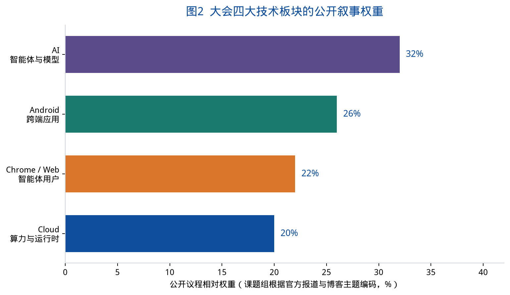

图 2 并非官方议程表，而是课题组根据报名通稿、会前攻略和开幕博客的主题出现频次做的相对编码。AI（智能体与模型）权重最高，Android 次之，Chrome/Web 与 Cloud 构成另外两翼。四条线同时出现，说明主办方要展示的是栈，而不是单品。

## 2.2 上海在 I/O Connect 全球巡回中的位置

Google for Developers 官方账号在 2026 年 6 月 24 日宣布：I/O Connect 巡回将前往柏林、班加罗尔与上海，与全球开发者连接。Google for Developers 主站随后把 I/O Connect China 列在社区活动中，时间写明 August 12-13 / Shanghai。

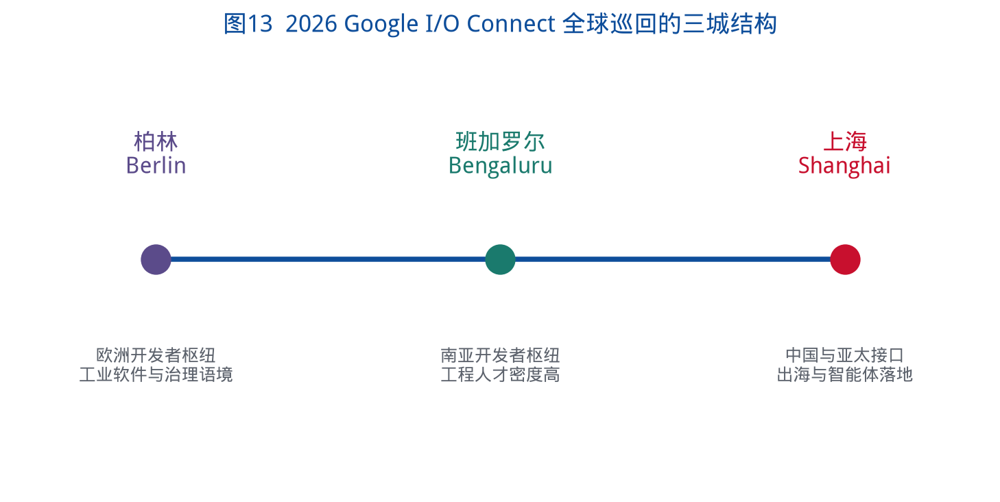

三城不是随机点位。柏林对应欧洲的工业软件、开源治理与监管语境；班加罗尔对应南亚高强度的工程人才供给；上海对应中国团队把产品送进全球消费与云市场的需求。把上海放进这条巡回，等于承认：**中国开发者已经是 Google 全球生态必须当面沟通的一方，而不只是远程阅读英文文档的用户。**

> **分析结论 2-1**：上海站的城市意义，首先是“被写进全球巡回”，其次才是“在世博中心开了两天会”。一座城市能否稳定出现在这类巡回名单上，取决于开发者密度、出海企业密度和会展接待能力，而不仅仅取决于能否租到一个大剧场。

## 2.3 与 2025 上海站的延续，而不是简单重复

2025 年 8 月 13—14 日，Google 同样在上海举办 I/O Connect China。当时媒体广泛引用 Google 大中华区及韩国总裁陈俊廷的判断：中国出海开发者已成为全球创新舞台上的中坚力量；Google Play 年度最佳榜单中，12 家中国团队的 13 款应用和游戏在不同市场斩获 14 项“年度最佳”。大会还启动 Google Developer Program，并开放第四期出海加速器申请。

2026 年上海站沿用了同一城市、同一季节、同一“出海”主轴，但公开叙事发生了三个可见变化：

1. **技术对象从“生成式模型赋能”转为“智能体全流程”**。2025 年报道大量出现 Gemini 2.5、Veo、Imagen、Firebase Studio；2026 年现场博客的关键词变成托管式智能体、Antigravity 2.0、WebMCP、Agent Runtime。
2. **开放模型与端侧被放到与云端并列的位置**。Gemma 4 系列、笔记本和手机本地运行智能体，在 2026 年官方博客中被明确写出。
3. **出海机制从“加速器报名”扩展为“初创出海计划 + 跨境电商加速中心”的组合表述**，更强调数字基座、海外商业体验和具身智能三条进化路径。

本白皮书因此把 2026 年上海站理解为：**同一接口的一次版本升级——从“用生成式 AI 做出海应用”，升级为“用智能体组织全球生产”。**

## 2.4 与 WAIC 2026 的对照：同一座城市的两种全球功能

2026 年 7 月 17—20 日，世界人工智能大会在上海举行，主场同样落在世博片区。本中心第二号文稿已指出，WAIC 呈现的是“治理规格 + 产业硬件 + 园区场景”。不到四周后，Google 开发者大会回到几乎同一地理单元，但连接的对象换成了开发者、创业者与全球产品通道。

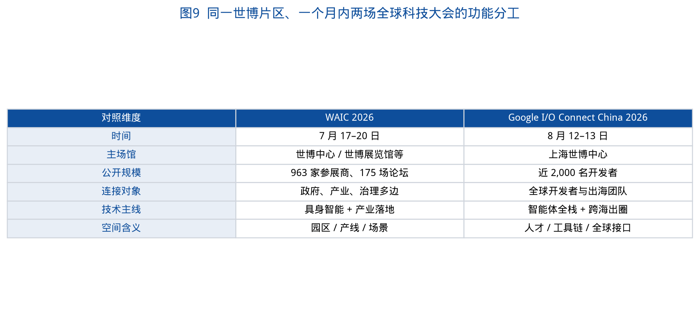

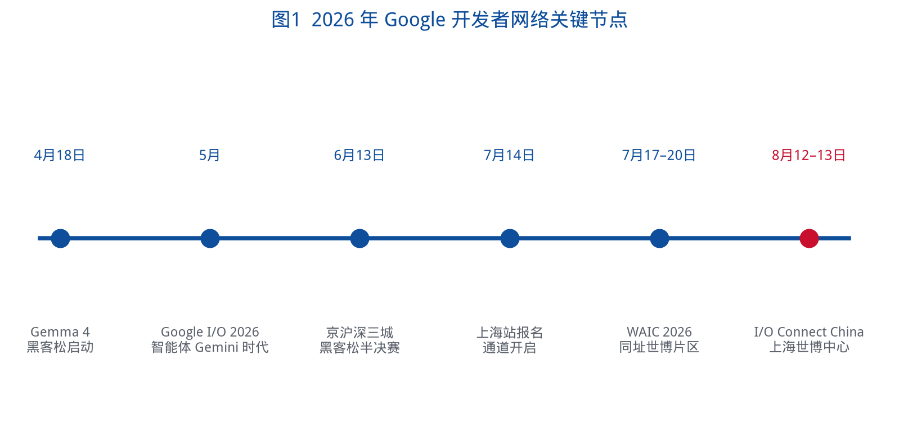

两场大会叠在同一个夏天，对城市管理是压力测试，对观察者则是难得的对照实验：上海能够同时提供“多边产业治理舞台”和“全球开发者实验室”。前者需要元首级安保、大展馆与论坛矩阵；后者需要可动手的工位、演示岛和跨时区产品通道。空间形态相近，城市功能并不相同。

> **分析结论 2-2**：把 WAIC 与 I/O Connect 看成互相替代的“AI 大会”，会误判上海的角色。前者回答“产业和治理如何落地”，后者回答“中国团队如何把智能体产品送到全球用户手里”。住房与园区政策应当同时服务这两条链，而不是用一套会展话术覆盖全部。

---

# 第三章 技术风向：从 I/O 2026 到上海落地的全栈智能体

## 3.1 官方主线：全栈，而不是单点模型

Google 中国博客在 2026 年 8 月 12 日开宗明义：AI 正从“前沿概念”变成拥有主动协作能力的“高效工具”；与此同时，来自中国的创新正在数字文化、智能终端和应用游戏等领域重新定义海外智能体验。现场要坚持的路线被写成——

> 从定制芯片、安全稳固基础设施，到前沿的研究与模型，再到触达全球用户的产品和平台。

这与皮查伊在 I/O 2026 主题演讲中的表述几乎同构。差别在于：I/O 面向全球开发者与消费者产品，上海站则把同一条栈明确接到“赋能中国开发者在海外高效创新”。

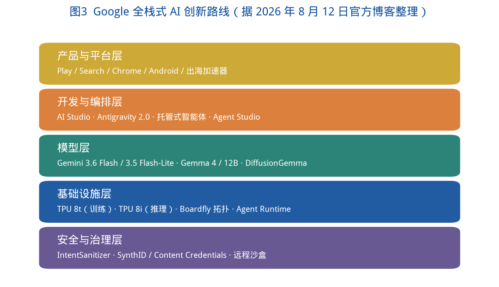

对住房与产业空间研究而言，全栈叙事有一个容易被忽略的推论：**智能体不是“云里的软件”，它绑定芯片、机房、设备、浏览器、应用商店和跨境支付。** 城市如果只准备写字楼，不准备测试设备、合规沙盒和可演示的真实场景，就接不住这条栈的落地端。

## 3.2 模型层：为行动而优化的 Flash，以及可本地运行的 Gemma

上海官方博客点名 **Gemini 3.6 Flash、3.5 Flash-Lite** 等新一代模型，强调其能够为极其复杂的任务做深度逻辑推理，从而成为智能体的底层基石。这与 5 月 I/O 的 Gemini 3.5 Flash 发布形成连续关系：I/O 上的 3.5 Flash 被定位为“把前沿智能与行动结合起来”的第一款 3.5 系列模型，突出编码、长程任务和真实工作流；上海站则把更新后的 Flash/Flash-Lite 写成智能体底座。

与闭源 API 并列出现的，是开放权重路线：**Gemma 4、Gemma 4 12B、DiffusionGemma**。官方特别写道，开发者已用这些模型做出突破性产品；更重要的是，离线状态下也能在笔记本电脑和手机本地运行强大的 AI 智能体，从而提供“速度快、性价比超高”的体验。

这一并列结构值得政策研究者抓住：云端 Flash 负责长程、高算力、可托管；端侧 Gemma 负责离线、隐私、低成本。两者不是替代关系，而是把智能体同时送进机房和口袋。

## 3.3 开发层：一次调用得到智能体和沙盒

上海博客给出一组对开发组织影响极大的细节：

- 开发者可利用 Gemini API 中的**托管式智能体**，构建能够自主分类问题、分析 Bug 并维护 SDK 健康运行的智能体；
- **一次 API 调用**即可同时获得智能体以及供其安全运行的远程环境；
- 通过 **AI Studio**，可在几分钟内完成从 JSON 文件到原生 Android 应用的构建，并在 **Google Antigravity 2.0** 上本地迭代。

5 月 I/O 已经把 Antigravity 2.0 说成“智能体优先”的桌面平台，用来编排和管束一群自主智能体。上海站没有停留在概念，而是把它嵌进“JSON → Android 应用 → 本地迭代”的可演示路径。会前攻略也把 Antigravity、AI Studio、Chrome 开发者工具并列为首日深潜对象。

> **分析结论 3-1**：当“远程沙盒 + 托管智能体”成为默认开发单元，企业对传统工位的依赖会下降，对稳定带宽、跨时区协作和可隔离运行环境的依赖会上升。园区若仍按“一张桌子一个人一台显示器”供货，会与智能体开发的真实组织方式错位。

## 3.4 Android：从手机到 5.8 亿大屏设备

官方给出一组硬件生态数字：**Android 活跃大屏设备已突破 5.8 亿**；目标是帮助开发者更快速构建高质量 Kotlin Android 应用，并推广到全球超过 **30 亿**终端，覆盖折叠屏、平板、可穿戴、电视、车机与 XR。

为服务这一目标，现场强调三项更新：

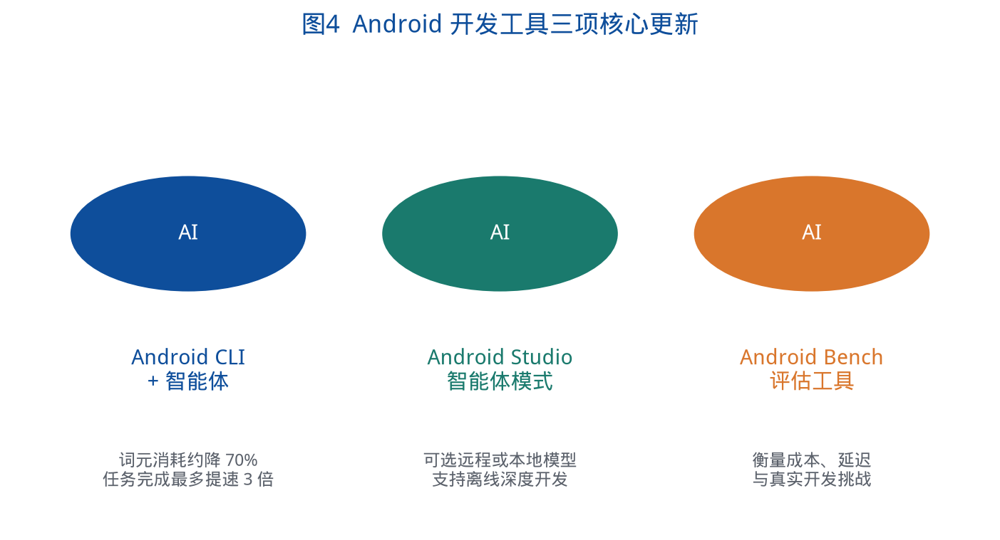

1. **Android CLI 与智能体结合**：通过 Android 技能和知识库，智能体处理繁琐任务时可减少约 70% 的词元（token）使用，任务完成速度最多提高三倍；
2. **Android Studio 智能体模式**：允许在 IDE 中开启智能体，并在远程模型与本地下载模型之间选择，以支持离线深度开发；
3. **Android Bench**：衡量大模型在真实 Android 开发挑战中的成本、延迟和词元消耗。

此外，UI 开发全面推行 Compose 优先；DDP Device Streaming 进入公开预览，可远程调用真实物理设备；DeviceRun 支持智能分片、在多台真机上并发测试；IntentSanitizer 等 API 与智能体结合，用于消除签名验证等安全漏洞。

这些更新对空间研究的直接含义是：**测试不再必须把实验室堆满真机。** 远程真机流和并发测试会把一部分硬件实验室搬到云端。但 XR、车机、折叠屏等形态仍需要本地演示与适配现场——这也解释了为何开发者大会必须是线下的：有些设备体验无法被文档替代。

## 3.5 Chrome / Web：网页迎来“智能体用户”

上海博客对 Web 的判断很硬：Web 生态迎来了新型用户——**智能体**。目标被写成三句：优化真人用户体验、适配智能体工具、革新现代 Web 开发工作流。

对应的技术点包括：

- Core Web Vitals 引入“软导航”性能衡量，追求“秒开”；
- 扩展浏览器内置端侧 AI 工具箱，支持跨源调用并在本地硬件运行优化模型；
- 实验性开放规范 **WebMCP**，让 Web 应用把 JavaScript 函数和 HTML 表单等结构化工具直接公开给智能体，使其更可靠地执行搜索、加购、账号管理；
- Modern Web Guidance 提供经专家把关、实时更新的技能（skills），并基于 Baseline 自动生成向后兼容代码；
- 面向智能体的 Chrome 开发者工具，使编程工具能自主调取运行时调试数据并执行审核修复。

WebMCP 在 I/O 开发者主题演讲中已被提出，并计划在 Chrome 中开展源试用。上海站把它写成中国开发者必须面对的新现实：未来访问网站的，不只是人，还有代理。

对城市商业空间而言，这意味着线下店、酒店、政务大厅的网页与小程序，迟早要同时服务两类用户。谁先把“可被智能体调用的结构化接口”准备好，谁就在获客链路上占先。这已经超出“做个更漂亮的官网”，而接近城市数字基础设施标准。

## 3.6 Cloud：训练与推理分家，智能体要有运行时

官方明确：智能体时代里，模型训练与部署的需求已经完全分化。第八代 TPU 因此拆成两款芯片——

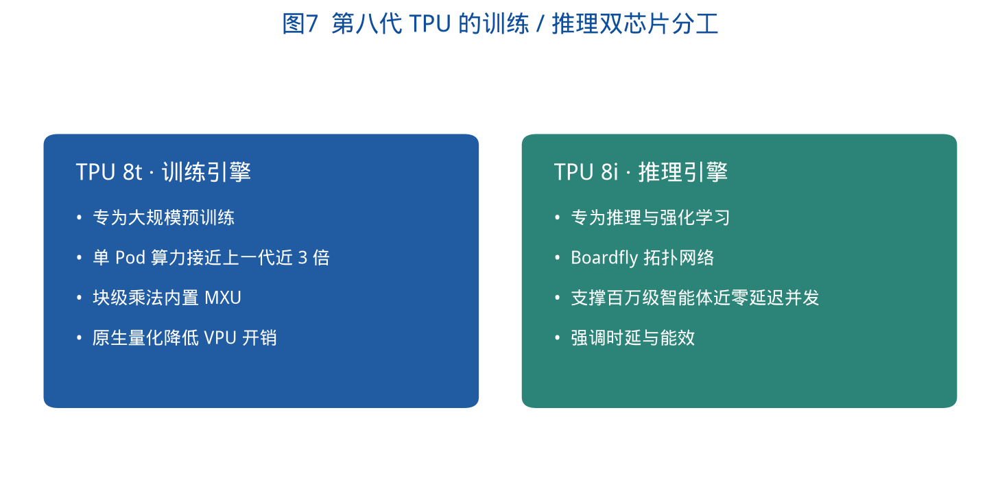

- **TPU 8t**：训练引擎，通过将块级乘法移至 MXU 内部、利用原生量化消除 VPU 开销，使单 Pod 计算性能提升至上一代的近三倍；
- **TPU 8i**：推理与强化学习，利用 Boardfly 拓扑网络，让数百万计的智能体以近乎零延迟并发运行。

I/O 主题演讲还补充了全球基础设施背景：Google 预计 2026 年资本开支约 1,800—1,900 亿美元，约为 2022 年 310 亿美元的六倍；训练可跨站点分布到超过 100 万块 TPU。上海站没有重复这些全球资本数字，而是把芯片分工接到开发者可感知的平台：

- Google Agent Platform 的 Agent Studio；
- 开源的近 50 个智能体技能；
- 60 多个托管 MCP 服务器；
- 专属 Agent Runtime，用于大规模智能体的部署、运行与治理。

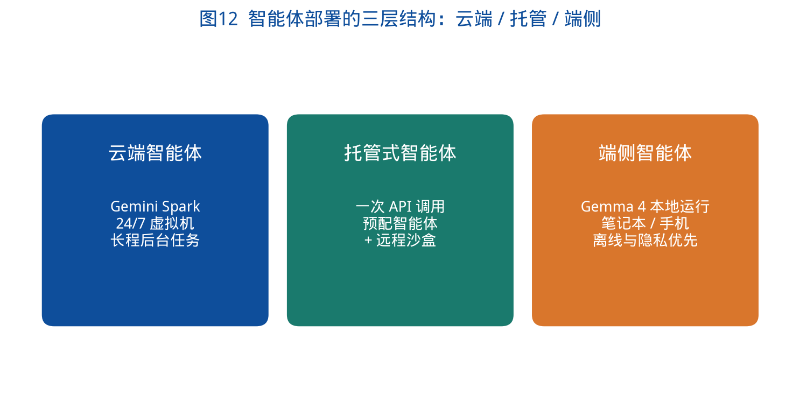

把 5 月与 8 月合在一起看，智能体部署呈现清晰的三层：云端 24/7 智能体（I/O 上的 Gemini Spark 跑在 Google Cloud 虚拟机上）、API 托管智能体（一次调用得到沙盒）、端侧 Gemma 智能体。上海站把后两层讲得更具体，因为它们更贴近中国开发者“能做出来、能带走、能放到海外产品里”的需求。

> **分析结论 3-2**：算力分层会传导为空间分层。训练仍靠近电力充足的大规模数据中心；推理与智能体并发更在意时延；端侧则回到住房和终端。城市不能再用“建一个智算中心”来回答所有 AI 空间问题。

---

# 第四章 Gemma 4 黑客松与开发者社区

## 4.1 赛道设计：四种进入智能体世界的方式

Gemma 4 Hackathon 把自己写成 2026 I/O Connect China 的配套竞赛。核心模型必须是 Gemma 4；赛道分为四条，供团队选择并做深。

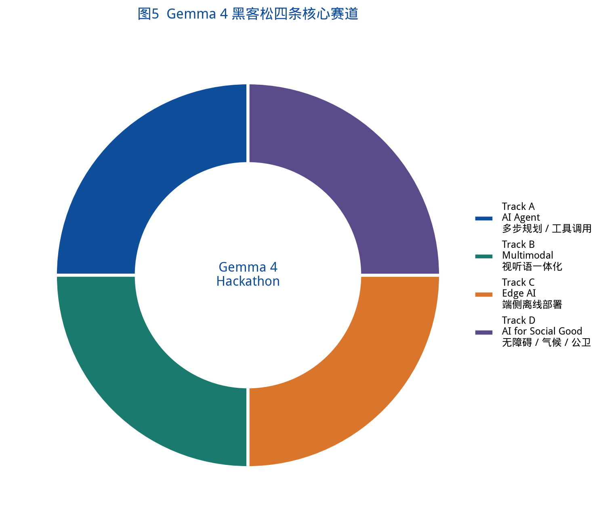

| 赛道 | 能力重点 | 公开示例场景 |
| --- | --- | --- |
| Track A · AI Agent | 多步规划、工具使用、原生函数调用 | 预问诊、法律文书、工业质检、教育辅导 |
| Track B · Multimodal | 视觉、音频与语言一体化 | 文化遗产数字化、视障辅助、混合格式文档问答 |
| Track C · Edge AI | 手机、树莓派、嵌入式完全离线，须真机演示 | 乡村医疗助手、本地隐私 OCR、低功耗农业监测 |
| Track D · AI for Social Good | 无障碍、气候、公共卫生、教育公平、灾害响应 | 助残工具、气候监测、心理健康自助、人道翻译 |

竞赛机制同样公开：4 月 18 日启动，5 月 18 日截止报名，6 月 8 日提交代码与五分钟演示视频，**6 月 13 日在北京、上海、深圳的 Google 办公室举行三城半决赛**，7 月 15 日公布入围，8 月在 I/O Connect 现场决赛路演。奖项包括总冠军 1 名（含 20,000 云积分及 GDE 提名、Google for Startups 合作机会）、赛道奖与卓越奖；资源支持上限被写成最高约 20 万美元。

三城半决赛值得单独标记。它说明 Google 在中国的开发者网络并不是“上海单点”，而是京沪深三个办公室节点。上海主会场是决赛舞台，日常的社区密度分布在多个城市。对人才住房政策来说，这意味着不能把“Google 开发者”理解成只在浦东开会的人群，他们平时更可能住在海淀、南山、杨浦、浦东张江或杭州滨江。

## 4.2 入围项目画像：适老化、医疗与端侧隐私居前

黑客松官网列出的入围团队中，课题组整理出 15 个具名项目，并按场景归类。

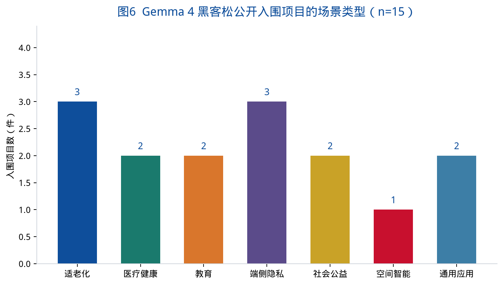

| 类型 | 项目举例 |
| --- | --- |
| 适老化 | Elva 老白（老人 AI 声导伴侣）；SafeVoice Agent（老人防诈语音智能体）；VoxShield（声纹守护） |
| 医疗健康 | MedSchema Agent（专病指标清洗与质控）；FirstAid Copilot（急救辅助） |
| 教育 | 时间规划小助手；乐学 |
| 端侧隐私 | OOtira 隐私优先衣橱副驾驶；守护犀 · EdgeMind；iPot 智能盆栽 |
| 社会公益 | AI for HER；视频偏见智能检测与包容引导 |
| 空间智能 | GIS Data Agent |
| 通用应用 | Munk AI；attractor |

样本很小，不能外推为全行业结构。但它仍然提供了一个高信噪比的信号：**当主办方把决赛舞台放到 I/O Connect，年轻团队首先拿出来的，不是又一个通用聊天机器人，而是老人、急救、教育、隐私和地理空间。** 这些场景全部发生在社区、住房和城市公共服务里。

GIS Data Agent 尤其值得住房政策研究中心注意。地理空间智能体一旦成熟，将直接进入规划分析、住房可达性、租赁供给监测和社区设施评估。它是技术栈通向本中心传统研究领域的一座桥。

> **分析结论 4-1**：黑客松入围清单显示，智能体的社会入口首先是“照料、安全、学习、本地隐私”，而不是纯生产力仪表盘。城市如果要把智能体写进住房与社区政策，应优先讨论适老化住宅、急救可达、青少年学习和家庭数据主权，而不是先讨论会展灯光秀。

## 4.3 社区基础设施：GDG、GDE 与中文文档

上海官方博客把 Google 在中国的支撑写成四大支柱：本土社区连接、技术导师指导、出海创业加速计划、本地化中文技术文档。2025 年上海站已经强调过 GDG（Google Developer Groups）与 GDE（Google Developer Experts）在北京、上海、深圳等地的线下网络，以及 Build with AI、Study Jams、DevFest 等活动形态。2026 年会前，联谱等活动平台仍能检索到 I/O Extended 北京/杭州、Build with AI 深圳、Google Cloud Next 中文精选课、Search Central Live Shanghai 等卫星活动。

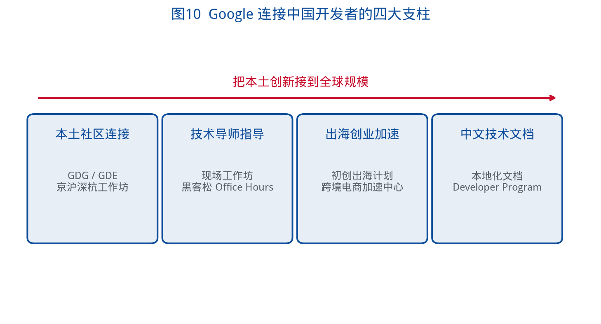

对城市空间的含义是：开发者生态需要**常设的小空间**，而不仅仅是每年两天的大空间。办公室路演、社区沙龙、黑客松工位，构成比世博中心更日常的地理。上海若只经营“主会场曝光”，不经营高校周边和园区里的常设社区点，全球巡回结束之后网络就会回到线上。

---

# 第五章 “跨海出圈”：中国开发者的全球增长路径

## 5.1 口号即产业组织命题

“从灵感火花到产品跨海出圈”不是装饰性文案。它把大会的成功标准从“听懂新技术”改写成“把产品送到海外用户手里”。开幕博客进一步把这条路拆成三步：夯实产品海外落地的数字基座，引领海外商业体验，再进入物理世界的具身智能。

这与 WAIC 上“具身智能占参展商近十分之一”的产业现象可以互证，但路径相反：WAIC 展示的是国内产线与场景如何吞下机器人；I/O Connect 展示的是中国团队如何借助 Google 的全球产品通道，把应用、游戏、智能终端和数字文化送出去，并在更远处与物理世界相遇。

对上海的城市定位而言，这正是“五个中心”中**国际经济中心、国际贸易中心、国际科技创新中心**在开发者尺度上的交汇。会议本身不创造贸易，但它把贸易所需的开发者、工具链和信任关系，压缩到两天的物理共在里。

## 5.2 出海机制：加速器、跨境电商加速中心与开发者计划

开幕博客写明，Google 通过启动**“谷歌初创出海计划”**与拓展**“谷歌跨境电商加速中心”**，整合生态内的核心出海方案与平台资源，为初创企业打造 AI 驱动的全栈式增长引擎。公开的 Google for Startups Accelerator China 页面显示，2026 年加速器仍在运行，面向总部在中国大陆或香港、已有出海需求或海外战略、已获种子到 A 轮融资的团队，覆盖跨境电商、AI 应用、游戏、内容、SaaS、智能制造等；辅导周期跨越 2026 年夏秋，并与 8 月上旬的节点衔接。

必须把 2025 年与 2026 年分开写。2025 年上海站启动了 Google Developer Program，并开放第四期出海加速器申请；当时媒体还提到 TalkMe 参加加速器后营收增加三倍、AI Mirror 在 140 个国家拥有 3,000 万用户等案例。这些是 2025 年的公开案例，说明机制已经运转，但不能直接当作 2026 年现场新宣布的数字。2026 年可确认的新表述，是把初创出海计划与跨境电商加速中心并列为“行动势能”的组织工具。

## 5.3 开发者角色：从写代码到管理智能体

上海博客对职业变迁的表述值得整段保留分析：

过去一年，AI 从回答问题的聊天机器人，变成执行任务的工具，再变成只需设定目标就能自主推理、做计划并完成复杂任务的自主智能体。开发者的角色随之转变：从编写每一行代码，变为定义规范和评估测试平台，**每一位开发者都成为“智能体的管理者”**。过去需要多名成员耗时数月才能完成的项目，如今个人在极短时间内即可完成。这种杠杆效应赋予每位开发者“背后拥有一支强大工程团队”的实力。

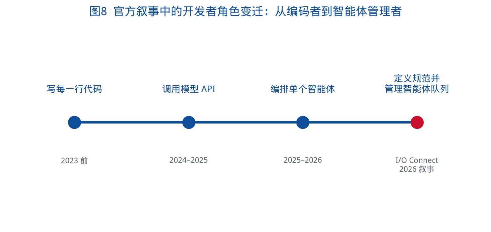

这是整份白皮书里对住房与办公市场最锋利的一句话。如果“一人即可完成过去一个小团队的工作”在部分产品上兑现，将会同时出现两种空间后果：

- **收缩效应**：初创团队更小、工位更少、对大型开放式办公的需求下降；
- **升级效应**：留下来的空间必须更高规格——演示、测评、合规、多时区会议、设备适配。

住房市场也会被波及。更年轻、更小班组、更全球时区的从业者，会更依赖可短租、可转租、可近高校或近国际社区的住房产品，而不是传统的“公司附近买三居”。

> **分析结论 5-1**：“跨海出圈”首先是生产组织命题，其次才是营销命题。智能体放大个人杠杆，会让上海的住房与办公需求从“人头规模”转向“连接全球市场的空间质量”。

---

# 第六章 会展空间与城市：世博片区的连续全球接口

## 6.1 世博中心：黄浦江南段的会展枢纽

上海世博中心位于浦东世博片区，与世博展览馆、中华艺术宫、梅赛德斯-奔驰文化中心、世博源相邻，轨道交通 7、8、13 号线可通达。公开场馆资料显示，世博展览馆占地约 11.5 公顷、建筑面积约 17.1 万平方米，室内外展览面积约 10 万平方米，并配有会议区域与近 1,500 个停车位。Google 开发者大会选择世博中心而非张江或西岸，说明主办方要的是**城市中心级、可国际抵达、可同时举办演讲与工作坊的复合场馆**。

从住房政策的地理看，世博片区并不是传统的青年租赁高密度区。它更接近会展、文旅、滨江更新和商务酒店集群。开发者在两天内被“临时植入”这里，日常居住地仍在杨浦、徐汇、浦东张江、闵行或长三角其他城市。于是出现一种独特的城市使用方式：**全球接口在浦东滨江，人才再生产在高校和园区。**

## 6.2 七八月连续国际科技大会的峰值效应

2026 年夏天，世博片区连续承担：

- 7 月 17—20 日：WAIC 2026（世博中心、世博展览馆，并延伸到西岸、张江）；
- 8 月 12—13 日：Google I/O Connect China（世博中心）。

对交通、酒店、安保、餐饮和临时用工，这是两次间隔不足四周的峰值。WAIC 期间已有出行提示：优先地铁 8 号线中华艺术宫站、13 号线世博大道站，住宿需提前通过 OTA 预订，价格带从青旅到世博洲际不等。Google 大会规模更小、天数更短，但参会者是开发者和创业者，对即时网络、夜间交通和可临时办公的酒店商务中心更敏感。

短期住宿是住房政策常被忽略的边缘地带。它不属于保障房，也不等于普通商品住宅，却在全球城市中越来越承担“人才港口”功能。服务式公寓、会议酒店、合规短租，决定一座城市能否在不抬升本地长期租金的前提下，吞下连续的国际会议。

> **分析结论 6-1**：会展峰值不应只被写成文旅收入。它是全球人才对城市住房弹性的压力测试。世博片区若只有豪华酒店、缺少中价位服务式公寓和可预约的短租合规供给，开发者网络的日常节点仍会留在京深杭，上海只保留“年度舞台”。

## 6.3 会展空间的产品形态：从展位到实验室

会前材料反复强调工作坊、Demo、跑通智能体全流程。这意味着场馆使用方式更接近：

- 主舞台：全栈叙事与出海动员；
- 工作坊隔间：Antigravity、AI Studio、Android、Chrome 的上手；
- Demo 岛：提示词生成可玩应用、教育与无障碍、传统文化数字化；
- 路演台：Gemma 4 黑客松决赛。

WAIC 用展馆分区映射产业板块（大模型、算力、具身、创投）；I/O Connect 用实验室分区映射开发者技能。对上海后续承办国际开发者活动的启示是：需要可快速分隔、强电源、强无线、可预约设备墙的“临时实验室”，而不仅仅是报告厅。

这类空间不一定长年空置在世博。它更适合与高校工程训练中心、园区中试平台、滨江更新中的工业遗存结合，形成“日常实验室 + 年度主会场”的双层结构。杨浦大创智、湾谷、复兴岛正在讨论的创新街区，与世博主会场可以是互补关系：一边生产团队和场景，一边对接全球通道。

---

# 第七章 人才、住房与产业空间：智能体时代的新变量

## 7.1 冲击强度：会展承载力高，住宅标准改造慢

课题组从六个维度对本次大会的城市空间冲击做了观察评分（0—100，仅表示相对强弱，不是统计调查）。

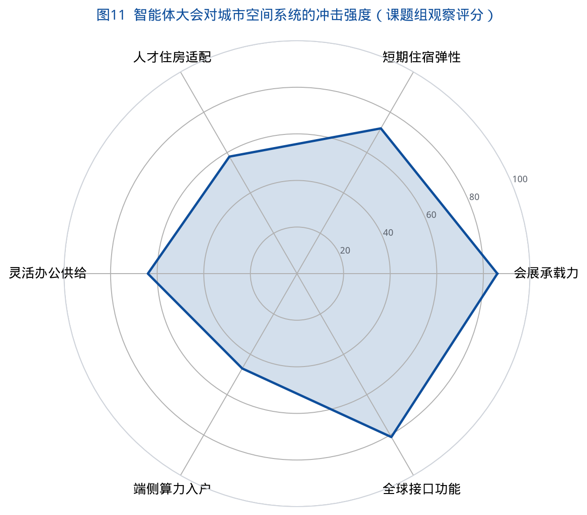

评分显示：会展承载力和全球接口功能已经很高——上海证明自己接得住 I/O Connect；短期住宿弹性中等偏上，但仍依赖酒店而非住房体系；人才住房适配、灵活办公供给明显落后于技术叙事；端侧算力入户几乎还没有进入住房标准讨论。

换言之，**城市已经会办这场会，但还不会为这场会所代表的生产方式和居住方式准备空间产品。**

## 7.2 “一人公司”与办公需求重组

官方“智能体管理者”叙事如果部分兑现，办公市场将出现三个可检验的方向：

1. **小团队、高杠杆**。更少的全职工程师完成更多交付，纯工位面积需求下降。
2. **测评与演示空间上升**。托管智能体、真机远程测试仍不能替代可对外展示、可邀请投资人和海外客户到场的房间。
3. **时区舱需求**。出海团队要覆盖欧美夜间，需要隔音、可预约、不打扰住宅邻里的夜间工作空间。这类空间放在园区里比放在普通公寓里更可持续。

这与第二号文稿提出的“AI 原生园区”可以衔接：那边强调电力密度、机器人友好楼板和开放场景；这边强调全球时区、演示舱和开发者社区。上海不必把两种园区做成同一个产品，但政策工具包应当同时覆盖。

## 7.3 青年开发者住房：租赁、高校圈层与多城通勤

I/O Connect 的参会画像虽无官方统计，但从黑客松规则（1—5 人团队、鼓励跨城）和卫星活动分布（京沪深杭）可以推断：这是一个高度跨城、高度年轻、高度项目制的群体。他们对住房的典型需求是：

- 可快速起租、可退出的租赁产品；
- 靠近地铁和高校（复旦、交大、同济、开源社区活跃地带）；
- 允许短期出差和多城居住，而不是绑定单一就业地；
- 对社区商业、24 小时网络和安全的敏感度高于对学区的敏感度。

杨浦区已有人才安居租房补贴、青年人才社区和环高校国际创新人文社区等政策工具。这些工具原本面向科研与产业人才，完全可以延伸识别“出海开发者 / 智能体创业团队”为一类可认证的青年人才，而不是把他们只当成会展观众。

## 7.4 端侧智能体：住房开始具备算力功能

Gemma 4 的官方鼓励非常明确：在笔记本和手机上离线运行智能体。黑客松 Track C 要求真机演示完全离线部署。这意味着未来会有一部分推理发生在住宅里。

由此派生的住房政策问题包括：

- **电力与散热**：密集本地推理是否进入住宅电气设计；
- **隐私与邻里**：摄像头、麦克风类陪护智能体在老旧小区如何安装；
- **适老化**：Elva、SafeVoice 这类项目若规模化，需要的是社区网络和紧急呼叫闭环，而不只是一个 App；
- **租赁合同**：房东是否允许租户部署小型边缘设备。

这些问题今天看起来“超前”，但开放模型的成本曲线正在把它们提前。住房标准如果继续把住宅定义为纯生活空间，会在下一轮智能体入户时被动应付。

## 7.5 出海团队的双城与多时区居住

“跨海出圈”会制造一种特殊的居住形态：创始团队人在上海或深圳，用户在北美、东南亚或中东，服务器在 Google Cloud，应用分发在 Play。人不必移民，但生活节律已经全球化。国际社区、可提供英文服务的租赁住房、签证和出入境便利、机场可达性，会重新进入人才住房的评价指标。

世博—前滩—浦东国际机场这条走廊，因此不只是会展走廊，也可能成为出海团队的“国际界面”。杨浦—五角场—大创智则更像“生产界面”。政策上应当承认这种分工，而不是要求每个区都复制同一套国际会议中心。

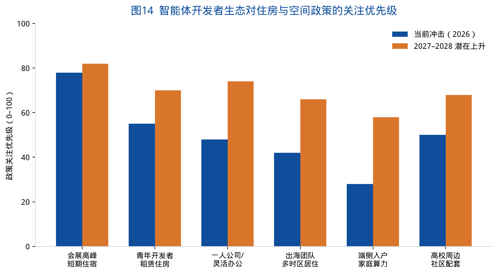

图 14 把当前冲击与 2027—2028 年潜在上升分开：会展高峰已经到来；真正会上升的是青年租赁、灵活办公、多时区居住和端侧入户。这正是住房政策研究需要提前布局的区间。

> **分析结论 7-1**：智能体时代的住房问题，不是“开发者会不会推高房价”这种笼统命题，而是三类具体产品是否存在——会展峰值的中价位服务式公寓、青年开发者可进退的租赁住房、以及允许端侧设备与适老化智能体进入的社区住宅标准。

---

# 第八章 展望与建议

## 8.1 对 2026—2027 年的趋势判断

综合公开材料，课题组对下一阶段作四点判断。

1. **I/O Connect 中国站大概率会继续以上海为默认接口。** 连续两年选在 8 月、选在会展级场馆，说明城市、档期和开发者密度已经形成路径依赖。变数在于场馆是继续落在世博，还是向能够更好结合工作坊与社区的复合空间扩展。
2. **智能体工具链会比模型名更稳定。** 模型编号会从 3.5 走到 3.6 再走到下一世代，但“托管智能体 + 远程沙盒 + 端侧开放模型 + WebMCP”这一结构更可能沉淀为开发者的日常环境。
3. **出海竞争将从“会用生成模型做内容”转向“会用智能体做运营与合规”。** 搜索、加购、账号管理一旦可被智能体调用，真正的门槛变成数据治理、内容凭证（SynthID / Content Credentials）和各地应用商店规则。
4. **社会场景会倒逼社区空间改造。** 适老化陪护、急救、教育、本地隐私不会停在黑客松 Demo 台，一旦进入试点，就需要物业、社区卫生、学校和租赁机构的接口。

## 8.2 对上海市与区级部门的建议

**建议一：把“全球开发者接口”写成世博片区的正式功能，而不是临时档期。** 在会展专项规划中明确：世博中心及周边应具备可重复举办国际开发者大会的实验室型空间（可分隔工作坊、设备墙、路演台），并评估 7—8 月连续国际科技活动对交通与住宿的叠加影响。

**建议二：补上中价位、可合规的短期人才住宿。** 在世博、前滩、张江、五角场四端，鼓励会议酒店转化部分服务式公寓，定向服务 7—30 天停留的开发者、导师和创业团队，避免国际会议把压力全部挤到旅游酒店和高价短租。

**建议三：在青年人才住房认定中增加“出海技术团队”类别。** 不必新建一套补贴，只需在现有人才安居、保租房、青年社区申请通道中，承认智能体/应用出海初创为可核验的人才类型，优先匹配可短租、可合租、近轨道交通的房源。

**建议四：以杨浦环高校社区承接“日常开发者网络”，以浦东世博承接“年度全球接口”。** 鼓励 GDG、高校开源社区、黑客松训练营进入大学路、大创智、湾谷的社区空间；让世博主会场从“孤岛舞台”变成“有日常网络支撑的年度出口”。

**建议五：启动“端侧智能体入户”的住宅与社区标准预研。** 由住房、经信、民政联合研究：老旧小区安装陪护设备的隐私与消防规则、租赁合同中的边缘设备条款、适老化紧急呼叫与智能体的责任边界。这是把黑客松场景翻译成可执行的公共规则。

**建议六：把 WebMCP 式的“可被智能体调用的城市服务接口”纳入政务和公共服务数字化标准的前瞻议题。** 先在交通、文旅、会展服务等低风险领域试点结构化工具接口，避免未来只服务浏览器里的人、却无法服务代理。

## 8.3 对高校与研究机构的建议

复旦、同济及周边高校已经出现在杨浦创新区叙事里。面对智能体开发者网络，高校可以做三件比“承办分论坛”更实的事：开放工程训练空间作为黑客松日常据点；在城市规划与住房研究中设立“数字代理与社区空间”方向；把 GIS Data Agent 这类项目接到真实的住房与设施数据（在合规前提下），让学生作品进入城市研究而不是停留在 Demo。

## 8.4 对园区与住房供给方的建议

产业园区应增加“全球时区舱 + 真机适配间 + 路演客厅”三类小空间，而不是继续只售卖大开间。住房供给方（包括保租房运营机构）应试验面向 1—5 人技术团队的灵活租约：允许短租、允许设备、靠近地铁、提供可预约的公共路演室。谁先把“一人公司 + 一群智能体”当成真实客户画像，谁就更接近下一轮租赁产品的定价权。

## 8.5 结语

2026 Google 开发者大会在上海只停留了两天。它留下的，不是一份必须立即写入法规的条文，而是一张清晰的城市考卷：当中国开发者被要求“跨海出圈”，当个人开始管理一群智能体，当开放模型可以在手机和笔记本上离线工作，上海准备用什么样的会展空间、人才住房和社区标准来承接？

世博中心证明了这座城市接得住全球巡回。真正的考验在会场灯光熄灭之后——人才是否住得下来，团队是否找得到日常协作的房间，老人和孩子所在的社区是否接得住那些已经在决赛台上跑通过的智能体。住房政策研究中心把这些问题写下来，是为了让下一场大会到来之前，空间政策已经开始工作。

---

# 附录 数据来源与图表索引

## A. 主要公开来源

1. Google 中国博客：《AI 全栈赋能，Google 助力中国开发者实现全球可持续增长》，2026 年 8 月 12 日，https://china.googleblog.com/2026/08/ai-google.html
2. IT之家：《2026 Google 开发者大会 8 月在上海举行，现已开启报名》，2026 年 7 月 14 日，https://www.ithome.com/0/976/554.htm
3. 凤凰网科技等对上述报名通稿的转载（口号“从灵感火花到产品跨海出圈”）
4. Google for Developers 主站对 I/O Connect China（August 12-13 / Shanghai）的活动条目，https://developers.google.com/
5. Google for Developers LinkedIn：I/O Connect 巡回前往 Berlin、Bengaluru、Shanghai 的公开帖文，2026 年 6 月 24 日
6. Gemma 4 Hackathon 官网：赛道、赛程、入围名单与决赛安排，https://hackathon.googdg.cn/
7. Google I/O 2026 主题演讲公开稿：Sundar Pichai, “I/O 2026: Welcome to the agentic Gemini era”，https://blog.google/innovation-and-ai/sundar-pichai-io-2026/
8. Google for Startups Accelerator China 页面（2026 年招募与辅导周期），https://startup.googlecnapps.cn/accelerator/
9. 会前议程预热：“智体新境 | 2026 Google 开发者大会 Day 1 亮点抢先看”
10. 复旦大学住房政策研究中心：《WAIC2026 人工智能产业空间白皮书》，FDU-HPRC-WP-2026-02，2026 年 8 月
11. 2025 年 I/O Connect China 媒体报道（界面新闻、澎湃新闻等），仅作历史对照
12. 上海世博展览馆 / 世博片区区位与交通公开介绍；杨浦人才安居与创新区公开政策

## B. 图表索引

| 编号 | 文件 | 内容 |
| --- | --- | --- |
| 图1 | chart01_calendar.png | 2026 年 Google 开发者网络关键节点 |
| 图2 | chart02_tracks.png | 大会四大技术板块的公开叙事权重 |
| 图3 | chart03_fullstack.png | Google 全栈式 AI 创新路线 |
| 图4 | chart04_android.png | Android 开发工具三项核心更新 |
| 图5 | chart05_hackathon_tracks.png | Gemma 4 黑客松四条核心赛道 |
| 图6 | chart06_finalist_types.png | 黑客松公开入围项目场景类型 |
| 图7 | chart07_tpu.png | 第八代 TPU 训练 / 推理分工 |
| 图8 | chart08_role_shift.png | 开发者角色变迁 |
| 图9 | chart09_expo_compare.png | WAIC 与 I/O Connect 对照 |
| 图10 | chart10_four_pillars.png | 连接中国开发者的四大支柱 |
| 图11 | chart11_space_radar.png | 对城市空间系统的冲击强度（观察评分） |
| 图12 | chart12_deploy_layers.png | 云端 / 托管 / 端侧三层部署 |
| 图13 | chart13_tour.png | I/O Connect 全球巡回三城结构 |
| 图14 | chart14_housing_priority.png | 住房与空间政策关注优先级 |

## C. 免责声明

本文仅基于公开网络信息进行研究整理，不代表 Google、复旦大学或其管理部门的官方立场。文中产品名称、技术指标与计划以原发布方后续更新为准。观察评分图为课题组分析工具，不得视为统计调查结果。转载请注明：复旦大学住房政策研究中心研究文稿第三号（FDU-HPRC-WP-2026-03）。
