

# 2026 谷歌上海开发者大会白皮书

**副标题**：智能体时代的中国开发者生态、出海接口与城市空间含义

**编制单位**：复旦大学住房政策研究中心（Housing Policy Research Center, Fudan University）

**文稿系列**：中心研究文稿 · 第三号

**文稿编号**：FDU-HPRC-WP-2026-03

**成稿日期**：2026 年 8 月

---

## 编制说明

本白皮书为复旦大学住房政策研究中心研究文稿系列的**第三号文稿**（编号 FDU-HPRC-WP-2026-03）。文稿以 2026 年 8 月 12—13 日在上海世博中心举行的 Google I/O Connect China（国内媒体通称「2026 Google 开发者大会」）为观察对象，系统整理截至成稿日可核验的新闻报道、官方博客、开发者站点与社区公开信息，并与本中心研究文稿第二号《WAIC2026 人工智能产业空间白皮书》（FDU-HPRC-WP-2026-02）形成对照。

住房政策与城市空间研究机构介入一场开发者大会，并非越界，而是沿用第二号文稿已经阐明的逻辑：**当人工智能从云端模型走向智能体、端侧与真实场景，技术发布会本身就成为城市的「接口型基础设施」**——它决定人才往哪里流动、企业把哪一座城市当作出海跳板、会展片区按何种节奏被反复使用。2026 年 7 月的 WAIC 与 8 月的 I/O Connect China 相隔不到四周、共用世博中心，为上海提供了一个罕见的同城双截面。

本白皮书**不掌握大会未公开的分会场人数、赞助商名录或内部议程表**。凡涉及规模、产品与项目的数字，均标注公开出处；对 Gemma 4 开发者大赛入围项目的赛道与场景归类，由课题组根据官网项目名称归纳，属于研究标注而非官方分赛道名单。除另有注明外，文中图表由课题组基于上述公开资料自行绘制。

---

## 摘要

2026 年 8 月 12—13 日，Google I/O Connect China 在上海世博中心举行。Google 黑板报称，现场汇聚 Google 与行业嘉宾及**近 2,000 名开发者**，讨论智能体时代的技术、工具与应用实践，核心命题是：中国创新力量如何借助**全栈 AI** 加速发展，并在全球市场实现可持续增长。IT之家 7 月 14 日的报名报道则把大会内容概括为 AI、Chrome、Cloud、Android 四条产品线，以及「跑通智能体开发全流程」的工作坊与现场 Demo。

把这场中国站放回 5 月 Google I/O 2026 的全球叙事中，坐标立刻清晰。Google CEO 桑达尔·皮查伊（Sundar Pichai）把 2026 年定义为 **「智能体 Gemini 时代」（the agentic Gemini era）**：公司月处理 Token 已超过 3.2 千万亿（quadrillion），约 850 万开发者每月在其模型上构建应用，Gemini 应用月活超过 9 亿。中国站不是另起一套技术路线，而是把这条全栈——从 TPU 硅基、Gemini / Gemma 模型、Antigravity 智能体平台，到 Android、Chrome 与 Cloud——翻译成中国开发者可上手、可出海、可规模化的本地接口。

课题组据此形成五点判断：

**其一，上海已被稳定为 Google 在中国的「开发者主场」。** 2023、2025、2026 三届 I/O Connect China 落在上海，仅 2024 年改在北京。与 WAIC 的「治理 + 产业博览」规格不同，I/O Connect 是连接站：规模更小、对象更纯（职业开发者），功能是把全球 I/O 的工具链接到中国团队的产品与出海路径上。

**其二，技术主轴已从「大模型展示」切换为「智能体交付」。** 公开议程反复出现的不是又一个参数规模，而是智能体工作流：Android Studio 接入模型与智能体编码工具、Firebase AI Logic 的端云混合推理、Android ADK、Chrome 中的智能体浏览器、Cloud 侧的托管代理 API，以及现场「跑通智能体开发全流程」。这与第二号文稿观察到的 WAIC「从大模型到智能体」风向一致，但 Google 给出的是一条可跨端、可出海的工程栈。

**其三，中国开发者被明确定位为「全球规模的供给方」而非本地市场的消费者。** 黑板报把 Google 的支撑体系概括为四大支柱：本土社区连接、技术导师指导、出海创业加速计划、本地化中文技术文档。2026 年谷歌出海创业加速器的入营确认节点恰好落在 8 月上旬，与大会同期；Gemma 4 开发者大赛的全国总决赛也设在大会现场。大会因此同时承担技术发布、创业筛选与社区加冕三项功能。

**其四，开源端侧与「真实世界问题」正在把 AI 从机房拉回社区。** Gemma 4 大赛四个赛道（Agent、多模态、端侧、社会向善）的 15 支出线队伍中，养老防诈、急救助手、医疗质控、无障碍与教育规划占据显著份额。这与 GDG 上海将于 11 月初举办的 DevFest 主题「超越模型，为真实而构建」（Beyond the Model. Build for Real）相互印证：对住房与社区政策而言，真正需要预留的不是更多机房，而是可嵌入既有住宅、街道和公共服务的端侧场景。

**其五，世博片区正在成为上海的「全球技术发布走廊」。** 7 月 WAIC、8 月 I/O Connect，再叠加秋季出海加速器开营与 11 月 GDG DevFest，会展空间、短期住宿、灵活办公和青年租赁住房被同一条人才流反复使用。本白皮书最后两章把这一观察翻译为城市与住房政策可操作的建议。

**关键词**：Google I/O Connect China 2026；智能体；全栈 AI；中国开发者出海；Gemma 4；会展型城市空间；人才住房

---

## 目录

- 第一章 全球坐标：从 I/O 2026 到上海连接站
- 第二章 大会全景：时间、地点、规模与公开议程
- 第三章 技术风向：智能体全栈如何被翻译到中国现场
- 第四章 出海接口：四大支柱、加速器与中文技术公共品
- 第五章 社区与作品：Gemma 4 大赛、GDG 与「为真实而构建」
- 第六章 同城双截面：WAIC 与 I/O Connect 的分工
- 第七章 城市空间含义：会展枢纽、人才住房与出海办公
- 第八章 展望与建议
- 附录 数据来源、方法说明与图表索引

---

# 第一章 全球坐标：从 I/O 2026 到上海连接站

## 1.1 智能体 Gemini 时代的规模台阶

2026 年 5 月 19 日，皮查伊在 Google I/O 开幕演讲中把公司十年「AI 优先」战略收束为一句话：人们已经不再满足于看到模型演示，而要求**日常产品里的可感知价值**。他用来度量这一阶段的尺子不是参数，而是 Token——模型处理的基本数据单元，也是「有多少真实问题正在被求解」的代理指标。

公开披露的台阶如下（图 3）：

| 指标 | I/O 2026 披露口径 | 对照 |
| --- | --- | --- |
| 全表面月处理 Token | 超过 3.2 千万亿 | 上年约 480 万亿，两年内从 9.7 万亿跃升 |
| 每月在模型上构建应用的开发者 | 超过 850 万 | — |
| 模型 API 吞吐 | 约 190 亿 Token/分钟 | — |
| 过去 12 个月处理超 1 万亿 Token 的 Cloud 客户 | 超过 375 家 | — |
| Gemini 应用月活 | 超过 9 亿 | 上年 I/O 时约 4 亿 |
| Search AI Overviews 月活 | 超过 25 亿 | — |
| Search AI Mode 月活 | 一年内超过 10 亿 | 被称为「搜索最大一次升级」 |
| 年度资本开支预期 | 约 1,800—1,900 亿美元 | 2022 年约 310 亿美元（31 billion USD），约 6 倍 |

数据来源：Sundar Pichai, *I/O 2026: Welcome to the agentic Gemini era*，2026-05-19。

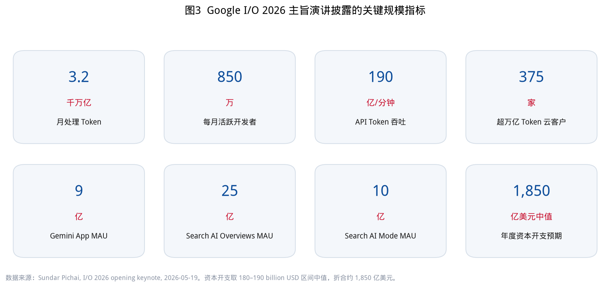

这些数字对上海现场的意义在于：中国站面对的不是「要不要做生成式 AI」的启蒙课，而是**如何把已经工业化的智能体栈接到可出海的产品上**。850 万全球开发者里，中国团队的位置被官方表述为「本土创新与全球规模之间的连接器」。

## 1.2 全栈，而不是单点模型

皮查伊强调 Google 的差异化是「全栈」：定制硅基与安全底座 → 研究与模型 → 触达数十亿人的产品与平台。I/O 2026 把这一结构又加厚了一层（图 4）：

- **硅基**：第八代 TPU 首次采用训练/推理双芯片（TPU 8t 与 8i）；训练可跨多个数据中心、在全球超过 100 万颗 TPU 上分布，宣称可组成「最大训练集群」；两款芯片能效最高约提升 1 倍。
- **模型**：Gemini 3.5 Flash 被定位为「前沿智力 + 行动」的第一款，官方称其在多数基准上优于 3.1 Pro，输出速度约为其他前沿模型的 4 倍，价格不到同类一半；Gemini 3.5 Pro 宣布次月推出。Gemini Omni / Omni Flash 则把任意输入映射为任意输出模态，先开放视频。
- **智能体平台**：Antigravity 从编码环境扩展为「管理一群自主智能体」的平台，并推出独立桌面端 Antigravity 2.0；Gemini Spark 作为 24/7 个人智能体运行在 Cloud 虚拟机上，后续经 MCP 接入第三方工具，并进入 Chrome 成为「智能体浏览器」。
- **可信内容**：SynthID 已为超过 1000 亿张图像/视频以及约 6 万年时长的音频加水印；OpenAI、Kakao、ElevenLabs 宣布采用。对出海应用而言，这是内容合规与平台分发的基础设施，而不只是研究彩蛋。

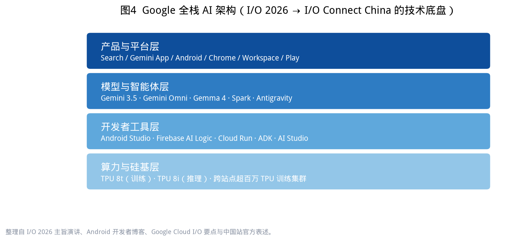

Google Cloud 在 I/O 同期的要点，则把企业侧收束为「代理式企业」（Agentic Enterprise）：Gemini Enterprise Agent Platform、托管代理 API（Managed Agents API）、Agentic Data Cloud 与 Workspace Intelligence。开发者不必自建复杂沙箱，一次 API 调用即可在 Google 托管环境里拉起能推理、能调工具、能执行代码的自定义代理。

## 1.3 中国站在 I/O Connect 网络中的位置

Google for Developers 站点把 I/O Connect China 与柏林、班加罗尔等站并列，定位是：「与职业开发者和 Google 专家连接，被最新工具激励，加速开发并做出前沿应用。」时间明确为 **8 月 12—13 日 / 上海**。

回看近四年公开报道（图 1）：

| 年份 | 城市 | 日期 | 公开定位摘要 |
| --- | --- | --- | --- |
| 2023 | 上海 | 9 月 6—7 日 | I/O 环球之旅收官站；陈俊廷强调 Play 奖项与数字人才计划 |
| 2024 | 北京 | 8 月 7—8 日 | 环球之旅压轴；「中国开发者是全球舞台不可或缺的先锋力量」 |
| 2025 | 上海 | 8 月 13—14 日 | 媒体报道主题为 AI 赋能中国出海开发者 |
| 2026 | 上海 | 8 月 12—13 日 | 智能体时代、全栈 AI、全球可持续增长 |

数据来源：动点科技（2023）、腾讯新闻（2024）、Google for Developers 活动列表、IT之家与 Google 黑板报（2026）。

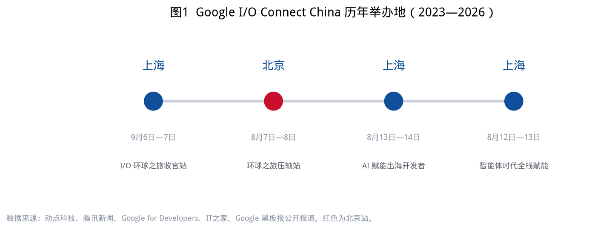

> **分析结论 1-1**：I/O Connect China 已经从「环球巡演的一站」沉淀为「每年一度的中国开发者接口」。上海在四年中三度承办，说明 Google 把「出海」与「会展型国际城市」绑在同一座物理容器里——这与 WAIC 选择上海、选择世博，是同一类区位逻辑。

## 1.4 本白皮书的问题意识

第二号文稿证明：AI 产业的增量正在从实验室转向园区、产线和街区。本号文稿把镜头从「产业空间供给」转向「开发者接口」：

1. 全球 I/O 的智能体栈，在上海现场被压缩成了哪些可操作的工具与叙事？
2. Google 用哪些制度化支柱把中国开发者接到全球规模？
3. 开源模型大赛与社区活动，如何把「智能体」落进养老、医疗、教育等真实空间？
4. 对上海——尤其是世博片区、青年租赁住房和出海企业办公——这意味着什么？

---

# 第二章 大会全景：时间、地点、规模与公开议程

## 2.1 基本事实

| 项目 | 公开口径 | 出处 |
| --- | --- | --- |
| 正式名称 | Google I/O Connect China 2026 | Google for Developers；Google 黑板报 |
| 中文通称 | 2026 Google 开发者大会 | IT之家、好软软件站等 |
| 日期 | 2026 年 8 月 12 日—13 日 | 上列来源一致 |
| 地点 | 上海世博中心（上海市浦东新区世博大道 1500 号） | IT之家；大数跨境转引 |
| 现场规模 | 近 2,000 名开发者 | Google 黑板报 2026-08-12 |
| 报名开启 | 2026 年 7 月 14 日前 | IT之家 |
| 主旨表述 | AI 全栈赋能，助力中国开发者实现全球可持续增长 | Google 黑板报 |

需要单独说明的是：第三方会展目录（如 10times）曾给出「预计约 100 名代表」等未核实口径，与官方「近 2,000 名开发者」明显冲突。本白皮书以 Google 黑板报为准，不采用未核实的第三方估数。

## 2.2 报名文案里的产品地图

IT之家转述的官方邀请函，把参会收益写成三条，几乎可以当作议程结构图：

1. **零距离了解 AI、Chrome、Cloud、Android 最新技术与行业案例**，探索「智能协同」的开发体验；
2. **实战工作坊 + 现场 Demo**，跟随技术专家进入真实场景，**跑通智能体开发全流程**；
3. **对话 Google 技术专家**，结识同频开发者与创业者。

口号是「从灵感火花到产品跨海出圈」。在住房与城市研究的词典里，这句口号有两层空间含义：一层是产品要跨海（企业的注册地、服务器、支付与合规主体随之双城化）；一层是人要出圈（开发者、创始人、导师在 48 小时内高度密集地占用会展、酒店与交通）。

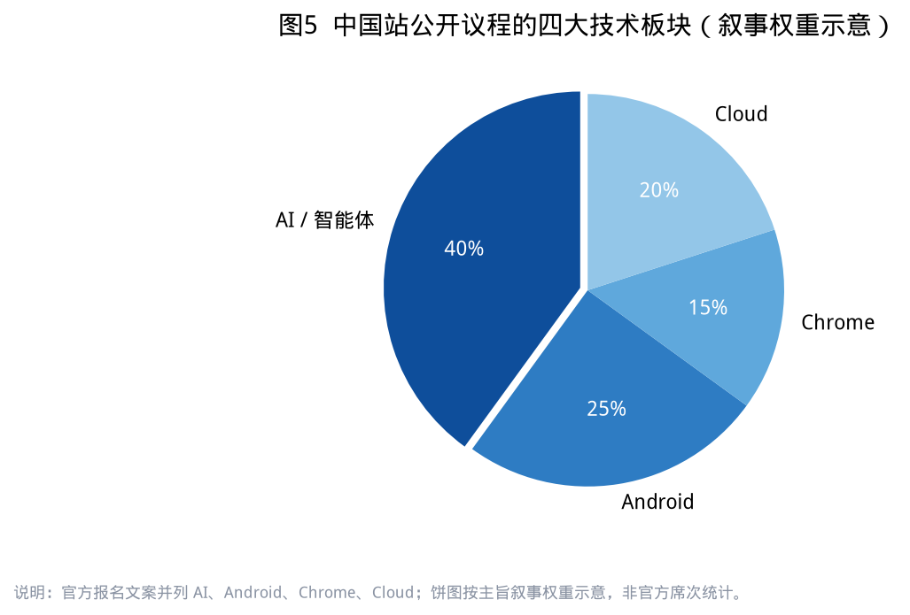

## 2.3 Android 展台：把全球设备生态带进世博中心

现场可核验的展台信息相对稀缺。一则 8 月 12 日发布于会场的 Android 展台记录，列出三个体验区，与 I/O 2026 的 Android 路线高度吻合：

1. **开发提效体验区**：把现有 AI 模型和智能体编码工具接入 Android Studio，服务全球化应用开发与出海提效；
2. **自适应与智能应用**：面向整个 Android 设备生态打造自适应、智能化应用，强调「量身定制的无缝体验服务全球用户」；
3. **XREAL Aura**：官方介绍为「首款搭载 Android XR 系统的有线眼镜」，融合无限空间画布、空间沉浸感与 Gemini 多模态辅助，面向海外用户。

这三块拼在一起，画出的不是「中国安卓手机市场」——Google Play 在中国大陆并不面向普通消费者——而是**中国团队服务全球 Android / XR 用户的生产现场**。世博中心在这两天里，功能上更接近一座临时的「出海操作系统实验室」。

## 2.4 同期嵌入：总决赛与入营确认

大会不是一个孤立的 48 小时。至少两条年度项目把高潮设计在同一周：

- **Gemma 4 开发者大赛全国总决赛**：4 月启动、6 月 13 日北上深三城半决赛、7 月 15 日公布入围，8 月在 I/O Connect China 现场路演颁奖（详见第五章）。
- **谷歌出海创业加速器 2026**：4 月 23 日开报、6 月 14 日截止、8 月上旬确认入营企业，9 月上旬开营（详见第四章）。

> **分析结论 2-1**：I/O Connect China 的真实产品形态是「发布会 + 筛选器 + 加冕礼」。会展空间因此不能按普通论坛配置：它需要 Demo 舞台、一对一辅导角落、加速器社交场，以及可让 15 支决赛团队过夜、改代码、见投资人的弹性住宿。

---

# 第三章 技术风向：智能体全栈如何被翻译到中国现场

## 3.1 从「会聊天的模型」到「会办事的智能体」

中国站黑板报把讨论对象明确为「智能体时代的技术、工具及开发者应用实践」。这与 5 月全球 I/O、与 7 月 WAIC 的语义迁移是同一条曲线：关键词从 Model 换成 Agent。

对开发者而言，差别是工程性的。模型回答问题；智能体要规划多步任务、调用工具、保持记忆、在端侧或云端之间路由，并且在失败时重试。Android 开发者博客在 I/O 2026 之后汇总的更新，几乎是一份智能体操作系统清单：

- **Gemini Nano 4（预览）**：通过 AICore 在设备端做原型；Gemma 4 作为最先进开源模型已发布。
- **ML Kit GenAI API** 增强，使 Nano 的生产化更稳定。
- **Firebase AI Logic 混合推理**：`PREFER_ON_DEVICE` / `PREFER_CLOUD` / `ONLY_ON_DEVICE` / `ONLY_CLOUD` 四种编排，开发者不必自写路由。
- **A2UI + Jetpack Compose 渲染器**：让智能体「表达 UI」，把 A2UI 消息渲染成原生组件。
- **Android ADK（实验）**：跨端云模型的多智能体工作流，管理编排、上下文与会话。
- **App Functions**：为「智能系统」预留应用可被智能体调用的接口。

把这份清单对照中国站 Android 展台，可以看出翻译策略：**不讲芯片与基准测试，讲 Android Studio 里能不能把智能体编码工具接进去，讲应用能不能自适应全球设备，讲 XR 眼镜能不能把 Gemini 带到海外用户脸上。**

## 3.2 Chrome 与 Cloud：浏览器成为智能体，云成为托管沙箱

皮查伊宣布 Gemini Spark 将于夏季晚些时候直接在 Chrome 中运行，成为「跨 Web 的智能体浏览器」。Chrome 出现在中国站四大板块里，因此不应理解为「浏览器内核分享」，而应理解为：**出海应用的获客、支付、内容审核与客服，将越来越多发生在可被智能体操作的网页环境里。**

Cloud 一侧，托管代理 API 的卖点是卸掉基础设施：推理、工具调用、代码执行发生在 Google 托管的远程环境，同时继承企业级隐私、治理与安全。对总部在中国、主体在海外的创业公司，这意味着「智能体运行时」可以放在其目标市场的合规云里，而不必把全部研发搬出国。

## 3.3 端云分工：对城市电力与户型的不同含义

第二号文稿强调 WAIC 展商结构里算力与机器人合计近半，对应高电力密度的数据中心和可进机器人的厂房。I/O Connect 给出的是另一条技术路径的并行：

| 路径 | 代表技术 | 空间含义 |
| --- | --- | --- |
| 云端智能体 | Spark、托管代理 API、TPU 8i 推理 | 资本开支与数据中心，发生在全球而非会场所在城市 |
| 端侧智能 | Gemma 4 2B/4B、Gemini Nano 4、仅设备端推理 | 算力走进手机、眼镜、树莓派、住宅网关 |
| 混合编排 | Firebase AI Logic 四种路由 | 楼宇弱电、隐私分区、本地缓存成为产品能力 |

> **分析结论 3-1**：上海不必因为承办 I/O Connect 就去竞赛「谁的智算中心更大」。这场大会的空间遗产更可能是：一批会用端云混合架构的出海团队把上海当作产品与人才基地，把重资本开支留在 Google 的全球云，把端侧体验留在目标市场的手机与 XR 设备上。对住房政策的启示是——**青年开发者租赁住房、可演示的社区场景、灵活的小型办公，比新建机房更贴近这条技术路线。**

## 3.4 Android XR：空间计算进入「可佩戴的房间」

XREAL Aura 被现场介绍为 Android XR 有线眼镜，强调「无限空间画布」与 Gemini 多模态辅助。空间计算一旦从实验室 Demo 变成可出海的消费电子，住房与办公的界面就会变化：一面实体墙可能同时是显示器、白板和智能体工作区；户型里的「书桌进深」与「无遮挡墙面」会比传统「几房几厅」更影响体验。本中心无意在此预测销量，只指出：**XR 若走出海消费电子路径，其第一批高强度用户正是大会现场的开发者与创客**——他们在上海的居住与办公条件，会成为产品迭代的非正式实验室。

---

# 第四章 出海接口：四大支柱、加速器与中文技术公共品

## 4.1 官方支柱的政策读法

黑板报把 Google「将本土创新与全球规模化连接」的机制写成四句话（图 6）：

1. **本土社区连接**
2. **技术导师指导**
3. **出海创业加速计划**
4. **本地化的中文技术文档**

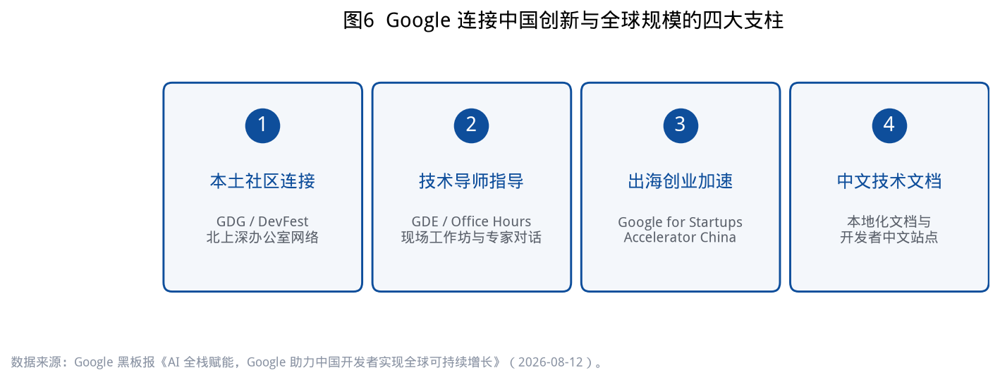

这不是公关并列，而是一套可对照公共品理论的结构：社区降低信息成本，导师降低试错成本，加速器降低出海的组织成本，中文文档降低技术采用的语言门槛。对一座城市来说，前三项都要落地为**可预约的物理空间与可重复的活动日历**；第四项则是数字公共品，但会改变谁愿意把研发中心放在中文环境里。

## 4.2 谷歌出海创业加速器 2026：与大会咬合的筛选器

Google for Startups Accelerator China（谷歌出海创业加速器）是全球加速器网络的中国组成部分，由 Google Information Technology (China) Co., Ltd. 运营，办公地址公开为北京海淀区中关村融科资讯中心 B 座。2026 年周期如下（图 9）：

| 节点 | 时间 |
| --- | --- |
| 报名开始 | 2026 年 4 月 23 日 |
| 报名结束 | 2026 年 6 月 14 日 |
| 线上面试及筛选 | 2026 年 5—7 月 |
| 确认入营企业 | 2026 年 8 月上旬 |
| 开营日 | 2026 年 9 月上旬 |
| 创业课程及一对一辅导 | 2026 年 9—12 月 |
| 线下展示日 | 2027 年 1 月或 3 月 |

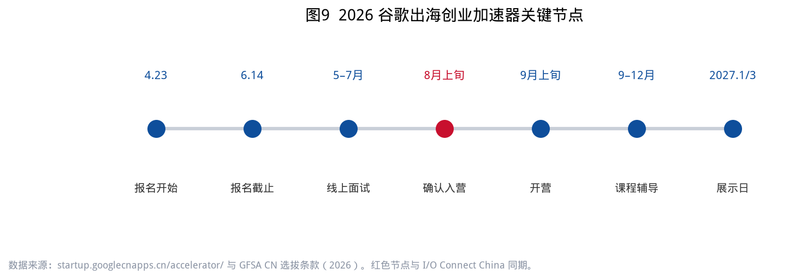

申请条件划出了清晰的企业画像：总部在中国大陆或香港；有出海需求或海外战略；已有推向市场的产品；已获种子到 A 轮融资；行业包括跨境电商、AI 公益、游戏、内容、工具、智能制造、SaaS、AI 应用、文娱、健身与户外等。法律条款进一步要求：**申请人须在中国大陆以外维持经营主体，且最终母公司在中国大陆或香港注册**——这是典型的「国内总部 + 海外运营实体」结构。

加速器卖点同样制度化为清单：三个月免费支持、不收费用与股权、全球课程的中国定制版、谷歌专家与海外导师一对一、VC 推介、闭门社交、校友网络。即使未入选，报名团队仍可能获邀参加营销、云服务、Google Play 与开源技术培训。

> **分析结论 4-1**：8 月上旬「确认入营」与 8 月 12—13 日大会重叠，意味着世博中心同时是技术发布会和加速器的「见面周」。对上海的招商与住房含义是：入营企业未必把法人迁到上海，但会在此后四个月高频往返北京课程、上海活动与海外市场。**短租式人才公寓、可接待跨境时差的办公角落，比传统三年起租的写字楼更匹配这一节奏。**

## 4.3 历史成绩单：中国开发者早已是 Play 生态的供给方

公开报道中的奖项数字，构成理解「出海」的定量背景（口径为各年新闻原述，不可直接纵向加总）：

- **2023 上海站**：陈俊廷称中国开发者在全球 23 个地区斩获 48 个 Google Play 年度最佳奖项（动点科技）。
- **2024 北京站**：陈俊廷称过去一年 25 个中国开发团队、31 款游戏和应用在全球不同地区斩获 50 个 Play 年度最佳（腾讯新闻）。
- 数字人才培养计划（2024 年报道口径）：与教育部合作，为 150 余所高校 560 余名教师开展线下培训，累计覆盖 4 万余名在校学生；开发者中文网站上线 Google AI 专页。

这些数字说明：Google 在中国没有消费级搜索与商店，但深度依赖中国团队向全球 Play 生态供货。上海承办连接站，本质是把「供给方城市」的身份年复一年地确认下来。

## 4.4 中文技术文档：被低估的空间因素

四大支柱把「本地化中文技术文档」与社区、导师、加速器并列，说明 Google 判断语言仍是采用门槛。对城市政策的推论是间接的：当文档、Codelab、AI Studio 与中文社区足够好，**研发团队可以留在中文城市，只把发行、支付与云区域放到海外**。这降低了「为了出海必须整体搬迁」的压力，却提高了对国内城市生活质量——住房可负担性、子女教育、社区 amenity——的要求。人才留沪还是留京、留深，比过去更取决于生活成本，而不是「能不能读到英文文档」。

---

# 第五章 社区与作品：Gemma 4 大赛、GDG 与「为真实而构建」

## 5.1 一场把总决赛嵌进大会的全国黑客松

Gemma 4 开发者大赛由 GDG China 发起，官方站点 hackathon.googdg.cn 写明：聚焦 Gemma 4，设四条赛道，经技术架构与社会影响评估选出 15—30 个高潜力项目，顶尖团队受邀在 Google I/O Connect 总决赛舞台演示。资源支持口径为最高 20 万美元级（含全体参赛团队共享的 2 万美元 Cloud Credit 奖池等）；半决赛于 6 月 13 日在北京、上海、深圳 Google 办公室同步举行。

赛程把社区动员拉成一个完整季度：

| 阶段 | 时间 |
| --- | --- |
| 启动报名、伙伴招募 | 4 月 18 日 |
| 五场在线工作坊 | 4 月 18 日—5 月 18 日 |
| 团队锁定（1—5 人，鼓励跨城） | 5 月 18 日 |
| 开放开发 + GDE Office Hours | 5 月 18 日—6 月 8 日 |
| 提交代码、5 分钟视频、技术报告、在线 Demo | 6 月 8 日 23:59 |
| 北上深半决赛 | 6 月 13 日 14:00—17:30 |
| 决赛名单公布 | 7 月 15 日 |
| 全国总决赛 | I/O Connect China 现场 |

核心约束只有两条：必须使用 Gemma 4（2B / 4B / 26B MoE / 31B Dense 等规格均可）；训练数据须披露并符合隐私法律。评审权重为：真实世界影响 30%、技术卓越 25%、完成度 20%、创新 15%、呈现质量 10%。**「真实世界影响」被放在第一位**，这与大会口号、与后续 DevFest 主题是同一套价值观。

## 5.2 15 支出线队伍：AI 正在进入住宅与公共服务

官网公布的入围名单（抓取于大赛站点公开页）如下。赛道与场景为课题组根据项目名称归纳（图 7、图 8），供观察「智能体进入了哪些房间」，不代表官方分类。

| 团队 | 项目 | 课题组场景标注 |
| --- | --- | --- |
| 地理空间智能 | GIS Data Agent | 地理空间 |
| 妙妙爱学习 | 时间规划小助手 | 教育 |
| 得法团队 | MedSchema Agent：基于 Gemma 4 的专病指标清洗与质控智能体 | 医疗 |
| 晓话AI | Munk AI | 通用助手 |
| OOtira Team | OOtira — Privacy-First AI Closet Copilot（端侧视觉） | 端侧隐私 |
| 躺平别动队 | 乐学 | 教育 |
| enactflow | attractor | 通用助手 |
| PandaaX | 守护犀 · EdgeMind | 端侧隐私 |
| SWL | iPot智能盆栽 | 生活硬件 |
| 妙手回春 | FirstAid Copilot | 医疗 |
| AI for HER | AI for HER | 社会向善 |
| AI向善 | 视频偏见智能检测与包容引导 | 社会向善 |
| Elva | Elva 老白 - 老人AI声导伴侣 | 养老 |
| KnifShield | SafeVoice Agent：老年人防诈语音智能体 | 养老 |
| TerraVineVox | VoxShield — AI 声纹守护者 | 养老 |

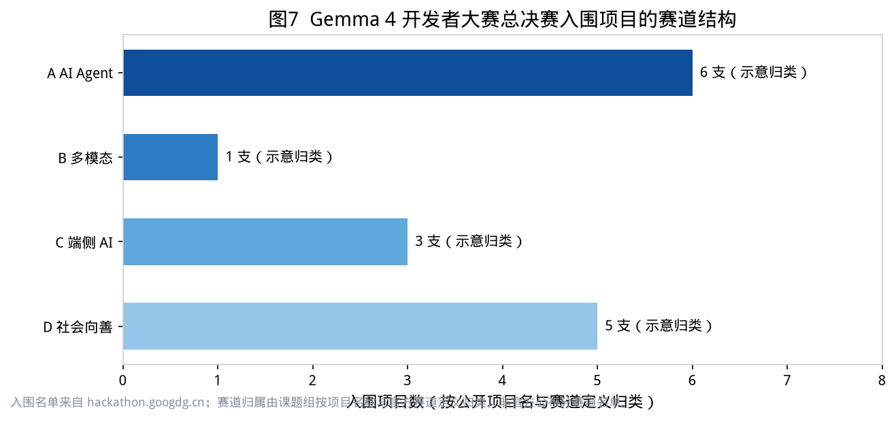

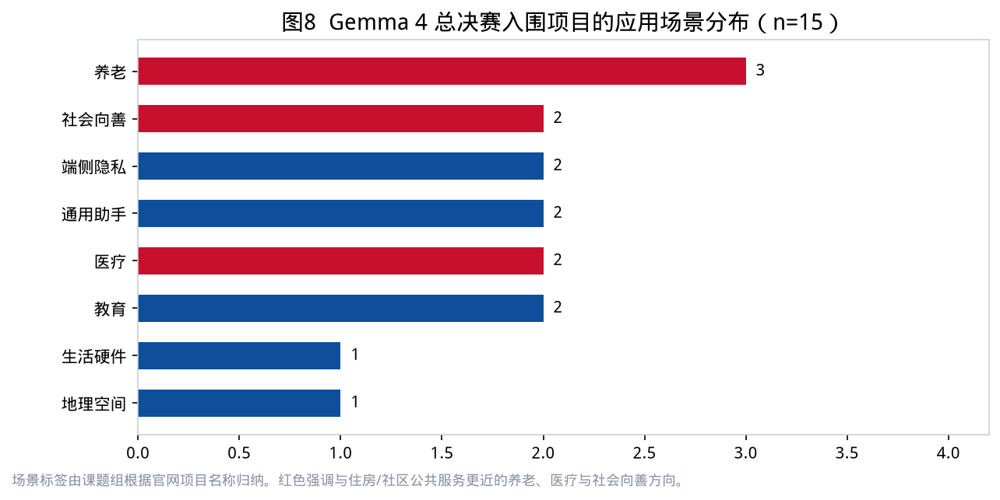

三点观察与住房政策直接相关：

1. **养老与防诈成为开源智能体的高频场景。** 「老白」声导伴侣、防诈语音智能体、声纹守护者，针对的是住宅内的老年人——他们是住房政策长期关注的群体，也是数字欺诈的高风险群体。智能体若要可用，必须适应嘈杂的客厅、方言、低带宽和子女异地照料，而不是展厅里的理想声学环境。
2. **急救与医疗质控指向社区卫生空间。** FirstAid Copilot 与专病指标清洗智能体，分别对应「家门口的黄金四分钟」和医疗机构数据治理。前者需要进入社区、学校和园区的急救点位，后者需要与医院信息化而不是与会展 Demo 对接。
3. **端侧隐私（衣橱副驾驶、EdgeMind）说明年轻开发者在主动规避云端上传。** 对住宅而言，这意味着更多推理发生在手机和本地设备，户内摄像头与麦克风的伦理、弱电和存储，将成为物业与社区治理的新议题。

> **分析结论 5-1**：开源端侧模型把 AI 的「最后一公里」从机房移到了户内。住房政策研究如果只跟踪数据中心选址，会错过 2026 年真正开始生长的那一层——**嵌入既有住宅和社区公共服务的小型智能体。**

## 5.3 GDG 上海与 11 月 DevFest：大会之后的城市常设层

Google Developer Groups（GDG）上海在其站点声明：GDG 是独立社区，言论与活动不得直接等同于 Google 公司。这一法律切割，反而凸显社区作为**城市内生公共品**的性质——它不随某一次大会撤展而消失。

公开信息显示：GDG 上海约有 1,017 名成员；即将到来的 Google DevFest 2026 Shanghai 主题为「Beyond the Model. Build for Real / 超越模型，为真实而构建」，时间在 11 月初，社区材料提到规模约 3,000 人（含约 20% 外籍开发者），并点名与新加坡、印度、日本等 GDG 联动。组织者背景覆盖携程、数据分析、移动端、AI 视觉与创业公司等。过往活动包括 Gemma 4 大赛半决赛上海站、Google Cloud Next 26 中文精选课、Build with AI 出海创业实战局。

DevFest 文案写得很硬：「过去一年我们听了很多关于世界模型和 AGI 的预言。但在上海，在 GDG，我们只关心一件事：Build for Real。今年会重点谈风险与韧性。」

> **分析结论 5-2**：I/O Connect 是年度峰值，GDG 是城市的基线容量。3,000 人规模、两成外籍的 DevFest，已经接近一场小型国际学术会议的住宿与翻译需求。上海若把开发者社区只当「活动执行外包」，就会系统性低估它对国际人才短居、夜间经济和文化包容性的贡献。

---

# 第六章 同城双截面：WAIC 与 I/O Connect 的分工

## 6.1 相隔 23 天的两场「世博」

2026 年 7 月 17—20 日，世界人工智能大会在上海举行，主会场同样包括世博中心。8 月 12—13 日，I/O Connect China 回到同一座建筑。对会展运营，这是档期管理；对城市研究，这是一次自然实验——**同一物理空间，在不到四周内先后承担「全球治理 + 产业博览」与「全球开发者接口」两种功能**（图 10）。

| 对照维度 | WAIC 2026 | I/O Connect China 2026 |
| --- | --- | --- |
| 时间 | 7 月 17—20 日 | 8 月 12—13 日 |
| 场馆 | 世博中心、世博展览馆、西岸、张江科学会堂 | 上海世博中心 |
| 公开规模 | 963 家参展商、175 场论坛 | 近 2,000 名开发者 |
| 主角 | 国家元首、科学家、产业资本、具身智能厂商 | 职业开发者、GDE、出海创业团队 |
| 技术主轴 | 具身智能、大模型落地、全球治理 | 智能体全栈、Android/Chrome/Cloud、出海工具链 |
| 空间需求 | 高电力密度展位、机器人步道、治理主论坛 | Demo 舞台、工作坊、一对一辅导、决赛路演 |
| 本中心文稿 | 第二号 | 第三号 |

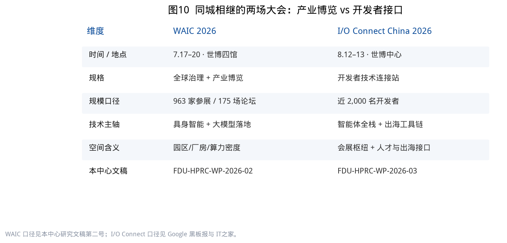

## 6.2 两条不可互相替代的路径

第二号文稿把中美欧 AI 路径概括为：美国守前沿模型与高端定价，欧洲做治理标准，中国以性价比、硬件/具身与产业空间供给形成组合优势。I/O Connect 并不推翻这一判断，它补充了**第四条并行管道**：中国团队使用全球（含 Google）工具链，向海外消费者与开发者市场供货。

因此，上海同时需要两类空间产品：

- **WAIC 型**：智算、中试、机器人友好楼宇、产业链园区——把「场景」留在国内。
- **I/O 型**：会展枢纽、加速器社交场、双语社区、灵活短租、跨境合规咨询集聚——把「接口」留在上海。

错配的表现会不一样。WAIC 型错配是厂房层高不够、电力接不上；I/O 型错配是酒店在 8 月中旬被会展峰值打满、青年开发者找不到可周租的床位、外籍社区成员缺乏夜间可停留的公共空间。

## 6.3 「硬件的 WAIC」与「软件接口的 I/O」并非零和

现场 Android XR 眼镜、端侧 Gemma 部署、智能盆栽等项目说明：I/O 路线同样碰到硬件。差别在于硬件的去向——WAIC 的具身智能更多指向工厂与园区，I/O 的硬件更多指向**全球消费电子与户内设备**。对浦东世博片区，这意味着会展之后的产业落地不应只对标张江芯片馆，也应对标可小批量试制、可国际物流、可做海外认证的消费电子中试空间。

> **分析结论 6-1**：把 WAIC 与 I/O Connect 写成「两个展」是会展日历的看法；写成「产业空间 + 开发者接口」才是城市战略的看法。上海的比较优势恰恰是二者可以共用世博、共用人才、共用国际航班，而不必迁就到两个城市。

---

# 第七章 城市空间含义：会展枢纽、人才住房与出海办公

## 7.1 世博片区：全球技术发布走廊

世博中心位于浦东新区世博大道 1500 号，周边是后博览时代持续再开发的滨江地带。2026 年夏季，这里在一个月内承接中国规格最高的人工智能治理会议，以及 Google 在中国最重要的开发者连接站。会展经济研究通常用过夜人天数和餐饮消费衡量冲击；本白皮书更关心**重复使用所形成的城市记忆**：国际技术社区开始把「八月的上海世博」写成固定坐标，如同把「五月的山景城」写成 I/O。

政策含义有三条：

1. **档期是城市资产。** 能够在 WAIC 之后三周再次接待全球开发者，说明场馆转换、安保、翻译、网络和交通的组织资本已经存在。继续把高质量技术会议排进世博，比另建一座「AI 会展城」更便宜。
2. **峰值住宿需要制度，而不是一次性调价。** 近 2,000 名开发者加工作坊讲师、决赛团队与加速器导师，会在 48 小时内推高滨江酒店价格。若没有可溢出到周租公寓、高校暑期宿舍和国际青年社区的机制，成本会转嫁到最年轻、最没有差旅预算的参会者身上——而他们正是社区和黑客松的主体。
3. **展后空间应保留「可演示性」。** 智能体全流程工作坊依赖稳定网络、可投影墙面和可分隔的小组房间。把世博周边的存量楼宇按「可举办 50—150 人技术工作坊」改造，比按传统零售招商品质更高、空置风险更低。

## 7.2 人才住房：开发者不是均质的「青年白领」

大会与社区露出的人才结构至少有四层，住房需求并不相同：

| 群体 | 出现场景 | 居住特征（研究推断） |
| --- | --- | --- |
| 职业开发者 / 创客 | 两日大会 | 本地通勤或一晚酒店；对价格敏感 |
| 黑客松决赛团队 | 路演前后加长停留 | 需要能改代码的桌面、深夜餐饮、3—7 天灵活住宿 |
| 加速器入营企业创始人 | 8 月确认、9—12 月课程 | 北上深与海外多城往返；要周租而非年租 |
| 外籍 GDG / DevFest 参与者 | 11 月约两成外籍 | 短居、英语/日语友好、支付与门禁无摩擦 |

上海既有的人才公寓、保障性租赁住房多按「签订劳动合同 + 社保缴纳」设计，恰好覆盖不到黑客松跨城组队、加速器短期驻留、社区志愿者这三类人。他们不构成传统意义上的「引进人才」，却构成城市创新密度的可见部分。

> **分析结论 7-1**：建议在世博、五角场/大创智、张江各试点一类「技术活动友好型」短租产品——7—30 天、可开票、有公共工位、不强制社保——专门对接大会、DevFest、加速器 Bootcamp。这不是放松住房保障资格，而是补上会展型创新城市缺失的那一档。

## 7.3 出海办公：双注册企业的空间脚注

加速器法律条款把「海外经营主体 + 中国/香港母公司」写成准入条件。这类企业的空间需求是分裂的：产品与设计在国内时区完成，发行、广告、客服与合规在目标市场的云与法人实体上完成。它们对上海的价值不是把税收全部留在浦东，而是把**高技能岗位、培训活动和国际网络**留在上海。

对应的办公产品应当是：

- 小面积、短租期、可扩可缩的工位，而不是 1,000 平方米起租的总部楼；
- 可支持晚间与海外团队开会的隔音舱（时差是刚需）；
- 邻近会展与机场，而不是只邻近本地客户；
- 能够同时容纳「中文文档环境」与「英文发行环境」的混合团队。

第二号文稿讨论过杨浦大创智等园区的「AI 原生」改造。本号补充：面向出海开发者的楼宇，评价标准应增加「国际支付与法务服务密度」「短租工位供给」「活动空间周转率」，而不是只看算力插座。

## 7.4 社区智能体：住宅与公共服务的新界面

第五章的入围项目已经把场景写进了住宅：老人声导、防诈、急救、教育规划、衣橱与盆栽。这要求住房政策提前回答几个具体问题，而不是等待产品普及后再补课：

1. **既有住宅的弱电与隐私。** 端侧模型降低了云端上传，但麦克风、摄像头和网关仍在户内。老旧小区改造是否预留局部推理网关的位置与供电？物业公约如何界定公共区域录音？
2. **适老化不是「加装屏幕」。** 声导伴侣和防诈智能体依赖自然语音，对户型的要求是降噪、简易唤醒和与子女远程协同，而不是再放一台平板。
3. **社区空间作为测试场。** 街道养老服务中心、社区卫生服务站、学校可以成为 Gemma 类开源应用的合规测试场，避免所有 Demo 只能在世博中心的理想环境里发生。
4. **XR 与户型。** 若 Android XR 眼镜进入出海消费电子，国内开发者家庭将成为非正式实验室；书桌墙面、层高与无障碍走动空间会进入「适研居」讨论。

## 7.5 北上深三城：上海的角色是主场，不是唯一栖息地

Gemma 半决赛在北京、上海、深圳 Google 办公室同步举行，加速器运营主体在北京。上海的独特之处是**主场会展 + 半决赛 + 大型社区 DevFest** 三者叠加（图 11）。竞争策略不应当是把 Google 中国总部「抢」到上海——公开信息显示其主要运营仍在北京——而应当是把「每年八月的连接站」和「每年秋冬的 DevFest」做成不可迁移的城市品牌。

对长三角其他城市，分工同样清楚：杭州、苏州、南京的团队可以继续把研发放在本地园区，把「见 Google 专家、见出海导师、见国际社区」的动作放到上海完成。这与航空枢纽的逻辑相同：不是所有航班都从上海起飞，但关键中转发生在这里。

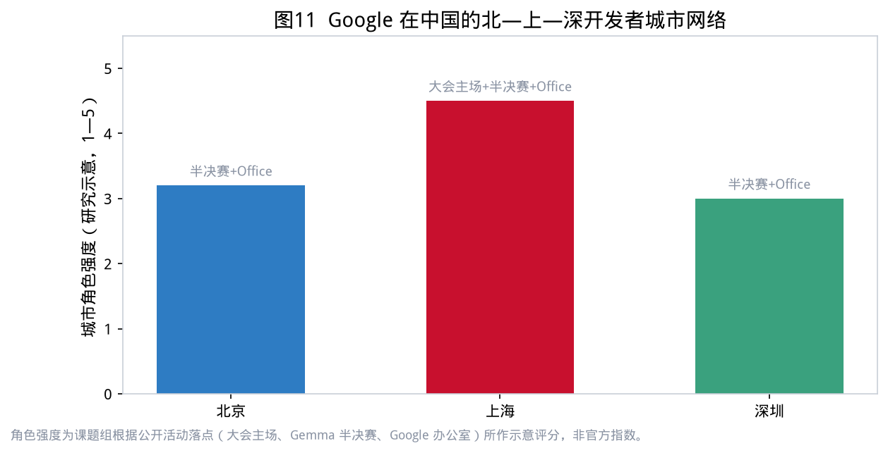

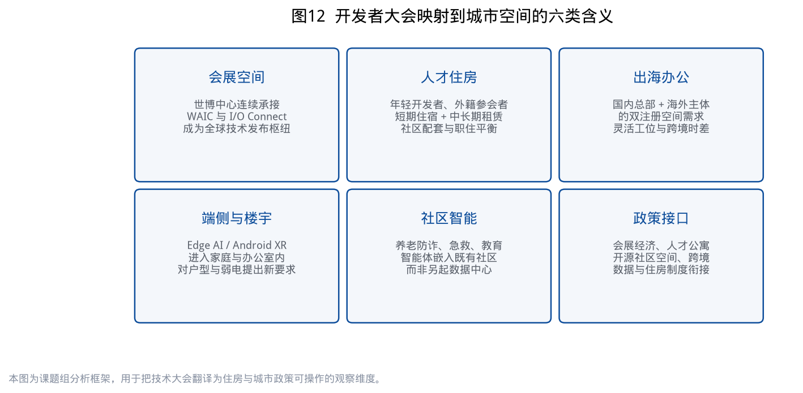

---

# 第八章 展望与建议

## 8.1 三个展望

**展望一：智能体工作流会在 12 个月内成为出海应用的默认架构。** Gemini 3.5、Antigravity、Android ADK、托管代理 API 与 Chrome 智能体浏览器，已经从演讲词变成可下载的工具。2027 年的 I/O Connect 若仍停留在「介绍什么是 Agent」，就会落后于开发者。城市侧应假设：到明年夏季，来沪参会者带来的 Demo 会更多占用真实社区场景，而不是只占用投影幕。

**展望二：开源端侧将继续把创新推向住房与公共服务。** Gemma 4 的 2B/4B 级模型以真机演示为半决赛门槛，已经筛选出一批「能在没网的地方跑」的团队。适老化、防诈、急救、教育是他们自愿选择的战场。公共部门若能提供合规数据沙盒和社区试点，上海有机会形成与 WAIC 具身智能并行的「社区智能体」品牌。

**展望三：会展日历将决定人才日历。** WAIC（7 月）→ I/O Connect（8 月）→ 加速器开营（9 月）→ DevFest（11 月）已经构成一条可预期的链（图 2）。这条链上的住房、交通、志愿者和翻译服务，应当按「季度产品」而不是「单个展会」来设计。

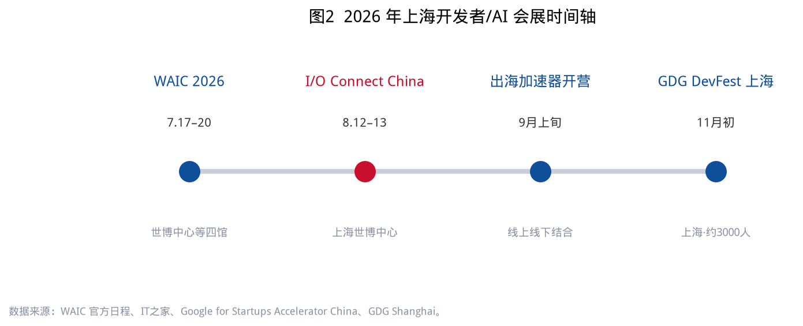

## 8.2 对上海市与浦东的六条建议

1. **把世博片区明确为「全球技术发布走廊」。** 在会展专项规划中单列 AI / 开发者类国际会议的档期保护、网络冗余和双语导视，避免与消费展简单混排。
2. **试点技术活动友好型短租。** 在世博、大创智、张江各拿出一批 7—30 天床位与工位，对接大会、黑客松和加速器，允许社区主办方团订。
3. **为 GDG 类独立社区提供常设空间，而不是一次性场租补贴。** 1,000 人量级、含外籍成员的社区，需要可周末使用、可做 Workshop 的固定房间。这比再办一场政府论坛更接近「本土社区连接」这一支柱。
4. **开放社区场景给开源智能体合规试点。** 优先养老服务中心、社区卫生站、学校安全教育，设立数据最小化与知情同意标准，让「Build for Real」有真实的 Real。
5. **出海楼宇的评估指标增加「接口密度」。** 短租工位、隔音舱、国际法务/支付服务、活动周转率，应与租金、空置率一并披露，供园区招商使用。
6. **与北京、深圳错位，而不是复制总部。** 上海巩固主场会展与国际社区，北京巩固政策与加速器运营，深圳巩固硬件与端侧。三城网络已经存在于 Google 自己的半决赛地图里，城市政策只需承认它。

## 8.3 对本中心后续研究的安排

本号文稿受公开信息所限，未能获得分会场签到、开发者来源城市、住宿选择等微观数据。建议后续：

- 在 11 月 DevFest 期间做小样本参会者职住调查，补上「开发者住在哪」的实证；
- 将加速器校友企业的注册地、办公地、海外主体地做成空间轨迹，验证「上海是接口还是栖息地」；
- 跟踪社区智能体在养老与防诈场景的落地障碍，形成对既有住宅改造标准的技术附录。

这些工作将与第二号文稿的园区实证、商务楼宇观察一并，构成中心在「AI × 城市空间」方向上的连续证据链。

---

# 附录 数据来源、方法说明与图表索引

## A. 主要公开来源

1. Google 黑板报，《AI 全栈赋能，Google 助力中国开发者实现全球可持续增长》，2026-08-12，https://china.googleblog.com/2026/08/ai-google.html
2. IT之家，《2026 Google 开发者大会 8 月在上海举行，现已开启报名》，2026-07-14，https://www.ithome.com/0/976/554.htm
3. Google for Developers，I/O Connect China 条目（August 12-13 / Shanghai），https://developers.google.com/
4. Sundar Pichai，*I/O 2026: Welcome to the agentic Gemini era*，2026-05-19，https://blog.google/innovation-and-ai/sundar-pichai-io-2026/
5. Android 开发者博客（中文转载），《Google I/O ’26：Android AI 更新，助力构建智能体验》
6. Google Cloud，《2026 Google I/O：Google Cloud 重点精华》（繁体中文）
7. Gemma 4 Hackathon 官网，https://hackathon.googdg.cn/
8. GDG 上海 / GitHub：gdgshanghai/Gemma4-Hackathon-ShangHai
9. Google for Startups Accelerator China，https://startup.googlecnapps.cn/accelerator/
10. GFSA CN Selection Terms（PDF，2026）
11. GDG Shanghai，Google DevFest 2026 Shanghai 活动页
12. 动点科技，2023 Google I/O Connect 上海报道
13. 腾讯新闻，2024 Google I/O Connect 北京报道
14. 现场 Android 展台公开记录（XREAL Aura / Android Studio / 自适应应用，2026-08-12）
15. 本中心研究文稿第二号：《WAIC2026 人工智能产业空间白皮书》（FDU-HPRC-WP-2026-02）

## B. 方法说明

- **规模数字**：仅采用官方或一线媒体转述的官方口径。「近 2,000 名开发者」来自 Google 黑板报；不采用 10times 等目录网站的未核实估数。
- **Gemma 入围项目分类**：以官网公开的团队名与项目名为准；赛道与场景由课题组归纳，可能与现场实际参赛赛道不完全一致。
- **示意性图表**：图 5 的板块权重、图 11 的城市角色强度，均在图注中标明为研究示意，避免被误读为官方统计。
- **空间含义章节**：属于政策分析，不是对 Google 或任何企业选址的预测。

## C. 图表索引

| 编号 | 文件 | 内容 |
| --- | --- | --- |
| 图1 | `assets/charts/chart01_history.png` | I/O Connect China 2023—2026 举办地 |
| 图2 | `assets/charts/chart02_calendar.png` | 2026 年上海开发者/AI 会展时间轴 |
| 图3 | `assets/charts/chart03_io_metrics.png` | I/O 2026 主旨演讲关键规模指标 |
| 图4 | `assets/charts/chart04_fullstack.png` | Google 全栈 AI 架构 |
| 图5 | `assets/charts/chart05_tracks.png` | 中国站四大技术板块（叙事权重示意） |
| 图6 | `assets/charts/chart06_pillars.png` | 连接中国创新与全球规模的四大支柱 |
| 图7 | `assets/charts/chart07_gemma_tracks.png` | Gemma 4 入围项目赛道结构 |
| 图8 | `assets/charts/chart08_gemma_scenes.png` | Gemma 4 入围项目应用场景 |
| 图9 | `assets/charts/chart09_accelerator.png` | 2026 出海创业加速器关键节点 |
| 图10 | `assets/charts/chart10_waic_compare.png` | WAIC 与 I/O Connect 对照 |
| 图11 | `assets/charts/chart11_three_cities.png` | 北—上—深开发者城市网络 |
| 图12 | `assets/charts/chart12_space_framework.png` | 大会映射到城市空间的六类含义 |

## D. 免责声明

本文稿为学术研究与政策讨论性质，不代表复旦大学或 Google 的官方立场，不构成投资、采购或参会建议。文中产品名称、奖项与计划以各权利人官方披露为准；若官方后续勘误，以勘误后的口径为准。

---

复旦大学住房政策研究中心　·　FDU-HPRC-WP-2026-03　·　二〇二六年八月

