
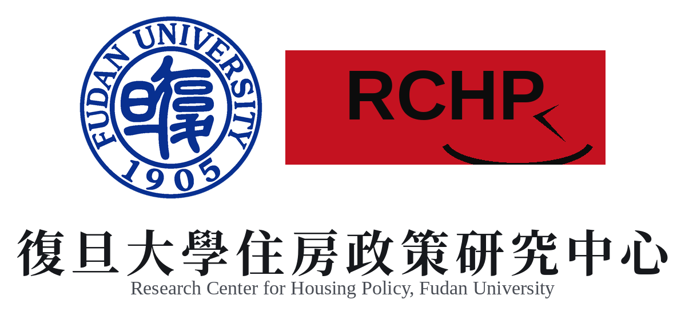

# WAIC2026 人工智能产业空间白皮书

**编制单位**：复旦大学住房政策研究中心（Housing Policy Research Center, Fudan University）

**文稿系列**：中心研究文稿 · 第二号

**文稿编号**：FDU-HPRC-WP-2026-02

**成稿日期**：2026 年 8 月

---

## 编制说明

本白皮书为复旦大学住房政策研究中心研究文稿系列的**第二号文稿**（编号 FDU-HPRC-WP-2026-02）。文稿以 2026 世界人工智能大会（WAIC 2026，2026 年 7 月 17—20 日，上海）的全量资源整合总表为基础数据源，覆盖 963 家参展商、175 场论坛、4262 家跨展会品牌库与 56 条官方演讲记录；同时引入 XSCT Bench（xsct.ai）大模型评测榜单与观猹（watcha.cn）AI 产品社区两组外部数据（均于 2026 年 8 月抓取），对人工智能产业的市场环境、竞争格局与青年用户偏好进行交叉验证。第八章园区实证部分交叉使用本中心《上海商务楼宇与产业园区市场报告·杨浦区》样本口径。除另有注明外，本文所有图表均由课题组基于上述数据自行绘制。

---

## 摘要

2026 年是人工智能从"模型竞赛"转向"空间落地"的分水岭之年。本白皮书基于 WAIC 2026 的一手产业数据，得出以下核心判断：

**其一，AI 产业的重心已从算法软件转向"硬件 + 场景"。** 963 家参展商中，机器人与智能硬件（24.2%）和算力·芯片·基础设施（23.5%）两大硬科技板块合计占比 47.7%，接近半壁江山；具身智能/人形机器人以 93 家成为第一大细分领域，AI Agent/智能应用以 87 家紧随其后——"一硬一软"两个爆发点均指向物理世界与真实场景。

**其二，国产大模型完成了从"追赶"到"并跑且更便宜"的格局重塑。** XSCT Bench 综合榜前 20 名中国产模型占 13 席，榜首为国产模型；国产与海外 Top10 平均分差距收敛至 1 分以内，而平均输出定价仅为海外的约四分之一。行业竞争逻辑已经从"谁更聪明"转变为"同样聪明，谁更便宜"。

**其三，AI 消费呈现鲜明的"年轻化、伙伴化、生活化"特征。** 观猹社区热门产品中，效率工具与通用助手合计占三分之一强，但真正的增量在"AI 搭子"、情绪陪伴、玄学决策、表情包创作等新兴形态——年轻人正在把 AI 从工具驯化为生活伙伴。

**其四，产业空间正在成为 AI 竞争的新变量。** 从世博展馆的场景化展区，到张江、西岸、复兴岛的载体竞赛，AI 对楼宇、园区与办公空间提出了"算力密度、场景开放度、空间柔性"的全新要求。白皮书最后一章提出"AI 原生园区"的定位框架与未来办公新范式，并以杨浦大创智等示范板块作实证补充。

**其五，中美欧已走出三条不可互换的产业路径。** 美国守前沿模型与高端定价，欧洲以治理标准见长，中国以性价比、硬件/具身与产业空间供给形成组合优势——这决定了园区与办公空间在中国 AI 战略中的权重，远高于硅谷"云端总部"模式。

**关键词**：WAIC 2026；人工智能产业空间；大模型竞争格局；具身智能；AI 原生园区；未来办公

---

## 目录

- 第一章 发展背景与宏观趋势
- 第二章 WAIC 2026 全景扫描：产业结构与空间集聚
- 第三章 论坛议题与技术风向
- 第四章 大模型市场环境与竞争格局
- 第五章 青年视角：AI 产品消费观察
- 第六章 具身智能与产业空间：典型案例与场景构想
- 第七章 面向 2026 年的展望与建议
- 第八章 AI 时代产业园区与未来办公新范式
- 附录 数据来源与图表索引

---

# 第一章 发展背景与宏观趋势

## 1.1 全球人工智能进入"治理与落地并重"的新阶段

2026 世界人工智能大会暨人工智能全球治理高级别会议于 7 月 17 日在上海世博中心开幕。国家主席习近平出席开幕式并发表主旨讲话，提出"携手构建公正合理的全球人工智能治理体系"；大会期间，《世界人工智能合作组织协定》完成签署，哈萨克斯坦总统托卡耶夫、柬埔寨首相洪玛奈、泰国总理阿努廷与联合国秘书长古特雷斯出席致辞。人工智能第一次以"全球治理议题"的规格进入多边外交主舞台，标志着行业发展从"技术竞速"阶段进入"治理与落地并重"阶段。

学术阵容同样空前：2024 图灵奖得主理查德·萨顿（Richard Sutton）提出"经验时代——AI 从人类数据走向经验驱动"；图灵奖得主约书亚·本吉奥（Yoshua Bengio）阐述联合国 AI 治理框架与智能体安全；姚期智、约翰·霍普克罗夫特（John Hopcroft）、2025 图灵奖得主吉尔·布拉萨德（Gilles Brassard）与 2025 诺贝尔化学奖得主奥马尔·亚吉（Omar M. Yaghi）先后登台。可以说，WAIC 2026 提供了一个观察全球 AI 产业最完整的截面。

## 1.2 国内外产业格局：从"单极引领"到"双梯队竞合"

综合大会数据与第三方评测，本白皮书认为全球 AI 产业格局正在发生三点结构性变化：

**（1）模型能力：中美第一梯队并跑，差距收敛到统计噪音级。** XSCT Bench 综合榜显示，榜首为国产模型 doubao-seed-2-1-pro（90.7 分），Claude Sonnet 4.6（90.3 分）与 GPT-5.5（89.4 分）紧随其后；国产与海外 Top10 平均分之差已缩窄至 0.6 分（详见第四章）。

**（2）商业模式：海外守高端定价，国产打性价比。** Claude Opus 4.6 输出定价 25 美元/百万 token，而同能力档位的国产模型普遍在 0.3—3 美元区间；DeepSeek V4 Flash 以约 0.28 美元/百万 token 的输出价直接压低了第二梯队的价格天花板。

**（3）落地路径：中国以"场景 + 硬件"换道超车。** 963 家参展商中具身智能、工业机器人、智能算力等"重资产、重场景"领域占比近半，而这恰恰是最依赖产业空间、供应链与制造能力的赛道——中国的园区体系、制造基础和超大规模场景由此转化为结构性优势。

把上述三点放到中美欧三条路径上对照（图 22），可以看得更清楚：美国在前沿模型上仍占先手，欧洲把治理标准做成了产业门槛，中国则在性价比、硬件/具身、场景落地和产业空间供给上形成组合优势。三条路径并不互相替代，但会决定企业选址、资本配置和园区产品形态。

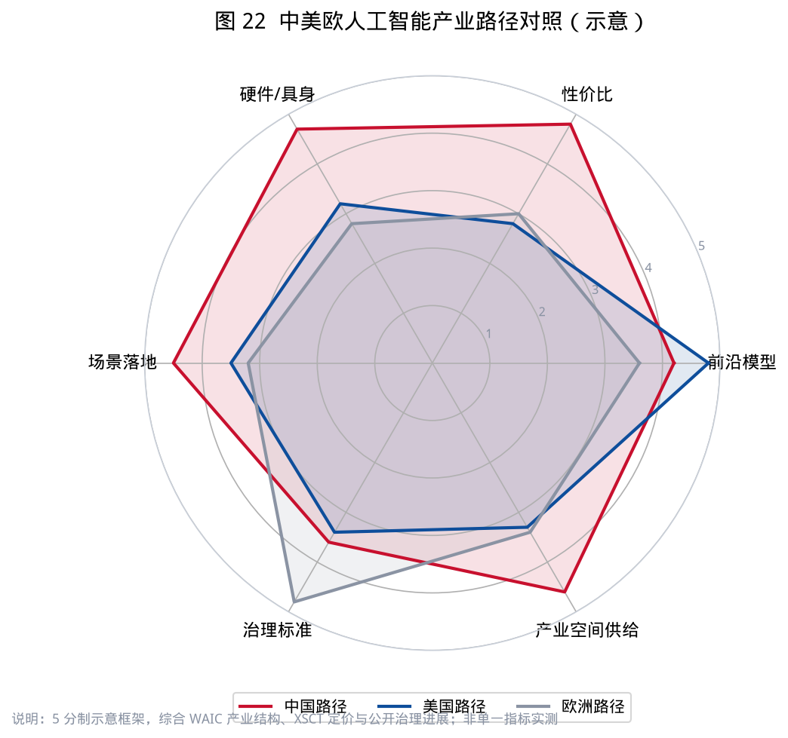

| 对照维度 | 中国路径 | 美国路径 | 欧洲路径 |
| --- | --- | --- | --- |
| 竞争焦点 | 场景 + 硬件 + 性价比 | 前沿模型 + 云生态 | 治理、标准与合规 |
| 代表场域 | WAIC（落地与治理并重） | GTC / OpenAI DevDay | EU AI Act 与监管沙盒 |
| 模型定价 | 低价放量（均价约 1.4 美元/M） | 高端溢价（15–25 美元/M） | 合规成本内部化 |
| 产业结构切片 | 硬科技占 WAIC 展商 47.7% | 软件/云服务主导 | 应用谨慎、工业软件见长 |
| 空间形态 | 产业园区 / 智算中心 / 机器人友好楼宇 | 云园区与总部校园 | 创新区 + 监管沙盒 |
| 对园区的含义 | 空间是生产要素 | 空间是品牌与人才容器 | 空间是合规试验场 |

> **分析结论 1-1**：中国 AI 的"换道超车"并不发生在实验室，而发生在园区、产线和街区。把产业空间仅仅理解为房地产，会系统性低估中国路径的竞争力来源。

## 1.3 国内四极分工：上海均衡、北京算力、广东硬件、浙江机器人

同一条中国路径内部，也并非铁板一块。按 WAIC 参展商注册地切分（图 16）：上海 275 家在机器人、算力、大模型三线几乎等量齐观，是全国唯一的"均衡极"；北京 193 家以算力芯片为第一赛道，契合首都的政策、资本与智算布局；广东 141 家机器人 50 家、算力 46 家，大模型仅 9 家，鲜明的"制造—硬件"结构；浙江 97 家中机器人独占 40 家，杭州人形与工业机器人集群已经从消费电子外溢到具身智能。

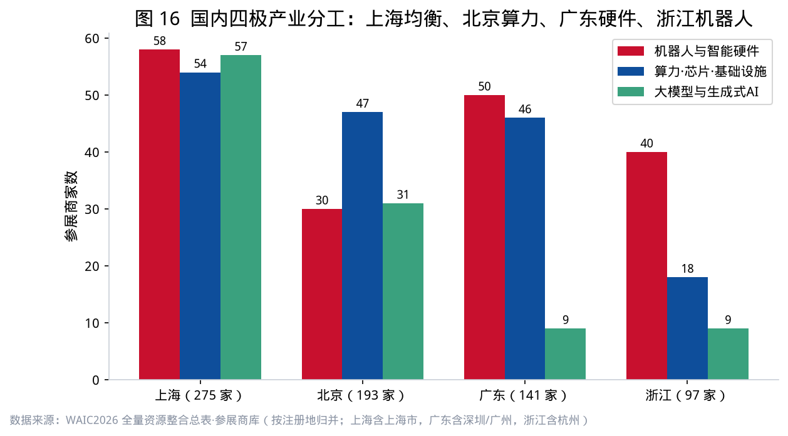

> **分析结论 1-2**：AI 招商不能全国一套话术。上海适合"模型—硬件—场景"闭环型园区，北京适合智算与总部型楼宇，粤浙适合机器人中试与零部件供应链园区。错配空间产品，会直接表现为空置与租金倒挂。

## 1.4 AI 与产业空间融合：本白皮书的核心命题

过去十年，AI 主要发生在"云端"；从 2026 年开始，AI 大规模走进"房间"——工厂产线、便利店、药房、酒店洗衣房、写字楼与产业园区。当模型能力趋同、价格战抹平算法溢价之后，**场景的获取能力与空间的承载能力将成为下一阶段竞争的稀缺要素**。这正是住房政策与城市空间研究机构介入 AI 产业研究的逻辑起点：产业空间（园区、楼宇、社区商业）既是 AI 的"用户"，也是 AI 的"跑道"。本白皮书前七章聚焦 WAIC 所呈现的 AI 产业本体，第八章回到产业空间与未来办公的研究本位，形成闭环。

---

# 第二章 WAIC 2026 全景扫描：产业结构与空间集聚

## 2.1 大会核心数据

| 指标 | 数量 | 说明 |
| --- | --- | --- |
| 参展商 | 963 家 | 覆盖 8 大类、39 个细分领域 |
| 论坛 | 175 场 | 13 个赛道，4 天，7 类场馆 |
| 跨展会品牌库 | 4262 家 | 含 11 个关联展会名录去重整合 |
| 联系人资源 | 3463 人 | 其中有效邮箱 2786 人 |
| 官方演讲视频 | 56 条 | 含开幕式及主论坛全程 |
| 展览场馆 | 4 处 | 世博中心、世博展览馆、西岸国际会展中心、张江科学会堂 |

数据来源：WAIC2026 全量资源整合总表·数据总览。

## 2.2 行业结构：硬科技占半壁江山

按八大类统计，机器人与智能硬件（233 家，24.2%）与算力·芯片·基础设施（226 家，23.5%）分列前两位，合计 47.7%；大模型与生成式 AI 以 137 家（14.2%）位列第三（图 1）。

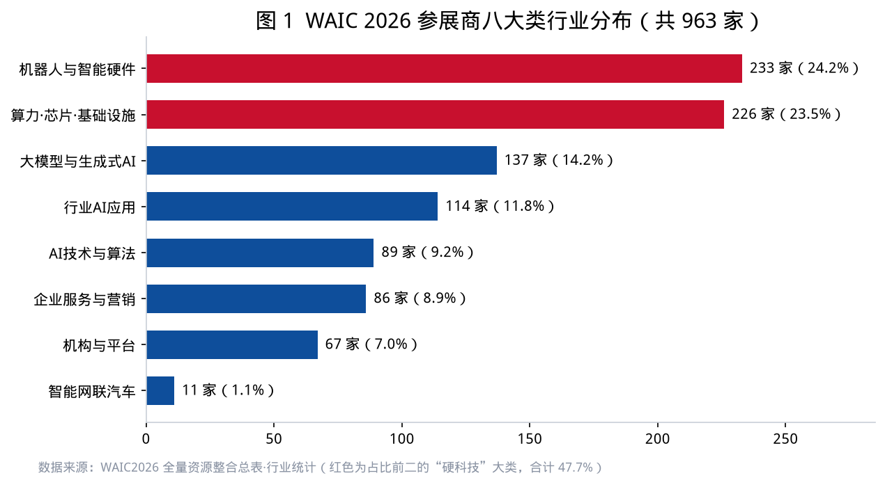

进一步下钻到 39 个细分领域（图 2），可以发现两个"9 字头"的爆发点：**具身智能/人形机器人（93 家，9.7%）**与 **AI Agent/智能应用（87 家，9.0%）**。值得注意的对照是：AI 基础大模型仅 20 家参展——基础模型层已经完成洗牌与收敛，产业的增量正在向"模型之上的应用"与"模型之下的硬件"两端迁移。

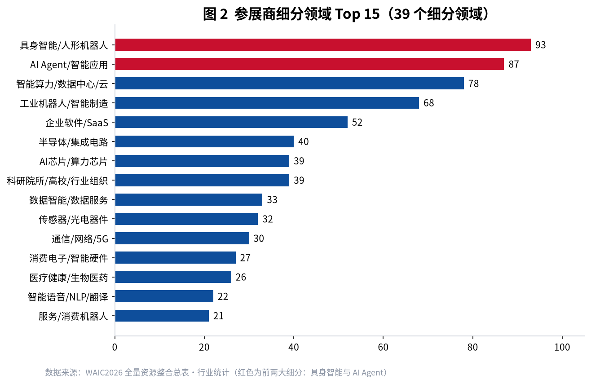

> **分析结论 2-1**：AI 产业呈"哑铃型"演化——上游算力芯片与下游具身场景两端加厚，中间的基础模型层收敛为少数寡头。产业空间的需求也随之分化：上游要"高电力密度的数据中心与洁净厂房"，下游要"可进机器人、可开放场景的楼宇与园区"。

## 2.3 空间集聚：沪京双核与长三角走廊

按注册地统计（图 5），上海（271 家，28.1%）与北京（189 家，19.6%）构成"双核"，合计占比 47.8%；上海、江苏、浙江三地合计 397 家（41.2%），长三角已形成全国最密的 AI 企业走廊；广东（含深圳）以 134 家位列第三极。

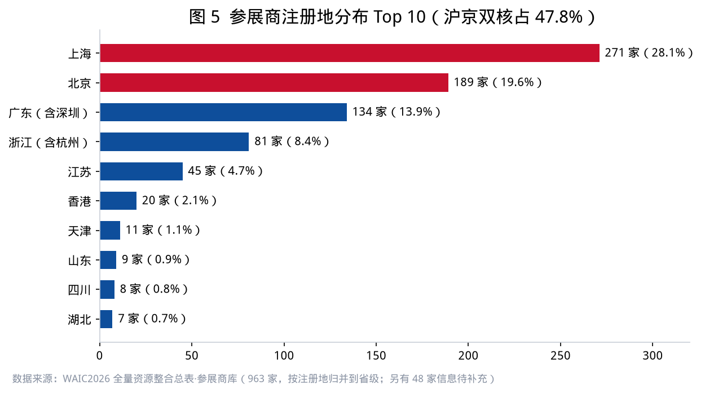

> **分析结论 2-2**：AI 产业的区位选择高度追随"算力 + 资本 + 场景 + 人才"的复合密度，而非单一成本要素。这解释了为什么 AI 企业集聚呈现出比互联网时代更强的中心城市黏性——也意味着核心城市产业园区在 AI 时代具有再定价空间。

## 2.4 资本结构：已上市与早期并存的"哑铃"

963 家参展商中，已上市公司 188 家（19.5%），天使/种子轮与 A 轮系列合计 157 家（16.3%），呈现明显的两端厚、中间薄结构（图 6）。头部公司完成证券化的同时，大量早期公司借助大会寻找场景与订单——WAIC 事实上承担了"产业空间招商对接平台"的功能。

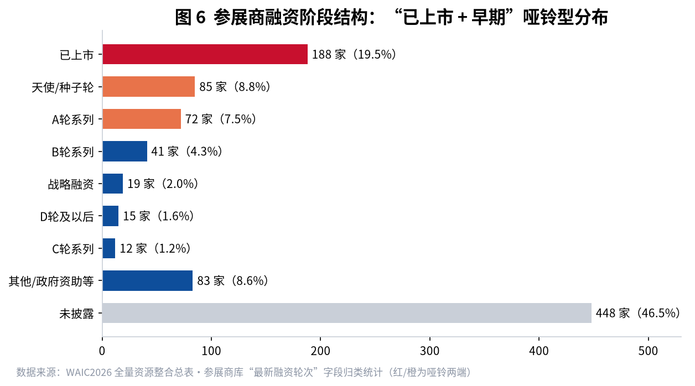

## 2.5 展馆分区即产业地图

大会的物理分区本身就是一份"AI 产业空间样本"（图 15、图 21）：世博展览馆承接 733 家（76.1%），内部再按展位号切分为 H1 大模型/Agent（150 家）、H2 算力基建（98 家）、H3 具身智能（162 家）、H4 创新创投（301 家）；张江科学会堂 114 家中 80 家属于算力·芯片·基础设施，几乎是一座"移动的芯片馆"；西岸 63 家以大模型与终端体验见长；世博中心 52 家中机构与平台占 15 家，对应主论坛与治理发布的制度型空间。

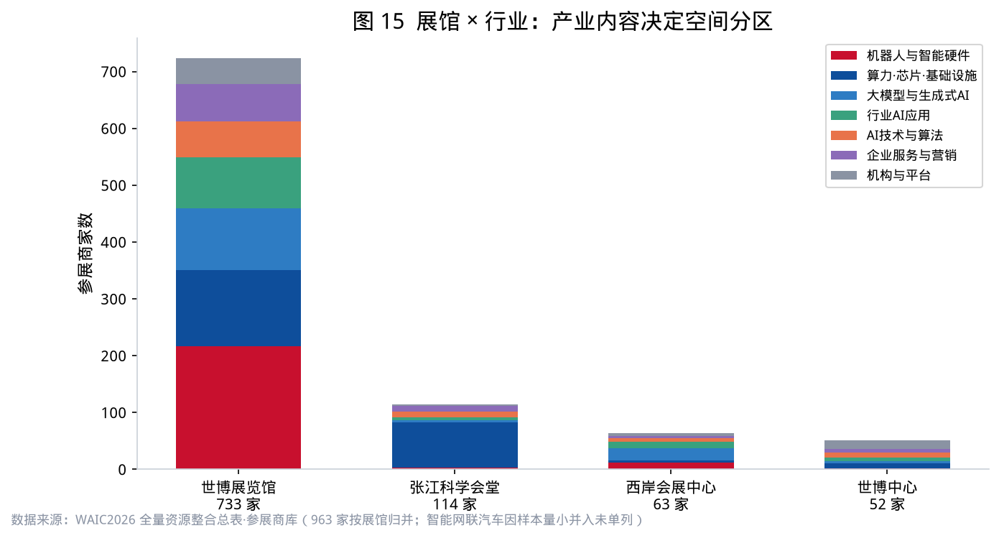

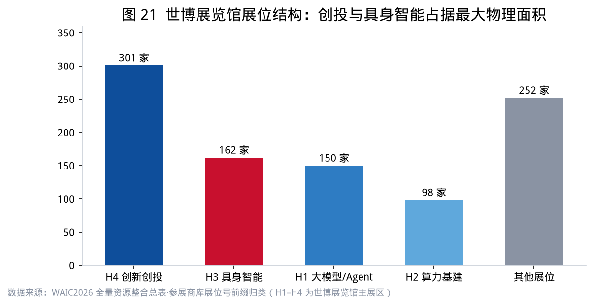

> **分析结论 2-3**：技术板块与城市空间板块已经一一映射——张江=底座，西岸=体验，世博=首发与治理。园区规划若仍按"综合楼宇"均质供给，就会与企业的空间需求错位。

## 2.6 垂直应用：医疗领先，物流与农业仍是空白带

行业 AI 应用共 114 家（图 17）。医疗健康/生物医药 26 家居首，能源/工业 18 家、金融与智慧城市各 15 家构成第二梯队；物流/供应链仅 4 家、农业/食品仅 5 家。与第六章具身智能"最卷工业物流"形成对照：本体企业扎堆演示仓储分拣，但行业应用层的物流软件与农业智能仍薄——**硬件场景热、行业软件冷**，中间存在可被园区补齐的系统集成空白。

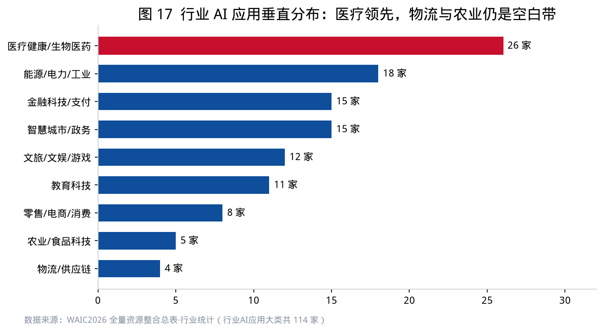

## 2.7 跨展会外延：AI 已经长到了供应链深处

品牌主库 4262 家并非都来自 WAIC。跨展会名录（图 18）显示，无人机、物流装备、传感器、小电机磁性材料、工业博览会等硬件展的名录体量，甚至超过 WAIC 本身——AI 产业的真正底座，是一条从磁性材料、传感器、无人机到物流装备的供应链长尾。对园区而言，这意味着"AI 园区"不能只招模型公司，还要为零部件、中试与检测预留厂房型空间。

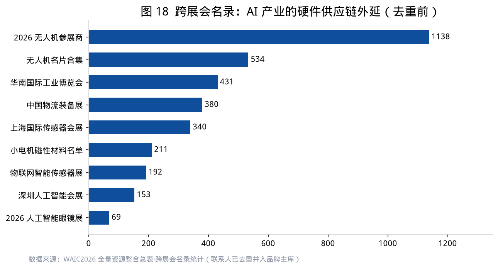

---

# 第三章 论坛议题与技术风向

## 3.1 赛道分布：技术、产业、底座三大主线

175 场论坛中，剔除综合类论坛（45 场）后，前三大专业赛道为：大模型与 AI 基础（35 场，20.0%）、产业与工业智能化（32 场，18.3%）、算力与 AI 芯片（22 场，12.6%），合计约 51%，构成"技术前沿—产业落地—底座设施"三大主线（图 3）。

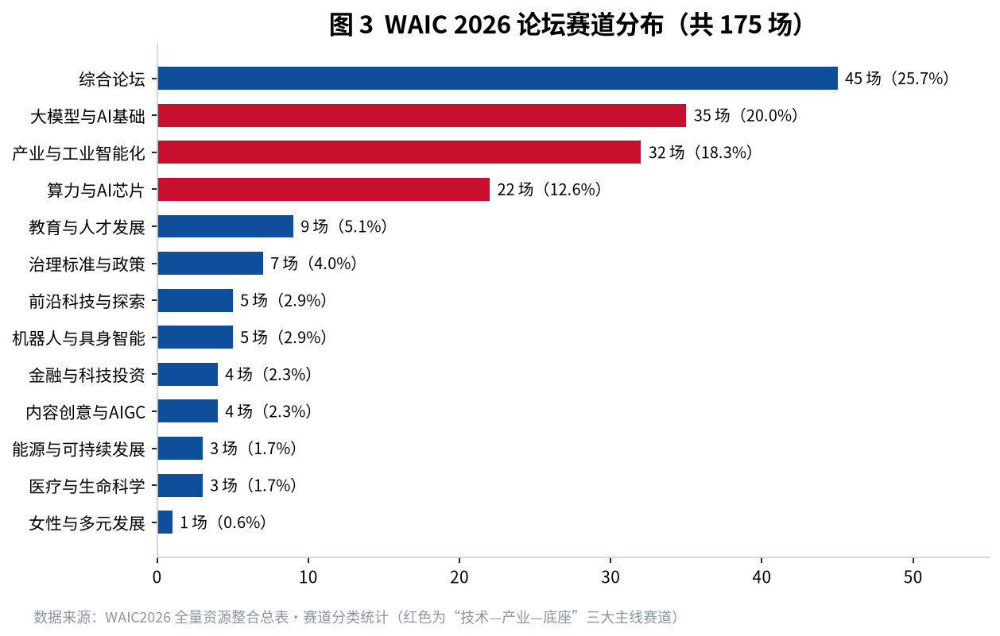

时间与空间分布同样高度集中（图 4）：7 月 18—19 日两天承载 129 场论坛（73.7%）；世博中心一馆承载 91 场（52%），成为政策发布与重量级论坛的绝对主场。

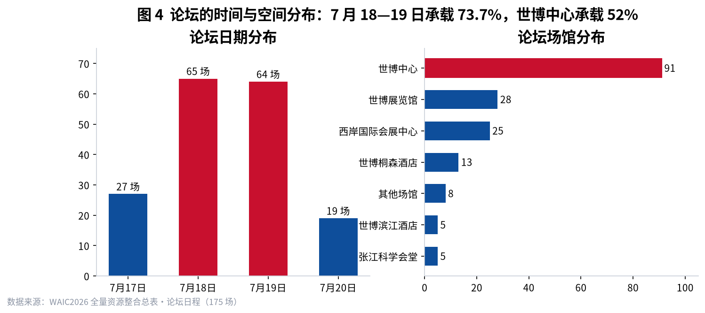

## 3.2 议题风向：从"大模型"到"智能体"，从"数字"到"物理"

论坛标题的语义变化透露出清晰的技术迁移路径：《从大模型到智能体》《从一次性 Agent 到记忆原生智能时代》《AI Agent 时代的一人公司与 Token 经济》《物理 AI 重塑智能制造》——**"Agent（智能体）"与"物理（Physical）"取代"大模型"成为 2026 年的高频词**。垂直行业实现全覆盖：金融、医疗、教育、能源、核能、船海、材料、无线电乃至气候预警均设专场。

## 3.3 专家观点集萃

- **理查德·萨顿（2024 图灵奖）**：AI 正从"人类数据时代"进入"经验时代"，智能体将从与环境的交互中获得能力——这直接指向物理空间中的具身学习。
- **印奇（阶跃星辰董事长）**：第三波 AI 浪潮的主战场是"物理场景通用智能体"。
- **周伯文（上海 AI 实验室主任）**：AI 能力边界"一冷一热"——编程任务完成度约 88%，而自主科学发现仅约 3%，AI for Science 是最大的待开发空间。
- **苏昊（复旦大学通用物理智能研究院首任院长）**：物理智能是解决大模型幻觉的关键路径。
- **王坚（中国工程院院士）**：要让科学数据成为基础模型的"原住民"。

> **分析结论 3-1**：学界与产业界罕见地指向同一个方向——AI 的下一程在物理世界。对产业空间而言，这意味着"可供智能体交互、试错、采数的真实场景"将成为像算力一样被争夺的战略资源。

---

# 第四章 大模型市场环境与竞争格局

本章基于 XSCT Bench（xsct.ai）榜单数据撰写。该平台以"Product Model Fit（产品—模型匹配）"为方法论，截至 2026 年 8 月覆盖 109 个模型、1517 个真实产品用例、累计 188471 次评测，综合分 = 基础题 ×30% + 进阶题 ×40% + 困难题 ×30%，采用 LLM-as-a-Judge 加证据锚定的双轨评审。相较传统学术基准，其用例更贴近真实产品场景，适合观察"商用视角"的竞争格局。

## 4.1 综合排名：国产模型首次登顶，前 20 占 13 席

综合榜前五名依次为：doubao-seed-2-1-pro（90.7，字节/火山引擎）、Claude Sonnet 4.6（90.3，Anthropic）、GPT-5.5（89.4，OpenAI）、MiniMax-M3（89.4）、Claude Opus 4.6（89.1）。前 20 名中国产模型占 13 席（图 7）。

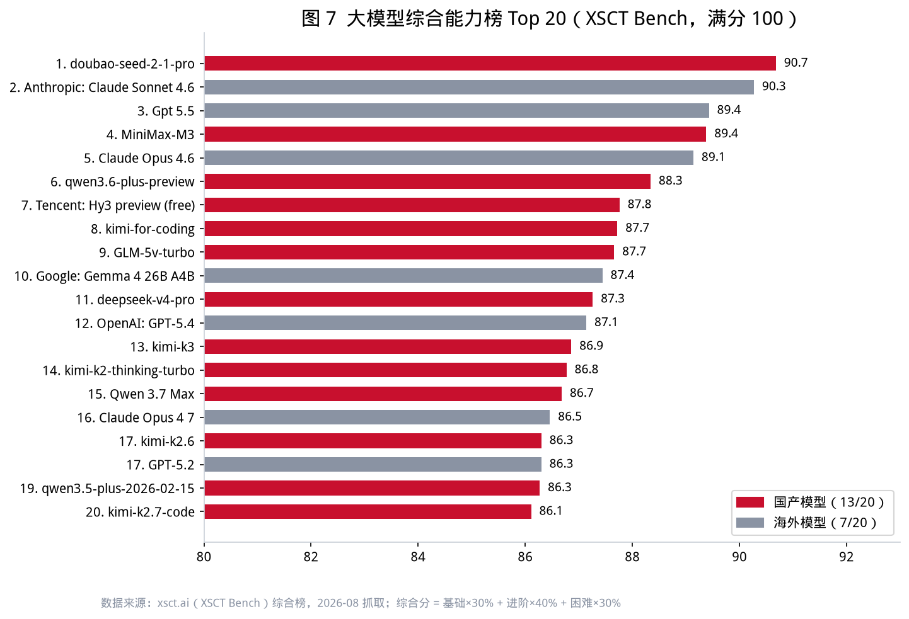

| 排名 | 模型 | 厂商/平台 | 综合分 | 输出定价（$/M token） |
| --- | --- | --- | --- | --- |
| 1 | doubao-seed-2-1-pro | 字节·火山引擎 | 90.7 | 未公开 |
| 2 | Claude Sonnet 4.6 | Anthropic | 90.3 | 15.00 |
| 3 | GPT-5.5 | OpenAI | 89.4 | — |
| 4 | MiniMax-M3 | MiniMax | 89.4 | 未公开 |
| 5 | Claude Opus 4.6 | Anthropic | 89.1 | 25.00 |
| 6 | qwen3.6-plus-preview | 阿里云百炼 | 88.3 | 1.77 |
| 7 | Hy3 preview | 腾讯混元 | 87.8 | 免费预览 |
| 8 | kimi-for-coding | 月之暗面 | 87.7 | 未公开 |
| 9 | GLM-5v-turbo | 智谱 | 87.7 | 2.66 |
| 10 | Gemma 4 26B A4B | Google | 87.4 | 0.34 |

数据来源：xsct.ai 综合榜（2026-08 抓取）。

## 4.2 竞争格局：能力并跑、价格分层

将国产与海外模型分组对比（图 10）：国产 Top10 平均分 87.9，海外 Top10 平均分 87.3，能力差距收敛至 1 分以内；而有公开定价模型的平均输出价格，国产为 1.43 美元/百万 token，海外为 6.27 美元/百万 token，价差逾 4 倍。

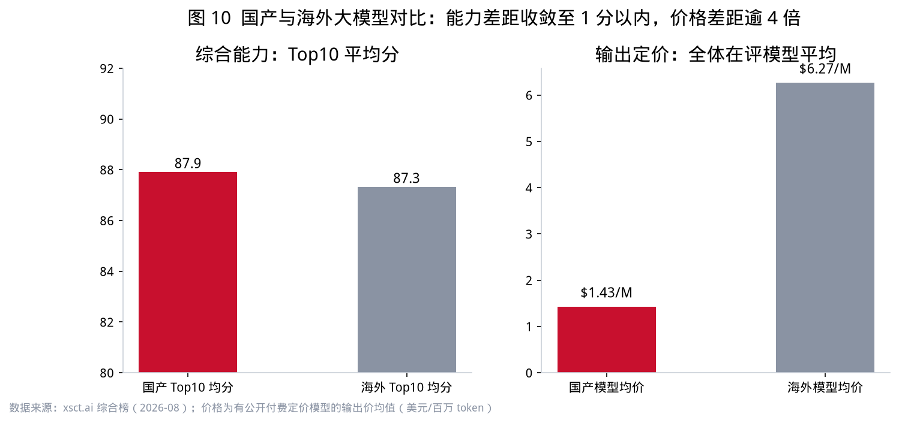

海外阵营内部亦出现分化：Anthropic 的 Claude 系列凭借代码与 Agent 能力守住 15—25 美元的高端定价带；GPT-5.5 数学硬题与推理链属第一梯队，但在长文档理解、Agent/MCP 调用与批判性思考上被评测方指出落后于 kimi-k2.6 与 Claude Sonnet 4.6；Google 则以 Gemma 4 系列开源模型在低价档位保持存在感。

## 4.3 性价比革命："同样聪明，谁更便宜"

图 8 的"能力—价格"散点显示：**高分低价的性价比象限几乎被国产模型占据**。标志性事件是 DeepSeek V4 Flash 发布——综合分 88.0 与 qwen3.6、kimi-k2.5 几乎并列，但输出价格仅约 2 元人民币/百万 token，为同档位最低。XSCT 的评述一针见血："这件事对行业的意义不是'又一家做出了好模型'，而是它把第二梯队的价格天花板直接压下来了。同一档位的竞争，从'谁更聪明'变成'同样聪明谁更便宜'。"

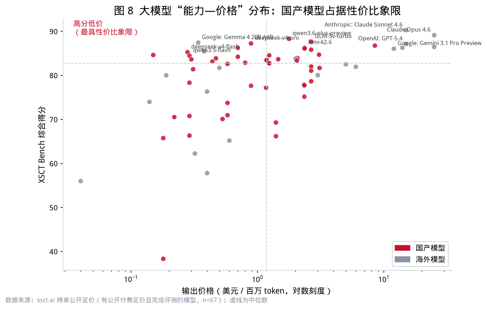

## 4.4 厂商梯队：国产多线作战，海外精品路线

按厂商归并在评模型（图 9）：阿里（通义千问系）以 20 余款在评模型构成最宽产品矩阵，字节（豆包）、月之暗面（Kimi）、智谱（GLM）、小米（MiMo）、MiniMax 各以 4—9 款多线布局；海外厂商以少量旗舰模型参与竞争。国产的"机海战术"实质是按场景分层定价——旗舰对标 Claude，flash/turbo 版本收割长尾流量。

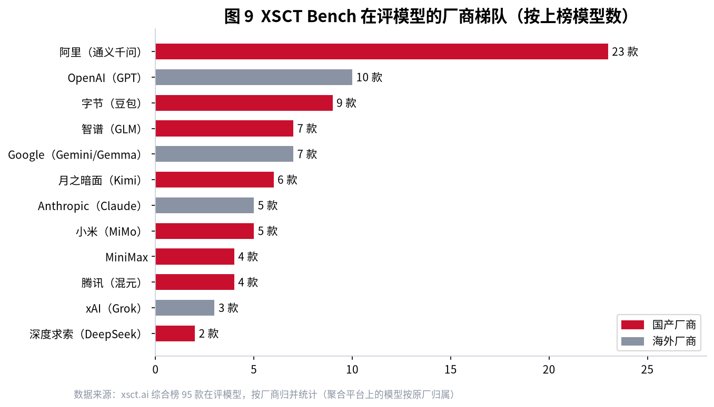

## 4.5 趋势判断

1. **排名的半衰期急剧缩短**。榜单前 30 名分差不足 6 分，任何一次版本迭代都可能改写座次；模型选型正从"选最强"转向"按场景选最合适"（Product Model Fit）。
2. **价格战不可逆**。低价并未换来低质，2026 年下半年推理成本仍有一个数量级的下降空间，API 白菜价将成为 AI 应用与空间服务大规模铺开的前提。
3. **能力竞争转向 Agent 化与记忆化**。批判性思维、长任务执行、MCP 工具调用成为新的分层指标，与第三章"从大模型到智能体"的论坛风向互相印证。
4. **中游模型厂商面临挤压**。综合分 84—86 分段的模型（与第一梯队差 5—7 分）既无旗舰溢价、又无极致低价，将被迫向垂直场景或端侧收缩。
5. **开源与闭源的边界弱化**。DeepSeek、Qwen、Gemma 等开放权重模型进入综合榜前列，企业级私有化部署门槛大幅下降——这将直接利好园区级、楼宇级的本地化 AI 基础设施建设。

---

# 第五章 青年视角：AI 产品消费观察

本章基于观猹（watcha.cn，"玩 AI，上观猹"）社区数据撰写。观猹是国内新一代前沿科技爱好者聚集地，以"产品收录 + 社区评测 + 发布日历"模式运营，其用户以高校学生与年轻从业者为主，是观察青年 AI 消费偏好的高信噪比样本。课题组于 2026 年 8 月抓取其产品分类（15 类）、热门榜 Top50 与互动数据。

## 5.1 品类结构：效率与陪伴双主线

热门 Top50 产品的类别分布（图 12）显示：效率工具（18 项）与通用助手（15 项）占据前两位，但虚拟陪伴、科研辅助、Agent 构建等新兴品类合计已接近三分之一。

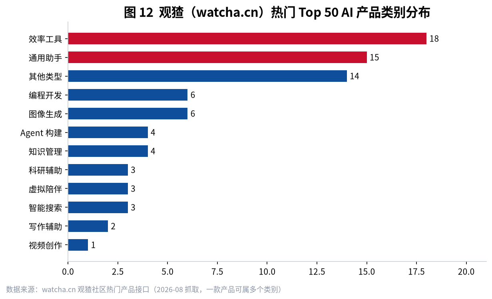

社区互动热度前十（图 13）中，既有 Claude Code、DeepSeek、Kimi 等"正统"产品，也有 QClaw（微信内桌面 Agent）、Alice（"越协作越着迷的 AI 搭子"）、WorkBuddy（AI 原生桌面工作台）、词元跳动（大模型 API 统一网关）等社区原生爆款。

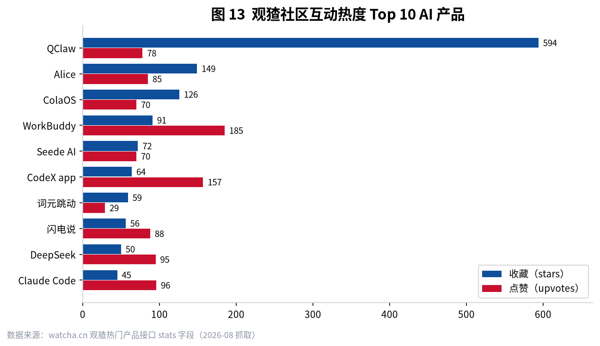

## 5.2 年轻人使用 AI 的六个观察

**观察一：AI"搭子化"。** 热门产品的话术已从"助手（assistant）"转向"搭子（buddy/companion）"——Alice 自称"会记事、会干活、会陪你"的 AI 搭子，百度将其通用智能体直接命名为"搭子 DuMate"。年轻人要的不是被服务，而是结伴感。

**观察二：情绪与决策外包。** "好好说"把指责翻译成对方听得进去的话；"Seeself·观己"自称"超越 80% 真人命理师的 AI 玄学网站"；"这俩人合适吗"用投票裁决感情问题。AI 正在接管年轻人最私密的情绪劳动与决策焦虑——玄学、沟通、亲密关系成为超预期的落地场景。

**观察三：万物皆可 meme。** "喵极 AI"主打"上传一张照片生成一整套表情包"，"妙呀"面向潮玩创作者做 AI 设计。生成式 AI 在年轻人手中首先是社交货币的印钞机，其次才是生产力。

**观察四：学习与怀旧的游戏化。** "LexSaga 词境奇旅"把背单词变成文字冒险，"夏日荷塘：模拟钓蛙"以 AI 复刻童年钓青蛙——轻量、可分享、情绪价值密度高的"小而美"产品持续走红。

**观察五：一人公司与 Vibe Coding 平民化。** "秒哒""秒悟"主打零代码把想法变成应用，"今晚能上线吗？"用 60 秒游戏测出"AI 产品经理人格"，社区里"一人公司 + Token 经济"叙事盛行——与 WAIC 论坛《AI Agent 时代的一人公司与 Token 经济》形成镜像。

**观察六：记忆主权意识萌芽。** Memmy 提出"让所有 AI 都记得同一个你"，MemOS 等记忆操作系统同步出现在 WAIC 参展商名单中。当 AI 成为长期伙伴，"我的记忆归谁管"正在成为新的产品命题与治理命题。

> **分析结论 5-1**：青年 AI 消费的主旋律是"效率工具打底、情感与身份表达增值"。对空间运营者的启示在于：AI 时代的园区与社区商业不应只配置"办公 + 会议"功能，还应为 AI 创作者社群、内容工作室、体验型零售预留空间——年轻人聚集的地方，才是 AI 产品的第一验证场。

---

# 第六章 具身智能与产业空间：典型案例与场景构想

## 6.1 H3 展厅：超 150 家具身智能企业"卷场景"

世博展览馆 H3 展厅聚集超 150 家具身智能企业，是本届大会人气最高的展区。与上一届"本体能动、会打招呼"的展示逻辑不同，2026 年几乎所有本体企业都提供了真实场景演示——场景成为新的竞争货币。课题组对 18 个结构化观察样本的场景分布统计见图 11。

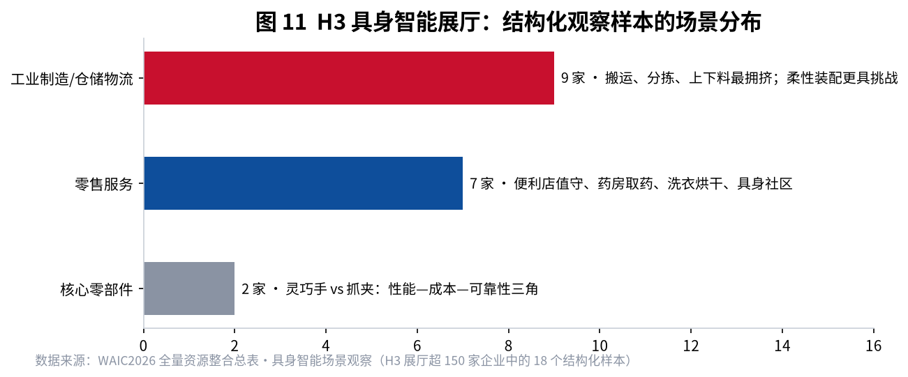

| 场景大类 | 企业/品牌 | 展示内容 | 落地方向 |
| --- | --- | --- | --- |
| 零售服务 | 银河通用 | Galbot G1 便利店值守，烤面包、倒饮料早餐全流程 | 商业零售 |
| 零售服务 | 梅卡曼德 | 人形轮式机器人货架取货互动 | 商业零售 |
| 零售服务 | 穹彻智能/蚂蚁灵波 | 药房取药递药；洗衣洗烘方案（即将进酒店） | 药房/酒店 |
| 零售服务 | 擎朗智能 | "具身社区"：咖啡亭、甜品屋、零售店、酒店洗衣房，零遥操 | 社区商业 |
| 零售服务 | 京东 × 星尘机器人 | 智能零售工作站首秀 | 零售 |
| 工业物流 | 智元机器人 | 半导体车间料盘上下料产线；精灵 G2 Max 仓储搬运码垛 | 半导体/物流 |
| 工业物流 | 乐聚机器人 | 1:1 复刻工厂产线，三台"夸父"实时计时作业 | 工厂产线 |
| 工业物流 | 银河通用 | Galbot S1 搬运 30kg、打螺丝 | 工业作业 |
| 工业物流 | 星动纪元/优艾智合/极智嘉 | 快递分拣、线边仓拣配、料箱搬运 | 物流仓储 |
| 核心零部件 | 月泉仿生等 | 灵巧手 vs 抓夹："性能—成本—可靠性"三角 | 零部件 |

数据来源：WAIC2026 全量资源整合总表·具身智能场景观察。

## 6.2 场景落地的三条规律

**（1）零售是"中间地带"。** 相比精度苛刻的工业制造与容错率极低的家庭服务，零售场景容错率适中、现金流清晰，成为最快验证商业闭环的场景。上海已于 2025 年将"商业零售"列入《具身智能产业发展实施方案》重点场景。其技术关键是"零售大脑"——识别数千种商品、自主规划任务、跑通接单—拣货—打包—递送全流程。

**（2）工业内部呈清晰梯队。** 搬运、分拣、上下料最拥挤也最易落地；柔性装配与精密操作更具挑战；全流程替代被视为终极目标。展台上的"连续作业计时器"取代参数表，成为新的信任语言。

**（3）零部件遵循"性能—成本—可靠性"三角。** 灵巧手是技术明星，但抓夹仍占出货主流——产业在炫技与交付之间保持理性。

## 6.3 场景构想：当机器人成为空间的"原住民"

基于上述观察，课题组提出四个面向 2026—2028 年的产业空间场景构想：

- **构想一：机器人友好楼宇（Robot-Ready Building）。** 无障碍动线、可通讯电梯、充电桩位、5G/边缘算力预埋将像"光纤入户"一样成为甲级写字楼与园区的标配评级项。
- **构想二：园区"具身社区"商业层。** 参照擎朗智能的展示形态，园区底商可整体规划为机器人运营的咖啡亭、便利店、洗衣房组合，白天服务员工、夜间自动补货盘点，形成 24 小时无人商业界面。
- **构想三：楼宇即训练场。** 把园区公区、产线、仓库以"场景开放协议"授权给具身智能企业采数与试运行，园区从收租方升级为"数据 + 场景"的股东方。
- **构想四：酒店与长租公寓的服务机器人化。** 穹彻智能洗烘方案即将进入酒店，预示客房服务、布草洗涤、递送环节的机器人渗透将从单点走向链条。

---

# 第七章 面向 2026 年的展望与建议

## 7.1 六大趋势展望

1. **智能体元年成色十足**：Agent 从技术概念变为默认产品形态，"记忆原生""长任务执行"成为分水岭能力。
2. **推理成本再降一个数量级**：价格战延续，token 成本趋近水电煤，AI 渗透率的约束从"用不用得起"转为"有没有场景"。
3. **具身智能从展台走向订单**：零售、物流、巡检三条赛道率先出现规模化复购，长三角与珠三角的产线与园区成为最大买家。
4. **算力空间证券化提速**：智算中心、超节点与"算电协同"设施成为新的核心资产类别，REITs 化路径逐步清晰。
5. **AI 治理进入多边机制化阶段**：世界人工智能合作组织落地上海，标准、伦理与安全评测成为产业出海的"新关税"。
6. **青年创作者经济与 AI 深度耦合**："一人公司 + Token 经济"降低创业颗粒度，园区孵化对象从"公司"细化为"个体创作者与超级个体"。

## 7.2 分主体建议

**对政府与监管部门**：以"场景开放清单"替代单纯补贴，将政务、交通、医疗、社区场景分批向具身智能与 Agent 企业开放；同步建设面向中小企业的普惠算力与模型评测公共服务（可参照 XSCT 类第三方评测机制）。

**对园区运营商与城市更新主体**：将"算力密度、场景开放度、空间柔性"纳入园区规划指标体系；在核心园区试点"机器人友好楼宇"标准与"具身社区"商业层；探索以场景入股、数据分成替代纯租金模式。

**对企业**：模型选型回归 Product Model Fit——按场景选模型、按成本定架构；具身智能企业优先卡位零售与物流两个"中间地带"场景；出海企业提前对接多边治理框架与标准认证。

**对高校与研究机构**：抓住"AI for Science 完成度仅 3%"的巨大空窗，布局科学智能与物理智能交叉学科；将园区与城市空间作为 AI 社会实验的天然实验室，产出兼具学术与政策价值的追踪研究。

---

# 第八章 AI 时代产业园区与未来办公新范式

*——作为全篇的收束，本章回到本中心的研究本位：空间。前七章回答"AI 产业发生了什么"，本章回答"空间应当如何回应"。*

## 8.1 产业园区在 AI 时代的定位重估

工业时代的园区卖土地，互联网时代的园区卖楼宇，AI 时代的园区必须回答一个新问题：**除了面积，你还能供给什么？** 本白皮书的答案是六种新要素——算力密度、场景开放度、数据要素供给、人才与社群、资本可得性、空间柔性（图 14）。园区的角色由"房东"转向"算力—场景—资本—社群的复合运营商"；租约之外，园区与企业的关系将叠加"场景合约、数据合约、股权合约"三重纽带。

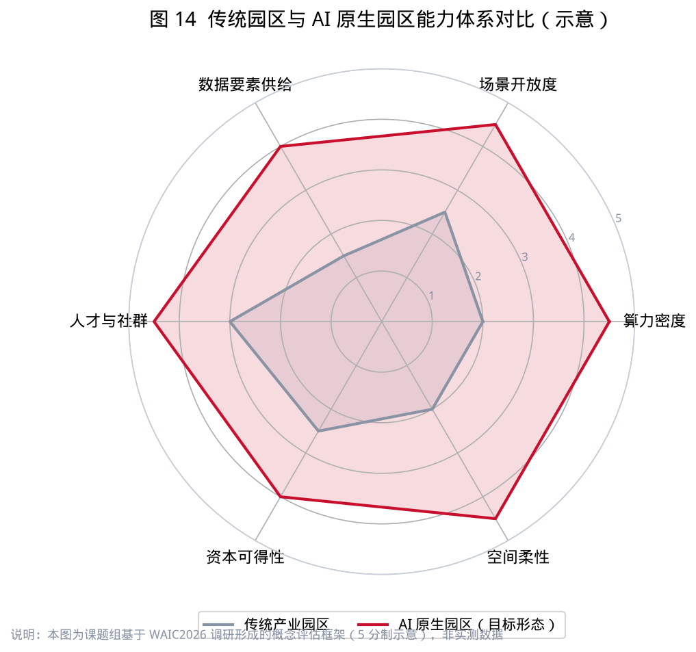

## 8.2 转型路径：四步走向"AI 原生园区"

1. **底座化**：以边缘算力节点、智算机房、绿电与液冷改造夯实物理底座，让"插电即训练"成为园区招商话术。
2. **场景化**：制定园区场景开放协议，把公区、食堂、停车、物流、安防作为具身智能与 Agent 的常态化试验场，并建立安全与保险配套。
3. **智能体化**：园区运营本身率先 AI 化——招商线索分级（参照 WAIC 资源库的 A/B 级线索管理模式）、能耗调度、物业工单由 Agent 接管，形成"用 AI 管理 AI 园区"的示范效应。
4. **资本化**：以数据资产入表、算力资产 REITs、场景对赌入股等工具，把重资产转化为可循环的资本结构。

## 8.3 未来办公的新范式与空间设计理念

**范式一：从"人均工位"到"人机共生单元"。** 当每位员工配备多个数字 Agent 与共享物理机器人，办公面积测算逻辑由"人头数 × 定额"转向"人 + 机 + 算力"的复合单元；走廊宽度、电梯载荷、充电与消毒间等"机器人后勤设施"进入设计规范。

**范式二：从"格子间"到"四象限场景"。** 专注舱（深度工作）、协作场（人机混合会议，含 AI 白板与实时纪要）、展示层（面向客户的场景样板间——像 H3 展厅一样"用场景说话"）、实验区（可改造、可采数的柔性空间）。办公空间的核心 KPI 从工位利用率转向"场景发生率"。

**范式三：从"精装交付"到"柔性冗余"。** AI 企业的空间需求以月为单位波动：今天是 20 人的模型团队，明天可能进驻一条机器人调试线。楼板承重、层高、电力容量与网络架构预留 30% 以上冗余，"可长大的房子"取代"一步到位的房子"。

**范式四：从"物业服务"到"环境即服务（Environment-as-a-Service）"。** 会议室自动纪要、访客 Agent 接待、无人零售与洗衣、夜间机器人巡检盘点——办公体验由空间 + 智能体共同交付，物业费的定价基准由平方米转向"服务事件"。

## 8.4 园区深度研究与示范案例

### 8.4.1 杨浦实证：AI 企业在向哪里集聚、付什么租金

杨浦是本中心的空间研究腹地，也是复旦大学所在城区。据本中心《上海商务楼宇与产业园区市场报告·杨浦区》样本口径：区内跟踪载体 20 个、总建面约 242 万㎡、可租约 156 万㎡，样本成交租金 3.95 元/㎡·天、空置率 16.5%、入驻企业样本 320 家。产业构成中（图 19），在线新经济 65 家居首，**AI/大模型 58 家、户均面积 1238㎡为各业态最大**——AI 租户不是"小团队租一间创客空间"，而是要连续大开间、高电力与可改隔断的楼层。

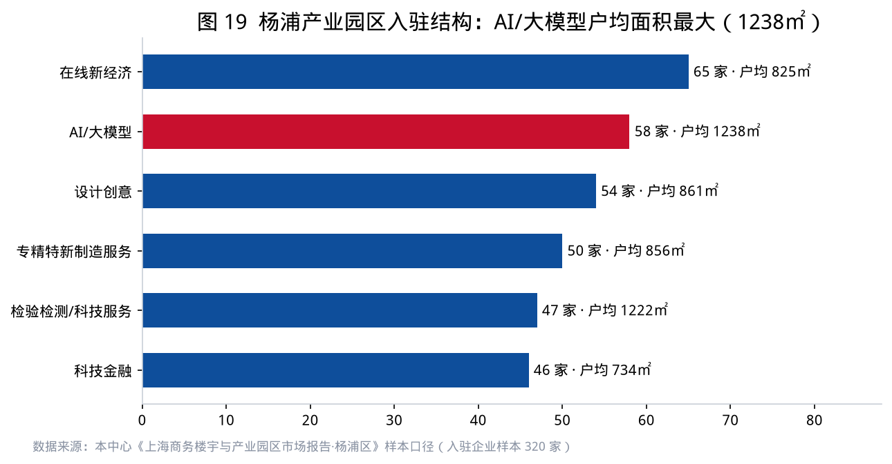

板块层面（图 20）呈现清晰的租金—集聚梯度：

- **大创智**成交租金 4.88 元/㎡·天（区内最高），空置 17.9%，却集中了 24 家 AI/大模型企业，是杨浦最接近"AI 原生园区"的板块；
- **五角场商圈**租金 4.80，空置 16.5%，AI 企业 7 家，商业配套强、适合面向青年的 AI 消费与内容工作室（与第五章观猹观察互证）；
- **杨浦滨江**租金 4.01、空置 15.4%（相对健康），AI 8 家，叠加专精特新与设计创意，适合"机器人中试 + 设计"混合业态；
- **国定路高校带**租金 3.21，紧贴复旦，AI 7 家，是校地转化与早期团队的天然孵化带；
- 外环与滨江东延伸租金低于 3.0、空置也更低，但 AI 企业数为 0——低租金并不能自动换来 AI 集聚。

迁徙样本显示杨浦滨江 In/Out 比 2.86（净吸引最强），大创智与新江湾亦为净流入。结合 WAIC 参展商上海 275 家的注册地结构，可以判断：**AI 企业愿意为"大学 + 场景 + 社群"支付租金溢价，却不会为"便宜的远郊厂房"迁移。**

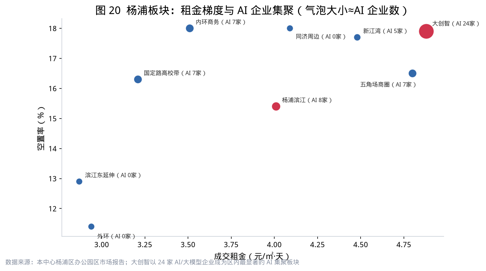

> **分析结论 8-1**：空置率高并不等于没有 AI 需求。大创智的高租金 + 相对高空置，更像是"产品错配"（缺大开间、缺电力、缺机器人动线），而不是需求消失。园区的正确动作是改产品，而不是先降租。

### 8.4.2 上海四个 AI 产业空间原型

结合 WAIC 2026 现场与杨浦实证，课题组将上海样本归纳为四种原型，供其他城市对照：

| 示范样本 | 空间原型 | AI 时代的角色 | 关键证据 | 可复制的产品动作 |
| --- | --- | --- | --- | --- |
| 浦东张江 | 底座型 | 芯片与智算基建引擎 | 张江科学会堂 114 家展商中 80 家为算力芯片 | 液冷机房、绿电套餐、超节点专线 |
| 徐汇西岸 | 体验型 | AI 终端与内容消费体验场 | 西岸承办 25 场论坛，大模型展商 22 家 | 展示层 + 消费级硬件体验商业 |
| 杨浦（大创智/高校带/复兴岛） | 试验型 | 校地转化 + 空间智能试验场 | 大创智 24 家 AI 企业；复兴岛承办量子城市空间智能论坛 | 场景开放协议、中试车间、青年社群 |
| 世博园区 | 制度型 | 全球 AI 治理与首发经济主场 | 世博中心承载 52% 论坛及《世界人工智能合作组织协定》签署 | 首发经济、标准发布、会展转化 |

四个样本分别对应"底座型、体验型、试验型、制度型"。本中心将以年度为周期，对其租金梯度、企业迁移、场景开放度与就业结构进行跟踪研究，形成中国 AI 产业空间的长期观察序列——相关成果将作为本研究文稿系列后续编号发布。

### 8.4.3 示范园区的三条操作清单

1. **给机器人留路**：层高 ≥4.5m 的中试层、货运电梯载荷、充电与消毒间、楼宇内 5G/边缘节点，写入"机器人友好楼宇"评级。
2. **给模型留电**：园区变压器与楼层配电按 AI 训练/推理峰值预留 30% 以上冗余，并提供可计量的绿电套餐。
3. **给年轻人留夜**：结合观猹社区所揭示的"搭子化、内容化"消费，在底商配置 24 小时可进入的创作者工位、无人零售与具身社区商业，而不是只做白天办公。

## 8.5 结语

WAIC 2026 给出的最重要信号，不是某一个模型的登顶，而是人工智能整体"落地成盒"——落进厂房、店铺、楼宇与园区。当算法的边际差距被价格战抹平，**空间将成为 AI 时代最诚实的计分板**：哪座城市、哪个园区能让智能体安全地跑起来、让年轻人愿意留下来，产业就会在哪里生长。这正是产业空间研究者的时代课题，也是本白皮书希望开启的长期对话。

---

# 附录

## 附录 A 数据来源与方法说明

1. **WAIC2026 全量资源整合总表**（2026-08-04 版）：整合 27 份源文件、去重后 17 份唯一内容，涵盖参展商（963 家）、行业统计（8 大类/39 细分）、品牌主库（4262 家）、联系人库（3463 人）、论坛日程（175 场）、演讲视频（56 条）、具身智能场景观察与参会攻略要点等 21 个工作表。
2. **xsct.ai（XSCT Bench）**：2026 年 8 月抓取综合榜 95 个在评模型的得分与公开定价；剔除未完成评测（0 分）与占位式异常定价样本后进行统计。该榜单采用 LLM-as-a-Judge 方法，结果仅供研究参考。
3. **watcha.cn（观猹）**：2026 年 8 月经其公开接口抓取产品分类（15 类）、热门产品榜（Top50）与互动统计（收藏/点赞/评测数）。
4. **本中心杨浦办公园区市场报告**：第八章园区实证所用载体、租金、空置与产业构成数据，取自中心既有《上海商务楼宇与产业园区市场报告·杨浦区》样本口径（跟踪载体 20 个、入驻企业样本 320 家）。
5. 本文对第三方数据的引用均注明出处；分析结论为课题组独立观点，不代表数据提供方立场。图 14、图 22 为概念示意框架，非单一指标实测。

## 附录 B 图表索引

| 编号 | 标题 | 所在章节 |
| --- | --- | --- |
| 图 1 | WAIC 2026 参展商八大类行业分布 | 2.2 |
| 图 2 | 参展商细分领域 Top 15 | 2.2 |
| 图 3 | 论坛赛道分布 | 3.1 |
| 图 4 | 论坛时间与场馆分布 | 3.1 |
| 图 5 | 参展商注册地分布 Top 10 | 2.3 |
| 图 6 | 参展商融资阶段结构 | 2.4 |
| 图 7 | 大模型综合能力榜 Top 20 | 4.1 |
| 图 8 | 大模型"能力—价格"分布 | 4.3 |
| 图 9 | 厂商模型梯队 | 4.4 |
| 图 10 | 国产与海外大模型对比 | 4.2 |
| 图 11 | 具身智能场景观察 | 6.1 |
| 图 12 | 观猹热门产品类别分布 | 5.1 |
| 图 13 | 观猹社区互动热度 Top 10 | 5.1 |
| 图 14 | 传统园区与 AI 原生园区能力对比（示意） | 8.1 |
| 图 15 | 展馆 × 行业交叉分布 | 2.5 |
| 图 16 | 国内四极产业分工 | 1.3 |
| 图 17 | 行业 AI 应用垂直分布 | 2.6 |
| 图 18 | 跨展会名录生态 | 2.7 |
| 图 19 | 杨浦园区产业构成 | 8.4 |
| 图 20 | 杨浦板块租金与 AI 集聚 | 8.4 |
| 图 21 | 世博展览馆展位结构 | 2.5 |
| 图 22 | 中美欧人工智能产业路径对照（示意） | 1.2 |

---

**复旦大学住房政策研究中心 · 研究文稿第二号（FDU-HPRC-WP-2026-02）**

*本文稿仅供学术研究与政策参考，引用请注明出处。*
