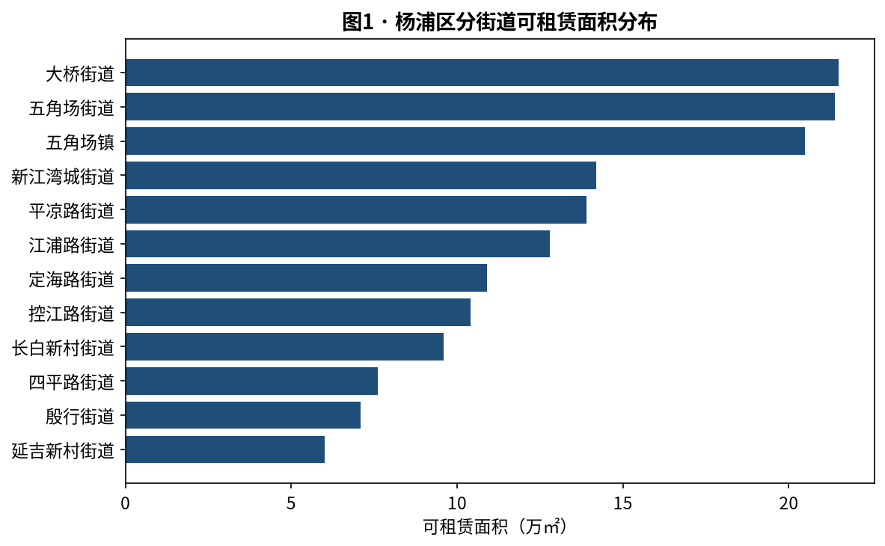
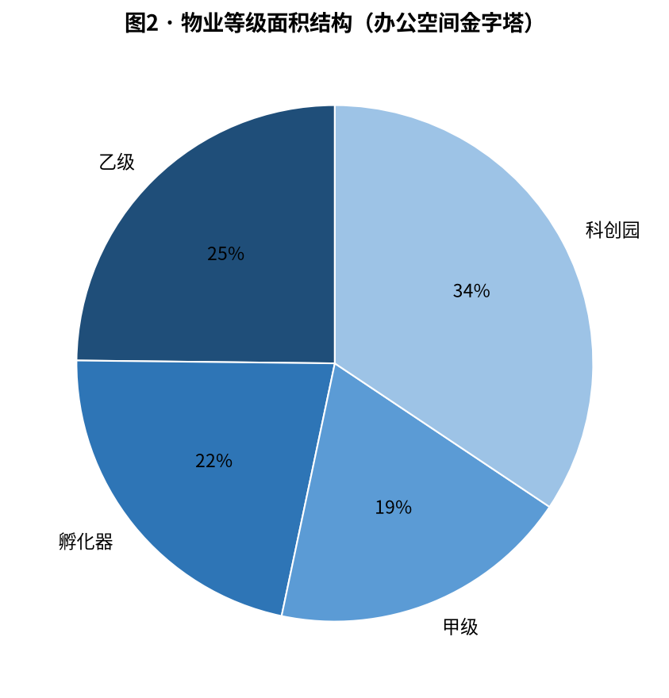
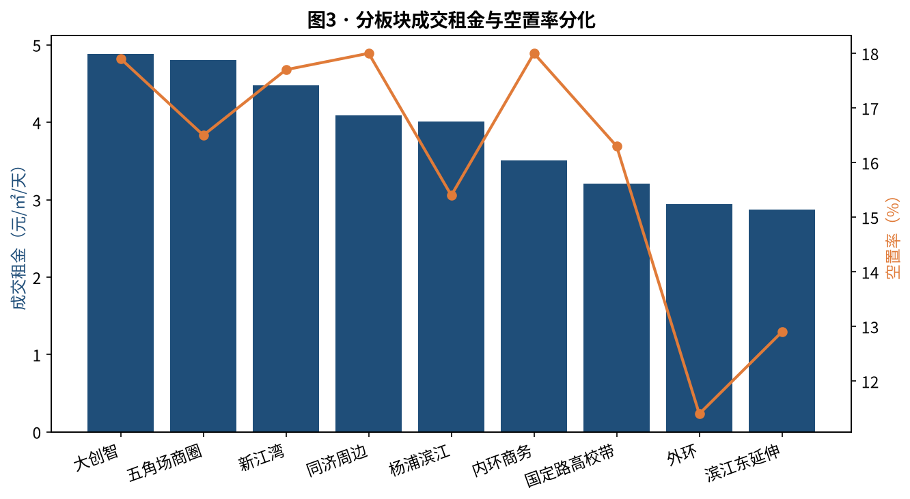
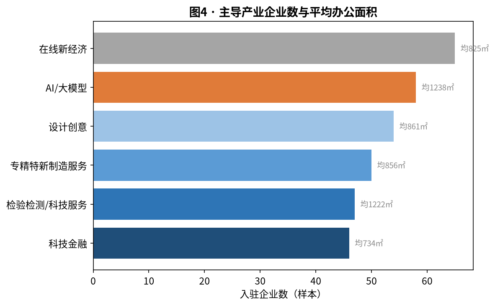
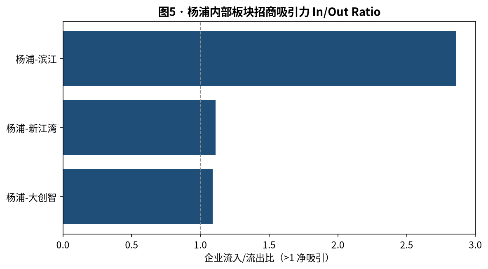
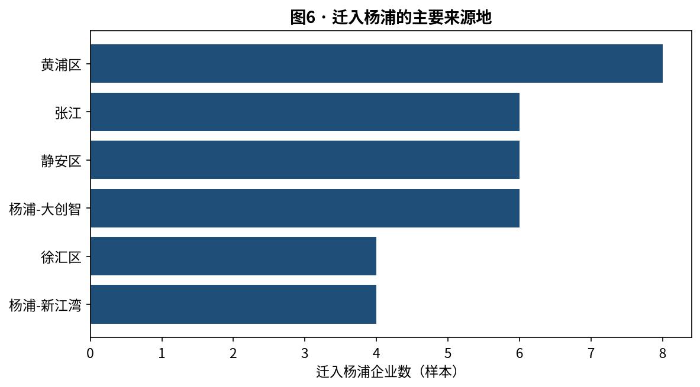

# 上海市杨浦区街道级商办市场月度动态（数据填充版）

> 易居房地产研究院 × AI 数据获取方 ｜ 由采集管线自动生成 ｜ 版本：填充版 V1.0

> ⚠️ **本版数据为「演示数据模式」自动生成**（云端未注入高德/企查查 API Key）。脚本已具备真实采集能力，在 `scripts/.env` 填入真实 Key 后重跑即切换为实采数据。

## 一、关键指标速览

| 指标 | 数值 | 指标  | 数值  |
| --- | --- | --- | --- |
| 载体总数（样本） | 20.0 | 总建面（万㎡） | 242.0 |
| 可租面积（万㎡） | 155.9 | 写字楼占比（%） | 45.0 |
| 平均报价租金（元/㎡/天） | 4.46 | 平均成交租金（元/㎡/天） | 3.95 |
| 全成本租金（元/㎡/天） | 4.81 | 议价折让（%） | 11.4 |
| 空置率（招商口径,%） | 16.5 | TOP 产业 | 在线新经济 |
| 入驻企业样本数 | 320.0 | 迁徙事件样本数 | 85 |

## 二、全域供给：分街道分布

| subdistrict | 载体数量 | 总建面(万㎡) | 可租面积(万㎡) | 写字楼数 | 产业园数 |
| --- | --- | --- | --- | --- | --- |
| 大桥街道 | 2 | 32.7 | 21.5 | 0 | 2 |
| 五角场街道 | 4 | 34.7 | 21.4 | 1 | 3 |
| 五角场镇 | 3 | 32.1 | 20.5 | 3 | 0 |
| 新江湾城街道 | 2 | 23.2 | 14.2 | 1 | 1 |
| 平凉路街道 | 2 | 21.9 | 13.9 | 1 | 1 |
| 江浦路街道 | 1 | 17.8 | 12.8 | 1 | 0 |
| 定海路街道 | 1 | 15.3 | 10.9 | 0 | 1 |
| 控江路街道 | 1 | 15.4 | 10.4 | 1 | 0 |
| 长白新村街道 | 1 | 13.3 | 9.6 | 0 | 1 |
| 四平路街道 | 1 | 13.6 | 7.6 | 0 | 1 |
| 殷行街道 | 1 | 12.1 | 7.1 | 0 | 1 |
| 延吉新村街道 | 1 | 9.9 | 6.0 | 1 | 0 |

## 三、市场行情：分板块租金与空置分化

| plate | 可租面积(万㎡) | 空置率% | 成交租金 |
| --- | --- | --- | --- |
| 大创智 | 18.0 | 17.9 | 4.88 |
| 五角场商圈 | 13.9 | 16.5 | 4.8 |
| 新江湾 | 14.2 | 17.7 | 4.48 |
| 同济周边 | 7.6 | 18.0 | 4.09 |
| 杨浦滨江 | 35.4 | 15.4 | 4.01 |
| 内环商务 | 38.8 | 18.0 | 3.51 |
| 国定路高校带 | 10.0 | 16.3 | 3.21 |
| 外环 | 7.1 | 11.4 | 2.94 |
| 滨江东延伸 | 10.9 | 12.9 | 2.87 |

## 四、需求结构：主导产业画像

| industry_tag | 企业数 | 平均面积(㎡) |
| --- | --- | --- |
| 在线新经济 | 65 | 825.0 |
| AI/大模型 | 58 | 1238.0 |
| 设计创意 | 54 | 861.0 |
| 专精特新制造服务 | 50 | 856.0 |
| 检验检测/科技服务 | 47 | 1222.0 |
| 科技金融 | 46 | 734.0 |

## 五、企业迁徙与招商吸引力

| 板块 | 流入 | 流出 | InOut比 | 研判 |
| --- | --- | --- | --- | --- |
| 杨浦-大创智 | 12 | 11 | 1.09 | 净吸引 |
| 杨浦-新江湾 | 10 | 9 | 1.11 | 净吸引 |
| 杨浦-滨江 | 20 | 7 | 2.86 | 净吸引 |

## 六、精准招商线索（TOP15）

| 企业(脱敏) | 产业标签 | 规模 | 当前面积(㎡) | 所在板块 | 信号 |
| --- | --- | --- | --- | --- | --- |
| 杨浦示例企业0133 | 检验检测/科技服务 | 大型 | 7772 | 大创智 | 近6月融资+招聘扩张 |
| 杨浦示例企业0152 | 专精特新制造服务 | 大型 | 7193 | 五角场商圈 | 近6月融资+招聘扩张 |
| 杨浦示例企业0026 | 在线新经济 | 大型 | 7027 | 新江湾 | 近6月融资+招聘扩张 |
| 杨浦示例企业0245 | 科技金融 | 大型 | 6105 | 杨浦滨江 | 工商稳定+岗位激增 |
| 杨浦示例企业0117 | AI/大模型 | 大型 | 6072 | 大创智 | 工商稳定+岗位激增 |
| 杨浦示例企业0013 | AI/大模型 | 大型 | 5883 | 国定路高校带 | 近6月融资+招聘扩张 |
| 杨浦示例企业0100 | 检验检测/科技服务 | 大型 | 5874 | 大创智 | 工商稳定+岗位激增 |
| 杨浦示例企业0101 | AI/大模型 | 大型 | 5681 | 国定路高校带 | 工商稳定+岗位激增 |
| 杨浦示例企业0270 | 检验检测/科技服务 | 大型 | 5210 | 内环商务 | 工商稳定+岗位激增 |
| 杨浦示例企业0272 | 专精特新制造服务 | 大型 | 4892 | 大创智 | 新设研发中心 |
| 杨浦示例企业0204 | 在线新经济 | 大型 | 4427 | 新江湾 | 工商稳定+岗位激增 |
| 杨浦示例企业0292 | 检验检测/科技服务 | 大型 | 4327 | 新江湾 | 工商稳定+岗位激增 |
| 杨浦示例企业0110 | 专精特新制造服务 | 大型 | 4042 | 杨浦滨江 | 新设研发中心 |
| 杨浦示例企业0210 | 在线新经济 | 大型 | 3995 | 大创智 | 新设研发中心 |
| 杨浦示例企业0180 | 在线新经济 | 大型 | 2891 | 新江湾 | 新设研发中心 |

> 筛选逻辑：近 6 个月融资 + 招聘扩张 + 工商稳定（未异常）交叉。企业名称已脱敏。

---

> 数据来源：高德 POI/AOI（载体）、企查查/天眼查（企业与工商变更）、好租/办办网/点点租（挂牌行情）；演示模式下为合成样本。正式版填入真实 Key 后由相同管线产出。遵循《上海市数据条例》及各平台条款。
